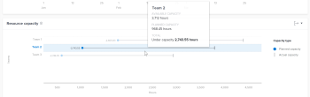

# 在Enhanced Analytics中查看资源容量可视化

“资源能力”可视化图表显示团队是否已结束、已不足或已满。

## 访问要求

您必须具备以下条件：

<table style="table-layout:auto"> 
 <col> 
 <col> 
 <tbody> 
  <tr> 
   <td role="rowheader"><a href="https://www.workfront.com/plans" target="_blank">Adobe Workfront计划</a>*</td> 
   <td> 
业务或更高版本
 </td> 
  </tr> 
  <tr> 
   <td role="rowheader"><a href="../administration-and-setup/add-users/access-levels-and-object-permissions/wf-licenses.md" class="MCXref xref">Adobe Workfront许可证概述</a>*</td> 
   <td> 
审阅或更高版本
 </td> 
  </tr> 
  <tr> 
   <td role="rowheader">访问级别配置*</td> 
   <td> 
查看项目访问权限
 
注意：如果您仍然没有访问权限，请咨询Workfront管理员，他们是否在您的访问级别设置了其他限制。 有关Workfront管理员如何更改访问级别的信息，请参阅 <a href="../administration-and-setup/add-users/configure-and-grant-access/create-modify-access-levels.md" class="MCXref xref">创建或修改自定义访问级别</a>.
 </td> 
  </tr> 
  <tr> 
   <td role="rowheader">对象权限</td> 
   <td> 
查看
 
有关请求其他访问权限的信息，请参阅 <a href="../workfront-basics/grant-and-request-access-to-objects/request-access.md" class="MCXref xref">请求对对象的访问 </a>.
 </td> 
  </tr> 
 </tbody> 
</table>

&#42;要了解您拥有的计划、许可证类型或访问权限，请联系您的Workfront管理员。

## 先决条件

有关使用Enhanced Analytics的先决条件，请参阅 [增强的分析概述](../enhanced-analytics/enhanced-analytics-overview.md).

## 了解“资源能力”可视化图表

“资源能力”可视化图表显示团队是否已结束、已不足或已满。 此计算基于：

* **可用容量**:在过滤的时间段内，家庭团队可以工作的总小时数

   >[!NOTE]
   >
   >如果您查看的是未来的时间段，则可用容量将根据团队过去7天的容量计算。 因此，不考虑任何计划PTO。

* **计划容量**:在过滤的时间段内，预期由主团队完成的计划工时总数

将家庭团队的计划时间与实际计划时间进行比较，有助于您确定自己是否没有为家庭团队分配足够的工作，或者他们是否因繁重的工作而感到精疲力竭。

在“资源能力”可视化图表上，您可以看到以下详细信息：

* **计划容量**:与主团队名称内联，蓝色圆圈表示分配给主团队的计划小时数。

   

* **实际能力**:与主队名称内联，垂直线表示主队可用的小时数。

   

* **超容量**:当水平线和蓝色圆圈在垂直线的右侧显示时，为家庭团队分配的工作量超过了他们在可用小时数内完成的工作量。 这表示在过滤的时间段内，团队的容量可能超过容量。 在蓝色圆圈的右侧，显示团队需要完成的剩余小时数。

   

* **能力不足**:当水平线和蓝色圆圈显示在垂直线的左侧时，主团队的可用小时数多于他们分配的计划工时数。 这表示该团队在过滤的时间段内可能处于容量不足状态。 蓝色圆圈的左侧显示了家庭团队完成工作的额外可用小时数。

   

将鼠标悬停在一行上可显示计划容量和可用容量的确切小时数，以及主团队超出或低于容量的小时数。

查看此信息可帮助您确定：

* 如果主队被过度分配或分配不足。
* 最大的项目是家庭团队所关注的。
* 哪些主队可以工作。

要了解如何获取此可视化图表的最佳数据，请参阅 [增强的分析概述](../enhanced-analytics/enhanced-analytics-overview.md).

## 查看“资源能力”可视化

1. 单击主菜单图标 ，然后选择 **Analytics**.
1. 在左侧面板中，选择 **人员**.

   

1. （可选）要使用其他日期范围，请从日期范围筛选器中选择新的开始日期和结束日期。

   

   有关使用日期范围过滤器的信息，请参阅 [在增强的分析中应用过滤器](../enhanced-analytics/use-enhanced-analytics-filters.md).

1. （视情况而定）如果您未设置团队过滤器，请添加团队过滤器，然后选择要查看其数据的每个团队。

   有关在Enhanced Analytics中添加过滤器的更多信息，请参阅 [在增强的分析中应用过滤器](../enhanced-analytics/use-enhanced-analytics-filters.md).

   添加过滤器后，最多会显示50个项目的数据，并且即使您离开页面或注销Workfront后，这些过滤器仍保持活动状态。

1. （可选）要放大日期范围，请在可视化中选择一个点以表示日期范围的开始日期，然后拖到日期范围的结束日期。

   所有其他可视化图表将更新至同一日期范围，并创建时间范围过滤器。

   

1. 将鼠标悬停在主团队行上，可查看仍可计划的小时数、主团队计划完成的小时数，以及工作的总小时数（标记为超量、次数或容量）。

   

1. （可选）要导出可视化数据，请单击 **导出图标**  在可视化的右上角，选择导出格式：

   * **图表 (PNG)**
   * **数据表(XSLX)**

1. 单击主团队名称，以在“团队容量”可视化图表中查看更多信息。

   要了解有关“团队容量”可视化的更多信息，请参阅 [在Enhanced Analytics中查看“团队容量”可视化](../enhanced-analytics/team-capacity-overview.md).

