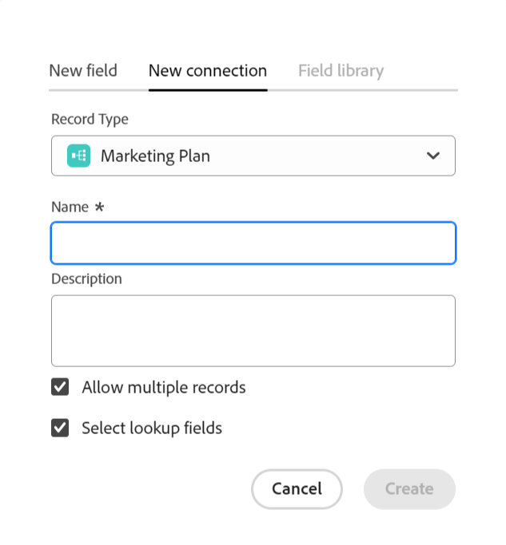

<!-----
title: Connect record types
description: A way to indicate how individual record types relate to one another is to connect them. Also, you can connect Maestro record types with object types from other applications to enhance your users' experience and keep their focus in one application.
hidefromtoc: yes
hide: yes
feature: Work management
role: User
author: Alina
--->

<!--update the metadata with real information when making this avilable in TOC and in the left nav-->
<!--************ THIS MIGHT NO LONGER BE A 'RELATIONSHIP' TYPE FIELD, BECAUSE THEY WILL SHOW IT IN THE CONNECTION TAB*****************************-->

# 连接记录类型

>[!IMPORTANT]
>
>目前，AdobeMaestro是测试版计划的一部分，该计划对有限数量的客户开放。
>
>有关加入Maestro测试版计划的更多信息，请与您的客户代表联系。
>
>有关信息，请参阅 [Adobe大师概述](../maestro-overview.md).

Adobe您可以使用Maestro来设计完全可自定义的工作区，其中包含组织所需的记录类型。 指示各个记录类型如何相互关联的一种方法是连接它们。 此外，您可以将Maestro记录类型与其他应用程序中的对象类型连接起来，以增强用户体验并将它们的焦点集中在一个应用程序中。

您可以连接以下各项：

* Maestro操作记录类型
* 将运营记录类型主要归入分类记录类型
* Maestro操作记录类型和来自其他应用程序的对象类型。

这样，您便可以在另一个Maestro记录中显示链接记录或对象类型中的字段。

本文介绍了如何将两个Maestro记录类型或Maestro记录类型与另一个应用程序中的对象连接起来。

建立记录或对象类型之间的连接后，可以将各个记录相互连接。

有关将Maestro记录连接到另一个应用程序的对象的信息，请参见 [连接记录](../records/connect-records.md).

有关连接记录类型的示例，请参见 [连接记录类型和记录的示例](../architecture-and-fields/example-connect-record-types-and-records.md).

<!--ensure this last linked article is right; the title and the link should have changed-->

## 访问要求

您必须具有以下权限才能执行本文中的步骤：

<table style="table-layout:auto">
 <col>
 </col>
 <col>
 </col>
 <tbody>
    <tr>
<tr>
<td>
   
 Adobe产品
 </td>
   <td>
   
 Adobe Workfront
 </td>
  </tr>  
 <td role="rowheader">
Adobe Workfront协议
</td>
   <td>

贵公司必须注册AdobeMaestro封闭测试版计划。 请联系您的客户代表以查询此新产品/服务。 

   </td>
  </tr>
  <tr>
   <td role="rowheader">
Adobe Workfront计划
</td>
   <td>

任何

   </td>
  </tr>
  <tr>
   <td role="rowheader">
Adobe Workfront许可证
</td>
   <td>
   
任何
 
  </td>
  </tr>

<tr>
   <td role="rowheader">访问级别</td>
   <td> 
任何
  
</td>
  </tr>

<tr>
   <td role="rowheader">布局模板</td>
   <td> 
系统管理员必须在布局模板中添加Maestro区域。 有关信息，请参阅 <a href="../access/grant-access.md">授予对Adobe大师的访问权限</a>. 
  
</td>
  </tr>
 </tbody>
</table>

<!--Maybe enable this at GA - but Maestro is not supposed to have Access controls in the Workfront Access Level: 
>[!NOTE]
>
>If you don't have access, ask your Workfront administrator if they set additional restrictions in your access level. For information on how a Workfront administrator can change your access level, see [Create or modify custom access levels](../administration-and-setup/add-users/configure-and-grant-access/create-modify-access-levels.md). -->

<!-- Notes to add for the table: for the "Workfront plans" row: the above is only for closed beta; when going to GA - activate the following plans:    

Current plan: Prime and Ultimate

Legacy plan: Enterprise
-->

<!-- Notes for the table: for the "Workfront access" row: 
For more information, see <a href="../../administration-and-setup/add-users/access-levels-and-object-permissions/wf-licenses.md" class="MCXref xref">Adobe Workfront licenses overview</a>.
-->

## 有关连接记录类型的注意事项

* 可以在Maestro中连接以下实体：

   * 两种操作记录类型
   * 两种分类
   * 操作记录类型和分类
   * 来自另一个应用程序的操作记录类型和对象类型。

     >[!TIP]
     >
     >    无法将分类记录类型连接到操作记录类型或从其他应用程序连接到对象类型。

* 您可以连接以下具有Maestro记录类型的应用程序中的以下对象：

   * Adobe Workfront：

      * 项目
      * 项目组合
      * 项目群
      * 公司
      * 组

* 将记录类型与另一个记录类型或另一个应用程序中的对象类型连接后，将出现以下情况：

   * 连接两种记录类型时：在要连接的记录类型上创建“链接记录”字段。 在您连接的记录类型上会创建一个类似的链接记录字段。

     例如，如果将“Campaign”记录类型与“Product”记录类型连接，则将在“Campaign”记录类型上创建名为“链接的产品”的链接记录字段，并在“Product”记录类型上创建自动名为“Campaign”的链接记录类型。

   * 将记录类型字段与分类连接时：在要连接的记录类型上创建链接记录字段。 在要连接的分类上不会创建任何链接的记录字段。

     例如，如果将“Campaign”记录类型与“Audience”分类记录类型连接，则在Campaign记录类型上创建名为“链接受众”的链接记录字段。 在受众分类记录类型上未创建自动命名为“Campaign”的链接记录字段。 <!--this might be temporary-->

   * 将记录类型字段与另一个应用程序的对象类型连接时：将在您连接的记录类型上创建链接记录字段。 Workfront中的Workfront项目不会自动创建任何链接的记录字段。 仅当实际对象连接到Maestro记录时，才会在Workfront对象记录类型上创建链接记录字段。

     有关更多信息，请参阅 [连接记录](../records/connect-records.md).

* 连接记录类型后，可以将一个记录类型的多个字段连接到另一个记录类型。 我们将这些字段称为“链接字段”或“查找字段”。
* 链接的记录字段前面有关系图标 .
* 为记录类型创建单个记录后，您可以从链接的记录类型字段中选择连接到的记录。 有关信息，请参阅 [连接记录](../records/connect-records.md).
* 不能编辑链接字段来自链接记录类型的信息，因为一旦您选择链接记录，这些字段就会自动从它们所属的原始记录类型填充。

## 连接记录类型

<!--when changes here, also update the article for "Connect records"-->

1. 单击 **主菜单** 图标  在Workfront的右上角， <!---or the **Main menu** icon   in the upper-left corner, if available--> 然后单击 **大师** .

   默认情况下应打开上次访问的工作区。

1. （可选）展开现有工作区名称右侧的向下箭头，然后选择要从中连接记录类型的工作区。
1. 单击记录类型的卡以打开记录类型页面。
1. 单击 **+** 图标，然后单击 **新建连接** 选项卡。

   
1. 在 **记录类型** 字段中，选择下列选项之一： <!--is the field name spelled right? lowercase "t"?-->

   * 其他操作记录类型
   * 分类
   * Workfront项目、Portfolio、项目群、公司或组。

   

   >[!TIP]
   >
   > 只有选定工作区的记录类型和分类可供选择。

1. 更新以下信息：

   * **名称**：已连接字段的名称，它将显示在原始记录类型的表视图或详细信息页面中。 这会在原始记录类型的表视图或原始记录的链接记录字段中创建链接记录列。 <!--ensure they updated this; and update the screen shot: it used to be "Label"-->

   >[!TIP]
   >
   >我们建议您在连接的记录字段的名称中包含要链接到的记录名称，以捕获新字段来自的记录类型。 链接的记录的名称在新链接的记录字段或其链接的字段中不可见。

   * **描述**：有关连接的记录字段的其他信息。 当您将鼠标悬停在表中的字段列上时，将显示字段的描述。
   * **允许多条记录**：选择此选项以指示您允许用户在链接记录类型字段显示在原始记录上时添加多个记录。 默认情况下，该选项处于选中状态。
   * **选择查找字段**：选择此选项可从所选记录类型添加字段。 默认情况下，该选项处于选中状态。

1. 单击&#x200B;**创建**。

1. （视情况而定）如果您在上一步中选择了选择查找字段设置，则 **添加查找字段** 框打开。

   单击 **+** 图标，以添加来自的字段 **未选择的字段** 区域。

   或

   单击 **-** 图标，以从删除字段 **选定的字段** 区域

   

   >[!NOTE]
   >
   >如果您未选择任何字段，则 **名称** 在原始记录的表格视图中，链接记录的字段是唯一可见的字段。 此 **名称** 无法删除字段。

1. （可选且视情况而定）如果选择链接数字、货币、百分比或日期类型字段，则还应选择聚合器值。 当用户在链接的记录字段中选择多个链接记录时，链接字段的值会根据您选择的聚合器显示为逗号分隔的或聚合的值。

   

   从以下项中选择：

   * **无**：显示来自用逗号分隔的多个记录的值。 这是默认选项。
   * **MAX**：显示来自在链接记录字段中选择的多个记录的所有值中的最高值。
   * **MIN**：显示在链接记录字段中选择的多个记录的所有值中的最小值。
   * **SUM**：显示来自在链接的记录字段中选择的多个记录的所有值的总数。
   * **平均**：显示来自在链接的记录字段中选择的多个记录的所有值的平均值。

   >[!NOTE]
   >
   >例如，您可以从Campaign记录（原始记录）中链接产品记录（链接记录），并将其命名为“产品字段”。 您还可以选择从营销活动记录中链接产品记录的“预算”字段，并将其称为“产品预算”。 如果您允许在“产品字段”中选择多个记录，则可以选择预算为$120,000的产品1和预算为$100,000的产品2。 您可以在链接字段中查看原始记录的以下预算信息，具体取决于您选择的汇总：
   >
   >* **无**：120,000美元，100,000美元
   >* **MAX**：120,000美元
   >* **MIN**：100,000美元
   >* **SUM**：220,000美元
   >* **平均**：110,000美元
   >

1. （可选）使用 **搜索** 图标  以搜索字段。

1. （可选）单击 **跳过** 如果您不想添加来自所连接记录类型的任何字段。

1. 单击 **添加字段** 以保存更改。

   添加了以下内容：

   * 手动添加链接记录类型后，将显示这些记录的链接记录字段。 链接记录字段的名称是您在步骤6中选择的名称。 <!-- ensure this is still accurate-->

   * 在链接记录字段中手动添加记录后，将显示链接记录类型字段中信息的链接字段（或字段）。 仅在以下情况下创建链接的字段： **选择查找字段** 创建连接时可选择“设置”。 链接的字段根据以下模式进行命名：

     `<Name of the original field on the linked record> (from <Name of your linked field>)`

   * 要链接的记录类型上的链接记录字段。 链接记录类型中链接的记录字段的名称是您链接来源的记录类型的名称。

     例如，如果您从“Campaign”记录类型中链接“Product”记录类型，并将营销活动的连接字段命名为“链接的产品”，则会为“Product”记录类型创建“Campaign”链接字段。

     <!--is the statement in the note below still accurate?? they were working on removing this from taxonomies-->

     >[!NOTE]
     >
     >当您将记录类型与以下内容连接时，显示链接来源的记录类型的链接记录字段不会添加到记录类型： <!--is this temporary for taxonomies??-->
     >        
     >   * 分类。
     >   * 来自另一个应用程序的对象类型。

1. （可选）在原始记录类型或链接记录类型表格视图中，单击链接记录字段右侧的下拉列表，然后单击以下任一项：

   * **编辑字段**：您只能更新 **名称** 和 **描述** 字段的信息。
   * **编辑查找字段**：添加或删除任何链接记录的字段。

   

   要添加或删除字段，请按照上述步骤7 - 12中的说明操作。 <!--ensure these step numbers stay accurate-->

1. （可选）单击链接记录或链接字段标题中的向下箭头，然后单击 **删除**.

   记录字段和任何其他查找字段将被删除，并且这些字段及其信息将无法恢复。

   >[!TIP]
   >
   >    不会删除从原始记录链接的记录中的链接记录字段。 <!-- is this still accurate?! -->

