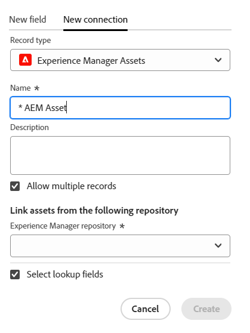
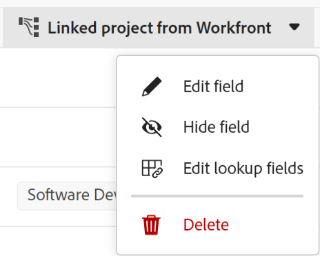

<!-----
title: Connect record types
description: A way to indicate how individual record types relate to one another is to connect them. Also, you can connect Adobe Workfront Planning record types with object types from other applications to enhance your users' experience and keep their focus in one application.
hidefromtoc: yes
hide: yes
feature: Work management
role: User
author: Alina
--->

<!--update the metadata with real information when making this avilable in TOC and in the left nav-->
<!--************ THIS MIGHT NO LONGER BE A 'RELATIONSHIP' TYPE FIELD, BECAUSE THEY WILL SHOW IT IN THE CONNECTION TAB*****************************-->

# 连接记录类型

{{maestro-important-intro}}

您可以使用Adobe Workfront Planning来设计包含组织所需记录类型的完全可自定义的工作区。 指示各个记录类型如何相互关联的一种方法是连接它们。 此外，您可以将Workfront Planning记录类型与其他应用程序中的对象类型连接起来，以增强用户体验并将它们的焦点集中在一个应用程序中。

您可以将记录类型相互连接或用其它应用程序的对象类型来记录类型。

这样，您就可以在Workfront Planning记录中显示链接记录或对象类型中的字段。

本文介绍了如何在Workfront Planning中将两种记录类型或一种记录类型与来自另一个应用程序的对象连接起来。

在记录或对象类型之间建立连接后，可以将各个记录相互连接。

有关将Workfront Planning记录连接到另一个应用程序中的对象的信息，请参阅 [连接记录](../records/connect-records.md).

有关连接记录类型的示例，请参见 [连接记录类型和记录的示例](../architecture/example-connect-record-types-and-records.md).

<!--ensure this last linked article is right; the title and the link should have changed-->

## 访问要求

您必须具有以下权限才能执行本文中的步骤：

<table style="table-layout:auto">
 <col>
 </col>
 <col>
 </col>
 <tbody>
    <tr>
<tr>
<td>
   
 产品
 </td>
   <td>
   
 Adobe Workfront
 
要将Adobe Workfront Planning记录类型与Experience Manager Assets连接，您必须具有Adobe Experience Manager Assets许可证，并且贵组织的Workfront实例必须载入Adobe业务平台或Adobe Admin Console。
 </td>
  </tr>  
 <td role="rowheader">
Adobe Workfront协议
</td>
   <td>

贵组织必须注册Adobe Workfront计划封闭测试版计划。 请联系您的客户代表以查询此新产品/服务。 

   </td>
  </tr>
  <tr>
   <td role="rowheader">
Adobe Workfront计划
</td>
   <td>

任何

   </td>
  </tr>
  <tr>
   <td role="rowheader">
Adobe Workfront许可证
</td>
   <td>
   
任何
 
  </td>
  </tr>

<tr>
   <td role="rowheader">
访问级别配置
</td>
   <td> 
Adobe Workfront Planning没有访问级别控制
  
</td>
  </tr>
<tr>
   <td role="rowheader">
布局模板
</td>
   <td> 
您的Workfront或组管理员必须在布局模板中添加Planning区域。 有关信息，请参阅 <a href="../access/access-overview.md">访问概述</a>. 
  
</td>
  </tr>
<tr>
   <td role="rowheader">
权限
</td>
   <td> 
管理工作区的权限</a> 
  
   
系统管理员有权访问所有工作区，包括他们未创建的工作区。
</td>
  </tr>
 </tbody>
</table>

<!--Maybe enable this at GA - but planing is not supposed to have Access controls in the Workfront Access Level: 
>[!NOTE]
>
>If you don't have access, ask your Workfront administrator if they set additional restrictions in your access level. For information on how a Workfront administrator can change your access level, see [Create or modify custom access levels](../administration-and-setup/add-users/configure-and-grant-access/create-modify-access-levels.md). -->

<!-- Notes to add for the table: for the "Workfront plans" row: the above is only for closed beta; when going to GA - activate the following plans:    

Current plan: Prime and Ultimate

Legacy plan: Enterprise
-->

<!-- Notes for the table: for the "Workfront access" row: 
For more information, see <a href="../../administration-and-setup/add-users/access-levels-and-object-permissions/wf-licenses.md" class="MCXref xref">Adobe Workfront licenses overview</a>.
-->

## 有关连接记录类型的注意事项

* 您可以在Adobe Workfront Planning中连接以下实体：

   * 两种记录类型

     记录类型必须属于同一工作区。
   * 来自另一个应用程序的记录类型和对象类型。

* 您可以将以下应用程序中的以下对象类型与Workfront Planning记录类型连接起来：

   * Adobe Workfront：

      * 项目
      * 项目组合
      * 项目群
      * 公司
      * 组

   * Adobe Experience Manager Assets：

      * 图像
      * 文件夹

     >[!IMPORTANT]
     >
     >您必须拥有Adobe Experience Manager Assets许可证，并且贵组织的Workfront实例必须载入Adobe业务平台或Adobe Admin Console，才能将Workfront Planning记录连接到Adobe Experience Manager Assets。
     >
     >如果您对入门Adobe Admin Console有任何疑问，请参阅 [Adobe统一Experience常见问题解答](/help/quicksilver/workfront-basics/navigate-workfront/workfront-navigation/unified-experience-faq.md).

* 为记录类型创建单个记录后，您可以从链接的记录类型字段中选择连接到的记录。 有关信息，请参阅 [连接记录](../records/connect-records.md).

* 将记录类型与另一个记录类型或另一个应用程序中的对象类型连接后，将出现以下情况：

   * **连接两种记录类型时**：在您连接的记录类型上创建链接记录字段。 在要连接的记录类型上创建类似的链接记录字段。

     例如，如果将“Campaign”记录类型与“Product”记录类型连接，则将在“Campaign”记录类型上创建名为“链接的产品”的链接记录字段，并在“Product”记录类型上创建自动名为“Campaign”的链接记录类型。

   * **将记录类型与另一个应用程序的对象类型连接时**：在您连接的记录类型上创建链接记录字段。 不会在其他应用程序的对象类型上自动创建链接记录字段。

     仅当实际对象连接到Workfront Planning记录时，才会为另一个应用程序的对象创建新的Workfront Planning只读记录类型。

     有关更多信息，请参阅 [连接记录](../records/connect-records.md).

   * **添加您连接的记录或对象的查找字段时**：您可以将其他应用程序的对象中的字段连接到Workfront Planning记录类型。 这些是链接或查找字段。 链接字段会在您连接记录或对象时自动显示连接记录或对象中的信息。 链接的查找字段始终是只读的，并且会自动填充连接的记录或对象的值。

     例如，如果您将“促销活动”记录类型与Workfront项目连接并选择将该项目的“计划完成日期”字段引入Workfront计划记录，则将自动为促销活动创建一个名为“计划完成日期”（来自项目）的链接字段。 您无法手动编辑此链接的字段。 计划完成日期（来自项目）字段显示链接项目的计划完成日期。

     >[!IMPORTANT]
     >
     >    对工作区具有“查看”或更高权限的每个人都可以查看链接字段中的信息，无论其在链接对象类型应用程序中的权限或访问级别如何。

* 链接的记录字段前面有关系图标 .

  链接的字段前面有标识该字段类型的图标。 例如，指示字段是数字、段落或日期的图标。

## 连接记录类型

<!--when changes here, also update the article for "Connect records"-->

{{step1-to-maestro}}

默认情况下应打开上次访问的工作区。

1. （可选）展开现有工作区名称右侧的向下箭头，然后选择要从中连接记录类型的工作区。
1. 单击记录类型的卡以打开记录类型页面。
1. 单击 **+** 图标，然后单击 **新建连接** 选项卡。

   

1. 在 **记录类型** 字段，搜索记录类型，或选择以下选项之一：

   * 来自所选工作区部分的另一个记录类型

     >[!TIP]
     >
     >只有来自所选工作区的记录类型可供连接。
     > 
     >如果所选工作区中没有其他记录类型，则不会显示工作区部分。

   * A **项目、Portfolio、计划、公司**，或 **组** 从 **Workfront对象类型** 部分。
   * **Experience Manager Assets** 从 **Adobe应用程序** 部分。

   

1. 更新以下信息：

   * **名称**：已连接字段的名称，它将显示在原始记录类型的表视图或记录页面中。 这会在原始记录类型的表视图或原始记录的链接记录字段中创建链接记录列。

   >[!TIP]
   >
   >我们建议您在连接的记录字段的名称中包含要链接到的记录名称，以捕获新字段来自的记录类型。 链接的记录的名称在新链接的记录字段或其链接的字段中不可见。

   * **描述**：有关连接的记录字段的其他信息。 当您将鼠标悬停在表中的字段列上时，将显示字段的描述。
   * **允许多条记录**：选择此选项以指示您允许用户在链接记录类型字段显示在原始记录上时添加多个记录。 默认情况下，该选项处于选中状态。
   * **选择查找字段**：选择此选项可从所选记录类型添加字段。 查找字段是与要链接到的记录或对象类型关联的字段。 链接它们将显示您链接到的记录或对象中的信息，以及您从中链接的记录的信息。 默认情况下，该选项处于选中状态。

1. （视情况而定，可选）如果您已选择连接Workfront对象，请选择 **自定义表单** 从 **仅链接符合这些条件的对象** 部分。 只有附加了所选自定义表单的对象才能链接到所选记录类型。 您可以选择多个表单。

   

   >[!NOTE]
   >
   > 您必须先在Workfront中为选定对象创建自定义表单，然后它们才会显示在此列表中。

1. （视情况而定）如果您已选择连接到Experience Manager Assets，请从以下位置选择一个存储库： **Experience Manager存储库** 中的下拉菜单 **链接以下存储库中的资产** 部分。 这是必填字段。 只有您在Experience Manager Assets中有权访问的存储库才会显示在此字段中。

   

1. 单击 **创建**.

1. （视情况而定）如果您选择 **选择查找字段** 设置， **添加查找字段** 框打开。

   单击 **+** 图标，以添加来自的字段 **未选择的字段** 区域。

   或

   单击 **-** 图标，以从删除字段 **选定的字段** 区域

   

   链接记录或对象后，连接的字段的值会自动填充。

   >[!IMPORTANT]
   >
   >    对工作区具有“查看”或更高权限的每个人都可以查看链接字段中的信息，无论其在链接对象类型应用程序中的权限或访问级别如何。

1. （可选）单击 **跳过** 并且不要从链接的记录或对象添加任何字段。 此 **名称** 在原始记录的表格视图中，链接记录的字段是唯一可见的字段。

1. （可选且视情况而定）如果选择链接数字、货币、百分比或日期类型字段，则还应选择聚合器值。 当用户在链接的记录字段中选择多个链接记录时，链接字段的值会根据您选择的聚合器显示为逗号分隔的或聚合的值。

   

   >[!NOTE]
   >
   > 将记录类型连接到Experience Manager Assets时，聚合不可用。

   从以下项中选择：

   * **无**：显示来自用逗号分隔的多个记录的值。 这是默认选项。
   * **MAX**：显示来自在链接记录字段中选择的多个记录的所有值中的最高值。
   * **MIN**：显示在链接记录字段中选择的多个记录的所有值中的最小值。
   * **SUM**：显示来自在链接的记录字段中选择的多个记录的所有值的总数。
   * **平均**：显示来自在链接的记录字段中选择的多个记录的所有值的平均值。

   >[!NOTE]
   >
   >例如，您可以从Campaign记录（原始记录）中链接产品记录（链接记录），并将其命名为“产品字段”。 您还可以选择从营销活动记录中链接产品记录的“预算”字段，并将其称为“产品预算”。 如果您允许在“产品字段”中选择多个记录，则可以选择预算为$120,000的产品1和预算为$100,000的产品2。 您可以在链接字段中查看原始记录的以下预算信息，具体取决于您选择的汇总：
   >
   >* **无**：120,000美元，100,000美元
   >* **MAX**：120,000美元
   >* **MIN**：100,000美元
   >* **SUM**：220,000美元
   >* **平均**：110,000美元
   >

1. （可选）使用 **搜索** 图标  以搜索字段。

1. 单击 **添加字段** 以保存更改。

   添加了以下项目：

   * 要链接的记录类型上的链接记录字段。 手动添加链接记录后，链接记录字段将显示来自链接记录类型的单个记录。 有关添加记录的信息，请参见 [连接记录](/help/quicksilver/maestro/records/connect-records.md). 链接记录字段的名称是您在步骤6中选择的名称。 <!--accurate-->

   * 在链接记录字段中手动添加记录或对象后，显示链接记录或对象类型字段中的信息的链接字段（或字段）。 仅在以下情况下创建链接的字段： **选择查找字段** 创建连接时可选择“设置”。 链接的字段会根据以下模式自动命名：

     `<Name of the original field on the linked record> (from <Name of your linked field>)`

     例如，如果您链接了某个“促销活动”记录类型与“项目”记录类型，并将该“项目”链接记录字段命名为“项目群信息”，然后选择还在“促销活动”表格视图中显示该“项目”的“预算”字段，则链接的字段将自动命名为 `Budget (from Program information)` 在营销活动的表格视图中。

   * 当您将记录类型链接到另一个记录类型时，链接记录字段也会添加到要链接的记录类型上。 链接记录类型中链接的记录字段的名称是您链接来源的记录类型的名称。

     例如，如果您从“Campaign”记录类型中链接“Product”记录类型，并将营销活动的连接字段命名为“链接的产品”，则会为“Product”记录类型创建“Campaign”链接记录字段。

     >[!TIP]
     >
     > 不会为对象创建链接记录字段，这些对象从另一个应用程序链接到您在Workfront Planning中链接的记录类型。

1. （可选，视情况而定）在原始记录类型或链接记录类型表格视图中，单击链接记录字段标题中的向下箭头，然后单击以下任一项：

   * **编辑字段**：您只能更新 **名称** 和 **描述** 字段的信息。
   * **编辑查找字段**：添加或删除任何链接记录的字段。

   

   要添加或移除查找字段，请按照上述步骤10-14中的说明操作。 <!--ensure these step numbers stay accurate-->

   >[!NOTE]
   >
   > 不能添加属于从另一应用程序链接到对象类型的记录类型的查找字段。
   >
   > 例如，无法将“Campaign Status”的查找字段添加到要从营销活动链接到的Workfront项目。

1. （可选）单击链接记录字段标题中的向下箭头，或者单击要链接到的记录类型中的查找字段标题，然后单击 **删除**.

   删除记录字段或查找字段。 如果删除记录字段，则与链接记录关联的任何查找字段也会被删除。
