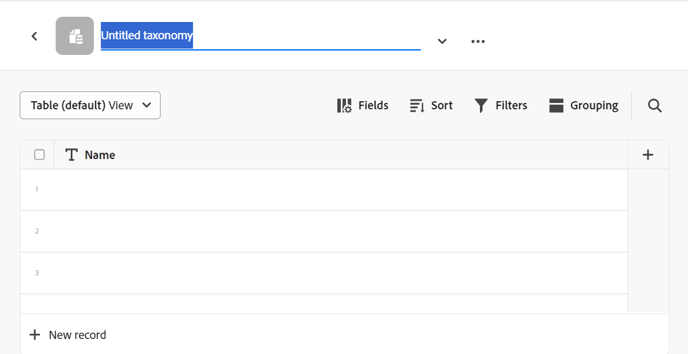

<!--udpate the metadata with real information when making this avilable in TOC and in the left nav-->

# 记录类型概览

{{maestro-important-intro}}

与Workfront中预定义的对象类型不同，在Adobe Workfront Planning中，您可以创建自己的对象类型。 例如，在Workfront中，已创建Program、Portfolio、Project、Task或Issue的对象类型。

Workfront Planning对象类型称为“记录类型”，您可以创建和自定义所有这些类型。 记录类型是Workfront Planning工作区的构建块。 有关工作区的信息，请参见 [创建工作区](../architecture/create-workspaces.md).

## 记录类型概述

在Workfront Planning中，您可以创建符合组织需求的自定义记录类型。

* 从模板创建工作区时，会在以下工作区部分中创建记录类型：

   * [操作记录类型](#operational-record-type)：表示战略计划、计划或计划工作的记录类型。 例如， Campaign 、 Activity 、 Tactics 、 Opportunity可以是运营记录类型。
   * [分类](#taxonomy)：捕获有关操作记录类型的属性的记录类型。 例如，区域、地址、受众可以是分类。

* 在自头创建的工作区中创建记录类型时，可以将记录类型放置到工作区中创建的任何部分中。
* 在创建记录类型时，只有您和您授予工作区访问权限的用户才能查看记录类型。
* 必须先创建工作区，然后才能为工作区创建记录类型。
* 一个工作区中总共可以有1,000个记录类型，无论该工作区有多少节。 这包括从头开始创建的记录类型或使用模板创建的记录类型。

<!--

### Operational Record Type{#operational-record-type}

An operational record type is a Maestro record type that represents work-related objects.  

For more information about operational record types including how to create them, see [Create record types](../architecture/create-record-types.md). 

### Taxonomy{#taxonomy}

A taxonomy is a record type that captures attributes about an operational record type. 

For more information about taxonomy record types, see [Create a taxonomy](../architecture/create-a-taxonomy.md). 

Although creating taxonomies is identical to creating operational record types, Maestro distinguishes conceptually between an operational record type and a taxonomy record type. The purpose of taxonomies is to enhance operational record types. Taxonomies should not directly represent work objects.  (***********this is no longer true, but might be later?!: A taxonomy is a record without dates, like a static list of attributes.***********) 

(********mimic what you did above for operational record types to say that we can also import taxonomies from other applications too - this will be possible later; for example Team would be a taxonomy record type, etc*************)

For example, Audience, Region, or Address can be taxonomy-type record types.  

For more information, see [Create a taxonomy](../architecture/create-a-taxonomy.md). 

## Similarities and differences between operational record types and taxonomies

The following table illustrates some of the similarities and differences between operational record types and taxonomies: 

| Record type and characteristic                              | Operational Record Type | Taxonomy Record Type |
|-------------------------------------------------------------|:-----------------------:|:--------------------:|
| They are part of a workspace                                |            ✓            |           ✓          |
| You can create them automatically, from a workspace template                    |            ✓            |           ✓          |
| You can create them manually, from scratch                    |            ✓            |           ✓          |
| You can create them by copying and pasting information from an external file or list                   |            ✓            |           ✓          |
| You can create by importing an Excel or CSV file                    |            ✓            |                     |
| You can create read-only record types by connecting to object types from other applications                    |            ✓            |                     |
| They represent work-related objects                         |            ✓            |                      |
| They represent attributes about work-related objects        |                         |           ✓          |
| You can create from scratch                                 |            ✓            |           ✓          |
| You can create by importing an Excel or CSV file            |            ✓            |                      |
| You can connect the record type to an object from another application|            ✓            |                      |
| You can connect to other Maestro record types               |            ✓            |                    |
| You can view their associated records in a table view       |            ✓            |           ✓          |
| You can view their associated records in a timeline view    |            ✓            |           ✓          |

-->