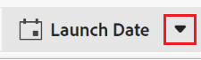

<!--update the metadata with real information when making this available in TOC and in the left nav-->

<!---
title: Formula fields
description: In Adobe Maestro, you can delete custom fields that are no longer relevant.
hidefromtoc: yes
hide: yes
author: Alina
feature: (*******************WE NEED A NEW ONE*******************)
role: User, Administrator (************is this right???************)
recommendations: noDisplay, noCatalog
--->

# 删除字段

>[!IMPORTANT]
>
>本文中的信息是指AdobeMaestro，它是Adobe Workfront提供的新产品。
>
>目前，AdobeMaestro是测试版计划的一部分，该计划对有限数量的客户开放。 您必须是Workfront客户才能使用Maestro功能。
>
>有关加入Maestro测试版计划的更多信息，请与您的客户代表联系。
>
>有关信息，请参阅 [Adobe大师概述](../maestro-overview.md).

在Adobe管理器中，您可以创建自定义字段来存储有关记录的信息。

有关在Maestro中创建自定义字段的信息，请参阅 [创建字段](../fields/create-fields.md).

您可以删除不再相关的Maestro字段。

## 有关删除Maestro字段的注意事项：

* 您可以删除您创建的字段或由其他用户或系统创建的字段。 <!--this will change with access levels/ permissions-->
* 您无法删除记录的“名称”字段。 <!--change this to say you can't delete the field selected to be the primary-->
* 您只能删除记录类型表中的字段。
* 存储在字段中的任何信息都将被删除并且无法恢复。
* 删除链接记录字段时，所有链接的查找字段也会从链接来源的记录类型中删除。 您链接到的记录类型的链接记录字段不会被删除。

  有关更多信息，请参阅 [连接记录类型](../architecture/connect-record-types.md).
  <!-- this is not possible yet, since fields cannot be shared yet; maybe move this up a bit, in this bullet list: * When you delete a field, it is deleted from all records associated with the field.-->

## 访问要求

您必须具有以下权限才能执行本文中的步骤：

<table style="table-layout:auto">
 <col>
 <tbody>
<td>
   
 Adobe产品
 </td>
   <td>
   
 Adobe Workfront
 </td>
  </tr>  
 <td role="rowheader">
Adobe Workfront协议
</td>
   <td>

贵公司必须注册AdobeMaestro封闭测试版计划。 请联系您的客户代表以查询此新产品/服务。 

   </td>
  </tr>
  <tr>
   <td role="rowheader">
Adobe Workfront计划
</td>
   <td>

任何

   </td>
  </tr>
  <tr>
   <td role="rowheader">
Adobe Workfront许可证
</td>
   <td>
   
任何
 
  </td>
  </tr>

<tr>
   <td role="rowheader">访问级别</td>
   <td> 
任何
  
</td>
  </tr>
<tr>
   <td role="rowheader">布局模板</td>
   <td> 
系统管理员必须在布局模板中添加Maestro区域。 有关信息，请参阅 <a href="../access/grant-access.md">授予对Adobe大师的访问权限</a>. 
  
</td>
  </tr>
 </tbody>
</table>

<!--
After permssions - replace the table with: 

<table style="table-layout:auto">
 <col>
 </col>
 <col>
 </col>
 <tbody>
    <tr>
<tr>
<td>
   
 Adobe product
 </td>
   <td>
   
 Adobe Workfront
 </td>
  </tr>  
 <td role="rowheader">
Adobe Workfront agreement
</td>
   <td>

Your organization must be enrolled in the Adobe Maestro closed beta program. Contact your account representative to inquire about this new offering. 

   </td>
  </tr>
  <tr>
   <td role="rowheader">
Adobe Workfront plan
</td>
   <td>

Any

   </td>
  </tr>
  <tr>
   <td role="rowheader">
Adobe Workfront license
</td>
   <td>
   
Any
 
  </td>
  </tr>
  
  <tr>
   <td role="rowheader">
Access level
</td>
   <td> 
Any
  
</td>
  </tr>
<tr>
   <td role="rowheader">
Layout template
</td>
   <td> 
Your Workfront or group administrator must add the Maestro area in your layout template. For information, see <a href="../access/grant-access.md">Grant access to Adobe Maestro</a>. 
  
</td>
  </tr>
<tr>
   <td role="rowheader">
Permissions
</td>
   <td> 
Manage permissions to a workspace</a> 
  
   
System Administrators have permissions to all workspaces, including the ones they did not create

</td>
  </tr>
 </tbody>
</table>

-->

<!--Maybe enable this at GA - but Maestro is not supposed to have Access controls in the Workfront Access Level: 
>[!NOTE]
>
>If you don't have access, ask your Workfront administrator if they set additional restrictions in your access level. For information on how a Workfront administrator can change your access level, see [Create or modify custom access levels](../administration-and-setup/add-users/configure-and-grant-access/create-modify-access-levels.md). -->

<!-- Notes to add for the table: for the "Workfront plans" row: the above is only for closed beta; when going to GA - activate the following plans:    

Current plan: Prime and Ultimate

Legacy plan: Enterprise
-->

<!-- Notes for the table: for the "Workfront access" row: 
For more information, see <a href="../../administration-and-setup/add-users/access-levels-and-object-permissions/wf-licenses.md" class="MCXref xref">Adobe Workfront licenses overview</a>.
-->

## 删除字段

<!--When they release the sharing of fields between other records, revise this section.  -->

1. 单击 **主菜单** 图标  位于Workfront的右上角，或者 **主菜单** 图标   （如果可用），然后单击 **大师** .

   这将打开Maestro中上次访问的工作区。
1. 单击要删除其字段的记录类型的卡片。
1. （视情况而定）选择 **表格视图** 从 **视图** 记录类型页面右上角的下拉菜单
1. 在列标题中查找要删除的字段，将鼠标悬停在列标题上，然后单击字段名称后的向下箭头。

   

1. 单击 **删除**. <!-- check this: they might replace it with **Delete field**-->

   <!--insert screen shot when finalized-->

1. 单击 **删除** 以确认。

   该字段已删除，无法恢复，并且无法再与任何记录关联。
