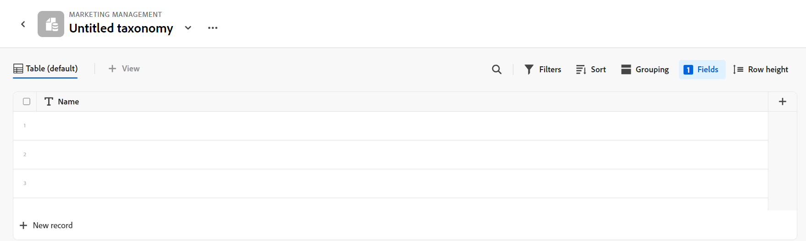
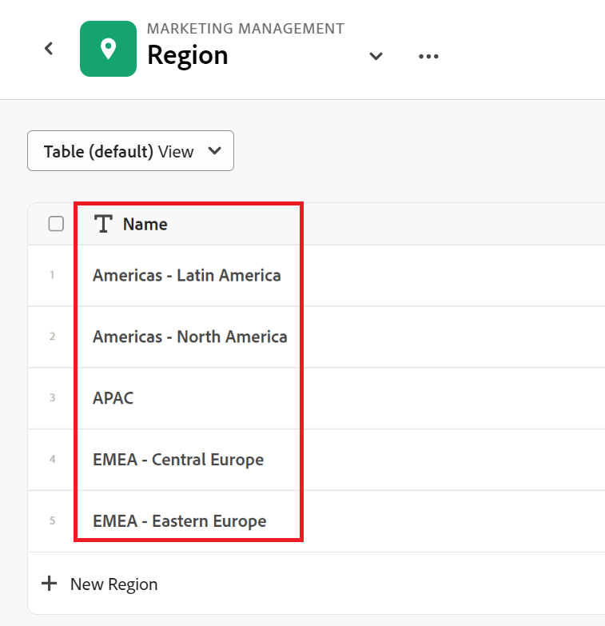

# Adobe大师概述

<!--udpate the metadata with real information when making this avilable in TOC and in the left nav-->

<!--see the separate article I wrote to have the PMs vet it for this: https://adobe-my.sharepoint.com/personal/alinaw_adobe_com/_layouts/15/doc.aspx?sourcedoc={79f94807-3d73-4015-afc0-5c016fc63cfc}&action=edit-->

<!--all the links are hidden for now, so I can share this with customer zero. Activate the links before making this public. -->

<!-- remove the references to closed beta from the entire article-->

<!--update the video in the IMPORTANT below, when we have something better, especially after Open Beta - remove it-->

>[!IMPORTANT]
>
>本文中的信息是指AdobeMaestro，它是Adobe Workfront提供的新产品。
>
>目前，AdobeMaestro是测试版计划的一部分，该计划对有限数量的客户开放。 您必须是Workfront客户才能使用Maestro功能。
>
>有关加入Maestro测试版计划的更多信息，请与您的客户代表联系。
>[观看Adobe大师的视频演示](https://video.tv.adobe.com/v/3424253/){target=_blank}

## Adobe大师简介

Adobe大师”是Adobe Workfront推出的新产品。 Maestro的目的是全面了解组织的运营详细信息，并回答工作管理生命周期每个阶段的关键业务问题。

团队和领导力需要获得以下问题的明确答案：

* 第4季度，我们在EMEA地区运行了多少次营销活动？
* 在并发营销活动之间是否有任何受众重叠？
* 认识项目目前进展如何？
* 特定营销活动的资产是什么样的？ 其中哪些仍必须获得批准？

要回答这些问题，领导力需要一种解决方案，能够全面了解从规划到执行、从交付到结果衡量的每个工作阶段。 目前，各组织拥有一些工具，可以涵盖流程的某些部分，但许多组织没有与工作的所有阶段建立良好的联系，也无法可靠地提供结果。

以下是Maestro的一些主要功能：

* 解决跨所有阶段和参与工作流程的所有利益相关者管理工作的问题。
* 全面自定义工作流，从决定组织使用哪些对象类型（或记录类型）到配置这些对象如何相互链接。
* 链接到来自其他系统的对象类型，为所有进程创建一致的框架。

## 在封闭测试版计划期间使用Maestro所需的访问权限

>[!IMPORTANT]
>
>目前，没有与用户或Maestro中的信息相关的访问级别或权限。 所有用户都可以查看、编辑和删除任何其他用户添加到Maestro的所有信息。

有关使用Maestro所需的访问权限的更多信息，请参阅 [Adobe专家访问概述](../maestro/access/access-overview.md).

<!-- hidden the table after I moved the content to the Access overview article: 

You must have the following access to use Adobe Maestro: 

<table style="table-layout:auto">
 <col>
 </col>
 <col>
 </col>
 <tbody>
    <tr>
<tr>
<td>
   
 Adobe product
 </td>
   <td>
   
 Adobe Workfront
 </td>
  </tr>  
 <td role="rowheader">
Adobe Workfront agreement
</td>
   <td>

Your organization must be enrolled in the Adobe Maestro closed beta program. Contact your account representative to inquire about this new offering. 

   </td>
  </tr>
  <tr>
   <td role="rowheader">
Adobe Workfront plan
</td>
   <td>

Any

   </td>
  </tr>
  <tr>
   <td role="rowheader">
Adobe Workfront license
</td>
   <td>
   
Any
 
  </td>
  </tr>
  
  <tr>
   <td role="rowheader">Access level</td>
   <td> 
Any
  
</td>
  </tr>

<tr>
   <td role="rowheader">Layout template</td>
   <td> 
Your system administrator must add the Maestro area in your layout template. For information, see <a href="../maestro/access/grant-access.md">Grant access to Adobe Maestro</a>. 
  
</td>
  </tr>
 </tbody>
</table>

************* Activate note when going to GA: 

>[!NOTE]
>
>If you still don't have access, ask your Workfront administrator if they set additional restrictions in your access level. For information on how a Workfront administrator can change your access level, see [Create or modify custom access levels](../administration-and-setup/add-users/configure-and-grant-access/create-modify-access-levels.md). 
-->

## Maestro术语

虽然Maestro是Workfront的一部分，但它带有专有概念和术语。 在开始为组织设置Maestro之前，请确保您熟悉Maestro概念。

Maestro的框架是完全可自定义的。 您可以创建所有记录类型、其属性以及与其关联的任何字段，以满足贵组织的确切需求。

以下是主要的Maestro对象和概念：

* **工作区**：定义特定组织的运营生命周期的记录类型和分类集合。 工作区是组织单位的工作框架。

  一个Workfront实例最多可以具有1,000个工作区。

  

  有关更多信息，请参阅 [创建工作区](../maestro/architecture/create-workspaces.md).

* **记录类型**：Maestro主对象类型。

  与Workfront中预定义对象类型不同，在Maestro中，您可以创建自己的对象类型。

  例如，在Workfront中，已创建Program、Portfolio、Project、Task或Issue的对象类型。

  在Maestro中，您可以创建符合组织工作流程的任何记录类型。 稍后，您可以定义记录类型如何相互关联或表单从属关系。

  有关更多信息，请参阅 [运营记录类型和分类概览](../maestro/architecture/overview-of-record-types-and-taxonomies.md).

  Maestro具有以下记录类型：

   * **操作记录类型**：表示战略计划、计划或已执行工作的记录类型。

     

     例如，促销活动、活动、项目群可以是运营记录类型。

     有关更多信息，请参阅 [创建记录类型](../maestro/architecture/create-record-types.md).

   * **分类**：捕获有关运营记录类型的属性的记录类型。

     

     尽管创建分类与创建操作记录类型相同，但Maestro会区分操作记录类型和分类记录类型。 分类法的目的是增强操作记录类型。 <!--this is no longer true, but might be later?!: A taxonomy is a record without dates, like a static list of attributes.-->

     例如，“受众”、“区域”或“地址”可以是分类类型的记录类型。

     有关更多信息，请参阅 [创建分类记录类型](../maestro/architecture/create-a-taxonomy.md).

* **记录**：Maestro记录类型的实例。 记录可以引用操作记录类型或分类。

  
  

  将记录类型添加到工作区后，您可以开始在该记录类型的页面上添加该类型的记录。

  例如，“Campaign”可以是操作记录类型，“Summer Campaign for EMEA”是Campaign记录类型的记录

  或

  “区域”是分类类型的记录，而“美洲 — 拉丁美洲”或“欧洲、中东和非洲 — 中欧”是分类类型的记录。

  有关更多信息，请参阅 [创建记录](../maestro/records/create-records.md).

* **工作区模板**：您可以使用预定义模板创建工作区。 您可以使用模板中的预定义记录类型、分类和字段，也可以添加自己的记录类型、分类和字段。

  

  Maestro随附销售、营销和产品管理工作区模板。

  有关更多信息，请参阅 [创建工作区](../maestro/architecture/create-workspaces.md).

* **字段**：字段是可添加到包含有关记录类型信息的操作或分类记录类型的属性。 <!--check the shot below, "Connection" needs to be in lowercase-->

  

  有关Maestro字段的注意事项：

   * 您为记录类型添加的字段会自动与该类型的所有记录相关联，并可用于捕获有关这些记录的数据。

   * 字段在应用于记录类型页的“表”视图中显示为列。 它们还显示在记录的详细信息页面中。

   * 字段对于记录类型是唯一的，不会从一种记录类型转移到另一种记录类型。

   * Maestro字段完全可自定义，并且只能在Maestro中访问。 您无法从Workfront访问Maestro字段。

  有关更多信息，请参阅 [创建字段](../maestro/fields/create-fields.md)

  默认情况下，新的操作记录类型与以下预定义字段相关联：

   * 名称
   * 描述
   * 开始日期
   * 结束日期
   * 状态

  默认情况下，新的分类记录类型与“名称”字段相关联。

  您可以创建以下类型的自定义字段：

   * 单行文本
   * 段落
   * 多选
   * 单选
   * 日期
   * 数字
   * 百分比
   * 货币
   * 复选框
   * 人员
   * 创建者
   * 创建日期
   * 上次修改者
   * 上次修改日期

* **链接的记录类型**， **链接的记录**、和 **链接的记录字段**：您可以在以下实体之间创建连接：

   * 两个Maestro记录类型
   * Maestro记录类型和Workfront项目、项目群、项目组合、公司或组对象类型。

  

  在记录类型之间建立连接后，可以将这些类型的单个记录彼此连接。 记录之间的连接显示为链接记录字段。

* **链接的字段** （或查找字段）：在两个记录类型之间建立连接并将单个记录链接在一起后，您可以在要连接的记录中引用链接记录的字段。

  

  有关链接记录类型、记录和创建链接字段的信息，请参阅以下文章：

   * [连接记录类型](../maestro/architecture/connect-record-types.md)
   * [连接记录](../maestro/records/connect-records.md)

<!--not yet:* Fields are reusable across Record Types.  -->

* **视图**：记录以不同类型的视图显示在各自的记录类型页面下。

  

  视图包含特定视图类型的个性化设置，如字段列表（列）、记录列表（行）、它们的顺序（排序）、应用的或适用的过滤器和分组。

  以下是可应用于记录类型页面的视图类型：

   * **表格视图**：以表格式显示记录及其字段。 表的行是单独的记录，列是记录字段。 这是默认视图。

     

   * **时间线视图**：按时间顺序显示时间轴中至少具有两个日期类型字段的记录。

     

  有关更多信息，请参阅 [管理记录视图](../maestro/views/manage-record-views.md).

## Maestro对象限制

下表显示了可在Maestro中创建的对象数限制。 当我们进入Maestro开发的下一个阶段时，这些限制可能会发生变化。

| Maestro对象 | 限制 |
|-------------------------------------------------------------------------------|:---------------------------------------------------------------------------------------------------------------:|
| 一个Workfront实例的工作区数 | 1,000 |
| 一个工作区的记录类型数 | 1,000（这包括工作区的分类，或从第三方应用程序导入的对象） |
| 一种记录类型的记录数 | 10,000 |
| 一种记录类型或分类的字段数 | 500 |
| 文本字段的字符数 | 1,000个字符 |
| 可粘贴到记录类型表中的文件大小 | 1MB |
| 可通过API为记录类型表导入的文件的大小 | 1.5MB |
| 发出API请求的速率 | 每分钟200个请求 |
| 可在表中导入的Excel文件的CSV大小 | 5MB |

## 在Workfront实例中为用户启用Maestro

贵组织必须注册AdobeMaestro封闭测试版计划，然后才能访问Maestro。 有关注册Beta版计划的信息，请联系您的客户代表。

有关授予对Maestro的访问权限以及允许其他人使用Maestro的详细信息，请参阅 [授予对Adobe大师的访问权限](../maestro/access/grant-access.md).

<!--hidden this after moved it to a separate article

After your organization has been enrolled in the Maestro beta program, you can add the Maestro area for other users by using a layout template. 

To share the Maestro area using a layout template: 

1. Log in to Workfront as a system administrator.  

1. Add the Maestro icon to the Main Menu using a Layout Template. For information, see [Customize the Main Menu using a layout template](../administration-and-setup/customize-workfront/use-layout-templates/customize-main-menu.md). 

1. Assign the  layout template to the users that you want to have access to Maestro.For information, see [Assign users to a layout template](../administration-and-setup/customize-workfront/use-layout-templates/assign-users-to-layout-template.md).

    All users who can access Maestro in their Main Menu can start creating workspaces, records types, records, and fields.  
  -->

## 找到Maestro

确保您的组织已获得Maestro的访问权限，并且您的系统或组管理员已将Maestro区域添加到主菜单。

要找到Maestro：

1. 登录到Adobe Workfront。

1. 单击 **主菜单**  图标，或单击 **主菜单**  左上角（如果可用）。

1. 单击 **大师** .

   “Maestro工作区”区域打开。

1. （可选并推荐）继续执行以下某些操作，以在Maestro中构建您的工作结构：

   1. 从头开始或使用模板创建工作区。

   1. 将记录类型添加到新工作区。

   1. 向新工作区中添加分类。

   1. 单击记录类型的名称以打开记录的页面。 默认情况下，记录页面会在“表”视图中打开。

   1. 通过执行以下任一操作自定义“表”视图：

      * 通过单击 **+** 图标。 视图中的列是与记录类型关联的字段。
      * 通过单击 **+** 图标。 视图中的行是所选记录类型的唯一记录。
      * 单击 **过滤器** 以筛选在记录类型页面上显示的信息。

   1. 单击记录名称可在记录的“详细信息”页面中查看详细信息。

   1. 从创建时间线视图 **视图** 记录类型页面右上角的下拉菜单

   1. 通过更新筛选器、分组或设置来自定义时间轴视图。

## Maestro中当前可用的功能

下表说明了Maestro中可用的主要功能及其可用时间线。 该列表不包括所有功能。

| 功能 | 现在可用 | 即将推出 | 正在研究 |
|----------------------------------------------------|:-----------------------------:|:--------------------------------:|:----------------:|
| 创建工作区 | ✓ {\f13 } |                                  |                  |
| 创建运营记录类型 | ✓ |                                  |                  |
| 创建分类 | ✓ |                                  |                  |
| 创建单独的命名记录和分类 | ✓ |                                  |                  |
| 创建记录自定义字段 | ✓ |                                  |                  |
| 使用Excel或CSV文件导入记录类型和字段 | ✓ |                                  |                  |
| 链接记录 | ✓ |                                  |                  |
| 查看表中的记录 | ✓ |                                  |                  |
| 在时间轴中查看记录 | ✓ |                                  |                  |
| 筛选记录 | ✓ |                                  |                  |
| 在时间轴视图中分组记录 | ✓ |                                  |                  |
| 在表视图中分组记录 | ✓ |                                 |                  |
| 对表视图中的记录进行排序 | ✓ |                                 |                  |
| 在时间轴视图中排序记录 |                               | ✓ |                  |
| 对表格视图中的分组进行排序 |                               | ✓ |                  |
| 在时间轴视图中排序分组 |                               | ✓ |                  |
| 连接工作区 |                               | ✓ |                  |
| 连接Maestro记录和分类 | ✓ |
| 在表视图中搜索记录 | ✓ |   |
| 将Maestro记录连接到Workfront项目、计划、项目组合、公司、组 | ✓ |                                 |                  |
| 记录详细信息页面 | ✓ |                                  |                  |
| 更新记录详细信息页面的布局 |                               | ✓ |                  |
| 工作区权限 | | ✓ |  |
| 提交请求 |                               |                                  | ✓ |
| 创意摘要 |                               |                                  | ✓ |
| 自定义记录的颜色和图标 | ✓ |                                  |                 |
| 向记录添加注释 |                               | ✓ |                 |
| 段落字段的富文本格式 | ✓ |                                  |                 |

## Maestro发布活动

我们定期向Maestro发布新功能。 有关已发布功能的最新列表，请参阅 [AdobeMaestro发布活动](../maestro/release-activity.md).

<!--moved the contents of this whole section to its own article: release-activity.md, in the same folder

This section lists the features and patches that have been released after the launch of the Maestro closed beta program, on May 22, 2023. 

The features are released weekly and are listed in the order of their release, with the most recent first. Customers who are participating in the Maestro closed beta program can access all features in their Preview and Production environments. 

### Week of September 4, 2023

#### Connect Maestro records with Workfront companies and groups

Preview and production: September 5, 2023  

You can now connect a Maestro record with Workfront companies and groups. You must first create a connection between a Maestro record type and the Workfront companies and groups object types. Then, you can connect a single Maestro record of the selected record type to individual Workfront companies and groups.  

Consider the following:  

* You must create a connection between Maestro record types and Workfront companies and groups for each Workspace.  

* You cannot connect taxonomy record types with Workfront object types. 

* You can connect multiple Maestro records to the same Workfront company or group, and multiple companies or groups to the same Maestro record.  

* You cannot edit companies or groups in Maestro. All company or group changes performed in Workfront are visible in Maestro, when reviewing the Maestro linked records.  

#### URL support for single-line text fields 

Preview and production: September 7, 2023 

For better visibility when working with links in the Table view, we have added support for URLs in single-line text fields. Using URLs to other websites or external drives when updating a single-line text field, now identifies them as links and allows you to click them from the table.  

### Week of August 28, 2023

#### Field visibility menu for the Table View toolbar

Preview and production: August 31, 2023

To display the right information on a given set of records, especially if you intend to share the view with others who need to see some but not all fields of a record type, you can now select which fields (or columns) to display and which to hide in the Table view.  

You can hide or show individual fields, from each header of the field columns, or you can manage all fields of the record type from a setting in the table view toolbar.  

### Week of August 21, 2023

#### Connect Maestro records to programs and portfolios 

Preview and production: August 24, 2023

You can now connect a Maestro record with Workfront programs and portfolios. You must first create a connection between a Maestro record type and a program or portfolio which creates a connected field. Then, you can connect any Maestro records from all other record types within the same workspace to specific programs and portfolios which will create a read-only Workfront Program or Workfront Portfolio record type in the same workspace. Consider the following:

* Workfront connector record types are unique for each workspace. 
* You can connect multiple Maestro records to the same Workfront program or portfolio, and multiple programs and portfolios to the same Maestro record. 
* You cannot edit programs and portfolios in Maestro. All program and portfolio changes performed in Workfront are visible in Maestro, when reviewing the linked records. 

#### New sorting functionality for the table view

Preview and production: August 24, 2023

You can now sort records in the table view of a record type page. 
The following capabilities are now available: 

* Sorting at the table-level, where you can sort by multiple fields at the same time. 
* Sorting at the column or field-level, where you can sort by an individual field at a time.

#### Improvements to the timeline view: new look-and-feel for groupings and the Compact/ Standard view switch

Preview and production: August 24, 2023

We have introduced the following improvements to the timeline view: 

* You can now display the timeline view in the following modes:

    * Standard: Displays records in separate lines.
    * Compact: Display the records whose dates don't intersect on the same line. 

* We have changed the look-and-feel of the grouping lines in the timeline view to display above the timeline of the records they contain. Prior to this improvement, the grouping lines displayed across the entire length of the timeline.

### Week of August 14, 2023

#### Reorder columns in the table view

You can now reorder columns in the Maestro table view. Consider the following when reordering columns: 

* The Name field is always the first field in the table view of a record type page 

* You cannot move the Name field to another position 

* The Name field is frozen and is not part of the horizontal scroll. 

#### Horizontal scroll for timeline view

You can now scroll horizontally in the timeline view of a record type. 

### Week of August 7, 2023

#### Import record types from an Excel file 

Preview and production: August 10, 2023

You can now import an Excel file to create record types in a workspace. The sheets of the file become the record types, and the columns of the file become their respective fields.  

#### Improved experience for connecting record types and projects 

Preview and production: August 10, 2023

We have improved the way you connect record types, including connecting to Workfront projects. As part of this improvement, we made the following changes when adding a field for a record type from the table view:  

* Removed the Relationship-type field from the "New field" tab.  

* Add a "New connection" tab where you can directly select the record or object type you want to connect to, eliminating the need for a Relationship-type field. 

### Week of July 10, 2023

#### Update the appearance of a record type

Preview and production: July 13, 2023

You can now select a custom icon for a record type, as well as a custom color for the record type icon.  

#### New Checkbox field type

Preview and production: July 13, 2023 

You can now add a Checkbox field type to Maestro record types. You can use the Checkbox field type to add a single checkbox option to a record. You can use this field to indicate a specific attribute or status for that particular record. For example, you can use it as a flag for tracking completion, approval, or any other binary attribute for each record.  

### Week of June 26, 2023

#### Quick activation of the contextual menu in a table

Preview and production: June 28, 2023
 
We have enabled the ability to activate the contextual menu by right-clicking anywhere in a record row, when viewing the records in the table view or a record type. You can now quickly view, delete, or copy a link to the record's Details page when you access the contextual menu from anywhere in the table view of a record type. Prior to this enhancement, the contextual menu was accessible only from the More menu in the Name column of a record.  

### Week of June 19, 2023

#### Record field names are unique

We have introduced a requirement now that the field names of a Maestro record type should have unique names. Fields that belong to different record types do not have to have unique names.  

### Week of June 5, 2023

#### Connect Maestro records with Workfront projects

Preview and production: June 5, 2023

You can now connect a Maestro record with Workfront projects. You must first create a connector Maestro record type to establish the connection between Maestro records and Workfront projects. Then, you can connect any Maestro records from all other record types to the connector record using the Relationship field. Consider the following:

* You must have a connector record type for Workfront for each Workspace. 
* You can connect multiple Maestro records to the same Workfront project, and multiple projects to the same Maestro record. 
* You cannot edit projects in Maestro. All project changes performed in Workfront are visible in Maestro, when reviewing the linked records. 

### Week of May 29, 2023

#### Two-date requirement for creating a Timeline view

Preview and production: May 31, 2023  

You must have at least two date fields associated with a record type in order to create a Timeline view. 
-->
