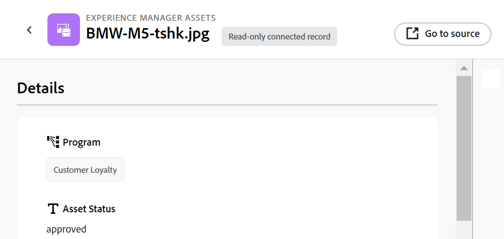

<!--when you make this live, update the metadata above to this: 
---
title: Connect records and objects
description: In addition to connecting Maestro records to one another, you can also connect Maestro records to objects from other applications.  
topic: Architecture
role: User
hidefromtoc: yes
hide: yes
---
-->
<!--update the metadata with real information when making this available in TOC and in the left nav-->

<!--if you change steps here, also update steps in the "Connect records" article-->

# 连接记录

>[!IMPORTANT]
>
>本文中的信息是指AdobeMaestro，它是Adobe Workfront提供的新产品。
>
>目前，AdobeMaestro是测试版计划的一部分，该计划对有限数量的客户开放。 您必须是Workfront客户才能使用Maestro功能。
>
>有关加入Maestro测试版计划的更多信息，请与您的客户代表联系。
>
>有关信息，请参阅 [Adobe大师概述](../maestro-overview.md).

您可以将AdobeMaestro记录连接到其他应用程序或对象。

您必须先将两个记录类型连接在一起，或者将记录类型连接到另一个应用程序中的对象类型，然后可以使用记录类型的“表”视图将记录连接到另一个对象，或者将记录连接到其他对象。

有关将记录类型相互连接或从其他应用程序连接到对象类型的信息，请参见 [连接记录类型](../architecture/connect-record-types.md).

有关连接记录类型的示例，请参见 [连接记录类型和记录的示例](../architecture/example-connect-record-types-and-records.md).

您可以连接以下各项：

* Maestro操作记录
* 将操作记录转换为分类记录
* Maestro操作记录和来自其他应用程序的对象。

  您可以将Maestro记录连接到下列应用程序中所列类型的对象：

   * Adobe Workfront

      * 项目
      * 项目组合
      * 项目群
      * 公司
      * 群组

   * Adobe Experience Manager Assets

      * 图像文件
      * 文件夹

  <!--when you add more objects, fix the Access Requirements below which right now refer only to projects-->

## 访问要求

您必须具有以下权限才能执行本文中的步骤：

<table style="table-layout:auto">
 <col>
 </col>
 <col>
 </col>
 <tbody>
    <tr>
<tr>
<td>产品
 </td>
   <td>
   
 Adobe Workfront
 
   
要将Maestro记录与Experience Manager Assets连接，您必须具有Adobe Experience Manager Assets许可证，并且贵组织的Workfront实例必须载入Adobe业务平台或Adobe Admin Console。

   </td>
  </tr>  
 <td role="rowheader">
Adobe Workfront协议
</td>
   <td>

贵公司必须注册AdobeMaestro封闭测试版计划。 请联系您的客户代表以查询此新产品/服务。 

   </td>
  </tr>
  <tr>
   <td role="rowheader">
Adobe Workfront计划
</td>
   <td>

任何

   </td>
  </tr>
  <tr>
   <td role="rowheader">
Adobe Workfront许可证
</td>
   <td>
   
任何
 
  </td>
  </tr>

<tr>
   <td role="rowheader">
访问级别配置
</td>
   <td> 
Maestro没有访问级别控制
  
</td>
  </tr>
<tr>
   <td role="rowheader">
权限
</td>
   <td> 
管理工作区的权限</a> 
  
   
系统管理员对所有工作区具有权限，包括他们未创建的工作区

</td>
  </tr>

<tr>
   <td role="rowheader">
布局模板
</td>
   <td> 
您的Workfront或组管理员必须在布局模板中添加Maestro区域。 有关信息，请参阅 <a href="../access/access-overview.md">访问概述</a>. 
  
</td>
  </tr>

</tbody>
</table>

<!--Maybe enable this at GA - but Maestro is not supposed to have Access controls in the Workfront Access Level: 
>[!NOTE]
>
>If you don't have access, ask your Workfront administrator if they set additional restrictions in your access level. For information on how a Workfront administrator can change your access level, see [Create or modify custom access levels](../administration-and-setup/add-users/configure-and-grant-access/create-modify-access-levels.md). -->

## 连接记录

### 有关连接记录的注意事项

* 连接记录类型后，连接的记录类型在链接它们的记录类型表中显示为链接记录字段。
* 您可以从链接的记录字段中浏览和添加链接记录的记录和对象以及对象类型。
* 您可以将链接记录类型的字段添加到要链接的记录类型的表中。
* 您无法手动更新正在链接的记录中链接字段的值。

  链接记录中链接字段的值会自动填充您从所配置的Maestro工作区或从第三方应用程序链接的Maestro记录。

* 每个有权访问Maestro并拥有工作区管理权限的人都可以查看您在Maestro记录之间或Maestro记录与其他应用程序对象之间建立的连接。 他们可以查看连接的记录和对象，无论他们对您所连接的第三方应用程序的权限如何。 <!--check with PM-->
* 如果您对连接记录所在的工作区具有管理权限，则可以查看和编辑其他人的连接。
* 您可以将一个Maestro记录连接到另一个应用程序的一个或多个对象。
* 要将Maestro记录与其他记录或对象链接，您必须具备以下各项：

   * 至少有一个Maestro工作区、记录类型和记录。

     有关更多信息，请参阅以下文章：

      * [创建工作区](../architecture/create-workspaces.md)
      * [创建记录类型](../architecture/create-record-types.md)
      * [创建记录](../records/create-records.md)

   * 记录类型之间的连接，或记录类型与其他应用程序的对象之间的连接。 有关信息，请参阅 [连接记录类型](../architecture/connect-record-types.md)

### 连接Maestro记录

{{step1-to-maestro}}

默认情况下应打开上次访问的工作区。

1. （可选）展开现有工作区名称右侧的向下箭头，然后选择要从中连接记录的工作区。
1. 单击记录类型的卡以打开记录类型页面。
1. 选择 **表** 从查看 **视图** 记录类型页面右上角的下拉菜单
1. （可选）通过向表中添加新行，将记录添加到您选择的记录类型。 有关信息，请参阅 [创建记录](../../maestro/records/create-records.md).
1. 从表视图中列出的记录，转到链接的记录列，将鼠标悬停在与要与其他记录链接的记录对应的单元格上，然后单击 **+** 图标。

   此 **连接对象** 框显示。

   

1. 在搜索框中开始键入记录的名称，然后当它显示在列表中时将其选定

   或

   在框中选择一个或多个记录的名称，然后单击 **连接对象** “连接对象”框右上角的。

   添加了以下内容：

   * 链接的记录显示在您在步骤5中选择的记录的链接记录字段中。 <!--accurate?--> 更新链接的记录会自动更新您正在链接的记录的链接字段。 您无法手动编辑链接的字段。

     >[!TIP]
     >
     >* 我们交替使用“链接字段”和“查找字段”。
     >
     >* 如果您已启用 **允许多条记录** 设置连接记录类型时，多个选定对象的字段值显示时用逗号分隔，或根据您选择的聚合器聚合。

1. （可选）关闭Maestro记录类型页面，然后转到所选的工作区。
1. 单击链接到的记录类型的卡。

   例如，如果您已连接 **营销活动** 包含产品记录的记录，单击 **产品** 卡片。

   记录类型卡片应在“表”视图中打开。 如果没有，请选择表格视图。

   请注意 **营销活动** 链接记录字段显示您在产品记录类型页面中链接到产品的营销活动的名称。 更新促销活动信息会自动更新产品记录类型的促销活动链接记录字段。

### 将Maestro记录连接到Workfront对象

<!--when we will have more applications to link to from Maestro, change the title to soemthing like: Connect Maestro records to objects from other applications-->

在Maestro记录类型和Workfront对象类型之间创建连接后，可以将单个Maestro记录连接到Workfront中的对象。 您连接的Workfront字段会自动填充到链接对象的Maestro记录中。

{{step1-to-maestro}}

默认情况下应打开上次访问的工作区。

1. （可选）展开现有工作区名称右侧的向下箭头，然后选择要从中连接记录的工作区。
1. 单击记录类型的卡以打开记录类型页面。
1. 选择 **表** 从查看 **视图** 记录类型页面右上角的下拉菜单

1. （可选）通过向表中添加新行，将单个记录添加到您选择的记录类型。 有关信息，请参阅 [创建记录](../../maestro/records/create-records.md).
1. （视情况而定）如果将选定的记录类型与Workfront对象连接，请转到链接对象列，将鼠标悬停在与要与Workfront对象链接的记录对应的单元格上，然后单击 **+** 图标。

   此 **连接对象** 框显示。

   

   有关将记录类型与来自第三方应用程序的对象连接的详细信息，请参阅 [连接记录类型](../architecture/connect-record-types.md).

1. 开始在搜索框中键入Workfront对象的名称，然后当该对象显示在列表中时将其选定

   或

   在框中选择一个或多个对象的名称，然后单击 **连接对象** “连接对象”框右上角的。

   添加了以下内容：

   * 选定的Workfront对象将添加到链接的记录字段。
   * 如果您在通过Workfront连接记录类型时添加了它们，则链接字段（或查找字段）会自动填充Workfront中的信息。
   * 名为“&lt; Name of the Workfront object type >”的新记录类型将在与链接的Maestro记录相同的工作区中创建。 对象的名称是此记录类型名称的一部分。 例如，链接到Workfront项目会创建 **项目** Maestro中的记录类型。

     这是只读记录类型，它显示在您从Maestro记录创建的新链接对象字段中选择的Workfront对象。 链接的对象的链接字段也会显示在只读链接的Workfront记录中。

     >[!IMPORTANT]
     >
     > 仅当单个项目添加到Maestro记录时，才会创建只读Workfront对象记录类型。 仅仅在Maestro记录类型和Workfront对象类型之间创建连接不会创建Workfront记录类型。

     Workfront对象字段中的任何现有信息都显示在链接或查找字段中。

     >[!TIP]
     >
     >
     >* 如果启用了“允许多条记录”设置，则多个对象的值要么以逗号分隔，要么根据您选择的聚合器聚合。
     >
     >* 在Workfront中，不会为链接的Workfront对象创建指向Maestro链接记录的链接记录字段。

1. （可选）关闭“Maestro记录类型”页面，然后转到您选择的工作区。
1. （可选）单击Workfront对象记录类型的卡片。 例如，单击 **项目** 信息卡(如果链接到Workfront项目)。 应在表视图中打开只读Workfront记录类型卡片。

   Workfront记录类型页面中列出的记录是已从Maestro记录链接的只读Workfront对象。 从Workfront记录类型链接的字段也显示为只读列，在Workfront中填充这些字段时，会自动填充这些字段。

1. （可选）要在Maestro中打开Workfront对象记录“详细信息”页面，请执行以下操作之一：

   * 从您链接的记录类型中，转到Workfront对象链接记录字段，然后单击Workfront对象的名称。
   * 从 **表** 查看Workfront记录类型页面，单击Workfront对象的名称

     或

     单击 **更多** Workfront对象名称右侧的菜单，然后单击 **视图**.

     

   这将打开链接的Workfront对象的“Maestro详细信息”页面。 这是只读页面。

1. （可选）要在Workfront中打开链接的Workfront对象，请执行以下操作之一：

   * 从 **表** 查看Workfront记录类型页面，单击Workfront对象的名称，以在Maestro中打开项目记录

   或

   单击 **更多** Workfront对象名称右侧的菜单，然后单击 **转到源**.

   

   此时将打开Workfront对象页面。 如果您有相应的权限，则可以编辑有关Workfront对象的信息。

1. （可选）在Maestro的只读Workfront对象记录页面中，单击 **添加字段** 图标  要从Workfront记录类型中添加或删除Workfront字段，请执行以下操作：

   >[!NOTE]
   >
   >  您在Workfront对象记录类型页面中添加或删除的字段不会从链接到Workfront对象类型的Maestro记录类型中添加或删除。 这些字段仅在只读Workfront记录类型页面上可见，因此您可以在Maestro中查看它们。

1. （可选且视情况而定）如果您向Workfront对象添加了至少两个日期字段，请单击 **视图** “Workfront对象记录类型”页面中的下拉菜单，然后选择 **时间线** 查看或 **创建视图** 创建时间线视图。  有关信息，请参阅 [管理时间线视图](/help/quicksilver/maestro/views/manage-the-timeline-view.md).

   Workfront链接对象显示在时间轴视图中。

### 将Maestro记录连接到Adobe Experience Manager对象

<!--when we will have more applications to link to from Maestro, change the title to soemthing like: Connect Maestro records to objects from other applications-->

>[!IMPORTANT]
>
>您必须拥有Adobe Experience Manager Assets许可证，并且贵组织的Workfront实例必须载入Adobe业务平台或Adobe Admin Console，才能将Maestro记录连接到Adobe Experience Manager Assets。
>
>如果您对入门Adobe Admin Console有任何疑问，请参阅 [Adobe统一Experience常见问题解答](/help/quicksilver/workfront-basics/navigate-workfront/workfront-navigation/unified-experience-faq.md).

在Maestro记录类型与Adobe Experience Manager Assets之间创建连接后，可以将单个Maestro记录连接到Experience Manager资源。 创建连接后，您从Experience Manager Assets连接的资源字段会自动填充在您链接的Maestro记录类型上。

{{step1-to-maestro}}

默认情况下应打开上次访问的工作区。

1. （可选）展开现有工作区名称右侧的向下箭头，然后选择要从中连接记录的工作区。
1. 单击记录类型的卡以打开记录类型页面。
1. 选择 **表** 从查看 **视图** 记录类型页面右上角的下拉菜单

1. （可选）通过向表中添加新行，将单个记录添加到您选择的记录类型。 有关信息，请参阅 [创建记录](../../maestro/records/create-records.md).
1. （视情况而定）如果将选定的记录类型与Experience Manager Assets连接，请转到链接对象列，将鼠标悬停在要与Experience Manager中的其他对象链接的记录对应的单元格上，然后单击 **+** 图标。

   此 **选择资源** 框显示。 <!--update screen shot with actual assets-->

   

   有关将记录类型与来自第三方应用程序的对象连接的详细信息，请参阅 [连接记录类型](../architecture/connect-record-types.md).

1. 单击可选择以下某些类型的资产：

   * 图像
   * 文件夹

   您可以选择多个资源。

   >[!IMPORTANT]
   >
   > 您只能连接您有权在Experience Manager中查看的资源。 连接后，所有Maestro用户都可以在Maestro中查看资源，无论他们在Experience Manager Assets中如何访问。

1. 单击 **选择**.

   添加了以下内容：

   * 选定的Experience Manager资源将添加到链接的记录字段。
   * 链接的字段（或查找字段）会填充Experience Manager所连接资源中的信息。
   * 名为“Experience Manager Assets”的新记录类型将在与链接的Maestro记录相同的工作区中创建。 <!--is this still added?-->

     这是只读记录类型，它显示在您从Maestro记录创建的新链接对象字段中选择的Experience Manager资源。 链接对象的链接字段也会显示在只读链接Experience Manager记录中。

     >[!IMPORTANT]
     >
     > 仅当将单个资产添加到Maestro记录时，才会创建只读的Experience Manager Assets记录类型。 只是在Maestro记录类型和Experience Manager Assets之间创建连接不会创建Experience Manager Assets记录类型。

     Experience Manager资源字段中的任何现有信息都显示在链接或查找字段中。

     >[!TIP]
     >
     >
     >* 如果启用了“允许多条记录”设置，则多个对象的值将以逗号分隔。
     >
     >* 在Experience Manager Assets应用程序中，不会为链接的Experience Manager资源创建指向Maestro链接记录的链接记录字段。

1. （可选）关闭Maestro记录类型页面，然后转到所选的工作区。
1. 单击Experience Manager Assets记录类型的卡。 只读Experience Manager Assets记录类型卡片应在“表”视图中打开。

   Experience Manager Assets记录类型页面中列出的记录是只读资源。 从Experience Manager Assets记录类型链接的字段也显示为只读列，当这些字段在Experience Manager中填充时，会自动填充它们。

1. （可选）转到您链接到Experience Manager Assets的记录类型，然后单击链接记录字段中的资源名称。 资源的Experience Manager详细信息将显示在弹出窗口中。 <!--update screen shot with hi-rez picture-->

   

   为图像文件显示以下字段：

   * 图像的缩略图
   * 图像文件名
   * 维度
   * 大小
   * 描述
   * Experience Manager中的文件路径
   * 资源类型
   * 创建日期
   * 修改日期

1. （可选）要在Maestro中打开“Experience Manager Assets记录详细信息”页面，请执行以下操作：

   1. 转到 **Experience Manager Assets** Maestro记录类型信息卡在您最初选择的工作区中，然后单击以打开记录类型页面。
Experience Manager Assets Maestro记录类型页面为只读。
   1. 在表视图中，单击资源的名称

      或

      将鼠标悬停在资产名称上，单击 **更多** 菜单  资产名称的右侧，然后单击 **视图**.\
      这将打开资产的主管 **详细信息** 页面。 这是只读页面。
1. （可选）要在Experience Manager中打开“Experience Manager资源记录详细信息”页面，请执行以下操作之一：

   * 转到链接来源记录的Maestro记录类型页面，单击链接记录字段中的资产名称以打开弹出窗口，然后单击 **打开** 图标  以打开资产。
   * 转到 **Experience Manager Assets** Maestro记录类型信息卡在您最初选择的同一工作区中，单击以打开记录类型页面，单击资产名称以打开Maestro **详细信息** 页面，然后单击 **转到源** 屏幕右上角的。

     
   * 转到 **Experience Manager Assets** 在最初选择的同一工作区中，Maestro记录类型信息卡单击该信息卡以打开Experience Manager Assets记录类型页面，将鼠标悬停在资源名称上，然后单击 **更多** 菜单，然后单击 **转到源**.

     

   资源将在Experience Manager Assets中打开。

1. （可选）单击 **添加字段** 图标  Experience Manager Assets添加或删除Experience Manager字段。

   >[!NOTE]
   >
   >  您在Experience Manager Assets记录类型页面中添加或删除的字段不会从链接到Experience Manager资源的Maestro记录类型中添加或删除。 这些字段仅在只读Experience Manager Assets记录类型页面上可见，因此您可以在Maestro中查看它们。

1. （可选且视情况而定）如果您向Experience Manager链接资源添加了至少两个日期字段，请单击 **视图** “Experience Manager Assets记录类型”页面中的下拉菜单，然后选择 **时间线** 查看或 **创建视图** 创建时间线视图。  有关信息，请参阅 [管理时间线视图](/help/quicksilver/maestro/views/manage-the-timeline-view.md).
Experience Manager Assets链接的资产会显示在时间轴视图中。