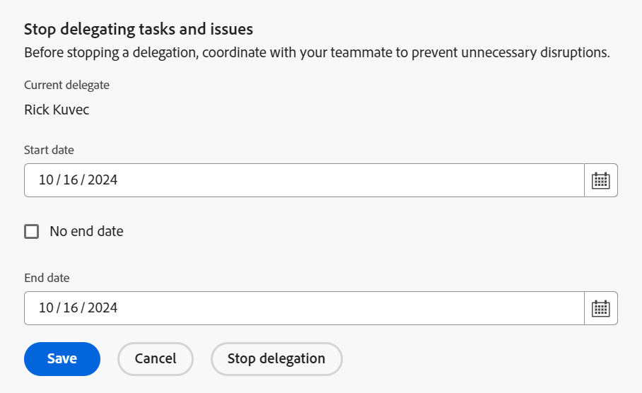

# 委派任务和问题

<!-- Audited: 10/2024 -->

<!--
<NOTE: 
<you might need to change the tile to Delegate PTI, etc, when that functionality is added. Named it this so it will not conflict with the TOC article for Delegate section which was also "Delegate work"
I wrote this as a "Manage..." article and I did not add three separate articles, to match what we have for delegating approval requests)
-->

您可以在外出时临时委派分配给您的工作。

您可以委派任务和问题分配，也可以委派审批。 本文介绍了如何委派任务和问题分配。

有关委托工作的一般信息，请参阅[委托工作概述](../../manage-work/delegate-work/delegate-work-overview.md)。

## 访问要求

+++ 展开以查看本文中各项功能的访问要求。

>[!IMPORTANT]
>
>* 您选择作为委派的用户将获得与您委派给他们的任务和问题的权限相同的权限。
>* 这些权限必须在其访问级别内工作，有时，其访问级别可能低于您的访问级别。
>
>   
>   例如，如果用户对其访问级别的任务只有“查看”访问权限，而您对您委派给他们的任务具有“管理”权限，则他们将获得您委派给他们的任务的“管理”权限。 但是，他们将无法对委派的任务执行与您相同的操作。 您不在时为了能够更新任务，必须向系统管理员请求对任务的编辑权限。
>
>   
>   有关系统管理员如何修改访问级别的信息，请参阅[创建或修改自定义访问级别](../../administration-and-setup/add-users/configure-and-grant-access/create-modify-access-levels.md)。
>
>* 对于在委派已开始之后分配的项目，在为[!DNL Workfront]分配项目后最多可能需要一小时才能与委派共享新分配的项目。

您必须具有以下权限才能执行本文中的步骤：

<table style="table-layout:auto"> 
 <col> 
 <col> 
 <tbody> 
  <tr> 
   <td role="rowheader">[!DNL Adobe Workfront] 计划</td> 
   <td> 
任何
 </td> 
  </tr> 
  <tr> 
   <td role="rowheader">[!DNL Adobe Workfront] 许可证*</td> 
   <td> 
新文档：参与者或更高版本

或

当前：审阅或更高版本

>[!NOTE]
>
>尽管您可以在拥有Request许可证时被分派到工作，但您不能将您的工作委派给其他人。 [!DNL Workfront]不建议将工作分配给审阅、请求或参与者用户。

</tr> 
  <tr> 
   <td role="rowheader">访问级别配置</td> 
   <td> 
编辑对任务和问题的访问权限 
     
 </td> 
  </tr> 
  <tr> 
   <td role="rowheader">对象权限</td> 
   <td> 
查看分配给您的任务或问题的权限或更高
 
    </td> 
  </tr> 
 </tbody> 
</table>

*有关详细信息，请参阅Workfront文档中的[访问要求](/help/quicksilver/administration-and-setup/add-users/access-levels-and-object-permissions/access-level-requirements-in-documentation.md)。

+++

<!--note from the table for Object permissions:
     
Contribute or higher permissions to the projects where you are designated as the Project&nbsp;Owner (NOTE:&nbsp;you cannot delegate projects yet)

    -->

## 先决条件

在执行本文中所述的活动之前，必须确保以下各项：

* 您的[!DNL Workfront]或组管理员在[!DNL Workfront]实例的[!UICONTROL 设置]区域的[!UICONTROL 任务和问题偏好设置]部分启用了&#x200B;[!UICONTROL **允许用户委派其任务和问题**]&#x200B;设置。

  有关详细信息，请参阅[配置系统范围的任务和问题首选项](../../administration-and-setup/set-up-workfront/configure-system-defaults/set-task-issue-preferences.md)。

## 将任务和问题委派给其他用户

在将工作委派给他人之前，我们建议您联系他们，并通知他们将被指定为您工作项目的代表。 在委派工作之前请他们口头批准，以确保他们有必要的时间在您外出时完成工作。

有关委派任务和问题的一般信息，请参阅[委派任务和问题概述](/help/quicksilver/manage-work/delegate-work/delegate-work-overview.md)。

要将您的任务和问题委派给其他人，请执行以下操作：

1. 转到&#x200B;[!UICONTROL **主页**]&#x200B;区域。
1. 请确保已将&#x200B;[!UICONTROL **我的工作**]、[!UICONTROL **我的任务**]&#x200B;或&#x200B;[!UICONTROL **我的问题**]&#x200B;构件添加到您的&#x200B;[!UICONTROL **主页**]。

   有关信息，请参阅[添加、编辑或删除主页中的小组件](/help/quicksilver/workfront-basics/using-home/new-home/add-edit-remove-widgets-in-new-home.md)

1. 单击&#x200B;[!UICONTROL **我的工作**]、[!UICONTROL **我的任务**]&#x200B;或&#x200B;[!UICONTROL **我的问题**]&#x200B;小组件的左上角的&#x200B;[!UICONTROL **代理**]。

   

1. 更新以下内容：

   * [!UICONTROL **将您的任务和问题委派给**]：开始键入您希望将您的任务和问题委派给的用户名称，然后当该名称显示在列表中时将其选定。 您只能选择一个用户。

     您选择作为代理的用户将获得与您委派给他们的任务和问题相关的权限相同的权限。

   * [!UICONTROL **开始日期**]：从日历中选择工作项委派应该开始的日期。

     >[!TIP]
     >
     >开始日期不能是过去。

   * [!UICONTROL **无结束日期**]：如果不想指定委派的结束日期，请选择此选项。

   * [!UICONTROL **结束日期**]：从日历中选择委派应该停止的日期。

     >[!TIP]
     >
     >如果将“结束日期”字段留空，并且未选择“无结束日期”选项，则仅为当天设置委派。

     
     <!--check screen shot - submitted bug for casing-->

1. 单击&#x200B;[!UICONTROL **保存**]。

   会发生以下情况：

   * 您的工作已委派给指定用户。 委派任何日期在您选择的时间范围内（包括在启用委派后新分配的任务或问题）的未完成任务或问题。

     >[!TIP]
     >
     >   日期在委派时间范围内的已完成工作项不会被委派。

   * 您会在屏幕底部收到一条消息，确认您已启用将您的工作委派给其他用户。 委派用户的名称显示在确认消息中。

   * 大多数区域都显示您的任务和问题已委派给其他用户，您可以在[!DNL Workfront]中看到这些工作分配。 有关哪些区域不包含代理人名称的更多信息，请参阅[代理人工作概述](delegate-work-overview.md)。

   * [!UICONTROL **主页**]&#x200B;区域中的&#x200B;[!UICONTROL **委派**]&#x200B;按钮更改为&#x200B;[!UICONTROL **编辑委派**]&#x200B;以指示存在委派。
     <!--
      <MadCap:conditionalText data-mc-conditions="QuicksilverOrClassic.Draft mode">
      (NOTE: is this shot correct?&nbsp;See UI - this is a mock)
      </MadCap:conditionalText>
      -->

     

   * 如果启用了事件通知和个人通知，您还会收到一封关于您委派的电子邮件确认。

   * 您选择作为委派的用户会收到一封有关委派的电子邮件（如果已启用其事件通知）。

     有关启用个人电子邮件通知的信息，请参阅[修改您自己的电子邮件通知](../../workfront-basics/using-notifications/activate-or-deactivate-your-own-event-notifications.md)。

## 编辑或停止委派

如果您选择了结束日期，则可以让委派过期，也可以手动停止委派。 如果委派日期发生更改，您还可以修改委派的时间范围。

1. 转到&#x200B;[!UICONTROL **主页**]&#x200B;区域，然后单击以下任何小部件中的&#x200B;[!UICONTROL **编辑委派**]：**我的工作**、**我的任务**&#x200B;或&#x200B;**我的问题**。
1. 在[!UICONTROL 停止委派任务和问题]框中，执行以下操作之一：
   * 修改&#x200B;[!UICONTROL **开始日期**]&#x200B;或&#x200B;[!UICONTROL **结束日期**]
   * 单击&#x200B;[!UICONTROL **停止委派**]

   >[!TIP]
   >
   >    如果委派已开始，则只能编辑委派的结束日期。

   

1. （视情况而定）单击&#x200B;[!UICONTROL **保存**]&#x200B;以保存新的委派日期

   或

   在确认框中单击&#x200B;[!UICONTROL **停止委派**]&#x200B;以确认停止委派。

   委派要么更新了日期，要么已停止，并且已从您的任务和问题中删除委派的用户。 他们对任务和问题的权限保持不变。

## 找到委托的工作和委托信息

<!--(if this was released, make sure that viewing delegated approvals has not changed, as documented here: /Content/Review and approve work/Manage Approvals/delegate-approval-requests.html) 
-->

委派任务和问题后，[!DNL Workfront]中有多个区域可供您查看所委派的工作或委派的人员。

* [在“工作”框中查找委派](#locate-delegates-in-the-assignments-box)
* [在[!UICONTROL 主页]中找到委托的工作](#locate-delegated-work-in-home)

### 在[!UICONTROL 工作]框中查找代理人

当您的系统或组管理员在系统中启用工作委派时，[!UICONTROL 工作总揽]框会在您可以访问它的任意位置显示以下选项卡：

* [!UICONTROL **任务**]：此处显示分配给任务或问题的用户。
* [!UICONTROL **委派**]：由任务或问题的被分派人指定为委派的用户显示在此处。

您可以在以下区域访问[!UICONTROL 工作总揽]框：

* 任务或问题标题

  任务或问题标题中的[!UICONTROL 任务]字段更改为[!UICONTROL 任务和委派]。

  

* 手动分配任务或问题时的[!UICONTROL 工作负载均衡器]

  

>[!NOTE]
>
> 您无法在任务或问题编辑框的[!UICONTROL 工作]部分中查看委派。

如果委派了任务或问题并且[!UICONTROL 委派]子选项卡为空，则可能存在以下情况之一：

* 您未分配到任务或问题。
* 任务或问题日期不在委派的时间范围内。

>[!TIP]
>
>委派的任务和问题的计划或实际小时数未考虑在资源管理工具中，如委派用户的[!UICONTROL 工作负载均衡器]或[!DNL Resource Planner]。 小时数仅与分配的用户相关联。

### 在[!UICONTROL 主页]中找到委托的工作

1. 转到&#x200B;[!UICONTROL **我的工作**]&#x200B;小组件中的&#x200B;[!UICONTROL **主页**]&#x200B;区域。
1. 单击过滤器下拉菜单，然后选择以下一个或多个选项：
   * [!UICONTROL **已委派**]：查看委派给您或由您委派的任务和问题。
   * [!UICONTROL **已委派给我**]：查看其他用户委派给您的任务和问题。
   * [!UICONTROL **由我委派**]：查看您委派给其他用户的任务和问题。

     

1. （可选）单击&#x200B;[!UICONTROL **排序**]&#x200B;下拉菜单以按以下条件对列表进行排序：
   * [!UICONTROL 到期日期]。 这是默认排序选项。
   * [!UICONTROL 名称]
   * 已完成[!UICONTROL 百分比]
   * [!UICONTROL 状态]
1. （可选）展开&#x200B;[!UICONTROL **我的工作**]&#x200B;构件右上角的分组下拉菜单，并按以下条件之一进行分组：
   * 没什么。 这是默认的分组选项。
   * [!UICONTROL 项目]
   * [!UICONTROL 状态]
   * [!UICONTROL 到期日期]

1. 要查看已委派或已委派给您的项目，请查看以下内容之一：

   * 对于您委派给其他人的项目，在&#x200B;[!UICONTROL **委派给**]&#x200B;之后，在任务或问题的状态下找到委派者的姓名。

   * 对于委派给您的项目，在&#x200B;[!UICONTROL **由**]&#x200B;委派给您之后，在任务或问题的状态下找到被分配人的名称。

     >[!TIP]
     >
     >    如果委派设置为在今天日期之后的某个日期开始，则委派的开始日期也会显示在[!UICONTROL 工作列表]中。 委派的项目会根据分组的类型，显示在您为[!UICONTROL 工作列表]选择的分组中。 例如，如果您按[!UICONTROL 计划完成日期]分组，则委派物料会显示在与其计划完成日期匹配的分组中。
