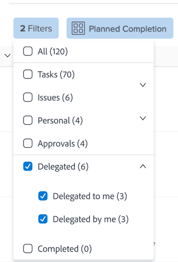

# 管理任务和问题委派

<!--
<NOTE: 
<you might need to change the tile to Delegate PTI, etc, when that functionality is added. Named it this so it will not conflict with the TOC article for Delegate section which was also "Delegate work"
I wrote thhis as a "Manage..." article and I did not add three separate articles, to match what we have for delegating approval requests)
-->

您可以在外出时临时委派分配给的工作。

您可以委派任务和发放分配，也可以委派审批。 本文介绍了如何委派任务和问题分配。

有关委派工作的常规信息，请参阅 [委派工作概述](../../manage-work/delegate-work/delegate-work-overview.md).

## 访问要求

>[!IMPORTANT]
>
>* 您选择作为代理的用户将获得与您委派给他们的任务和问题的权限相同的权限。
>* 权限必须在其访问级别内工作，有时其访问级别可能低于您的级别。

   >
   >   
   >   例如，如果用户在其访问级别中只具有查看任务访问权限，而您对您委派给他们的任务具有管理权限，则用户将收到您委派给他们的任务的管理权限。 但是，他们将无法执行与您对委派任务执行相同的操作。 他们必须向系统管理员请求对任务的编辑访问权限，才能在您缺席时更新任务。
   >
   >   
   >   有关如何修改访问级别的信息，请参阅 [创建或修改自定义访问级别](../../administration-and-setup/add-users/configure-and-grant-access/create-modify-access-levels.md).
>
>* 对于在委派已启动后分配的项目，最长可能需要在为分配了该项目后一个小时 [!DNL Workfront] 与委托共享新分配的项目。

您必须具有以下访问权限才能执行本文中的步骤：

<table style="table-layout:auto"> 
 <col> 
 <col> 
 <tbody> 
  <tr> 
   <td role="rowheader">[!DNL Adobe Workfront] 计划*</td> 
   <td> 
任意
 </td> 
  </tr> 
  <tr> 
   <td role="rowheader">[!DNL Adobe Workfront] 许可证*</td> 
   <td> 
审阅或更高版本

>[!NOTE]
>
>尽管在您拥有请求许可证时，可以将您分配到工作，但您无法将您的工作委派给其他人。 [!DNL Workfront] 不建议将工作分配给审核或请求用户。

</tr> 
  <tr> 
   <td role="rowheader">访问级别配置*</td> 
   <td> 
编辑对任务和问题的访问权限如果您仍没有访问权限，请咨询您的 [!DNL Workfront] 管理员。 有关如何 [!DNL Workfront] 管理员可以修改您的访问级别，请参阅 <a href="../../administration-and-setup/add-users/configure-and-grant-access/create-modify-access-levels.md" class="MCXref xref"> 创建或修改自定义访问级别</a>.
 </td> 
  </tr> 
  <tr> 
   <td role="rowheader">对象权限</td> 
   <td> 
查看您分配到的任务或问题的更高权限
 
    
有关请求其他访问权限的信息，请参阅 <a href="../../workfront-basics/grant-and-request-access-to-objects/request-access.md" class="MCXref xref">请求对对象的访问 </a>.
 </td> 
  </tr> 
 </tbody> 
</table>

*要了解您拥有的计划、许可类型或访问权限，请联系您的 [!DNL Workfront] 管理员。

<!--note from the table for Object permissions:
     
Contribute or higher permissions to the projects where you are designated as the Project&nbsp;Owner (NOTE:&nbsp;you cannot delegate projects yet)

    -->

## 先决条件

在执行本文所述的活动之前，您必须确保：

* 您的 [!DNL Workfront] 或组管理员已启用 [!UICONTROL 允许用户删除已记录小时的任务和问题] 设置 [!UICONTROL 设置] 区域 [!DNL Workfront] 实例。

   有关更多信息，请参阅 [配置系统范围的任务和问题首选项](../../administration-and-setup/set-up-workfront/configure-system-defaults/set-task-issue-preferences.md).

## 将任务和问题委派给其他用户

在将工作委派给他人之前，我们建议您联系他们，并通知他们，他们将在您的工作项目中被指定为代表。 下放工作前请求口头批准，以确保他们有在您不在办公室时完成工作所需的时间。

有关委派任务和问题的常规信息，请参阅 [委派任务和问题概述](delegate-work.md).

要将任务和问题委派给其他人，请执行以下操作：

1. 转到 [!UICONTROL **主页**] 区域，然后单击 [!UICONTROL **委派**] 在 [!UICONTROL **工作列表**].

   

1. 在 [!UICONTROL **委派任务和问题**] 选项卡，更新以下内容：

   * [!UICONTROL **将任务和问题委派到**]:开始键入您希望将任务和问题委派给的用户的名称，然后在列表中显示时选择该名称。 您只能选择一个用户。\

      您选择作为委派的用户将收到与您向其委派的任务和问题的权限相同的权限。 有关更多信息，请参阅 [委派任务和问题概述](delegate-work-overview.md).

   * [!UICONTROL **开始日期**]:从日历中选择开始委派工作项目的日期。

      >[!TIP]
      >
      >开始日期不能是过去的日期。

   * [!UICONTROL **无结束日期**]:如果您不想为委派指定结束日期，请选择此选项。

   * [!UICONTROL **结束日期**]:从日历中选择委派应停止的日期。

      >[!TIP]
      >
      >不选择结束日期，则仅为当天启用委派。

      

1. 单击&#x200B;[!UICONTROL **保存**]。

   发生以下情况：

   * 您的工作将委派给指定用户。 如果任何未完成的任务或问题的日期在您选择的时间范围内（包括启用委派后新分配的任务或问题），则会进行委派。
   >[!TIP]
   >
   >   不会委派在委派的时间范围内具有日期的已完成工作项。

   * 您会在屏幕的右上角收到一条消息，确认您已启用将工作委派给其他用户。 确认消息中将显示委派用户的名称。

   * 在大多数区域中，您都可以在 [!DNL Workfront]. 有关哪些区域不包括代表姓名的详细信息，请参阅 [委派任务和问题概述](delegate-work-overview.md).

   * 的 [!UICONTROL **委派**] 按钮 [!UICONTROL 主页] 区域更改 [!UICONTROL **编辑委派**] 表示已有一个代表团。

   <!--
   <MadCap:conditionalText data-mc-conditions="QuicksilverOrClassic.Draft mode">
   (NOTE: is this shot correct?&nbsp;See UI - this is a mock)
   </MadCap:conditionalText>
   -->

   

   * 如果启用了事件通知和个人通知，您还会收到有关委派的电子邮件确认。

   * 如果您选择作为委托的用户的事件通知已启用，则该用户会收到有关该委托的电子邮件。

      有关启用个人电子邮件通知的信息，请参阅 [激活或停用您自己的事件通知](../../workfront-basics/using-notifications/activate-or-deactivate-your-own-event-notifications.md).

## 编辑或停止委派

如果您选择了结束日期，则可以让委派过期，也可以手动停止委派。 如果委派日期发生更改，您还可以修改委派的时间范围。

1. 转到 [!UICONTROL 主页] 区域，然后单击 [!UICONTROL 编辑委派] 中。
1. 在 [!UICONTROL 委派任务和问题] 选项卡，执行下列操作之一：
   * 修改 [!UICONTROL **开始日期**] 或 [!UICONTROL **结束日期**]
   * 单击 [!UICONTROL **停止委派**]

   >[!TIP]
   >
   >    如果委派已经启动，则只能编辑委派的结束日期。

   

1. （视情况而定）单击 [!UICONTROL **保存**] 保存新的委派日期

   或

   单击 [!UICONTROL **停止委派**] 确认框中确认停止委派。

   委派会更新日期或停止日期，并且已从您的任务和问题中删除委派的用户。 他们对任务和问题的权限仍然有效。

## 查找委派的工作和委派信息

<!--(if this was released, make sure that viewing delegated approvals has not changed, as documented here: /Content/Review and approve work/Manage Approvals/delegate-approval-requests.html) 
-->

委派任务和问题时， [!DNL Workfront] 您可以在此处查看委派的工作或代表的身份。

* [在“分配”(Assignments)框中查找代理](#locate-delegates-in-the-assignments-box)
* [在中查找委派的工作 [!UICONTROL 主页]](#locate-delegated-work-in-home)

### 在 [!UICONTROL 分配] 框

当系统或组管理员在系统中启用工作委派时， [!UICONTROL 分配] 框中会显示以下选项卡，您可以在任何位置访问它：

* [!UICONTROL **分配**]:此处将显示分配给任务或问题的用户。
* [!UICONTROL **代表团**]:此处将显示任务或问题的受分配者指定为代表的用户。

您可以访问 [!UICONTROL 分配] 框中，选择“禁止使用”选项。

* 任务或问题标题

   

   的 [!UICONTROL 分配] 任务或问题标题更改为 [!UICONTROL 任务和代表团].

* 的 [!DNL Workload Balancer] 在手动分配任务或问题时

   

>[!NOTE]
>
> 无法在 [!UICONTROL 分配] “编辑”(Edit)框的部分。

如果委派了任务或问题，并且 [!UICONTROL 代表团] 子选项卡为空，则可能存在以下方案之一：

* 未将您分配给任务或问题。
* 任务或问题日期超出委派时间范围。

>[!TIP]
>
>资源管理工具(如 [!DNL Workload Balancer] 或 [!DNL Resource Planner] ，用于委派的用户。 小时数仅与分配的用户关联。

### 在中查找委派的工作 [!UICONTROL 主页]

1. 转到 [!UICONTROL **主页**] ，然后单击过滤器下拉菜单并选择以下一个或多个选项：
   * [!UICONTROL **委派**]:查看您或您委派的任务和问题。
   * [!UICONTROL **委托给我**]:查看其他用户委派给您的任务和问题。
   * [!UICONTROL **由我委派**]:查看您委派给其他用户的任务和问题。

   

1. 单击 [!UICONTROL 排序] 下拉菜单，按以下条件对列表进行排序：
   * [!UICONTROL 计划完成]. 这是默认的排序选项。
   * [!UICONTROL 计划开始]
   * [!UICONTROL 提交日期]
   * [!UICONTROL 项目]
   * [!UICONTROL 我的优先级]
1. 在 [!UICONTROL **工作列表**] 以查看委派的工作项目。 存在以下情形：
   * 对于您委派给其他人的项目，委派的名称显示在 [!UICONTROL **工作列表**] 以及 [!UICONTROL **任务和代表团**] 字段。

   * 对于委派给您的项目，代理人的名称显示在 [!UICONTROL **工作列表**] 以及 **[!UICONTROL 任务和代表团]** 字段。
   >[!TIP]
   >
   >    如果将委派设置为在今天日期之后的某个日期开始，则委派的开始日期也会显示在 [!UICONTROL 工作列表]. 委派项目显示在您为 [!UICONTROL 工作列表]，具体取决于分组类型。 例如，如果按 [!UICONTROL 计划完成日期]，则委派项目会显示在与其计划完成日期匹配的分组中。
