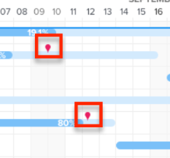
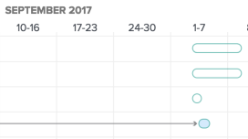

# 配置信息在[!UICONTROL 甘特图]上的显示方式

<!-- Audited: 5/2025 -->

您可以配置在任务列表甘特图和项目列表甘特图中显示哪些信息。

## 访问要求

+++ 展开以查看本文中各项功能的访问要求。

您必须具备以下条件才能执行本文中的步骤：

<table style="table-layout:auto"> 
 <col> 
 <col> 
 <tbody> 
  <tr> 
   <td role="rowheader"> Adobe Workfront计划</td> 
   <td> 
任何 
 </td> 
  </tr> 
  <tr> 
   <td role="rowheader">Adobe Workfront许可证</td> 
   <td> 
   
新建：浅色

   
或

   
当前：复查

   </td> 
  </tr> 
  <tr> 
   <td role="rowheader">访问级别配置</td> 
   <td> 
[!UICONTROL 视图]或更高权限访问项目和任务
 
注意：如果您仍然没有访问权限，请询问您的[!DNL Workfront]管理员是否对您的访问级别设置了其他限制。 有关[!DNL Workfront]管理员如何修改访问级别的信息，请参阅<a href="../../../administration-and-setup/add-users/configure-and-grant-access/create-modify-access-levels.md" class="MCXref xref">创建或修改自定义访问级别</a>。
 </td> 
  </tr> 
  <tr> 
   <td role="rowheader">对象权限</td> 
   <td> 
[!UICONTROL 视图]或更高版本的项目访问权限
 
有关请求其他访问权限的信息，请参阅<a href="../../../workfront-basics/grant-and-request-access-to-objects/request-access.md" class="MCXref xref">请求访问对象</a>。
 </td> 
  </tr> 
 </tbody> 
</table>

有关此表中信息的更多详细信息，请参阅Workfront文档中的[访问要求](/help/quicksilver/administration-and-setup/add-users/access-levels-and-object-permissions/access-level-requirements-in-documentation.md)。

+++

## 了解显示选项

下表详细列出了[!UICONTROL 甘特图]的显示选项：

<table style="table-layout:auto"> 
 <col> 
 <col> 
 <col> 
 <tbody> 
  <tr> 
   <td role="rowheader">实际日期</td> 
   <td>  </td> 
   <td> 
[!UICONTROL 实际开始日期]和[!UICONTROL 实际完成日期]以三角形图标显示。 如果[!UICONTROL 实际完成日期]为空，则只显示[!UICONTROL 实际开始日期]。
 
有关详细信息，请参阅项目<a href="../../../manage-work/projects/planning-a-project/project-actual-completion-date.md" class="MCXref xref">概述[!UICONTROL 实际完成日期] </a>和项目<a href="../../../manage-work/projects/planning-a-project/project-actual-start-date.md" class="MCXref xref">概述[!UICONTROL 实际开始日期] </a>。
 </td> 
  </tr> 
  <tr> 
   <td role="rowheader">[!UICONTROL 分配]</td> 
   <td>  </td> 
   <td> 
显示任务被分派人。 将鼠标悬停在被分配人姓名旁边的详细信息链接上，可查看有关他们的更多详细信息，包括他们分配给任务的百分比。
 
将[!UICONTROL 甘特图]导出到PDF时，[!UICONTROL 甘特图]中不会显示被分配人。 将[!UICONTROL 甘特图]导出到PDF时，被分配人仅显示在任务列表中。
 </td> 
  </tr> 
  <tr> 
   <td role="rowheader">[!UICONTROL 基线]</td> 
   <td>  </td> 
   <td> 
项目快照，表示初始项目计划中包含的项目的关键数据段。 可以在项目的整个时间表中采用基线。 启用在&lbrack;！UICONTROL甘特图中显示基线时，请选择要显示的基线。 您一次只能在[!UICONTROL 甘特图]上查看一个基线，该基线将以灰色条形显示。
 
有关基线的详细信息，请参阅<a href="../../../manage-work/projects/create-projects/create-baselines.md" class="MCXref xref">创建项目基线</a>。
 </td> 
  </tr> 
  <tr> 
   <td role="rowheader">[!UICONTROL 提交日期]</td> 
   <td>  </td> 
   <td> 
被分派人承诺完成任务的日期，在[!UICONTROL 甘特图]中以标记显示。 
 
有关提交日期的详细信息，请参阅<a href="../../../manage-work/projects/updating-work-in-a-project/overview-of-commit-dates.md" class="MCXref xref">[!UICONTROL 提交日期]概述</a>。
 </td> 
  </tr> 
  <tr> 
   <td role="rowheader">[!UICONTROL %完成]</td> 
   <td>  </td> 
   <td>  任务的完成百分比显示在任务行中。  </td> 
  </tr> 
  <tr> 
   <td role="rowheader">[!UICONTROL 关键路径]</td> 
   <td>  </td> 
   <td>可能会影响项目时间线的任务会被视为关键路径的一部分，并明确标记为红色。 </td> 
  </tr> 
  <tr> 
   <td role="rowheader">[!UICONTROL Milestone]菱形</td> 
   <td>  </td> 
   <td> 
在与里程碑关联的任务之后，将显示一个菱形图标。 将鼠标悬停在里程碑上可查看里程碑的名称和日期。 [!DNL Workfront]管理员确定每个里程碑菱形的颜色。
 
有关里程碑的详细信息，请参阅<a href="../../../administration-and-setup/customize-workfront/configure-approval-milestone-processes/create-milestone-path.md" class="MCXref xref">创建里程碑路径</a>。
 </td> 
  </tr> 
  <tr> 
   <td role="rowheader">[!UICONTROL Milestone]行</td> 
   <td>  </td> 
   <td> 
在与里程碑关联的任务之后会显示一条直线。 将鼠标悬停在里程碑上可查看里程碑的名称和日期。 [!DNL Workfront]管理员确定每个里程碑行的颜色。
 
 有关里程碑的详细信息，请参阅  <a href="../../../administration-and-setup/customize-workfront/configure-approval-milestone-processes/create-milestone-path.md" class="MCXref xref">创建里程碑路径</a>
 </td> 
  </tr> 
  <tr> 
   <td role="rowheader">[!UICONTROL 前置任务]</td> 
   <td>  </td> 
   <td> 
显示两个任务之间前置任务关系的任务之间的线条。 要突出显示单个前置任务行，请将鼠标悬停在该行上。 单击以将其高亮显示。 您一次只能突出显示一个前置任务行。
 
在甘特图或具有跨项目前置任务的任何任务中，如果任务的前置任务关系跨越多个页面，则旁边会显示一个[!UICONTROL 前置任务]图标。
 
单击[!UICONTROL 前置任务]图标可查看所有前置任务和后续任务及其详细信息，如任务名称、前置任务关系类型和关键日期。
 
注意：项目列表中的[!UICONTROL 甘特图]显示有关跨项目前置任务的信息。 有关如何在不同项目之间创建前置任务关系的详细信息，请参阅<a href="../../../manage-work/tasks/use-prdcssrs/cross-project-predecessors.md" class="MCXref xref">创建跨项目前置任务</a>
 
有关前置任务的详细信息，请参阅<a href="../../../manage-work/tasks/use-prdcssrs/enforced-predecessors.md" class="MCXref xref">强制执行前置任务</a>。
 </td> 
  </tr> 
  <tr> 
   <td role="rowheader">[!UICONTROL 进度状态]</td> 
   <td> 
[!UICONTROL On Time] 
 
[!UICONTROL 落后]    
 
[!UICONTROL 处于风险中]    
 
晚的        
 </td> 
   <td> 
 
 
给定任务当前进度的状态。 
 
有关详细信息，请参阅<a href="../../../manage-work/tasks/task-information/task-progress-status.md" class="MCXref xref">任务[!UICONTROL 进度状态]概述</a>。
 </td> 
  </tr> 
  <tr> 
   <td role="rowheader">预计日期</td> 
   <td>  </td> 
   <td> 
根据当前已完成工作加上剩余工作标明预计开始和完成日期的预计时间表。 
 
有关预计完成日期的更多信息，请参阅<a href="../../../manage-work/projects/planning-a-project/project-projected-completion-date.md" class="MCXref xref">项目、任务和问题的预计完成日期概览</a>。
 </td> 
  </tr> 
 </tbody> 
</table>

## 配置显示选项

1. 转到&#x200B;**任务列表甘特图**&#x200B;或&#x200B;**项目列表甘特图**。\
   有关甘特图所在位置的详细信息，请参阅[甘特图入门[!UICONTROL 甘特图]](../../../manage-work/gantt-chart/use-the-gantt-chart/get-started-with-gantt.md)。

1. （可选）选择&#x200B;**切换到预计日期**&#x200B;设置以按任务的预计日期显示任务。 默认情况下，任务按其计划日期显示。
1. 单击&#x200B;**选项**&#x200B;图标。 将打开&#x200B;**选项**&#x200B;对话框。\
   

1. 选择要在[!UICONTROL 甘特图]中显示的配置选项。

   >[!NOTE]
   >
   > 项目列表[!UICONTROL 甘特图]中并非所有配置选项都可用。

1. 单击甘特图中的任意位置，关闭&#x200B;**选项**&#x200B;对话框。
