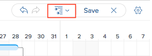

# 更新任务列表中的信息 [!UICONTROL 甘特图]

任务列表 [!UICONTROL 甘特图] 显示有关项目或模板上任务的详细信息。

在模板中，任务列表 [!UICONTROL 甘特图] 反映模板任务列表中在任务级别所做的更新。 您无法编辑 [!UICONTROL 甘特图] 与模板相关联。

在项目中，您可以直接在任务列表中更新任务信息 [!UICONTROL 甘特图].

本文介绍了可直接在“任务列表”中执行的以下操作 [!UICONTROL 甘特图]：

* 修改任务持续时间
* 创建或删除前置任务关系
* 更改任务开始日期和结束日期
* 更新完成百分比
* 均衡项目资源

## 访问要求

您必须具备以下条件才能执行本文中的步骤：

<table style="table-layout:auto"> 
 <col> 
 <col> 
 <tbody> 
  <tr> 
   <td role="rowheader">[!DNL Adobe Workfront] 计划*</td> 
   <td> 
任意 
 </td> 
  </tr> 
  <tr> 
   <td role="rowheader">[!DNL Adobe Workfront] 许可证*</td> 
   <td> 
[！UICONTROL计划] 
 </td> 
  </tr> 
  <tr> 
   <td role="rowheader">访问级别配置*</td> 
   <td> 
[！UICONTROL Edit]对项目和任务的访问权限
 
注意：如果您仍然没有访问权限，请咨询 [!DNL Workfront] 管理员（如果他们在您的访问级别设置了其他限制）。 有关如何 [!DNL Workfront] 管理员可以修改您的访问级别，请参见 <a href="../../../administration-and-setup/add-users/configure-and-grant-access/create-modify-access-levels.md" class="MCXref xref">创建或修改自定义访问级别</a>.
 </td> 
  </tr> 
  <tr> 
   <td role="rowheader">对象权限</td> 
   <td> 
[！UICONTROL Manage]对项目和任务的访问权限 
 
有关请求其他访问权限的信息，请参阅 <a href="../../../workfront-basics/grant-and-request-access-to-objects/request-access.md" class="MCXref xref">请求访问对象 </a>.
 </td> 
  </tr> 
 </tbody> 
</table>

&#42;要了解您拥有什么计划、许可证类型或访问权限，请联系贵机构的 [!DNL Workfront] 管理员。

## 修改任务持续时间

1. 转到要修改的项目。
1. 单击 **[!UICONTROL 任务]** （在左侧面板中）。

   

1. 单击 **[!UICONTROL 甘特图]** 图标。

   

   所有更改都会在 **[!UICONTROL 自动保存]** 选项。 默认情况下处于启用状态。

1. （可选）单击 **[!UICONTROL 计划模式]** 图标并选择 **[!UICONTROL 手动保存标准]** 或 **[!UICONTROL 时间线规划]** 以手动保存更改。

   

1. 将鼠标悬停在任务的时间线上，并将时间线指示器拖动到其他日期。
1. 在到达任务正确的新完成日期时放置指示器。
1. （可选和条件）如果已选择手动保存更改，请单击 **[!UICONTROL 撤消]** 或&#x200B;**[!UICONTROL 重做]** 图标来取消或复制任何更改。

   >[!TIP]
   >
   >可以使用以下键盘快捷键撤消或重做甘特图上的更改：
   >
   >   
   >   
   >   * [!DNL Mac]：使用 [!UICONTROL Command + Z] 撤消和 [!UICONTROL Command + Shift + Z] 以重做。
   >   * [!DNL Windows]：使用 [!UICONTROL Ctrl + Z] 撤消和 [!UICONTROL Ctrl + Y] 以重做。
   >   
   >

1. 单击 **[!UICONTROL 保存]** 右上角的 [!UICONTROL 甘特图].

## 创建或删除前置任务关系

1. 转到要修改的项目。
1. 在 **[!UICONTROL 任务]** 区域，单击 **[!UICONTROL 甘特图]** 图标。

   此 **[!UICONTROL 自动保存]** 选项默认处于选中状态，在这种情况下，所有更改都将自动保存。

   

1. （可选）单击 **[!UICONTROL 计划模式]** 图标并选择 **[!UICONTROL 手动保存标准]** 或 **[!UICONTROL 时间线规划]** 以手动保存更改。

   

1. 要创建前置任务关系，请单击任务的起始点并将其拖动到任务的终点。
1. 要删除前置任务关系，请单击连接两个任务的前置任务行以选择它，然后按键 **[!UICONTROL 删除]** 在键盘上。\
   

1. （可选和条件）如果选择手动保存更改，请单击 **[!UICONTROL 撤消]** 或&#x200B;**[!UICONTROL 重做]** 图标来取消或复制任何更改。

   >[!TIP]
   >
   >可以使用以下键盘快捷键撤消或重做甘特图上的更改：
   >
   >   
   >   
   >   * [!DNL Mac]：使用 [!UICONTROL Command + Z] 撤消和 [!UICONTROL Command + Shift + Z] 以重做。
   >   * [!DNL Windows]： [!UICONTROL 使用Ctrl + Z] 撤消和 [!UICONTROL Ctrl + Y] 以重做。
   >   
   >

1. 单击&#x200B;**[!UICONTROL 保存]**。

## 更改任务开始日期和结束日期

1. 转到要修改的项目。
1. 在 **[!UICONTROL 任务]** 区域，单击 **[!UICONTROL 甘特图]** 图标。

   所有更改都会在 **[!UICONTROL 自动保存]** 选项。 默认情况下处于启用状态。

   

1. （可选）单击 **[!UICONTROL 计划模式]** 图标并选择 **[!UICONTROL 手动保存标准]** 或 **[!UICONTROL 时间线规划]** 以手动保存更改。

   

1. 将鼠标悬停在任务中心上并找到多向箭头。
1. 单击任务并将其拖动到所需的日期。

   

1. 如果以影响任务限制的方式更改任务日期，请单击 **[!UICONTROL 接受]** 确认任务限制更改。

   >[!NOTE]
   >
   >如果任务具有以下约束之一，则系统会更新 [!UICONTROL 任务约束] 到 [!UICONTROL 开始时间不早于] 比从以下日期安排的项目 [!UICONTROL 开始日期] 或 [!UICONTROL 完成时间不晚于] 如果项目是从 [!UICONTROL 完成日期]：
   >
   >   
   >   
   >   * [!UICONTROL 尽可能早]
   >   * [!UICONTROL 尽可能迟]
   >   * [!UICONTROL 最早可用时间]
   >   * [!UICONTROL 最晚可用时间]
   >   
   >   
   >在某些情况下，前置任务关系可能会阻止任务提前开始，并且不允许任务移动。

1. （可选和条件）如果已选择手动保存更改，请单击 **[!UICONTROL 撤消]** 或&#x200B;**[!UICONTROL 重做]** 图标来取消或复制任何更改。

   >[!TIP]
   >
   >您可以使用以下键盘快捷键撤消或重做对 [!UICONTROL 甘特图]：
   >
   >   
   >   
   >   * [!DNL Mac]：使用 [!UICONTROL Command + Z] 撤消和 [!UICONTROL Command + Shift + Z] 以重做。
   >   * [!DNL Windows]：使用 [!UICONTROL Ctrl + Z] 撤消和 [!UICONTROL Ctrl + Y] 以重做。
   >   
   >

1. 单击&#x200B;**[!UICONTROL 保存]**。

## 更新完成百分比

1. 转到要修改的项目。
1. 在 **[!UICONTROL 任务]** 区域，单击 **[!UICONTROL 甘特图]** 图标。

   

   所有更改都会在 **[!UICONTROL 自动保存]** 选项。 默认情况下处于启用状态。

1. （可选）单击 **[!UICONTROL 计划模式]** 图标并选择 **[!UICONTROL 手动保存标准]** 或 **[!UICONTROL 时间线规划]** 以手动保存更改。
1. 双击任务内部的百分比数字并输入数字。

   >[!IMPORTANT]
   >
   >您必须拥有 [!UICONTROL 完成百分比] 在 [!UICONTROL 选项] 对话框，以便更新完成百分比。 要执行此操作，请单击 **[!UICONTROL 选项]** 图标并选择 **[!UICONTROL 完成百分比]**.
   >
   >
   >   >
   >

1. （可选和条件）如果选择手动保存更改，请单击 **[!UICONTROL 撤消]** 或&#x200B;**[!UICONTROL 重做]** 图标来取消或复制任何更改。

   >[!TIP]
   >
   >您可以使用以下键盘快捷键撤消或重做对 [!UICONTROL 甘特图]：
   >
   >   
   >   
   >   * [!DNL Mac]：使用 [!UICONTROL Command + Z] 撤消和 [!UICONTROL Command + Shift + Z] 以重做。
   >   * [!DNL Windows]：使用 [!UICONTROL Ctrl + Z] 撤消和 [!UICONTROL Ctrl + Y] 以重做。
   >   
   >

1. 单击 **[!UICONTROL 保存]** 右上角的 [!UICONTROL 甘特图].

## 均衡项目资源

您可以使用任务列表 [!UICONTROL 甘特图] 以调配资源。

有关均衡资源的信息，请参见 [!UICONTROL 甘特图]，请参见 [均衡资源 [!UICONTROL 甘特图]](../../../manage-work/gantt-chart/use-the-gantt-chart/level-resources-in-gantt.md).

<!--

(NOTE:&nbsp;this is drafted because I moved the whole content to the article linked above)

<ol>
<li value="1">Go to the project you want to level.</li>
<li value="2"> 
 In the <strong>Tasks</strong> area, click the <strong>Gantt chart</strong> icon.
 
All changes are saved automatically when the <strong>Autosave</strong> option is enabled. It is enabled by default. 
 </li>
<li value="3">

(Optional) Click the <strong>Plan mode</strong> icon and select <strong>Manual save Standard</strong> or <strong>Timeline Planning</strong> to save your changes manually.
 <note type="tip">
You cannot level resources in the Gantt chart when the Autosave option is enabled.
</note>

  

 </li>
<li value="4"> 
Click the <strong>Level Resources</strong> drop-down menu.
 
  
 </li>
<li value="5">Select one of following options:
<ul>
<li><strong>Level Now</strong>: Applies resource leveling to the selected task.</li>
<li>
<strong>Clear Leveling</strong>: Removes all resource leveling from the selected task.
</li>
</ul><note type="note">
Your resources might be overallocated if they are assigned to multiple tasks which occur during the same time frame.
</note></li>
<li value="6"> 
(Optional and conditional) If you have disabled the Autosave option, click the <strong>Undo</strong> or<strong>Redo</strong> icons if you want to cancel or duplicate any of the changes. 
 <note type="tip">

You can use the following keyboard shortcuts to undo or redo changes on the Gantt chart:

<ul>
<li>Mac: Use Command + Z to undo and Command + Shift + Z to redo.</li>
<li>Windows: Use Ctrl + Z to undo and Ctrl + Y to redo.</li>
</ul>
</note> </li>
<li value="7">Click <strong>Save</strong> in the upper-right corner of the Gantt chart.</li>
</ol>

-->

<!--
<h2 data-mc-conditions="QuicksilverOrClassic.Draft mode"> </h2>
-->
