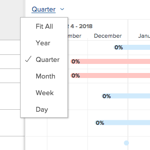

# 查看[!UICONTROL 甘特图]中的信息

任务列表[!UICONTROL 甘特图]和项目列表[!UICONTROL 甘特图]显示有关项目和任务的信息。

## 访问要求

您必须具备以下条件才能执行本文中的步骤：

<table style="table-layout:auto"> 
 <col> 
 <col> 
 <tbody> 
  <tr> 
   <td role="rowheader">[!DNL Adobe Workfront] 计划*</td> 
   <td> 
任何 
 </td> 
  </tr> 
  <tr> 
   <td role="rowheader">[!DNL Adobe Workfront] 许可证概述*</td> 
   <td> 
[！UICONTROL Review]或更高版本
 </td> 
  </tr> 
  <tr> 
   <td role="rowheader">访问级别配置*</td> 
   <td> 
[！UICONTROL视图]或更高权限访问项目和任务
 
<b>注释</b>

如果您仍然没有访问权限，请询问您的[!DNL Workfront]管理员是否对您的访问级别设置了其他限制。 有关[!DNL Workfront]管理员如何修改访问级别的信息，请参阅<a href="../../../administration-and-setup/add-users/configure-and-grant-access/create-modify-access-levels.md" class="MCXref xref">创建或修改自定义访问级别</a>。
 </td>
</tr> 
  <tr> 
   <td role="rowheader">对象权限</td> 
   <td> 
[！UICONTROL视图]或更高版本的项目访问权限
 
有关请求其他访问权限的信息，请参阅<a href="../../../workfront-basics/grant-and-request-access-to-objects/request-access.md" class="MCXref xref">请求访问对象</a>。
 </td> 
  </tr> 
 </tbody> 
</table>

&#42;要了解您拥有什么计划、许可证类型或访问权限，请与[!DNL Workfront]管理员联系。

## 找到[!UICONTROL 甘特图]

您可以从Workfront中的多个区域同时找到任务列表甘特图和项目列表[!UICONTROL 甘特图]。 有关详细信息，请参阅[开始使用[!UICONTROL 甘特图]](../../../manage-work/gantt-chart/use-the-gantt-chart/get-started-with-gantt.md)。

## 查看[!UICONTROL 关键路径]上的任务

在项目列表[!UICONTROL 甘特图]中，不在[!UICONTROL 关键路径]上的任务显示为浅蓝色水平线。 位于项目[!UICONTROL 关键路径]上的任务显示为红色水平线。

有关[!UICONTROL 关键路径]上任务的更多信息，请参阅项目[!UICONTROL 关键路径]](../../../manage-work/tasks/manage-tasks/critical-path.md)的[概述。

## 查看项目列表[!UICONTROL 甘特图]中的任务信息

您可以直接从“项目列表”中查看项目的任务信息。 任务将列在每个项目的名称下。

>[!NOTE]
>
>您无法从项目列表[!UICONTROL 甘特图]中编辑任务。

您可以直接从以下区域的项目列表中查看项目的任务信息：

* 在[!UICONTROL 项目]区域
* 在Portfolio中
* 在项目中

要从项目列表中查看项目中的任务，请执行以下操作：

1. 转至上述区域之一。

   例如，从[!UICONTROL 主菜单]，单击&#x200B;**[!UICONTROL 项目]**。

   此时将显示项目列表。

1. 单击屏幕右上角的&#x200B;**[!UICONTROL 甘特图]**&#x200B;图标。

   <!--
   
(NOTE: images conditioned for classic and nwe)  

   -->

1. 单击&#x200B;**[!UICONTROL 显示任务列表]**&#x200B;图标。

1. 在左侧的项目列表中，单击项目名称旁边的下拉箭头，以显示该项目下的任何任务。\
   这会在[!UICONTROL 甘特图]上显示任务信息。\
   

1. （可选）单击右上角的&#x200B;**[!UICONTROL 打印]**&#x200B;图标以导出[!UICONTROL 甘特图]。

   >[!NOTE]
   >
   >项目列表[!UICONTROL 甘特图]仅导出项目。 不包括任务信息。

## 更改[!UICONTROL 甘特图]中显示信息的时间段

您可以调整[!UICONTROL 甘特图]上显示的时间段以按粒度级别显示信息，也可以快速导航到天、周、月、季度或年视图：

* [在粒度级别更改时间段](#change-the-time-period-on-a-granular-level)
* [按日、周、月、季度或年查看信息](#view-information-by-day-week-month-quarter-or-year)

### 在粒度级别更改时间段 {#change-the-time-period-on-a-granular-level}

1. 将鼠标悬停在[!UICONTROL 甘特图]的时间线上，然后从左到右拖动缩放指示器以展开或收缩时间线。\
   

### 按日、周、月、季度或年查看信息 {#view-information-by-day-week-month-quarter-or-year}

1. 在[!UICONTROL 甘特图]中，单击时间范围下拉菜单。

   

1. 从以下可用选项中选择时间范围：

   * **[!UICONTROL 适合所有]**：此选项显示整个项目的时间线。
   * **[!UICONTROL 所有项目]**：此选项仅在项目列表甘特图中可用。
   * **[!UICONTROL 年]**
   * **[!UICONTROL 季度]**
   * **[!UICONTROL 个月]**
   * **[!UICONTROL 周]**
   * **[!UICONTROL 天]**

1. （可选）选择一个更细粒度的时间范围，如[!UICONTROL 周]或[!UICONTROL 天]，然后单击并拖动[!UICONTROL 甘特图]底部的水平滚动条，以在项目的时间线上从左到右移动。\
   此时将显示[!UICONTROL 甘特图]的时间线快照以显示整个项目。

   >[!TIP]
   >
   >时间轴快照仅在单击水平滚动条之后显示。

   

1. （可选）单击时间线快照中的任意位置，以导航到项目生命周期中的特定点。\
   或\
   拖动快照查看器的句柄以选择特定的时间线范围以在主[!UICONTROL 甘特图]中显示它。

## 使用筛选器、视图和分组

[!UICONTROL 甘特图]是任务列表中当前显示的信息的可视表示形式。 您可以将筛选器、视图和分组应用于两个[!UICONTROL 甘特图]中列出的对象。

>[!CAUTION]
>
>选择[!UICONTROL 手动]保存[!UICONTROL 时间线计划]以将更改保存到任务列表时，无法应用筛选器、视图和分组。 有关将更改保存到列表中的任务的信息，请参阅[编辑列表中的任务](../../../manage-work/tasks/manage-tasks/edit-tasks-in-a-list.md)。

应用于列表的筛选器和分组会同时反映在项目列表和任务列表[!UICONTROL 甘特图]中，导出甘特图时也会包含这些筛选器和分组：

* 过滤器\
   您可以对列表应用筛选器以控制[!UICONTROL 甘特图]中显示的信息。\
   有关应用筛选器的信息，请参阅[筛选器概述](../../../reports-and-dashboards/reports/reporting-elements/filters-overview.md)。

* 分组\
   应用到列表的分组将反映在[!UICONTROL 甘特图]中。\
   有关应用分组的信息，请参阅Adobe Workfront中的[分组概述](../../../reports-and-dashboards/reports/reporting-elements/groupings-overview.md)。

视图未反映在[!UICONTROL 甘特图]上。 但是，在导出[!UICONTROL 甘特图](如[将[!UICONTROL 甘特图]导出到PDF](../../../manage-work/gantt-chart/use-the-gantt-chart/export-gantt-chart-to-pdf.md)中所述)时，除[!UICONTROL 甘特图]外，还将导出任务列表，并将当前视图应用于该列表。

## 配置显示选项

您可以选择在两个[!UICONTROL 甘特图]中显示的信息类型。 有关详细信息，请参阅[配置信息在[!UICONTROL 甘特图]](../../../manage-work/gantt-chart/use-the-gantt-chart/configure-info-on-gantt-chart.md)上的显示方式。
