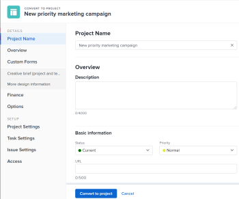

# 在Adobe Workfront中将问题转换为项目

如果在提交问题后需要完成更多工作才能完成问题，您可以将问题转换为项目。

您可以将问题转换为新项目，也可以使用模板将其转换为项目。 本文介绍了将问题转换为项目的两种方式。

有关转换问题的一般信息，请参阅 [转换Adobe Workfront中的问题概述](../../../manage-work/issues/convert-issues/convert-issues.md).

从问题创建项目时，项目上的某些字段会从其他对象填充。 有关更多信息，请参阅文章中的“新建项目默认设置”部分 [创建项目](../../../manage-work/projects/create-projects/create-project.md).

## 访问要求

您必须具有以下访问权限才能执行本文中的步骤：

<table style="table-layout:auto"> 
 <col> 
 <col> 
 <tbody> 
  <tr> 
   <td role="rowheader">Adobe Workfront计划*</td> 
   <td> 
任意
 </td> 
  </tr> 
  <tr> 
   <td role="rowheader">Adobe Workfront许可证*</td> 
   <td> 
计划 
 </td> 
  </tr> 
  <tr> 
   <td role="rowheader">访问级别配置*</td> 
   <td> 
编辑对问题、任务和项目的访问权限
 
编辑对财务数据的访问，以更新从问题转换的预计财务信息
 
注意：如果您仍然没有访问权限，请咨询Workfront管理员，他们是否在您的访问级别设置了其他限制。 有关Workfront管理员如何更改访问级别的信息，请参阅 <a href="../../../administration-and-setup/add-users/configure-and-grant-access/create-modify-access-levels.md" class="MCXref xref">创建或修改自定义访问级别</a>.
 </td> 
  </tr> 
  <tr> 
   <td role="rowheader">对象权限</td> 
   <td> 
查看问题的权限
 
在问题转换后，您将获得项目的“管理”权限
 
有关请求其他访问权限的信息，请参阅 <a href="../../../workfront-basics/grant-and-request-access-to-objects/request-access.md" class="MCXref xref">请求对对象的访问 </a>.
 </td> 
  </tr> 
 </tbody> 
</table>

*要了解您拥有的计划、许可证类型或访问权限，请联系您的Workfront管理员。

## 将问题转换为项目

您可以将问题转换为空白项目，或使用模板将问题转换为项目。

1. 转到项目并单击 **[!UICONTROL 问题]** 中。
1. 在显示的问题列表中，执行下列操作之一：

   * 要将问题转换为空白项目，请单击问题的名称，然后单击 **[!UICONTROL 更多]** 菜单  在问题名称的右侧，单击 **[!UICONTROL 转换为空白项目]**.

      或

      在问题列表中选择问题，单击 **[!UICONTROL 更多]** 菜单  ，然后单击 **[!UICONTROL 转换为空白项目]**.

      >[!IMPORTANT]
      >
      >仅当系统或组管理员启用了 [!UICONTROL 允许用户在不使用模板的情况下创建项目] 首选项 [!UICONTROL 设置] 的上界。 有关更多信息，请参阅 [配置系统范围的项目首选项](../../../administration-and-setup/set-up-workfront/configure-system-defaults/set-project-preferences.md).

      在转换问题后，您必须手动将任务添加到项目或将模板附加到项目。

      继续执行下面的步骤3e。

      <!--
     Is this accurate?
     -->

      >[!TIP]
      >   
      >* 如果问题是使用请求队列创建的，则新项目会继承请求队列的组。
      >* 如果问题是通过将其添加到项目的“问题”部分来创建的，则新项目会继承问题项目的组。

   * 要使用模板将问题转换为项目，请执行以下操作之一：

      * 单击问题的名称，然后单击 [!UICONTROL **更多**] 菜单  问题名称的权利

         

         或

      * 在问题列表中选择问题，在报表或功能板中，单击 **更多** 菜单  ，然后单击 **从模板转换为项目** 并开始在 **搜索模板** 框中，然后在模板显示在列表中时单击该模板的名称。 继续执行步骤3。

         <!--      
        (is this accurate?)      
        -->
      >[!TIP]
      >
      >如果将模板添加到收藏夹列表，则可以将鼠标悬停在 [!UICONTROL **收藏模板**] 菜单，然后单击要使用的模板。

      此时将显示“从模板新建项目”框。

      

      >[!TIP]
      >
      >如果问题与审批流程相关联或已与解决对象关联，则Workfront在“转换为项目”框的顶部会显示一条警告，通知您审批将被删除，或解决对象将在转换期间被覆盖。 有关更多信息，请参阅 [转换Adobe Workfront中的问题概述](../../../manage-work/issues/convert-issues/convert-issues.md).

1. （视情况而定）如果您选择使用模板将问题转换为项目，请继续执行以下步骤：

   1. 查看右侧的模板详细信息。

      模板详细信息包括：

      * 模板持续时间
      * 模板所有者
      * 包括前三个任务名称的顶级任务数
      * 模板中所有任务的数量
      * 模板自定义表单的名称
   1. （可选）将鼠标悬停在模板名称上，然后单击“收藏夹”图标  将其标记为收藏以供将来使用。

      >[!TIP]
      >
      >您最多可以有40个Workfront项目标记为收藏。 这包括模板和其他项目。

   1. 单击 [!UICONTROL **使用模板**] 来选择模板。

      的 [!UICONTROL 转换为项目] 框中。

      

   1. 如果模板中已填充字段，则会在 [!UICONTROL 转换为项目] 框中。 您可以编辑预填充的值，以更好地与项目匹配。 有关更多信息，请参阅 [编辑项目](../../../manage-work/projects/manage-projects/edit-projects.md).

      >[!TIP]
      >
      >* 您的系统或组管理员可以在 [!UICONTROL “转换为项目”框] 通过在 [!UICONTROL 布局模板].
      >
      >* 要更新 [!UICONTROL 金融] 部分 [!UICONTROL 转换为项目] 框 [!UICONTROL 编辑] 访问 [!UICONTROL 财务数据] 访问级别。 如果 [!UICONTROL 查看] 访问 [!UICONTROL 财务数据] 在访问级别，模板中的所有财务信息都会传输到新项目，在转换问题时，您无法对其进行编辑。 有关信息，请参阅 [授予对财务数据的访问权限](../../../administration-and-setup/add-users/configure-and-grant-access/grant-access-financial.md) 和 [共享模板](../../../workfront-basics/grant-and-request-access-to-objects/share-a-template.md).

   1. （可选和视情况而定）单击 [!UICONTROL **选项**] 在左侧面板中，然后从可用的选项中选择：

      * [!UICONTROL **保留原始问题并将其解决方案绑定到此项目**]

         取消选择后，将删除原始问题。

         >[!NOTE]
         >
         >无权访问或无权删除问题的用户将无法删除问题，因为无论此设置的状态如何，用户都将无法在转换问题时将其删除。 有关问题的访问权限和权限的信息，请参阅：
         >
         >* [授予对问题的访问权限](../../../administration-and-setup/add-users/configure-and-grant-access/grant-access-issues.md)
         > 
         >* [共享问题](../../../workfront-basics/grant-and-request-access-to-objects/share-an-issue.md)

      * [!UICONTROL **允许（用户名）有权访问此项目**]

         如果未选择，则问题为 [!UICONTROL 主要联系人] 无权访问新任务。

         >[!NOTE]
         >
         >此处提供的选项取决于Workfront管理员如何为系统中的每个人或您的组配置这些选项。 有关更多信息，请参阅 [配置系统范围的任务和问题首选项](../../../administration-and-setup/set-up-workfront/configure-system-defaults/set-task-issue-preferences.md).
         >
         >
         >或者，如果贵组织中的顶级群组单独配置了它们，则此处可用的选项取决于您在步骤6中为新项目选择的群组。 有关更多信息，请参阅 [为组配置任务和问题首选项](../../../administration-and-setup/manage-groups/create-and-manage-groups/configure-task-issue-preferences-group.md).
   1. 单击 [!UICONTROL **自定义Forms**] 并执行以下任一操作：

      * 查看附加到模板的自定义表单。 他们会转到新项目。
      * 确保所有必填字段都包含有效信息。
      * 通过拖动自定义表单来重新排列它们  你想要的地方。
      * 单击 **x** 图标。
      * 如有必要，请将自定义表单信息从问题传输到项目。

         >[!TIP]
         >
         >* 如果将附加到问题的多对象自定义表单配置为与问题和项目一起使用，则在您进行转换时，如果问题和项目的自定义表单中同时存在字段，则保留表单中保存的所有信息。
         >* 如果将具有计算字段的多对象自定义表单附加到问题和项目，则问题和项目必须与表单的计算自定义字段中引用的所有字段兼容。 如果出现不兼容的情况，系统会显示一条消息，提醒您进行调整。 有关更多信息，请参阅 [使用旧版表单生成器将计算量度添加到自定义表单](../../../administration-and-setup/customize-workfront/create-manage-custom-forms/add-calculated-data-to-custom-form.md).
         >* 如果您使用模板进行转换，而附加到模板的自定义表单包含自定义字段（该字段也可在附加到问题的自定义表单中找到），则问题中的字段值将用于新项目。 但是，如果问题上的自定义字段为空，则会使用模板中的值。

   1. 单击 [!UICONTROL **转换为项目**].

      >[!TIP]
      >
      >如果您决定删除原始问题，则该问题现在是一个项目。
      >   
      >或
      >  
      >如果您决定保留原始问题，该问题现在会链接到新项目，并且将在项目完成时完成。
      >
      >某些问题字段会传输到项目。 如果您在前面的步骤中未更改模板中定义的大多数字段，则这些字段会自动传输到新创建的项目。 有关信息，请参阅 [转换Adobe Workfront中的问题概述](../../../manage-work/issues/convert-issues/convert-issues.md).

1. （可选）根据需要设置任何其&#x200B;他项目详细信息（项目所有者、项目日期）和任务。
1. 单击 [!UICONTROL **转换为项目**].

   现在，问题已转换为项目。

1. 单击 [!UICONTROL **转到项目**] 内部 [!UICONTROL 成功] 通知。 此时将打开项目页面。
