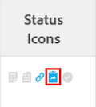

# 解析和可解析对象概述

<!-- Audited: 08/2025 -->

可解析对象是一个问题，其解决方案与解析对象绑定。 解决对象是项目、任务或其他问题。

将问题转换为任务或项目时，问题会成为任务或项目的可解析对象。

您也可以手动将问题链接到解析对象，该对象可以是任务、项目或问题。 有关信息，请参阅[将问题的解决手动绑定到其他问题、任务或项目](../../../manage-work/issues/convert-issues/manually-tie-resolution-of-issue-to-ptis.md)。

在此方案中，原始问题将成为任务、项目或问题的可解析对象。

## 设置Adobe Workfront以处理可解析对象 {#set-up-adobe-workfront-to-handle-resolvable-objects}

作为Workfront管理员或组管理员，您可以决定如何处理系统中或组的可解析对象。

您可以选择在将可解析对象转换为任务或项目时保留该对象，或者在创建任务或项目后删除它。 您可以选择允许在转换问题的过程中更改这些设置，这将允许转换问题的用户在转换问题时选择是保留还是删除问题。

>[!NOTE]
>
>可解析对象始终是问题，其解析度和状态取决于与其关联的解析对象的解析度和状态。 解析对象可以是问题、任务或项目。

有关设置处理可解析对象的首选项的信息，请参阅[配置系统范围的任务和问题首选项](../../../administration-and-setup/set-up-workfront/configure-system-defaults/set-task-issue-preferences.md)。

<!--WRITER

(Note: drafted and just pointed the user to the article linked above)&nbsp;

To establish the system default for what happens to the issue as it is being converted to a task or a project:

<ol>
<li value="1">Log in to Workfront as a Workfront administrator or group administrator.</li>
<li value="2"> 
  From the main menu, click <strong>Setup</strong>. 
 
  
 </li>
<li value="3">Expand <strong>Project Preferences</strong>.</li>
<li value="4">Click <strong>Tasks & Issues</strong>.</li>
<li value="5">Go to the <strong>Issues</strong> area of the setup.  Consider editing any of the following settings:
<ul>
<li>
<strong>Automatically update Resolvable Issue status when the status of the Resolving Object changes:</strong> Select this option to tie the resolution of the original issue to the resolution of its Resolving Object. In order for this setting to have any effect, the options to <strong>Keep the original issue and tie its resolution to the task</strong> or<strong>project</strong> must be selected.

<ul>
<li>When this setting is enabled, you can create custom statuses with the same key for both issues and projects or tasks. When the project or task (as a resolvable object) turns into the custom status, the change also reflects on the status of the issue. The status key must be the same for the issue and project or task statuses.</li>
<li>
When this setting is disabled, resolving object statuses are automatically set to the default status, instead of the custom ones. For more information about the default statuses, see <a href="#synchronize-the-status-of-the-resolvable-object-with-that-of-the-resolving-object" class="MCXref xref">Synchronize the Status of the Resolvable Object with that of the Resolving Object</a>.
<note type="note">
The default status of the issue is controlled by the status of the project or task, regardless of whether this option is selected or not.
</note></li>
</ul></li>
<li><strong>When converting an issue to a TASK...:</strong> The settings in this section determine what happens during the conversion process from issue to task:
<ul>
<li><strong>Keep the original issue and tie its resolution to the task:</strong> When converting the issue, it remains visible as an issue until the task is complete. The status of the issue automatically changes to Closed when the task completes.</li>
<li><strong>Allow Primary Contact to have access to the task:</strong> Gives the primary contact (issue creator) access to the task to review the task, make updates, and stay informed of its progress.</li>
<li><strong>Allow these settings to be changed during conversion:</strong> Allows the user who is converting the issue to change these options during the conversion of an issue to a task. </li>
</ul></li>
<li><strong>When converting an issue to a PROJECT...:</strong> The settings in this section determine what happens during the conversion process from issue to project:
<ul>
<li><strong>Keep the original issue and tie its resolution to the project:</strong> When converting the issue, it remains visible as an issue until the project is complete. The status of the issue automatically changes to Closed when the project completes.</li>
<li><strong>Allow Primary Contact to have access to the project:</strong> Gives the primary contact (issue creator) access to the project to review the project, make updates, and stay informed of its progress.</li>
<li><strong>Allow these settings to be changed during conversion:</strong> Allows the user who is converting the issue to change these options during the conversion of an issue to a project. </li>
</ul></li>
</ul></li>
<li value="6">Click <strong>Save</strong>.</li>
</ol>

-->

## 在转换为项目或任务期间处理可解析对象

根据Workfront或组管理员配置系统级或组级问题首选项的方式，在将问题转换为项目或任务期间，您也许能够处理可解析对象。

存在以下情况：

* 如果Workfront或组管理员具有“保留原始问题，并将其解决方案与任务绑定”以及“保留原始问题并将其解决方案与项目绑定”选项，并且未选中“允许在转换期间更改这些设置”，则在您将问题转化为任务或项目时，您将无法更改这些设置。\
  

* 如果Workfront或组管理员具有“保留原始问题，并将其解决方案与任务绑定”和“保留原始问题，并将其解决方案与项目绑定（选中或取消选中）” ，并且“允许在转换期间更改这些设置”处于选中状态，则当您将问题转化为任务或项目时，您将能够更改这些设置。\
  

有关将问题转化为任务和项目的更多信息，请参阅[在Adobe Workfront中转化问题的概述](../../../manage-work/issues/convert-issues/convert-issues.md)。

<!--WRITER

<h2>Tie the resolution of an issue to a project, task or </h2> 

(NOTE: created new article for this section; draft when the article is live and see if you need to make a link from this one to the new article) 

You can manually tie the resolution of an issue to the resolution of a project, task, or issue without converting the issue. The issue becomes one of the Resolvable Objects of the project, task, or issue you select. When you do this, a change in the status of the project, task, or issue triggers a change in the status of the original issue, so you cannot manually edit the status of the original issue.  For more information about how the status of the Resolving Object affects the Resolvable Object, see <a href="#synchronize-the-status-of-the-resolvable-object-with-that-of-the-resolving-object" class="MCXref xref">Synchronize the Status of the Resolvable Object with that of the Resolving Object</a>.

You must have Manage permissions on the original issue and View permissions on the project, task, or issue to do this. 

To tie the resolution of an issue to the resolution of a project, task, or issue:

<ol>
<li value="1">Navigate to an issue whose resolution you want to tie to a task or a project.</li>
<li value="2"> 
  Click the <strong>Issue Details</strong> > <strong>Overview</strong> area. 
  </li>
<li value="3"> 
Click the <strong>Edit</strong> icon  in the upper-right corner of the Issue Details section. 
 </li>
<li value="4">At the bottom of the form,  click in the <strong>Resolved By</strong> field,  and select from the following types of resolving objects:
<ul>
<li><strong>Project</strong></li>
<li><strong>Task</strong></li>
<li>
<strong>Issue</strong>
</li>
</ul>
The field for the resolving object displays. 
</li>
<li value="5">After selecting the object, start typing the name of a specific project, task, or issue in the available field and select it when it appears in the drop-down list. </li>
<li value="6">Click <strong>Save</strong>&nbsp;<strong>Changes</strong>. The original issue becomes the Resolvable Object for the project, task, or issue you selected in step 4 and 5. <note type="note">
One project, task, or issue may have multiple issues as Resolvable Objects.
</note></li>
</ol>

-->

## 将可解析对象的状态与解析对象的状态同步 {#synchronize-the-status-of-the-resolvable-object-with-that-of-the-resolving-object}

* 当解析对象为问题时[同步状态](#synchronize-statuses-when-the-resolving-object-is-an-issue)
* [当解析对象是任务或项目时，同步状态](#synchronize-statuses-when-the-resolving-object-is-a-task-or-a-project)

### 当解析对象为问题时同步状态 {#synchronize-statuses-when-the-resolving-object-is-an-issue}

当一个问题手动链接到另一个问题时，第二个问题的状态（解析对象）会触发第一个问题（可解析对象）状态的更改。 第一个问题的状态与第二个问题更改为的状态匹配。 这适用于默认问题和自定义问题状态。

### 当解析对象是任务或项目时，同步状态 {#synchronize-statuses-when-the-resolving-object-is-a-task-or-a-project}

当问题为任务或项目的可解析对象时，任务状态的更改和项目触发问题状态的更改。 在这种情况下，默认状态的触发方式与自定义状态有所不同。

当项目的自定义状态等于默认状态且不会触发问题状态更改时，项目状态的更改不会触发问题的状态更改。

* [将解析对象的默认状态与可解析对象的默认状态同步](#synchronize-the-default-status-of-the-resolving-object-with-the-default-status-of-the-resolvable-object)
* [将解析对象的自定义状态与可解析对象的自定义状态同步](#synchronize-the-custom-status-of-the-resolving-object-with-the-custom-status-of-the-resolvable-object)

#### 将解析对象的默认状态与可解析对象的默认状态同步 {#synchronize-the-default-status-of-the-resolving-object-with-the-default-status-of-the-resolvable-object}

无论是否选择了状态更改解析对象选项时自动更新可解析问题状态，每当解析对象（项目或任务）上的默认状态更改时，可解析对象（问题）的状态都会相应地更改。 仅已映射默认状态以触发此类更改。

当问题设置为任务的解析对象时，以下默认任务状态会触发默认问题状态的以下更改：

| **任务状态** | **问题状态** |
|---|---|
| 新建 | 新建 |
| 正在进行中 | 正在进行中 |
| 完成 | 已关闭 |

将问题设置为项目的可解析对象时，以下默认项目状态会触发默认问题状态的以下更改。 某些项目状态不会触发对问题状态的更改。 问题仍然停留在项目变为以下状态之一之前的状态：

| **项目状态** | **问题状态** |
|---|---|
| 规划中 | 新建 |
| 目前 | 正在进行中 |
| 暂停 | 暂停 |
| 已请求 | 不会触发对问题状态的更改 |
| 已审批 | 不会触发对问题状态的更改 |
| 被拒绝 | 不会触发对问题状态的更改 |
| 想法 | 不会触发对问题状态的更改 |
| 已停止 | 已关闭 |
| 已完成 | 已关闭 |

>[!NOTE]
>
>在问题状态变为“已关闭”（由于关闭任务或项目）后，无论任务或项目状态在关闭后发生了什么变化，问题仍为“已关闭”。

#### 将解析对象的自定义状态与可解析对象的自定义状态同步 {#synchronize-the-custom-status-of-the-resolving-object-with-the-custom-status-of-the-resolvable-object}

将任务或项目的状态更改为自定义状态时，仅当满足以下2个条件时，问题状态才会更改为自定义问题状态：

* 当选择解析对象更改状态选项时，自动更新可解析问题状态。 有关详细信息，请参阅[设置Adobe Workfront以处理可解析对象](#set-up-adobe-workfront-to-handle-resolvable-objects)。

* 项目或任务的自定义状态与问题自定义状态具有相同的三个字母的代码。

您可以为问题和项目或任务创建具有相同键的自定义状态。 当项目或任务（作为解析对象）更改为自定义状态时，更改也会反映在问题状态上。 问题和项目或任务状态的状态键必须相同。

例如，假设您使用三个字母的代码LCD创建了一个名为Launched的项目自定义状态，它等同于Current。 接下来，创建一个名为“已启动项目”的问题自定义状态，同时显示字母代码LCD，这相当于“进行中”。 将项目标记为已启动时，问题会自动将状态更改为项目已启动。 如果在解析对象更改设置的状态未启用时自动更新可解析问题状态，则问题状态将改为进行中。

有关创建自定义状态的详细信息，请参阅[创建或编辑状态](../../../administration-and-setup/customize-workfront/creating-custom-status-and-priority-labels/create-or-edit-a-status.md)。

## 将解析对象的完成百分比与可解析对象的完成百分比同步

如果问题由任务或项目解决，当发生以下任何情况时，问题的完成百分比将更新可解决的问题：

* 当有人保存对任务或项目所做的更改时。
* 当重新计算项目的时间表时。

如果问题由另一个问题解决，则当其中一个问题更新时，完成百分比将更新。

## 在任务或项目上找到可解析对象

>[!NOTE]
>
>要执行本节中的步骤，您必须至少具有对任务和项目的查看访问权限，以及对包含要查看的可解析对象的任务或项目的查看权限。

对于任务和项目，查找解析对象是相同的。

1. 导航到通过转化问题创建的项目或任务。
1. 在页面的左侧，选择&#x200B;**任务详细信息**&#x200B;或&#x200B;**项目详细信息**&#x200B;选项卡。
1. 在&#x200B;**概述**&#x200B;部分的底部，找到显示任务或项目的可解析对象的&#x200B;**此已解析**&#x200B;字段。

   

   >[!NOTE]
   >
   >问题无法转换为其他问题，但可以手动将其与正在解决的问题关联。 一个项目、任务或问题可以有多个问题作为可解析对象。 在项目、任务或问题解决后，可解决对象（问题）也会解决。 即使解决了可解决问题的项目、任务或问题重新打开，可解决问题仍保持关闭状态。

## 识别列表中的解析对象的问题

在问题列表中，您可以通过在&#x200B;**状态图标**&#x200B;或&#x200B;**标志**&#x200B;列中查找此图标来识别标记为通过状态图标解析对象的问题：

## 在报告中查看可解析和解析对象信息

您可以在项目、任务或问题的视图或报告中显示有关可解析对象或解析对象的信息。

下表显示了可显示的字段以及可在哪些视图中显示它们：

<table style="table-layout:auto"> 
 <col> 
 <col> 
 <col> 
 <col> 
 <thead> 
  <tr> 
   <th><strong>视图中的字段</strong> </th> 
   <th><strong>问题视图</strong> </th> 
   <th><strong>任务视图</strong> </th> 
   <th><strong>项目视图</strong> </th> 
  </tr> 
 </thead> 
 <tbody> 
  <tr> 
   <td><strong>具有可解析项</strong>：如果项目或任务具有与其关联的可解析问题，则显示True值；否则显示False值。</td> 
   <td>✓</td> 
   <td>✓</td> 
   <td>✓</td> 
  </tr> 
  <tr> 
   <td><strong>原始问题名称、原始问题输入日期、创建者姓名</strong>：显示原始问题的名称和输入日期，以及在文本模式自定义视图中创建问题的用户的名称。 有关详细信息，请参阅<a href="../../../reports-and-dashboards/reports/custom-view-filter-grouping-samples/view-display-original-issue-info-task-project-list.md" class="MCXref xref">查看：在任务或项目列表中显示原始问题信息</a>。 </td> 
   <td> </td> 
   <td> ✓</td> 
   <td> ✓</td> 
  </tr> 
  <tr> 
   <td> 
<strong>可解析对象：</strong>以文本模式自定义视图为项目、任务报告或列表显示所有可解析对象的列表。
 
有关详细信息，请参阅<a href="../../../reports-and-dashboards/reports/custom-view-filter-grouping-samples/view-resolvable-objects-task-project-report.md" class="MCXref xref">视图：任务或项目报告中的可解析对象</a>
 </td> 
   <td> </td> 
   <td>✓</td> 
   <td> ✓</td> 
  </tr> 
  <tr> 
   <td><strong>转换的问题发起人</strong>：显示有关最初记录问题但后来转换为任务的用户的信息。 </td> 
   <td> </td> 
   <td>✓</td> 
   <td> </td> 
  </tr> 
  <tr> 
   <td><strong>解决项目</strong>：显示有关解决项目的信息，该信息是从原始问题转换而来，或手动指定为问题的解决对象。</td> 
   <td>✓</td> 
   <td> </td> 
   <td> </td> 
  </tr> 
  <tr> 
   <td><strong>解决任务</strong>：显示有关解决任务的信息，该信息是从原始问题转换而来，或手动指定为问题的解决对象。</td> 
   <td>✓ </td> 
   <td> </td> 
   <td> </td> 
  </tr> 
  <tr> 
   <td><strong>解决问题</strong>：显示有关被手动指定为问题的解决对象的解决问题的信息。</td> 
   <td> ✓</td> 
   <td> </td> 
   <td> </td> 
  </tr> 
 </tbody> 
</table>
