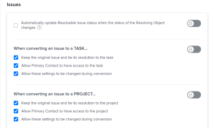

# 解析和可解析对象概述

可解析对象是其分辨率与解析对象绑定的问题。 解决对象是项目、任务或其他问题。

将问题转换为任务或项目时，该问题将成为任务或项目的可解析对象。

您还可以手动将问题链接到“解决对象”（Resolving Object，可以是任务、项目或问题）。 有关信息，请参阅 [手动将问题的解决与其他问题、任务或项目关联](../../../manage-work/issues/convert-issues/manually-tie-resolution-of-issue-to-ptis.md).

在此方案中，原始问题成为任务、项目或问题的可解析对象。

## 设置Adobe Workfront以处理可解析对象 {#set-up-adobe-workfront-to-handle-resolvable-objects}

作为Workfront管理员或组管理员，您可以决定如何处理系统中或组中的可解析对象。

您可以选择在将可解析对象转换为任务或项目时保留该对象，或在创建任务或项目后将其删除。 您可以选择允许在转换问题的过程中更改这些设置，这将允许转换问题的用户在转换问题时选择是保留还是删除问题。

>[!NOTE]
>
>可解析对象始终是一些问题，其分辨率和状态取决于与其关联的解析对象的分辨率和状态。 “解决对象”可以是问题、任务或项目。

有关设置处理可解析对象的首选项的信息，请参阅 [配置系统范围的任务和问题首选项](../../../administration-and-setup/set-up-workfront/configure-system-defaults/set-task-issue-preferences.md).

<!--WRITER

(Note: drafted and just pointed the user to the article linked above)&nbsp;

To establish the system default for what happens to the issue as it is being converted to a task or a project:

<ol>
<li value="1">Log in to Workfront as a Workfront administrator or group administrator.</li>
<li value="2"> 
  From the main menu, click <strong>Setup</strong>. 
 
  
 </li>
<li value="3">Expand <strong>Project Preferences</strong>.</li>
<li value="4">Click <strong>Tasks & Issues</strong>.</li>
<li value="5">Go to the <strong>Issues</strong> area of the setup.  Consider editing any of the following settings:
<ul>
<li>
<strong>Automatically update Resolvable Issue status when the status of the Resolving Object changes:</strong> Select this option to tie the resolution of the original issue to the resolution of its Resolving Object. In order for this setting to have any effect, the options to <strong>Keep the original issue and tie its resolution to the task</strong> or<strong>project</strong> must be selected.

<ul>
<li>When this setting is enabled, you can create custom statuses with the same key for both issues and projects or tasks. When the project or task (as a resolvable object) turns into the custom status, the change also reflects on the status of the issue. The status key must be the same for the issue and project or task statuses.</li>
<li>
When this setting is disabled, resolving object statuses are automatically set to the default status, instead of the custom ones. For more information about the default statuses, see <a href="#synchronize-the-status-of-the-resolvable-object-with-that-of-the-resolving-object" class="MCXref xref">Synchronize the Status of the Resolvable Object with that of the Resolving Object</a>.
<note type="note">
The default status of the issue is controlled by the status of the project or task, regardless of whether this option is selected or not.
</note></li>
</ul></li>
<li><strong>When converting an issue to a TASK...:</strong> The settings in this section determine what happens during the conversion process from issue to task:
<ul>
<li><strong>Keep the original issue and tie its resolution to the task:</strong> When converting the issue, it remains visible as an issue until the task is complete. The status of the issue automatically changes to Closed when the task completes.</li>
<li><strong>Allow Primary Contact to have access to the task:</strong> Gives the primary contact (issue creator) access to the task to review the task, make updates, and stay informed of its progress.</li>
<li><strong>Allow these settings to be changed during conversion:</strong> Allows the user who is converting the issue to change these options during the conversion of an issue to a task. </li>
</ul></li>
<li><strong>When converting an issue to a PROJECT...:</strong> The settings in this section determine what happens during the conversion process from issue to project:
<ul>
<li><strong>Keep the original issue and tie its resolution to the project:</strong> When converting the issue, it remains visible as an issue until the project is complete. The status of the issue automatically changes to Closed when the project completes.</li>
<li><strong>Allow Primary Contact to have access to the project:</strong> Gives the primary contact (issue creator) access to the project to review the project, make updates, and stay informed of its progress.</li>
<li><strong>Allow these settings to be changed during conversion:</strong> Allows the user who is converting the issue to change these options during the conversion of an issue to a project. </li>
</ul></li>
</ul></li>
<li value="6">Click <strong>Save</strong>.</li>
</ol>

-->

## 在转换到项目或任务期间处理可解析对象

根据Workfront或组管理员配置系统或组级别问题首选项的方式，您可能能够在问题转换为项目或任务期间处理可解析的对象。

存在以下情形：

* 如果Workfront或组管理员具有 **保留原始问题，并将其解决办法与任务挂钩** 和 **保留原始问题并将其解决方案与项目绑定** 选定项和 **允许在转换期间更改这些设置** 如果未选中，您将无法更改这些设置，因为您将问题转换为任务或项目。\
   

* 如果Workfront或组管理员具有 **保留原始问题，并将其解决办法与任务挂钩** 和 **保留原始问题并将其解决方案与项目绑定** 已选择或未选择，且 **允许在转换期间更改这些设置** 选中后，您将能够在将问题转换为任务或项目时更改这些设置。\
   

有关将问题转换为任务和项目的更多信息，请参阅 [转换Adobe Workfront中的问题概述](../../../manage-work/issues/convert-issues/convert-issues.md).

<!--WRITER

<h2>Tie the resolution of an issue to a project, task or </h2> 

(NOTE: created new article for this section; draft when the article is live and see if you need to make a link from this one to the new article) 

You can manually tie the resolution of an issue to the resolution of a project, task, or issue without converting the issue. The issue becomes one of the Resolvable Objects of the project, task, or issue you select. When you do this, a change in the status of the project, task, or issue triggers a change in the status of the original issue, so you cannot manually edit the status of the original issue.  For more information about how the status of the Resolving Object affects the Resolvable Object, see <a href="#synchronize-the-status-of-the-resolvable-object-with-that-of-the-resolving-object" class="MCXref xref">Synchronize the Status of the Resolvable Object with that of the Resolving Object</a>.

You must have Manage permissions on the original issue and View permissions on the project, task, or issue to do this. 

To tie the resolution of an issue to the resolution of a project, task, or issue:

<ol>
<li value="1">Navigate to an issue whose resolution you want to tie to a task or a project.</li>
<li value="2"> 
  Click the <strong>Issue Details</strong> > <strong>Overview</strong> area. 
 
  
 </li>
<li value="3"> 
Click the <strong>Edit</strong> icon  in the upper-right corner of the Issue Details section. 
 </li>
<li value="4">At the bottom of the form,  click in the <strong>Resolved By</strong> field,  and select from the following types of resolving objects:
<ul>
<li><strong>Project</strong></li>
<li><strong>Task</strong></li>
<li>
<strong>Issue</strong>
</li>
</ul>
The field for the resolving object displays. 
</li>
<li value="5">After selecting the object, start typing the name of a specific project, task, or issue in the available field and select it when it appears in the drop-down list. </li>
<li value="6">Click <strong>Save</strong>&nbsp;<strong>Changes</strong>. The original issue becomes the Resolvable Object for the project, task, or issue you selected in step 4 and 5. <note type="note">
One project, task, or issue may have multiple issues as Resolvable Objects.
</note></li>
</ol>

-->

## 将可解析对象的状态与解析对象的状态同步 {#synchronize-the-status-of-the-resolvable-object-with-that-of-the-resolving-object}

* [在解决对象问题时同步状态](#synchronize-statuses-when-the-resolving-object-is-an-issue)
* [当解析对象是任务或项目时同步状态](#synchronize-statuses-when-the-resolving-object-is-a-task-or-a-project)

### 在解决对象问题时同步状态 {#synchronize-statuses-when-the-resolving-object-is-an-issue}

如果问题被手动绑定到另一个问题，则第二个问题的状态（解决对象）将触发第一个问题的状态（可解决对象）的更改。 第一个问题的状态与第二个问题更改为的状态匹配。 这适用于默认和自定义问题状态。

### 当解析对象是任务或项目时同步状态 {#synchronize-statuses-when-the-resolving-object-is-a-task-or-a-project}

当问题是任务或项目的可解析对象时，任务和项目状态的更改将触发问题状态的更改。 默认状态的触发方式与自定义状态不同，在此例中为。

* [将解析对象的默认状态与可解析对象的默认状态同步](#synchronize-the-default-status-of-the-resolving-object-with-the-default-status-of-the-resolvable-object)
* [将解析对象的自定义状态与可解析对象的自定义状态同步](#synchronize-the-custom-status-of-the-resolving-object-with-the-custom-status-of-the-resolvable-object)

#### 将解析对象的默认状态与可解析对象的默认状态同步 {#synchronize-the-default-status-of-the-resolving-object-with-the-default-status-of-the-resolvable-object}

无论是否选中了“解决对象状态发生更改时自动更新可解决问题状态”选项，每当解决对象（项目或任务）上的默认状态发生更改时，可解决对象（问题）的状态都会相应地发生更改。 只有默认状态已映射以触发此类更改。

将问题设置为任务的解决对象时，以下任务默认状态会触发以下问题默认状态更改：

| **任务状态** | **问题状态** |
|---|---|
| 新 | 新 |
| 进行中 | 进行中 |
| 完成 | 已关闭 |

当问题设置为项目的可解析对象时，项目的以下默认状态会触发以下问题的默认状态更改。 某些项目状态不会触发对问题状态的更改。 在将项目转换为以下状态之一之前，问题仍处于状态：

| **项目状态** | **问题状态** |
|---|---|
| 计划 | 新 |
| 目前 | 进行中 |
| 保持 | 保持 |
| 已请求 | 不会触发对问题状态的更改 |
| 已批准 | 不会触发对问题状态的更改 |
| 被拒绝 | 不会触发对问题状态的更改 |
| 想法 | 不会触发对问题状态的更改 |
| 废弃 | 已关闭 |
| 已完成 | 已关闭 |

>[!NOTE]
>
>在问题状态变为“已关闭”（因关闭任务或项目而关闭）后，无论任务或项目在关闭后更改为的状态如何，问题仍保持“已关闭”。

#### 将解析对象的自定义状态与可解析对象的自定义状态同步 {#synchronize-the-custom-status-of-the-resolving-object-with-the-custom-status-of-the-resolvable-object}

将任务或项目的状态更改为自定义状态时，仅当满足以下两个条件时，问题的状态才会更改为自定义问题状态：

* 选中“Automatically update Resolvable Issue status when the Resolving Object changes”（解决对象更改状态时自动更新可解决的问题状态）选项。 有关如何启用此设置的更多信息，请参阅 [设置Adobe Workfront以处理可解析对象](#set-up-adobe-workfront-to-handle-resolvable-objects).

* 项目或任务的自定义状态与问题的自定义状态具有相同的三个字母代码。

您可以使用相同的键创建自定义状态，以用于问题和项目或任务。 当项目或任务（作为解析对象）更改为自定义状态时，更改也会反映问题的状态。 问题和项目或任务状态的状态键必须相同。

例如，使用三个字母代码“LCD”（等于“当前”）创建一个名为“已启动”的项目自定义状态。 此外，创建一个名为“项目启动”的问题自定义状态，并将字母代码“LCD”等于“进行中”。 当您将项目标记为“已启动”时，问题会自动将状态更改为“已启动项目”。 如果未启用“解决对象更改的状态”设置，则“自动更新可解决的问题”状态将改为“进行中”（默认状态）。

有关创建自定义状态的更多信息，请参阅 [创建或编辑状态](../../../administration-and-setup/customize-workfront/creating-custom-status-and-priority-labels/create-or-edit-a-status.md).

## 将解析对象的完成百分比与可解析对象的完成百分比同步

如果某个问题由任务或项目解决，则当发生以下任何情况时，该问题的完成百分比就会更新该可解决的问题： 

* 当某人保存任务或项目的更改时。
* 项目的时间表将重新计算。

如果和问题由其他问题解决，则完成百分比会在任一问题更新时更新。

## 在任务或项目上找到可解析的对象

对于任务和项目，查找解析对象的方式相同。

1. 导航到您通过将问题转换为项目或任务而创建的项目或任务。
1. 单击 **项目详细信息** 或 **任务详细信息** 图标，然后单击以将其展开。
1. 单击 **概述**.
1. 在选项卡的底部，找到 **此解析** 字段：此字段中列出了项目或任务的可解析对象问题。

   >[!NOTE]
   >
   >无法将问题转换为其他问题，但它们可以手动与“解决问题”关联。 项目、任务或问题可能具有多个问题作为可解析对象。 当项目、任务或问题得到解析时，可解析对象（问题）也得到解析。 即使重新打开解决的项目、任务或问题，“可解决问题”仍然处于关闭状态。

## 识别列表中的解决对象问题

在问题列表中，您可以通过在 **状态图标** 或 **标记** 列：

## 在报表中查看可解析和可解析的对象信息

您可以在项目、任务或问题的视图或报告中显示有关可解析对象或可解析对象的信息。\
下表显示了可显示哪些字段以及可在哪些视图中显示它们：

<table style="table-layout:auto"> 
 <col> 
 <col> 
 <col> 
 <col> 
 <thead> 
  <tr> 
   <th><strong>视图中的字段</strong> </th> 
   <th><strong>问题视图</strong> </th> 
   <th><strong>任务视图</strong> </th> 
   <th><strong>项目视图</strong> </th> 
  </tr> 
 </thead> 
 <tbody> 
  <tr> 
   <td><strong>有可解决项</strong>:显示 <strong>True</strong> 值（如果项目或任务具有与其关联的可解决问题），以及 <strong>False</strong> 值。</td> 
   <td>✓</td> 
   <td>✓</td> 
   <td>✓</td> 
  </tr> 
  <tr> 
   <td><strong>原始发行名称、原始发行条目日期、创作者名称</strong>:显示原始问题的名称和登入日期，以及在文本模式自定义视图中创建问题的用户的名称。 有关为项目或任务报表或列表构建文本模式自定义视图以显示有关原始问题的信息的详细信息，请参阅 <a href="../../../reports-and-dashboards/reports/custom-view-filter-grouping-samples/view-display-original-issue-info-task-project-list.md" class="MCXref xref">查看：显示任务和项目列表上的原始问题信息</a>. </td> 
   <td> </td> 
   <td> ✓</td> 
   <td> ✓</td> 
  </tr> 
  <tr> 
   <td> 
<strong>应收款项：</strong> 显示项目或任务报表或列表的文本模式自定义视图中所有可解析对象的列表。
 
有关构建此视图的更多信息，请参阅 <a href="../../../reports-and-dashboards/reports/custom-view-filter-grouping-samples/view-resolvable-objects-task-project-report.md" class="MCXref xref">查看：任务或项目报告中的可解析对象</a>
 </td> 
   <td> </td> 
   <td>✓</td> 
   <td> ✓</td> 
  </tr> 
  <tr> 
   <td><strong>已转换的问题创作者</strong>:显示有关最初记录了问题（该问题稍后被转换为任务）的用户的信息。 </td> 
   <td> </td> 
   <td>✓</td> 
   <td> </td> 
  </tr> 
  <tr> 
   <td><strong>解决项目</strong>:显示有关“解决项目”的信息，该“解决项目”是从原始问题转换的，或手动指定为问题的“解决对象”。</td> 
   <td>✓</td> 
   <td> </td> 
   <td> </td> 
  </tr> 
  <tr> 
   <td><strong>解决任务</strong>:显示有关解决任务的信息，该任务是从原始问题转换的，或手动指定为问题的解决对象。</td> 
   <td>✓ </td> 
   <td> </td> 
   <td> </td> 
  </tr> 
  <tr> 
   <td><strong>解决问题</strong>:显示有关已手动指定为问题解决对象的“解决问题”的信息。</td> 
   <td> ✓</td> 
   <td> </td> 
   <td> </td> 
  </tr> 
 </tbody> 
</table>
