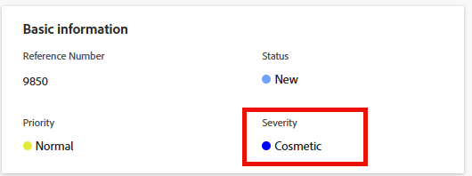

# 更新问题严重性

<!--Audited: 08/2025-->

您可以将严重程度与Adobe Workfront中的问题关联。 任务和项目没有严重性。

问题指可能会阻止项目按时完成或在预算内的意外事件。 您可以使用严重程度来指示问题的严重程度。

您的Workfront管理员定义Workfront中可用的严重性。 创建之后，即可使用它们与问题关联。\
有关在Workfront中创建严重程度的更多信息，请参阅[创建或自定义问题严重程度](../../../administration-and-setup/customize-workfront/creating-custom-status-and-priority-labels/create-customize-issue-severities.md)。

您必须拥有问题的Contribute权限才能更新其严重性。

您可以在Workfront的以下区域中更新问题的严重性：

* 在&#x200B;**编辑问题**&#x200B;对话框中
* 在问题的&#x200B;**问题详细信息**&#x200B;区域中
* 在问题列表或报告中

## 访问权限要求

+++ 展开可查看本文所述功能的访问权限要求。

<table style="table-layout:auto"> 
 <col> 
 <col> 
 <tbody> 
  <tr> 
   <td role="rowheader">Adobe Workfront 包</td> 
   <td> 
“任一”
 </td> 
  </tr> 
  <tr> 
   <td role="rowheader">Adobe Workfront许可证</td> 
   <td>
参与者或更高版本
 
   
请求或更高版本
 </td> 
  </tr> 
  <tr> 
   <td role="rowheader">访问级别配置</td> 
   <td> 
编辑对问题的访问权限
</td> 
  </tr> 
  <tr> 
   <td role="rowheader">对象权限</td> 
   <td> 
管理问题的权限
</td> 
  </tr> 
 </tbody> 
</table>

有关此表中信息的更多详细信息，请参阅Workfront文档中的[访问要求](/help/quicksilver/administration-and-setup/add-users/access-levels-and-object-permissions/access-level-requirements-in-documentation.md)。

+++

## 更新问题严重性

要在问题的问题详细信息区域中更新问题的严重性，请执行以下操作：

1. 转到要更新其严重性的问题。
1. 单击左侧面板中的&#x200B;**问题详细信息**。

   默认情况下应显示&#x200B;**概述**&#x200B;部分。

1. 单击&#x200B;**基本信息**&#x200B;区域中的&#x200B;**严重性**&#x200B;字段。

   

1. 从下拉菜单中选择适当的&#x200B;**严重性**。

   根据Workfront管理员在系统中配置严重程度的方式，选项可能会有所不同。

1. 单击&#x200B;**保存更改**。
