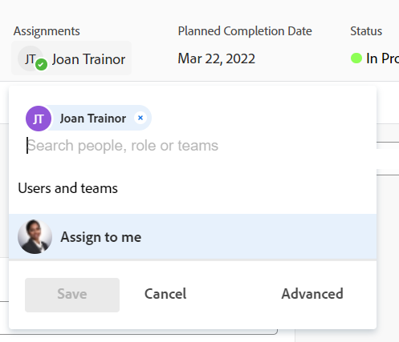

# 分配问题

<!--Audited: 07/2024-->

您可以将问题分配给用户、角色和团队，以指示负责完成问题的人员。 有关分配问题的一般信息，请参阅[修改问题分配的概述](../../../manage-work/issues/manage-issues/modify-issue-assignments-overview.md)。

>[!TIP]
>
>您可以分配多个用户、工作角色或团队。 您只能分配活动用户、工作角色和团队。
>
>如果在停用用户、工作角色或团队之前已分配用户、工作角色或团队，则仍将其分配给工作项目。 在这种情况下，我们建议执行以下操作：
>
>* 将工作项重新分配给活动资源。
>* 将已停用团队中的用户与活动团队关联，并将工作项重新分配给活动团队。

除了本文之外，我们建议您阅读以下文章，以了解有关分配问题的更多信息：

* [修改问题分配的概述](../../../manage-work/issues/manage-issues/modify-issue-assignments-overview.md)
* [编辑问题](../../../manage-work/issues/manage-issues/edit-issues.md)
* [修改列表中多个问题的用户分配](../../../manage-work/issues/manage-issues/edit-assignments-for-multiple-issues.md)
* [创建高级工作](../../../manage-work/tasks/assign-tasks/create-advanced-assignments.md)
* [进行智能分配](../../../manage-work/tasks/assign-tasks/make-smart-assignments.md)
* [智能分配概述](../../../manage-work/tasks/assign-tasks/smart-assignments.md)
* [在工作负载均衡器中分配工作概述](../../../resource-mgmt/workload-balancer/assign-work-in-workload-balancer.md)

您可以在单个问题级别将问题分配给一个或多个资源，也可以一次性将多个资源分配给多个问题。

在Adobe Workfront中，分配问题和任务非常类似。 有关分配任务的一般信息，请参阅[修改任务分配的概述](../../../manage-work/tasks/assign-tasks/modify-task-assignments-overview.md)。

## 访问要求

+++ 展开以查看本文中各项功能的访问要求。

<table style="table-layout:auto"> 
 <col> 
 </col> 
 <col> 
 </col> 
 <tbody> 
  <tr> 
   <td role="rowheader">Adobe Workfront计划</td> 
   <td> 
任何 
 </td> 
  </tr> 
  <tr> 
   <td role="rowheader">Adobe Workfront许可证*</td> 
   <td> 
新文档：参与者或更高版本

   
当前：审阅或更高版本
 </td> 
  </tr> 
  <tr> 
   <td role="rowheader">访问级别</td> 
   <td> 
编辑对问题的访问权限
 
查看或更高权限的项目和任务以分配一个问题
 </td> 
  </tr> 
  <tr> 
   <td role="rowheader">对象权限</td> 
   <td> 
管理问题的权限
 
 查看问题所在项目或任务的权限或更高（在分配一个问题时）

Contribute对问题所在的项目或任务拥有或更高权限（在分配多个问题时）。
 </td> 
  </tr> 
 </tbody> 
</table>

*有关信息，请参阅Workfront文档中的[访问要求](/help/quicksilver/administration-and-setup/add-users/access-levels-and-object-permissions/access-level-requirements-in-documentation.md)。

+++

## 向工作角色、团队和用户进行多个分配的注意事项

将多个资源分配给工作项时，请考虑以下事项：

* 用户可以有多个与其配置文件关联的工作角色。 有关将用户与工作角色关联的信息，请参阅[编辑用户的配置文件](../../../administration-and-setup/add-users/create-and-manage-users/edit-a-users-profile.md)。

* 任务或问题通常首先分配给一个或多个工作角色或团队。 当项目准备好开始时，可能需要将它们也分配给用户。

  如果已将任务或问题分配给一个或多个角色，并且您还分配了用户，则Adobe Workfront将根据以下规则确定要与其他用户（如果有）关联的工作角色：

   * 如果只分配了一个工作角色，并且该工作角色与用户的主要角色匹配，则任务或问题仅被分配给履行其主要角色的用户。
   * 如果分配了多个角色，并且至少有一个角色与用户的辅助角色匹配，则将任务或问题分配给履行其中一个其他角色(如果存在多个匹配，则Workfront会随机选择其他角色)以及分配的任何其他角色的用户。
   * 如果分配了一个或多个工作角色，但没有与用户的角色匹配，则任务或问题将同时分配给该角色和用户。

* 如果将任务或问题分配给团队并且您还分配了用户，则任务或问题仍会分配给团队和用户。

<!--

<h2> </h2>
<h2>Considerations about removing assignments from issues</h2> 

(NOTE: drafted and moved to Modify issue assignments overview article)

You can remove assignments from one issue at a time, or you can remove assignments from multiple issues in bulk.

For more information about removing assignments from issues in bulk, see <a href="../../../manage-work/issues/manage-issues/edit-assignments-for-multiple-issues.md" class="MCXref xref">Modify user assignments for multiple issues in a list</a>. 

Consider the following when removing assignments from issues: 

<ul>
<li>When you unassign a user from an issue, the issue remains assigned to the job role that the user fulfilled on the issue.</li>
<li>When you unassign a job role or a team from an issue, the issue remains unassigned if it is not assigned to any other resources. </li>
</ul>

-->

## 分配单个问题

1. 转到要分配的问题。
1. 单击问题标题右上角的&#x200B;**任务**&#x200B;区域中的&#x200B;**分配给**

   或

   如果问题已分配，单击当前分配的名称。

   

1. 执行下列操作之一：

   * 开始键入要分配的用户、角色或团队的名称，然后当该名称出现在列表中时单击它。

     

   * （视情况而定）单击可用列表中的名称、角色或团队之一
   * 单击&#x200B;**分配给我**&#x200B;以将其分配给您自己
   * 单击&#x200B;**高级**。

     创建高级工作分配的过程与任务和问题类似。 有关如何进行高级分配的信息，请参阅[创建高级分配](../../../manage-work/tasks/assign-tasks/create-advanced-assignments.md)。

     >[!TIP]
     >
     >添加用户分配时，请注意头像、用户的主要角色或其电子邮件地址，以区分具有相同名称的用户。
     >
     >用户必须与至少一个工作角色关联，才能在添加时查看工作角色。
     >
     >您必须在访问级别中启用“查看联系信息”设置，用户才能查看用户的电子邮件。 有关信息，请参阅[授予用户访问权限](../../../administration-and-setup/add-users/configure-and-grant-access/grant-access-other-users.md)
     >

     <!-- this doesn't apply to issues; if it does, add this to the TIP above: 
      >When adding a job role assignment, you can search for the job role or location. Select a role from the Job roles list to use the default billing rate for the assignment, or select a Rate card job role to use the billing rate from the rate card. For more information on rate cards, see [Manage rate cards](/help/quicksilver/administration-and-setup/set-up-workfront/configure-system-defaults/manage-rate-cards.md).-->

1. 单击&#x200B;**保存**&#x200B;以完成问题分配。
1. （可选）单击问题标题上任务区域任务名称旁边的&#x200B;**X图标**&#x200B;以删除任务。

## 在列表中分配问题

当任何分配字段在列表视图中可见时，您可以在列表或报告中分配问题。 这是指派问题的更快方式。

根据视图中可见的字段，可以将以下实体分配给问题：

| 选项 | 分配的实体 |
|---|---|
| **分配给** | 分配一个用户 |
| **已分配** | 分配一个用户 |
| **分配** | 分配用户、工作角色或团队。 |

要在列表中分配问题，请执行以下操作：

1. 转到问题列表，该列表中具有“任务负责人”、“任务负责人”或“工作总揽”字段。
1. 要分配问题，请执行下列操作之一：

   * 在&#x200B;**分配给**&#x200B;或&#x200B;**分配的**&#x200B;字段中单击，并开始键入要分配给问题的活动用户的名称，然后当该用户显示在列表中时单击它。

     

   * 单击&#x200B;**工作总揽**&#x200B;字段并开始键入要分配给问题的活跃用户、工作角色或活跃团队的名称，然后当它显示在列表中时单击它。

     

   >[!TIP]
   >
   >添加用户分配时，请注意头像、用户的主要角色或其电子邮件地址，以区分具有相同名称的用户。
   >
   >用户必须与至少一个工作角色关联，才能在添加时查看工作角色。
   >
   >您必须在访问级别中启用“查看联系信息”设置，用户才能查看用户的电子邮件。 有关信息，请参阅[授予用户访问权限](../../../administration-and-setup/add-users/configure-and-grant-access/grant-access-other-users.md)。

1. （视情况而定）在“工作总揽”字段中可见时，单击工作总揽框右上角的&#x200B;**人员图标** 以打开“高级工作”框并创建高级工作。 有关详细信息，请参阅[创建高级工作](../../../manage-work/tasks/assign-tasks/create-advanced-assignments.md)。

   >[!TIP]
   >
   >您不能从“分配至”或“已分配”字段进行高级分配。

1. 将您的代理人添加到问题中后，按Enter或单击页面上的任意位置以保存更改。

## 批量分配问题

1. 转到要批量分配的问题列表。
1. 选择列表中的多个问题。
1. 单击&#x200B;**编辑图标** 。

   将打开&#x200B;**编辑问题**&#x200B;对话框。

1. 在&#x200B;**分配**&#x200B;区域，选择&#x200B;**代理人**&#x200B;框，然后开始键入要分配给所有问题的用户、工作角色或团队的名称。

   >[!IMPORTANT]
   >
   >如果任何问题已分配，则您在此处指示的资源将添加到问题中，而不是替换问题中的现有资源。

1. （可选）当您为问题分配多个资源时，选择&#x200B;**问题所有者**&#x200B;列中的单选按钮以指示哪个资源是问题的主要被分配者或所有者。 这不适用于团队。
1. （可选）在将用户分配给问题时，从&#x200B;**受分配人角色**&#x200B;列的&#x200B;**选择角色**&#x200B;下拉菜单中选择用户在问题中应履行的角色。 如果不选择角色，Workfront会自动选择用户的主要角色。

1. （可选）如果要从所有问题中删除现有被分配人，请执行下列操作之一：

   1. 开始键入要从问题中移除的用户、角色或团队的名称，然后当该名称出现在列表中时将其选中，然后单击&#x200B;**移除被分配人**&#x200B;以添加要移除的其他被分配人。
   1. 单击&#x200B;**移除所有现有被分配人**&#x200B;可从所有已选问题中移除所有被分配人。

1. 单击&#x200B;**保存更改**。
1. （可选，视情况而定）当问题列表中显示“分配给”或“工作总揽”字段时，单击其中一列以查找问题，然后单击被分配人名称旁边的&#x200B;**X图标**&#x200B;以将其从问题中删除。
