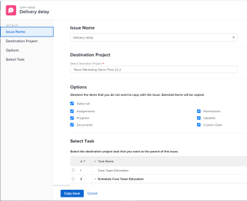

# 复制问题

您可以复制问题或请求，并将其保存在同一项目或其他项目中。 您还可以将问题从任务复制到另一个项目。

您可以从以下对象复制问题：

* 从项目复制到同一项目（在同一项目上复制）
* 从任务到同一任务（如果在同一任务上，则重复）
* 从项目到另一个项目
* 从任务到项目

>[!TIP]
>
>“问题”和“请求”在Workfront中可互换使用。 您可以同时记录项目和任务中的问题以指示需要解决的意外工作。 您还可以提交在指定为请求队列的项目中记录为问题的请求。

## 访问要求

您必须具有以下权限才能执行本文中的步骤：

<table style="table-layout:auto"> 
 <col> 
 <col> 
 <tbody> 
  <tr> 
   <td role="rowheader">Adobe Workfront计划*</td> 
   <td> 
任何
 </td> 
  </tr> 
  <tr> 
   <td role="rowheader">Adobe Workfront许可证*</td> 
   <td> 
请求或更高版本
 
查看或更高许可证以复制项目问题部分中的问题。
 </td> 
  </tr> 
  <tr> 
   <td role="rowheader">访问级别*</td> 
   <td> 
编辑对问题的访问权限
 
查看或更高权限的项目和任务
 
注意：如果您仍然没有访问权限，请咨询Workfront管理员是否对您的访问级别设置了其他限制。 有关访问访问级别中问题的信息，请参阅<a href="../../../administration-and-setup/add-users/configure-and-grant-access/grant-access-issues.md" class="MCXref xref">授予对问题的访问权限</a>。 有关Workfront管理员如何更改访问级别的信息，请参阅<a href="../../../administration-and-setup/add-users/configure-and-grant-access/create-modify-access-levels.md" class="MCXref xref">创建或修改自定义访问级别</a>。 
 </td> 
  </tr> 
  <tr> 
   <td role="rowheader">对象权限</td> 
   <td> 
管理问题的权限
 
将权限分配给要将问题复制到的项目，并具有“添加问题”功能。
 
 有关向问题授予权限的信息，请参阅<a href="../../../workfront-basics/grant-and-request-access-to-objects/share-an-issue.md" class="MCXref xref">共享问题</a>
 
有关请求其他权限的信息，请参阅<a href="../../../workfront-basics/grant-and-request-access-to-objects/request-access.md" class="MCXref xref">请求访问对象</a>。
 </td> 
  </tr> 
 </tbody> 
</table>

&#42;要了解您拥有什么计划、许可证类型或访问权限，请与Workfront管理员联系。

## 复制问题时的注意事项

### 复制问题时的一般注意事项

在复制过程中，您可以选择将某些与问题相关的项目复制到复制的问题。 但是，某些项目会默认转移到新问题，而其他项目则不会，如下面的列表所述。

默认情况下，以下项目将复制到新问题：

* 主要联系人
* 自定义表单。 只有在复制过程中选择“自定义数据”时，自定义字段中的信息才会复制到新问题。
* 审批
* 计划开始日期和计划完成日期

默认情况下，以下对象不会复制到新问题：

* 记录的小时数

### 与文档或请求队列相关问题的注意事项

在复制包含文档或与请求队列关联的问题时，请考虑以下事项：

* **当问题与请求队列关联时：**&#x200B;当您将问题复制到另一个对象并且该问题与请求队列关联时，复制的问题不再与第一个问题源自的原始队列关联。
* **当文档附加到问题时：**&#x200B;当您将问题复制到另一个对象并且该问题具有附加的文档时，该文档及其版本也将移动到新问题。 与文档关联的任何验证或审批都不会移动。
* **当问题链接到文档或文件夹时：**&#x200B;当您复制问题时，如果问题具有链接到Google Drive等第三方服务的文档或文件夹，则指向文档的链接将传输到复制的问题。

## 复制列表中的问题

您可以从问题列表或问题报告中复制一个或多个问题。

1. 转到包含要复制的一个或多个问题的项目。

   或

   转到问题报告。

1. 如果您选择转到项目，请单击左侧面板中的&#x200B;**问题**。
1. 选择要复制的一个或多个问题，然后单击问题列表顶部的&#x200B;**更多菜单**，然后单击&#x200B;**复制到**。

   

1. 继续复制问题，如从步骤2开始的[复制单个问题](#copy-a-single-issue)部分中所述。

   <!--
   <MadCap:conditionalText data-mc-conditions="QuicksilverOrClassic.Draft mode">
   (NOTE: ensure step number stays accurate)
   </MadCap:conditionalText>
   -->

## 复制单个问题 {#copy-a-single-issue}

您可以在查看时复制一个问题。

1. 转到要复制的问题，然后单击问题名称右侧的&#x200B;**更多**&#x200B;菜单，然后&#x200B;**复制**&#x200B;到。

   复制

   显示&#x200B;**复制问题**&#x200B;框。

   

1. 在&#x200B;**选择目标项目**&#x200B;部分中，指定要复制问题的项目的名称。 默认显示当前项目的名称。

   >[!TIP]
   >
   >列表中仅显示100个项目。

1. （视情况而定）如果您无权将问题复制到项目，请单击&#x200B;**请求访问权限**。
1. （视情况而定）如果您有权将问题添加到目标项目上的任务之一，请继续将问题复制到选定的目标项目，而不请求访问权限。

   

   >[!TIP]
   >
   >如果所选项目处于未决批准、已完成或终止状态，且Workfront管理员阻止向这些项目添加问题，则会显示类似消息。 有关详细信息，请参阅[配置系统范围的项目首选项](../../../administration-and-setup/set-up-workfront/configure-system-defaults/set-project-preferences.md)。

1. （可选）在&#x200B;**选项**&#x200B;部分中，取消选择下表中列出的任何项以将其从新问题中删除。 默认情况下，将选择所有选项。

   >[!NOTE]
   >
   >这仅影响复制的问题，而不影响原始问题。

   <table style="table-layout:auto"> 
    <col> 
    <col> 
    <tbody> 
     <tr> 
      <td role="rowheader">任务</td> 
      <td>删除分配给问题的用户、工作角色或团队。</td> 
     </tr> 
     <tr> 
      <td role="rowheader">进度</td> 
      <td>删除问题的完成百分比（如果有）。</td> 
     </tr> 
     <tr> 
      <td role="rowheader">文档</td> 
      <td>删除文档选项卡中的所有内容，包括文档版本、链接文档和文件夹。  默认情况下，无法将文档验证和审批复制到其他问题。</td> 
     </tr> 
     <tr> 
      <td role="rowheader">权限</td> 
      <td>删除与问题共享的实体。 </td> 
     </tr> 
     <tr> 
      <td role="rowheader">更新</td> 
      <td>从问题的更新部分删除注释。</td> 
     </tr> 
     <tr> 
      <td role="rowheader">自定义数据</td> 
      <td>删除问题自定义表单中的信息，以及与附加到问题的文档关联的自定义表单中的信息（如果它们也随问题一起复制）。 自定义表单将保留附加到问题和文档，但表单上的信息不会转移到新问题中。 </td> 
     </tr> 
    </tbody> 
   </table>

1. （可选）在&#x200B;**选择任务**&#x200B;部分中，选择要将问题移动到的任务。
1. 单击&#x200B;**复制问题**&#x200B;或&#x200B;**复制问题**（如果您在列表中选择了多个问题）。

   复制的问题将添加到指定项目。

