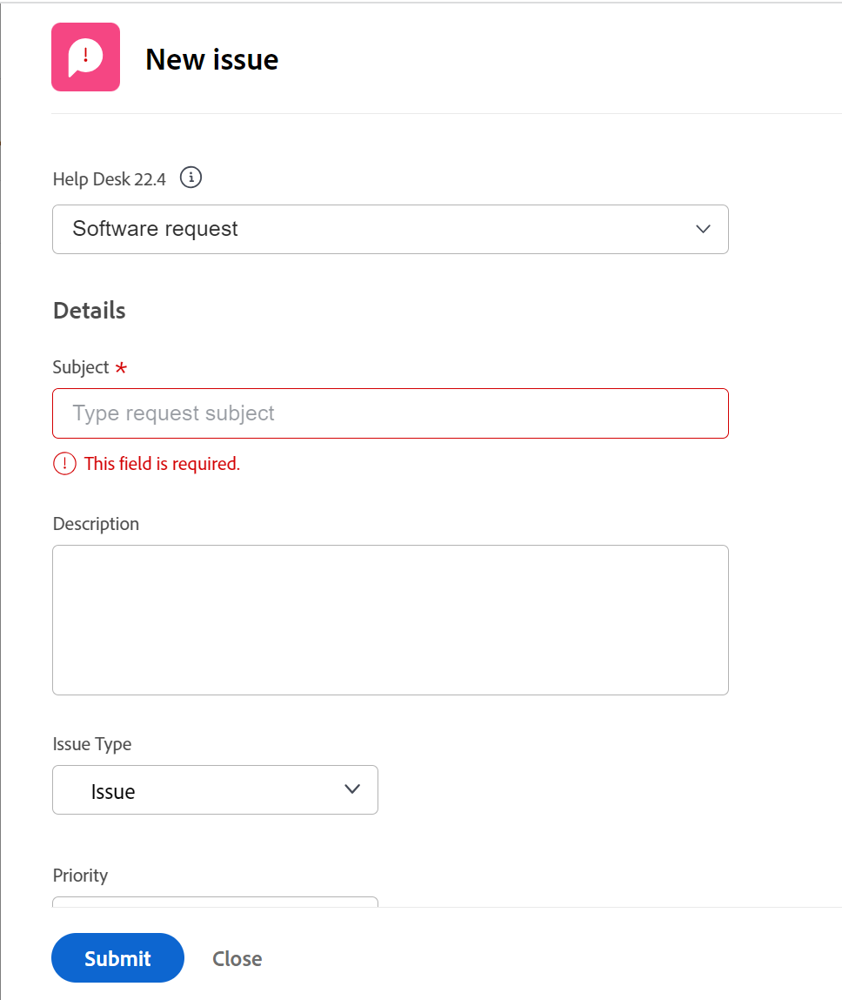

# 创建问题

<!--remove Preview and Prod references when this comes to Prod-->

此页面上高亮显示的信息是指尚未普遍可用的功能。 它只能在“预览”环境中用于所有客户，或者在“生产”环境中用于启用快速版本的客户。 

有关快速版本的信息，请参阅 [为您的组织启用或禁用快速发布](../../../administration-and-setup/set-up-workfront/configure-system-defaults/enable-fast-release-process.md). 

有关当前版本的信息，请参阅 [2023年第四季度发行版概述](../../../product-announcements/product-releases/23-q4-release-activity/23-q4-release-overview.md). 

在处理项目时，您可能会发现出现意外事件。 您可以将这些意外事件记录为特定项目或任务的问题。 具有适当访问权限的用户可以在项目或任务进展到完成时查看和监控问题的状态，而无需冗长的电子邮件链或状态会议。 与属于已计划事件的任务不同，问题表示Adobe Workfront中的未计划工作项。

您还可以将问题作为请求添加到项目中。 有关信息，请参阅 [创建和提交Adobe Workfront请求](../../../manage-work/requests/create-requests/create-submit-requests.md).

>[!TIP]
>
>在Workfront中，问题和请求可互换使用。 您可以同时记录项目和任务中的问题以指示需要解决的意外工作。 您还可以提交在指定为请求队列的项目中记录为问题的请求。

## 访问要求

您必须具有以下权限才能执行本文中的步骤：

<table style="table-layout:auto"> 
 <col> 
 <col> 
 <tbody> 
  <tr> 
   <td role="rowheader">Adobe Workfront计划*</td> 
   <td> 
任何
 </td> 
  </tr> 
  <tr> 
   <td role="rowheader">Adobe Workfront许可证*</td> 
   <td> 
查看或更高版本以向项目或任务添加问题
 
使用请求队列请求或更高版本将问题添加为请求。
 </td> 
  </tr> 
  <tr> 
   <td role="rowheader">访问级别配置*</td> 
   <td> 
编辑对问题的访问权限
 
查看或更高权限的项目和任务
 
注意：如果您仍然没有访问权限，请咨询Workfront管理员是否对您的访问级别设置了其他限制。 有关访问访问级别中问题的信息，请参阅 <a href="../../../administration-and-setup/add-users/configure-and-grant-access/grant-access-issues.md" class="MCXref xref">授予对问题的访问权限</a>. 有关Workfront管理员如何更改您的访问级别的信息，请参阅 <a href="../../../administration-and-setup/add-users/configure-and-grant-access/create-modify-access-levels.md" class="MCXref xref">创建或修改自定义访问级别</a>. 
 </td> 
  </tr> 
  <tr> 
   <td role="rowheader">对象权限</td> 
   <td> 
Contribute或更高权限，能够将“问题”添加到您创建问题的任务或项目
 
 有关向问题授予权限的信息，请参阅 <a href="../../../workfront-basics/grant-and-request-access-to-objects/share-an-issue.md" class="MCXref xref">共享问题 </a>
 
有关请求其他权限的信息，请参阅 <a href="../../../workfront-basics/grant-and-request-access-to-objects/request-access.md" class="MCXref xref">请求访问对象 </a>.
 </td> 
  </tr> 
 </tbody> 
</table>

&#42;要了解您拥有的计划、许可证类型或访问权限，请联系您的Workfront管理员。

<!--
(NOTE: in NWE Requestors CAN see the Issues tab on a project but in classic they cannot! However, even when they DO see it, they cannot enter the issues - logged this issue for it but they might decide not to fix it: https://hub.workfront.com/issue/60181e28000058980cce29597185b2d6/updates?email-source=comm)

-->

## 创建问题时的限制

当您拥有正确的访问权限时，您可以创建项目或任务的问题。 但是，在下列情况下，您可能无法创建问题：

* 您的Workfront管理员或组管理员必须启用添加问题，才能在项目偏好设置区域中向处于“完成”或“终止”状态的项目添加问题。 有关设置项目首选项的信息，请参阅 [配置系统范围的项目首选项](../../../administration-and-setup/set-up-workfront/configure-system-defaults/set-project-preferences.md).
* 您无法将问题添加到未决批准中的项目。

## 准备新问题表单

您的组织应具有明确定义的流程，以便记录问题的时间和方式。 配置此流程时，第一步是创建提交问题所需的表单。 无论您允许将问题直接添加到任务和项目，还是允许将问题提交到的请求队列，您都可以定义哪些Workfront字段，以及在用户提交新问题且必须完成时可以使用哪些自定义字段。 新问题表单可包含有助于快速解决问题的重要信息。

项目新问题的字段在项目的“队列详细信息”部分中定义，将记录问题。 有关配置项目的队列详细信息部分的信息，请参阅 [创建请求队列](../../../manage-work/requests/create-and-manage-request-queues/create-request-queue.md).

有关通过将问题提交到请求队列来创建问题的信息，请参阅 [通过输入新请求创建问题](#create-issues-by-entering-a-new-request) 部分。

## 使用“新建问题”按钮创建任务或项目的问题

在项目中定义新问题表单的字段后，您可以开始创建问题。

创建问题因您选择创建问题的环境而异。

### 使用生产环境中的“新建问题”按钮在任务或项目中创建问题

要在任务或项目中创建问题，请执行以下操作：

1. 转到要创建问题的项目。
1. （可选）如果要记录任务的问题，请转到 **任务** 区域，然后单击任务的名称。
1. 单击 **问题** 部分。

   

1. 单击 **新建问题**.

   

1. （视情况而定）如果项目创建者在项目中创建了“队列主题”或“主题组”，则它们将被添加到新问题表单中。 指定 **主题组** 或 **队列主题** 您的新问题。 “主题组”和“队列主题”的名称已根据您的环境定制。\
   有关创建主题组的详细信息，请参见 [创建主题组](../../../manage-work/requests/create-and-manage-request-queues/create-topic-groups.md). 有关创建队列主题的详细信息，请参阅 [创建队列主题](../../../manage-work/requests/create-and-manage-request-queues/create-queue-topics.md).

   

   * 如果项目上只设置了一个队列主题，则会自动显示该主题。
   * 如果“主题组”下面没有任何“队列主题”或“主题组”，则“主题组”下拉列表中没有任何内容。

1. （视情况而定）如果项目创建者允许 **请求类型** 要显示在新问题表单上的字段，请从以下选项中选择问题类型：

   * 错误报告
   * 更改顺序
   * 问题
   * 请求\
     根据Workfront管理员配置项目首选项的方式，问题类型的名称可能有所不同。

   >[!TIP]
   >
   >必须在“队列详细信息”中以及创建队列主题时启用请求类型，以在“新建问题”表单中显示为选项。 有关信息，请参阅以下文章：
   >* [创建请求队列](../../requests/create-and-manage-request-queues/create-request-queue.md)
   >  * [创建队列主题](../../requests/create-and-manage-request-queues/create-queue-topics.md)

1. 在中为新问题添加名称 **问题名称** 字段。
1. 继续指定中可用的字段 **新建问题** 表单。 有关输入新问题时可用的字段的更多信息，请参阅 [编辑问题](../../../manage-work/issues/manage-issues/edit-issues.md).

   >[!IMPORTANT]
   >
   >新问题表单中并非所有与问题相关的字段都可用。 项目创建者在定义项目的队列详细信息区域时，会启用创建问题时可用的字段。 有关更多信息，请参阅 [创建请求队列](../../requests/create-and-manage-request-queues/create-request-queue.md).

1. （视情况而定）如果队列主题与自定义表单关联，则该自定义表单将显示在 **新建问题** 表单。\
   或\
   如果项目通过队列详细信息区域与问题自定义表单相关联，则该表单会显示在 **新建问题** 表单，默认的Workfront字段之后。

   有关信息，请参阅 [创建请求队列](../../../manage-work/requests/create-and-manage-request-queues/create-request-queue.md).

1. 单击 **保存新问题。**

问题可分配给多个用户、工作角色或团队。 有关分配和管理请求的更多信息，请参阅 [管理工作和团队请求](../../../people-teams-and-groups/work-with-team-requests/manage-work-and-team-requests.md).

<!--When this is coming to Production, remove the "Production" section above and replace it with the following content: -->

### 在预览环境中使用新建问题按钮创建任务或项目上的问题

要在任务或项目中创建问题，请执行以下操作：

1. 转到要创建问题的项目。
1. （可选）如果要记录任务的问题，请转到 **任务** 区域，然后单击任务的名称。
1. 单击 **问题** 部分。

   

1. 单击 **新建问题**.
新问题框随即显示。

   

1. （视情况而定）如果项目创建者在项目中创建了“队列主题”或“主题组”，则它们将被添加到新问题表单中。 指定 **主题组** 或 **队列主题** 您的新问题。 “主题组”和“队列主题”的名称已根据您的环境定制。\
   有关创建主题组的详细信息，请参见 [创建主题组](../../../manage-work/requests/create-and-manage-request-queues/create-topic-groups.md). 有关创建队列主题的详细信息，请参阅 [创建队列主题](../../../manage-work/requests/create-and-manage-request-queues/create-queue-topics.md).

   * 如果项目上只设置了一个队列主题，则会自动显示该主题。
   * 如果“主题组”下面没有任何“队列主题”或“主题组”，则“主题组”下拉列表中没有任何内容。

1. 将问题名称添加到中 **主题** 字段，然后添加 **描述**.

1. （视情况而定）如果项目创建者允许 **请求类型** 要显示在新问题表单上的字段，请从以下选项中选择问题类型：

   * 错误报告
   * 更改顺序
   * 问题
   * 请求\
     根据Workfront管理员配置项目首选项的方式，问题类型的名称可能有所不同。

   >[!TIP]
   >
   >必须在“队列详细信息”中以及创建队列主题时启用请求类型，以在“新建问题”表单中显示为选项。 有关信息，请参阅以下文章：
   >* [创建请求队列](../../requests/create-and-manage-request-queues/create-request-queue.md)
   >  * [创建队列主题](../../requests/create-and-manage-request-queues/create-queue-topics.md)

1. 继续指定中可用的字段 **新建问题** 表单。 有关输入新问题时可用的字段的更多信息，请参阅 [编辑问题](../../../manage-work/issues/manage-issues/edit-issues.md).

   >[!IMPORTANT]
   >
   >新问题表单中并非所有与问题相关的字段都可用。 项目创建者在定义项目的队列详细信息区域时，会启用创建问题时可用的字段。 有关更多信息，请参阅 [创建请求队列](../../requests/create-and-manage-request-queues/create-request-queue.md).

1. （视情况而定）如果队列主题与自定义表单关联，则该自定义表单将显示在 **新建问题** 表单。\
   或\
   如果项目通过队列详细信息区域与问题自定义表单相关联，则该表单会显示在 **新建问题** 表单，默认的Workfront字段之后。

   有关信息，请参阅 [创建请求队列](../../../manage-work/requests/create-and-manage-request-queues/create-request-queue.md).

1. 单击 **提交**.

   问题可分配给多个用户、工作角色或团队。 有关分配和管理请求的更多信息，请参阅 [管理工作和团队请求](../../../people-teams-and-groups/work-with-team-requests/manage-work-and-team-requests.md).

## 在任务或项目中内联创建问题

>[!IMPORTANT]
>
>项目所有者必须启用 **允许用户添加内联问题** 在为项目定义问题设置时，您可以先将内联问题添加到项目或任务。 有关在项目上配置问题设置的信息，请参阅 [编辑项目](../../../manage-work/projects/manage-projects/edit-projects.md).
>

如果要快速添加多个问题，可以通过将任务或项目添加到问题列表，为任务或内联项目创建问题。

>[!NOTE]
>
>当您内联添加问题时，Workfront不会将新问题表单应用到新问题。 如果您希望用户在输入问题时提供某些信息，我们不建议内联添加问题。 这可能会对问题报告产生负面影响，并且稍后还会影响分配给问题的用户获得解决问题所需的所有信息的能力。

要创建内联问题，请执行以下操作：

1. 转到要创建问题的项目。
1. （可选）如果要记录任务的问题，请转到 **任务** 部分，然后单击任务的名称。
1. 单击 **问题** 部分。
1. 单击 **添加更多问题**.

   在“问题”部分的问题列表中创建新行。

   >[!TIP]
   >
   >如果在编辑项目框中取消选中允许用户添加问题内联设置，则此选项将灰显。 有关信息，请参阅 [编辑项目](../../../manage-work/projects/manage-projects/edit-projects.md).

   

1. 在名称字段中开始键入问题的名称，然后继续内联添加有关问题的更多信息。

   >[!TIP]
   >
   >您应用于问题列表的视图会提供可用于编辑内联的字段。 您可能无法内联编辑以下类型的字段：
   >   
   >* 属于其他对象的字段
   >* 您无权编辑的字段
   >* 计算字段，以及Workfront自动更新的字段

1. 单击Enter完成内联编辑，然后将问题添加到项目或任务。

## 通过输入新请求创建问题 {#create-issues-by-entering-a-new-request}

您可以将项目指定为接收问题的容器。 在Workfront中，此类项目称为请求队列。 您可以通过主菜单中的请求区域访问请求队列。

>[!TIP]
>
>术语“问题”和“请求”在Workfront中可以互换。

有关如何将项目设置为请求队列以接收问题的更多信息，请参阅 [创建请求队列](../../../manage-work/requests/create-and-manage-request-queues/create-request-queue.md). 有关提交请求的信息，请参阅 [创建和提交Adobe Workfront请求](../../../manage-work/requests/create-requests/create-submit-requests.md).
