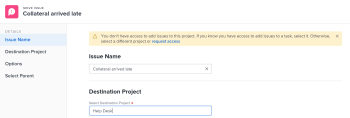

# 移动问题

您可以在以下对象之间移动问题：

* 从项目到其他项目
* 从同一项目或其他项目中的任务到另一个任务
* 从任务到项目或到其他项目
* 从项目到同一项目中的任务或另一个项目中的任务

## 访问要求

您必须具有以下访问权限才能执行本文中的步骤：

<table style="table-layout:auto"> 
 <col> 
 <col> 
 <tbody> 
  <tr> 
   <td role="rowheader">Adobe Workfront计划*</td> 
   <td> 
任意
 </td> 
  </tr> 
  <tr> 
   <td role="rowheader">Adobe Workfront许可证*</td> 
   <td> 
请求或更高版本
 
在项目的“问题”部分中查看或获得更高的许可以移动问题。
 </td> 
  </tr> 
  <tr> 
   <td role="rowheader">访问级别配置*</td> 
   <td> 
编辑对问题的访问权限
 
查看或更高权限访问项目和任务
 
注意：如果您仍然没有访问权限，请咨询Workfront管理员，他们是否在您的访问级别设置了其他限制。 有关访问访问级别中问题的信息，请参阅 <a href="../../../administration-and-setup/add-users/configure-and-grant-access/grant-access-issues.md" class="MCXref xref">授予对问题的访问权限</a>. 有关Workfront管理员如何更改访问级别的信息，请参阅 <a href="../../../administration-and-setup/add-users/configure-and-grant-access/create-modify-access-levels.md" class="MCXref xref">创建或修改自定义访问级别</a>. 
 </td> 
  </tr> 
  <tr> 
   <td role="rowheader">对象权限</td> 
   <td> 
管理问题的权限
 
对要在其中移动问题且能够添加问题的项目拥有权限。
 
 有关授予问题权限的信息，请参阅 <a href="../../../workfront-basics/grant-and-request-access-to-objects/share-an-issue.md" class="MCXref xref">共享问题 </a>
 
有关请求其他权限的信息，请参阅 <a href="../../../workfront-basics/grant-and-request-access-to-objects/request-access.md" class="MCXref xref">请求对对象的访问 </a>.
 </td> 
  </tr> 
 </tbody> 
</table>

*要了解您拥有的计划、许可证类型或访问权限，请联系您的Workfront管理员。

## 有关移动问题的注意事项

在移动包含文档或与请求队列关联的问题时，请考虑以下事项：

* **当问题与请求队列关联时：** 将问题移动到其他对象时，如果问题与请求队列相关联，则移动的问题不再与第一个问题源自的原始队列相关联。
* **将文档附加到问题时：** 当将问题移动到另一个对象并且该问题附加了文档时，该文档、其版本和校样也会移动到新问题。 与文档关联的任何批准都不会移动。
* **将问题链接到文档或文件夹时：** 当您移动包含文档或文件夹的问题时，如果该问题已链接到第三方服务(如Google Drive)，则指向文档的链接会随问题移动。

## 在列表中移动问题

您可以从问题列表或问题报表中移动一个或多个问题。

1. 转到包含要移动的问题的项目。

   或

   转到问题报表。

1. 如果您选择转到项目，请单击 **问题** 中。
1. 选择要移动的问题，然后单击 **“更多”菜单** 在问题列表顶部，单击 **移动到**.

   

1. 继续移动问题，如 [移动单个问题](#move-a-single-issue) 从步骤2开始。

   <!--
   <MadCap:conditionalText data-mc-conditions="QuicksilverOrClassic.Draft mode">
   (NOTE: ensure step stays accurate)
   </MadCap:conditionalText>
   -->

## 移动单个问题 {#move-a-single-issue}

您可以在查看问题时移动一个问题。

### 在预览环境中移动单个问题

1. 转到要复制的问题，单击 **更多** 菜单 在问题名称的右侧，选择 **移动** 。

   

   的 **移动问题** 框中。

   

1. 在 **选择目标项目** 部分，指定要将问题移到的项目名称。 默认情况下，将显示当前项目的名称。

   >[!TIP]
   >
   >列表中仅显示100个项目。

1. （视情况而定）单击 **请求访问** 如果您无权将问题移到项目中，则。
1. （视情况而定）如果您有权向目标项目中的任务之一添加问题，则继续在未请求访问权限的情况下移动选定目标项目上的问题。

   

   >[!TIP]
   >
   >如果选定的项目处于待批准、已完成或已停止状态，则当Workfront管理员阻止向这些项目添加问题时，会显示类似的消息。 有关更多信息，请参阅 [配置系统范围的项目首选项](../../../administration-and-setup/set-up-workfront/configure-system-defaults/set-project-preferences.md).

1. （可选）在 **选项** 部分，取消选择下表中列出的任何项目，以将其从移动的问题中删除。 默认情况下，将选择所有选项。

   >[!IMPORTANT]
   >
   >取消选择“选项”列表中的项目会导致数据丢失。 将删除现有问题中的信息，且无法恢复。

   <table style="table-layout:auto"> 
    <col> 
    <col> 
    <tbody> 
     <tr> 
      <td role="rowheader">全部选择</td> 
      <td>取消选择此选项可在将问题移动到新位置时从问题中删除所有信息。 </td> 
     </tr> 
     <tr> 
      <td role="rowheader">分配</td> 
      <td>删除分配给问题的用户、作业角色或团队。</td> 
     </tr> 
     <tr> 
      <td role="rowheader">进度</td> 
      <td>删除问题的完成百分比（如果有）。 </td> 
     </tr> 
     <tr> 
      <td role="rowheader">
文档
</td> 
      <td> 
删除“文档”选项卡中的所有内容，包括文档版本、链接的文档和文件夹。

   <b>注释</b>

   如果您选择不随问题移动文档，则文档将被删除并放入回收站30天。 管理员可以恢复它们，并在移动的问题中恢复它们。

   如果问题在移动后被删除，则还原的文档将放置在还原这些文档的管理员用户页面的“文档”区域。
     
 </td>
   </tr> 
     <tr> 
      <td role="rowheader">权限</td> 
      <td>删除与其共享问题的实体。 </td> 
     </tr> 
     <tr> 
      <td role="rowheader">更新</td> 
      <td>从问题的“更新”部分删除注释。</td> 
     </tr> 
    </tbody> 
   </table>

1. （可选）在 **选择任务** 部分，选择要移动问题的任务。
1. 单击 **移动问题** 或 **移动问题**，如果您在列表中选择了多个问题。

   已移动的问题将添加到指定的项目。

