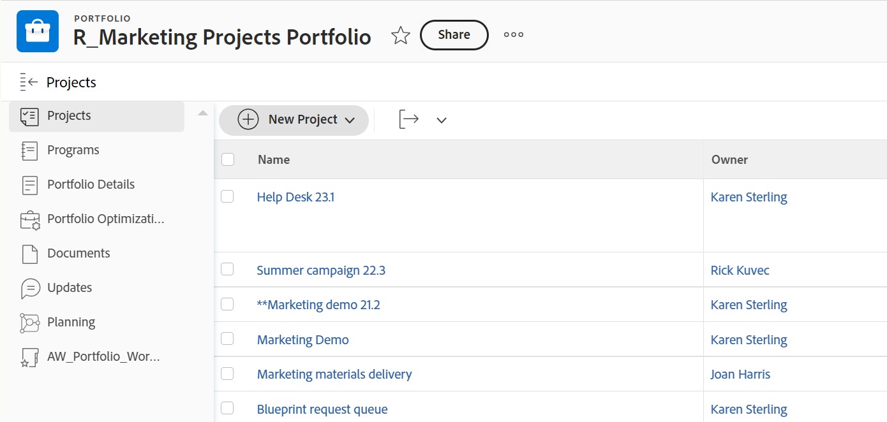

# 将项目添加到项目组合

<!--Audited: 08/2025-->

<!--
The highlighted information on this page refers to functionality not yet generally available. It is available only in the Preview environment for all customers. The same features will also be available in the Production environment for all customers after a week from the Preview release.    

For more information, see [Interface modernization](/help/quicksilver/product-announcements/product-releases/interface-modernization/interface-modernization.md). 
-->

我们建议您在启动项目时将项目添加到项目组合。 但是，您可以在其生命周期内的任何时间将其添加到项目组合。

将项目添加到项目组合时，请考虑以下事项：

* 您只能将一个项目组合与项目关联。
* 项目将保留在项目组合中，直到将其删除或与另一个项目组合关联。
* 项目组合可包含无限数量的项目。

>[!CAUTION]
>
>在大量子对象中使用继承的权限时，可能无法正确应用。
>   
>要帮助避免继承权限问题，我们建议执行以下操作：
>
>* 限制单个父项（项目组合或项目群）下的子对象（项目）的数量。 我们建议每个项目组合或项目群不超过10,000个项目。
>
>* 通过在较低级别对象中应用权限来减少继承深度。
>
>  例如，直接在项目级别应用权限，而不是依赖从项目组合继承到项目群，然后继承到项目的权限。
>
>* 拆分项目以包含较少的项目，从而降低权限复杂性。
>

## 访问权限要求

+++ 展开可查看本文所述功能的访问权限要求。 

<table style="table-layout:auto"> 
 <col> 
 <col> 
 <tbody> 
  <tr> 
   <td role="rowheader">[!DNL Adobe Workfront] 包</td> 
   <td> 
“任一”

   </td> 
  </tr> 
  <tr> 
   <td role="rowheader">[!DNL Adobe Workfront] 许可证</td> 
   <td>
标准
 
   
[！UICONTROL计划] 
 </td> 
  </tr> 
  <tr> 
   <td role="rowheader">访问级别配置</td> 
   <td> 
[！UICONTROL Edit]访问项目组合
 
[！UICONTROL Edit]对项目的访问权限
 </td> 
  </tr> 
  <tr> 
   <td role="rowheader">对象权限</td> 
   <td> 
项目组合的[！UICONTROL Manage]权限
 
[！UICONTROL Manage]项目权限
  </td> 
  </tr> 
 </tbody> 
</table>

*有关信息，请参阅Workfront文档中的[访问要求](/help/quicksilver/administration-and-setup/add-users/access-levels-and-object-permissions/access-level-requirements-in-documentation.md)。

+++

<!--
Old:

<table style="table-layout:auto"> 
 <col> 
 <col> 
 <tbody> 
  <tr> 
   <td role="rowheader">[!DNL Adobe Workfront] plan</td> 
   <td> 
Any

   </td> 
  </tr> 
  <tr> 
   <td role="rowheader">[!DNL Adobe Workfront] license*</td> 
   <td>
New: Standard
 
   
Current: [!UICONTROL Plan] 
 </td> 
  </tr> 
  <tr> 
   <td role="rowheader">Access level</td> 
   <td> 
[!UICONTROL Edit] access Portfolios
 
[!UICONTROL Edit] access to Projects
 </td> 
  </tr> 
  <tr> 
   <td role="rowheader">Object permissions</td> 
   <td> 
[!UICONTROL Manage] permissions to the portfolio
 
[!UICONTROL Manage] permissions to the projects
  </td> 
  </tr> 
 </tbody> 
</table>
-->

## 将项目添加到项目组合

1. 转到项目组合，然后单击左侧面板中的&#x200B;**[!UICONTROL 项目]**。

   

1. 单击&#x200B;**[!UICONTROL 新建项目]**&#x200B;并选择添加项目的方法。

   >[!TIP]
   >
   >在[!UICONTROL 里程碑]视图中查看项目列表时无法添加项目。

   从以下选项中选择：

   <table style="table-layout:auto"> 
    <col> 
    <col> 
    <tbody>

   <tr> 
      <td role="rowheader">[！UICONTROL新建项目]</td> 
      <td> 
添加新项目。 
 
有关创建项目的详细信息，请参阅<a href="../../../manage-work/projects/create-projects/create-project.md" class="MCXref xref">创建项目</a>。 
 </td> 
     </tr> 
     <tr> 
      <td role="rowheader">[！UICONTROL新项目（旧版存储）]</td> 
      <td> 
添加新的Workfront存储项目。 

      
仅当您的组织同时使用Workfront和Adobe云文档存储时，才会显示选项。 您的Workfront实例可能没有这两种类型的存储。

       
有关创建项目的详细信息，请参阅<a href="../../../manage-work/projects/create-projects/create-project.md" class="MCXref xref">创建项目</a>。 
 </td> 
     </tr> 
     <tr> 
      <td role="rowheader">[！UICONTROL New Project from Template]</td> 
      <td> 
使用现有模板添加新项目。 
 
有关从模板创建项目的详细信息，请参阅<a href="../../../manage-work/projects/create-projects/create-project-from-template.md" class="MCXref xref">使用模板创建项目</a>。
 </td> 
     </tr> 
     <tr> 
      <td role="rowheader">[！UICONTROL导入[!DNL MS Project]] </td> 
      <td> 
添加您之前从[!DNL MS Project]导出并在计算机上保存的项目。 
 
有关通过从[!DNL Microsoft Project]导入项目来创建新项目的详细信息，请参阅<a href="../../../manage-work/projects/create-projects/import-project-from-ms-project.md" class="MCXref xref">从[!DNL Microsoft Project]</a>导入项目。
 </td> 
     </tr> 
     <tr> 
      <td role="rowheader">[！UICONTROL请求项目]</td> 
      <td> 
请求批准项目。
 
有关请求项目的信息，请参阅<a href="../../../manage-work/projects/create-projects/request-project.md">请求项目</a>。 
 </td> 
     </tr> 
          <tr> 
      <td role="rowheader">[！UICONTROL现有项目]</td> 
      <td> 
添加已创建的项目。
 </td> 
     </tr>
    </tbody> 
   </table>

   <!-- update screen shot for both kinds of storages??-->

   

1. （视情况而定）如果您选择添加现有项目，将打开&#x200B;**添加项目**&#x200B;框。<!--check this after UI changes-->

    <!--check this after UI changes-->

1. 在&#x200B;**[!UICONTROL 将项目添加到此项目组合]**&#x200B;字段中开始键入项目名称，然后在项目名称出现在列表中时单击它们。 <!--check this after UI changes-->

   您可以添加多个项目。

   >[!NOTE]
   >
   >当您的组织同时使用旧版Workfront和Adobe云存储来存储文档时，将会出现以下情况：
   >
   >
   >* 当您将Adobe云存储项目添加到旧版Workfront存储产品组合，并且该产品组合没有附加任何文档时，该项目组合将转换为Adobe云存储产品组合。
   >* 当您将Adobe云存储项目添加到旧版Workfront存储产品组合，并且该产品组合具有附加文档时，该产品组合文档存储仍保留在Workfront存储上。 但是，从产品组合中删除了旧版Workfront存储图标。
   >* 您不能将旧版Workfront存储项目添加到Adobe云存储产品组合。
   >
   >有关详细信息，请参阅[项目和相关对象的文档管理概述](/help/quicksilver/manage-work/projects/manage-projects/manage-documents-on-projects.md)。
   >
   >并非所有Workfront实例都具有这两种类型的文档存储。

   <!--
    For preview/ prod release: replace all bullets (i think!!) in the Note with this:
    * You cannot add a Legacy storage project to an Adobe cloud storage portfolio, or an Adobe cloud storage project to a Legacy storage portfolio. 
    * You cannot create a project from an Adobe cloud storage template in a Legacy storage portfolio. 
    * You can create a project from a Legacy storage template in an Adobe cloud storage portfolio, but the documents and folders on the template are not added to the new project. The project receives Adobe cloud storage.
    -->

1. （可选）如果您决定不将其添加到项目组合，请单击项目名称右侧的&#x200B;**X**&#x200B;图标以将其从列表中删除。

   <!--replace last step with this, for unshim: 1. (Optional) Click the **Delete** icon  next to the name of a project if you decide not to add it to the portfolio.-->

1. 单击&#x200B;**[!UICONTROL 添加项目]**。<!--check this after UI changes-->

   现在，您选择的一个或多个项目与该项目组合关联。
