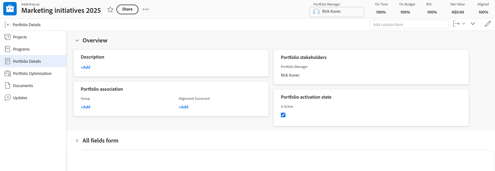

# 编辑项目组合

您可以编辑有关您创建的项目组合的信息，或其他用户已创建的信息（如果他们与您共享了这些信息）。

您可以编辑 [!UICONTROL 作品集] 或者您可以在列表中编辑项目组合。

## 访问要求

您必须具有以下权限才能执行本文中的步骤：

<table style="table-layout:auto"> 
 <col> 
 <col> 
 <tbody> 
  <tr> 
   <td role="rowheader">[!DNL Adobe Workfront] 计划*</td> 
   <td> 
任何
 </td> 
  </tr> 
  <tr> 
   <td role="rowheader">Adobe [!DNL Workfront] 许可证概述*</td> 
   <td> 
[！UICONTROL计划] 
 </td> 
  </tr> 
  <tr> 
   <td role="rowheader">访问级别*</td> 
   <td> 
[！UICONTROL Edit]对Portfolio的访问权限
 
注意：如果您仍然没有访问权限，请咨询 [!DNL Workfront] 管理员（如果他们在您的访问级别设置了其他限制）。 有关访问您访问级别中的项目组合的信息，请参阅 <a href="../../../administration-and-setup/add-users/configure-and-grant-access/grant-access-portfolios.md" class="MCXref xref">授予对项目组合的访问权限</a>. 有关如何 [!DNL Workfront] 管理员可以更改您的访问级别，请参见 <a href="../../../administration-and-setup/add-users/configure-and-grant-access/create-modify-access-levels.md" class="MCXref xref">创建或修改自定义访问级别</a>. 
 </td> 
  </tr> 
  <tr> 
   <td role="rowheader">对象权限</td> 
   <td> 
项目组合的[！UICONTROL Manage]权限
 
 有关向项目组合授予权限的信息，请参阅 <a href="../../../workfront-basics/grant-and-request-access-to-objects/share-a-portfolio.md" class="MCXref xref">共享项目组合 </a>. 
 
有关请求其他权限的信息，请参阅 <a href="../../../workfront-basics/grant-and-request-access-to-objects/request-access.md" class="MCXref xref">请求访问对象 </a>.
 </td> 
  </tr> 
 </tbody> 
</table>

要了解您拥有的计划、许可证类型或访问权限，请联系贵机构的 [!DNL Workfront] 管理员。

## 编辑项目组合

1. 转到 **[!UICONTROL 主菜单]**.
1. 单击 **[!UICONTROL Portfolio]**，然后单击项目组合的名称以将其打开。
1. （可选）要编辑有关项目组合的有限信息，请单击 **[!UICONTROL Portfolio详细信息]** 在左侧面板中。

   

   <!--
   
(NOTE: the note below will also be true for Edit Portfolio box)

   -->

   >[!NOTE]
   >
   >根据贵机构的 [!DNL Workfront] 管理员或组管理员修改了您的布局模板， [!UICONTROL Portfolio详细信息] 区域可能会重新排列或无法显示。 有关信息，请参阅 [自定义 [!UICONTROL 详细信息] 使用布局模板查看](../../../administration-and-setup/customize-workfront/use-layout-templates/customize-details-view-layout-template.md).

   要编辑中的信息 [!UICONTROL 详细信息] 部分，执行以下操作：

   1. （可选）单击 **[!UICONTROL 全部折叠]** 图标来折叠所有区域。
   1. （可选且视情况而定）折叠区域后，单击 **右指箭头**  ，展开要编辑的区域。
   1. 有关 [!UICONTROL Portfolio详细信息] 部分，继续编辑中的项目组合 [!UICONTROL 编辑Portfolio] 框如下所示。
   1. （可选）如果项目组合未附加自定义表单，请在 **[!UICONTROL 添加自定义表单]** 字段中，将其在列表中显示时选中，然后单击 **[!UICONTROL 保存更改]**.
   1. （可选）单击 **[!UICONTROL 导出]** 图标  导出 [!UICONTROL 概述] 和自定义表单信息添加到PDF文件，然后单击 **[!UICONTROL 导出]**. 从以下项中选择：

      * 选择全部（仅在至少附加一个自定义表单时显示）
      * 概述
      * 一个或多个自定义表单的名称

      PDF文件将下载到您的计算机。

      

      有关更多信息，请参阅 [导出自定义表单和对象详细信息](../../../workfront-basics/work-with-custom-forms/export-custom-forms-details.md).

1. 要编辑有关一个或多个项目组合的所有信息，请执行下列操作之一：

   <!--
   
(NOTE: this might have to be split in two sections if the single edit and the bulk edit won't come at the same time for portfolios)

   -->

   * 单击 **[!UICONTROL 更多]** 项目组合名称旁边的菜单，然后 **[!UICONTROL 编辑].**

     <!--   
     
(NOTE: this will change in NWE with a new Edit Portfolio UI)
   
     -->

   * 转到项目组合列表，并选择要编辑的一个或多个项目组合，然后单击 **[!UICONTROL 编辑]** 图标  位于列表顶部。

     <!--   
     
(NOTE: this will need to split into another section when they release the new [!UICONTROL Edit Portfolio] UI)
   
     -->
   此 **[!UICONTROL 编辑Portfolio]** 对话框随即显示。

   

   所有项目组合字段均可在 [!UICONTROL 编辑Portfolio] 框和按左侧面板中列出的区域分组。

1. 请考虑在以下任意部分中指定信息：

   * [[!UICONTROL 概述]](#overview)
   * [自定义表单](#Custom%C2%A0F)
   * [评论](#comment)

### [!UICONTROL 概述] {#overview}

1. 按如上所述开始编辑项目组合。
1. 单击 **[!UICONTROL 概述]** 并指定以下字段：

   <!--
   
(NOTE: note below is drafted: drafted till they release new Edit Portfolio boxes)

   -->

   <!--
   <note type="note">
   Depending on how your Workfront administrator or Group administrator sets up our Layout Template, the fields in the Edit Portfolio box might be rearranged or not display. For information, see
   <a href="../../../administration-and-setup/customize-workfront/use-layout-templates/customize-details-view-layout-template.md" class="MCXref xref">Customize the Details view using a layout template</a>.
   </note>
   -->

   <table style="table-layout:auto"> 
    <col> 
    <col> 
    <tbody> 
     <tr> 
      <td role="rowheader">[！UICONTROL名称]</td> 
      <td> 
更新项目组合的名称。 
 
提示：当您选择多个项目组合时，此项不可用。 
 </td> 
     </tr> 
     <tr> 
      <td role="rowheader">[！UICONTROL描述]</td> 
      <td> 
键入Portfolio的描述以指示其独特之处。 
 </td> 
     </tr> 
     <tr> 
      <td role="rowheader">[！UICONTROLPortfolio管理器]</td> 
      <td> 
开始键入要指定为项目组合经理的用户名称，然后当该用户出现在列表中时将其选定。 这与[！UICONTROLPortfolio所有者]相同。 他可以监督项目组合中定义的工作并批准业务案例。
 
重要信息：指定某个人作为Portfolio管理员时，该人员会自动获得项目组合、项目群和项目群中的[！UICONTROL管理]权限。 
 
提示：您可以在项目组合标题中快速更新项目组合管理器。 
 </td> 
     </tr> 
     <tr> 
      <td role="rowheader">[！UICONTROL组]</td> 
      <td> 
添加单个组的名称（如果该组与项目组合相关联或负责完成它）。 
 
提示：  
从[！UICONTROLPortfolio详细信息]页面访问[！UICONTROL组]字段时，请执行以下操作： 
 
您可以确保选择正确的组，方法是将鼠标悬停在该组上并单击[！UICONTROL信息]图标  显示在它旁边。 这将显示一个工具提示，其中列出了有关组的信息，例如组及其上各组的层次结构。
 
  
 
此选项在[！UICONTROL编辑Portfolio]框中不可用。 
 
 </td> 
     </tr> 
     <tr> 
      <td role="rowheader"> 
[！UICONTROL对齐记分卡]
 </td> 
      <td> 
从下拉列表中选择要使用的对齐计分卡。 记分卡用于衡量项目与Portfolio既定标准的符合程度，通常反映组织的使命、价值和战略目标。 有关更多信息，请参阅 <a href="../../../manage-work/projects/define-a-business-case/apply-scorecard-to-project-to-generate-alignment-score.md" class="MCXref xref">将记分卡应用于项目并生成一致性分数</a> 和 <a href="../../../administration-and-setup/set-up-workfront/configure-system-defaults/create-scorecard.md" class="MCXref xref">创建记分卡</a>.
 </td> 
     </tr> 
     <tr> 
      <td role="rowheader">[！UICONTROL处于活动状态]</td> 
      <td> 
 如果要使项目组合处于活动状态，请选中此复选框。 其他用户可以在创建或编辑项目时找到活动项目组合并将它们附加到项目。 无法将非活动项目组合附加到项目。 默认情况下启用此功能。
 </td> 
     </tr> 
    </tbody> 
   </table>

1. 单击 **[!UICONTROL 保存更改]** 或继续编辑以下部分。

### 自定义表单

1. 按如上所述开始编辑项目组合。
1. 单击 **[!UICONTROL 添加Forms]** 下拉菜单，可选择自定义表单并将其添加到项目组合。

   必须先创建项目组合自定义表单，然后才能添加这些表单。

   >[!NOTE]
   >
   >根据贵机构的 [!DNL Workfront] 管理员为您的自定义表单中的分区设置权限，并非每个人都可以查看或编辑给定自定义表单上的相同字段。 在自定义表单的部分中编辑字段的权限取决于您对项目组合本身的权限。 有关设置自定义表单各部分的权限的信息，请参阅 [创建或编辑自定义表单](../../../administration-and-setup/customize-workfront/create-manage-custom-forms/create-or-edit-a-custom-form.md).

1. 更新自定义表单中的任何字段，然后单击 **[!UICONTROL 保存更改]** 或者继续下面的部分。

### 评论 {#comment}

1. 按如上所述开始编辑项目组合。
1. 单击 **[!UICONTROL 注释]**.

   

1. 在中添加评论 **[!UICONTROL 将更新发布到项目组合]** 字段。
1. （可选）单击 **[!UICONTROL 人员]** 图标以将用户或团队添加到评论。
1. （可选）单击 **[!UICONTROL 锁定]** 图标来锁定评论，并使其仅对公司中的用户为私有。
1. 单击 **[!UICONTROL 保存更改]**.
