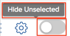

# [!UICONTROL Portfolio优化器] 概述

此 [!UICONTROL Portfolio优化器] 是用于项目评估和比较的工具。 审查和比较的过程 [!UICONTROL 商业论证] 分配给项目组合的项目值是项目组合经理确定项目优先顺序并为组织生成最大价值的方式。

目的 [!UICONTROL 项目组合优化器] 是提供一个界面，资产组合经理，指导委员会或产品管理办公室可以通过此界面查看有关每个项目的业务案例的摘要信息。 然后，可根据战略价值和目标，或根据其总体得分，确定项目的优先次序。

此 [!UICONTROL Portfolio优化器] 只有在您已满足以下前提条件时，才能协助您：

* 此 [!UICONTROL 商业案例] 项目已完成。 有关信息，请参阅中的文章 [定义业务案例：文章索引](../../projects/define-a-business-case/define-business-case.md).
* 在要审阅的项目的“项目详细信息”部分的“项目概述”区域中定义项目组合。
* 您已为要审阅的项目指明了项目预算和计划收益。 固定成本和固定收入是可选的，但可增加其他值。 有关信息，请参阅 [项目财务字段](../../projects/project-finances/project-finances-overview-1.md).

有关查找 [!UICONTROL Portfolio优化器]，请参见 [找到 [!UICONTROL Portfolio优化器]](../../../manage-work/portfolios/portfolio-optimizer/locate-portfolio-optimizer.md).

## 财务状况 [!UICONTROL Portfolio优化器]

* [本行财务领域 [!UICONTROL Portfolio优化器]](#the-financial-areas-in-the-portfolio-optimizer)
* [中的财务字段 [!UICONTROL Portfolio优化器]](#the-financial-fields-in-the-portfolio-optimizer)

在使用时，您可以在项目周期内的任何时候查看项目组合的财务状态 [!UICONTROL Portfolio优化器].

在中处理财务时，请考虑以下事项 [!UICONTROL Portfolio优化器]：

* 当项目满足以下条件时，每个项目都会获得一个分数 [!UICONTROL 商业案例] 根据它们在 [!UICONTROL Portfolio优化器]. 例如，低成本或高一致性项目会获得较高的得分。

  有关计算项目的项目组合优化器分数的更多信息，请参阅文章 [概述 [!UICONTROL Portfolio优化器] 分数](../../../manage-work/portfolios/portfolio-optimizer/portfolio-optimizer-score.md).

* 下列各项的财务计算 [!UICONTROL Portfolio优化器] 使用 [!UICONTROL 预算成本] 在 [!UICONTROL 商业论证] 项目的URL。
* 您可以在以下位置手动设置项目的优先级： [!UICONTROL Portfolio优化器]，并考虑关于他们的所有信息。 这包括财务数据、与记分卡的一致性，例如ROI。

### 本行财务领域 [!UICONTROL Portfolio优化器] {#the-financial-areas-in-the-portfolio-optimizer}

您可以在以下区域查看财务信息： [!UICONTROL Portfolio优化器]：

* **[!UICONTROL Portfolio标题]**：此区域显示从项目组合中的所有项目收集的财务信息。 它显示在Portfolio对象的每个选项卡上。
* **[!UICONTROL Portfolio选定项目的财务状况]**：此区域显示从以下所选项目中收集的财务信息： [!UICONTROL Portfolio优化器]. 您可以通过查看此区域中的信息，添加或删除项目并了解这将如何影响项目组合的财务。
* **[!UICONTROL 项目财务]**：此区域显示中列出的每个项目的财务信息 [!UICONTROL Portfolio优化器].

### 中的财务字段 [!UICONTROL Portfolio优化器] {#the-financial-fields-in-the-portfolio-optimizer}

以下财务字段显示在 [!UICONTROL Portfolio优化器]：

* [Portfolio标题](#portfolio-header)
* [Portfolio选定项目的财务](#portfolio-finances-for-selected-projects)

#### Portfolio标题 {#portfolio-header}

[!DNL Adobe Workfront] 使用来自项目的信息（其状态仅等同于）计算项目组合标题中的财务字段 [!UICONTROL 已批准] 或 [!UICONTROL 当前].

<table style="table-layout:auto"> 
 <col> 
 <col> 
 <thead> 
  <tr> 
   <th><strong>字段名称</strong> </th> 
   <th><strong>描述</strong> </th> 
  </tr> 
 </thead> 
 <tbody> 
  <tr> 
   <td>[！UICONTROL On Time]</td> 
   <td> 
项目组合中被认为是[！UICONTROL按时]的项目所占的百分比。 这可以从Portfolio内的任何选项卡中看到。
 
当项目出现时，会将该项目视为[！UICONTROL准时] <strong>[！UICONTROL条件]</strong> 是 <strong>[！UICONTROL On Target]</strong>.  有关[！UICONTROL项目完成情况的更多信息，请参阅文章 <a href="../../../manage-work/projects/manage-projects/project-condition-and-condition-type.md" class="MCXref xref">项目完成情况和完成情况类型概览</a>.
 
此 <strong>[！UICONTROL On Time]</strong> 百分比使用以下公式计算：
 
<em>[！UICONTROL On TimePortfolio百分比] = [！UICONTROL On Time]项目数/处于[！UICONTROL Current]或[！UICONTROL Approved]状态的项目总数</em> 
 </td> 
  </tr> 
  <tr> 
   <td>[！UICONTROL On Budget]</td> 
   <td> 
项目组合中被认为是[！UICONTROL按预算]的项目的百分比。 这可以从[！UICONTROLPortfolio]内的任何选项卡中看到。
 
项目是 <strong>[！UICONTROL On Budget]</strong> 当他们未超出其预定义预算时。  有关项目预算的更多信息，请参阅文章 <a href="../../../manage-work/projects/project-finances/manage-project-finance-area.md" class="MCXref xref">项目财务区域中的[！UICONTROL Manage]信息</a>.
 
使用以下公式计算[！UICONTROL On Budget]百分比：
 
<em>[！UICONTROL On BudgetPortfolio百分比] =预算上的[！UICONTROL]项目数/项目总数 </em><em>处于[！UICONTROL Current]或[！UICONTROL Approved]状态</em> 
 </td> 
  </tr> 
  <tr> 
   <td>ROI（针对项目组合）</td> 
   <td> 
项目组合的[！UICONTROL投资回报率] (ROI)的计算方法是：考虑[！UICONTROLPortfolio]的[！UICONTROL收益]合计和项目的[！UICONTROL预算成本]合计。 这可以从Portfolio内的任何选项卡中看到。
 
使用以下公式计算PortfolioROI值：
 
<em>PortfolioROI = （[！UICONTROL总收益] - [！UICONTROL总预算成本]）/ [！UICONTROL总成本] * 100</em> 
 
有关如何计算项目投资回报率的更多信息，请参阅文章 <a href="../../../manage-work/projects/project-finances/calculate-roi.md" class="MCXref xref">计算投资回报率(ROI)</a> .
 </td> 
  </tr> 
  <tr> 
   <td>[！UICONTROL Aligned]或[！UICONTROL Alignment Score] </td> 
   <td> 
在项目的[！UICONTROL Business Case]中完成[！UICONTROL记分卡]后计算的所有[！UICONTROL项目对齐分数]值的平均值。 每个项目的对齐方式得分都列在[！UICONTROLPortfolio优化器]的[！UICONTROL对齐]列中。 这可以从项目组合内的任何选项卡中看到。
 
有关为项目生成对齐分数的更多信息，请参阅文章 <a href="../../../manage-work/projects/define-a-business-case/apply-scorecard-to-project-to-generate-alignment-score.md" class="MCXref xref">将记分卡应用于项目并生成一致性分数</a>.
 </td> 
  </tr> 
  <tr> 
   <td>[！UICONTROL净值]</td> 
   <td> 
项目组合中所有项目的所有[！UICONTROL净值]的总和。 这可以从项目组合内的任何选项卡中看到。
 
有关如何为项目计算[！UICONTROL净值]的更多信息，请参阅文章 <a href="../../../manage-work/projects/project-finances/calculate-net-value.md" class="MCXref xref">计算净值</a>.
 </td> 
  </tr> 
 </tbody> 
</table>

#### Portfolio选定项目的财务 {#portfolio-finances-for-selected-projects}

<table style="table-layout:auto"> 
 <col> 
 <col> 
 <thead> 
  <tr> 
   <th><strong>字段名称</strong> </th> 
   <th> 
<strong>描述</strong> 
 
 
 </th> 
  </tr> 
 </thead> 
 <tbody> 
  <tr> 
   <td>[！UICONTROL项目数]</td> 
   <td> 
项目组合中的活动项目总数。 项目组合中被视为活动的项目可以处于以下任意状态：
 
    <ul> 
     <li>[！UICONTROL当前版本]</li> 
     <li>[！UICONTROL规划]</li> 
     <li>[！UICONTROL已批准]</li> 
    </ul> </td> 
  </tr> 
  <tr> 
   <td>[！UICONTROL预算]</td> 
   <td>您可以手动更新此字段以指示整个项目组合的总预算。 此预算用于项目组合内的所有项目。 </td> 
  </tr> 
  <tr> 
   <td>[！UICONTROL剩余]</td> 
   <td> 
项目组合内所有项目的所有[！UICONTROL预算成本]之后的剩余预算已从项目组合预算中减去。
 
使用以下公式计算[！UICONTROL剩余Portfolio预算]：
 
<em>[！UICONTROL剩余Portfolio预算] = [！UICONTROL总Portfolio预算] — 所有Portfolio项目的总[！UICONTROL预算成本]</em> 
 
项目组合中所有项目的总预算成本[！UICONTROL]显示在预算字段下的指标栏中。 
 
有关跟踪项目成本的更多信息，请参阅文章<a href="../../../manage-work/projects/project-finances/track-costs.md" class="MCXref xref">跟踪成本</a>.
 </td> 
  </tr> 
  <tr> 
   <td>[！UICONTROL总成本]</td> 
   <td> 
在[！UICONTROLPortfolio优化器]中显示的所有项目的成本总和。 每个项目的成本与项目的[！UICONTROL预算成本]相同，因为它显示在[！UICONTROL业务案例摘要]中。 
 
有关[！UICONTROL业务案例中项目财务字段的更多信息，请参阅文章中的“了解业务案例中的财务字段”部分 <a href="../../../manage-work/projects/define-a-business-case/create-business-case.md" class="MCXref xref">为项目创建业务案例 </a>.
 </td> 
  </tr> 
  <tr> 
   <td>[！UICONTROL风险] </td> 
   <td> 
项目组合中所有项目的所有[！UICONTROL潜在风险成本]的总和。 每个项目的[！UICONTROL潜在风险成本]在[！UICONTROLPortfolio优化器]的[！UICONTROL风险]列中列出。 
 
有关计算项目风险的更多信息，请参阅文章 <a href="../../../manage-work/projects/project-finances/potential-risk-cost.md" class="MCXref xref">计算潜在风险成本 </a>.
 </td> 
  </tr> 
  <tr> 
   <td>[！UICONTROL优点]</td> 
   <td> 
项目组合中所有项目的所有[！UICONTROL计划收益]值的总和。 每个项目的计划权益值都列在[！UICONTROLPortfolio优化器]的[！UICONTROL权益]列中。 
 
有关项目的[！UICONTROL计划收益]的详细信息，请参阅文章 <a href="../../../manage-work/projects/project-finances/project-planned-benefit.md" class="MCXref xref">项目计划收益概述</a>.
 </td> 
  </tr> 
  <tr> 
   <td>[！UICONTROL净值风险]指示器</td> 
   <td> 
在考虑到项目组合中所有项目提供的[！UICONTROL净值]的情况下测量[！UICONTROL潜在风险]值。 为了在产品组合内实现最高效率，您需要看到[！UICONTROL风险]指示器低而[！UICONTROL净值]指示器高。 
 
有关计算[！UICONTROL净值的风险的更多信息，请参阅文章 <a href="../../../manage-work/portfolios/portfolio-optimizer/calculate-risk-to-net-value-in-portfolio.md" class="MCXref xref">计算投资组合中净值的风险</a>.
 </td> 
  </tr> 
 </tbody> 
</table>

## 自定义 [!UICONTROL Portfolio优化器]

您只能自定义的项目列表区域 [!UICONTROL Portfolio优化器] 使用设置更改列表中的信息。

以下图标和选项可用于 [!UICONTROL Portfolio优化器]：

<table style="table-layout:auto"> 
 <col> 
 <col> 
 <col> 
 <tbody> 
  <tr> 
   <td>Portfolio优化器中的图标</td> 
   <td>名称</td> 
   <td>功能</td> 
  </tr> 
  <tr> 
   <td>  </td> 
   <td>[！UICONTROL设置项目优先级]</td> 
   <td>当您要根据项目顺序的优先级保存项目顺序时，使用此图标。 </td> 
  </tr> 
  <tr> 
   <td>  </td> 
   <td>[！UICONTROL优化项目组合]</td> 
   <td>使用此图标可根据项目的以下财务值优化项目组合：
    <ul>
     <li>[！UICONTROL成本]</li>
     <li>[！UICONTROL对齐方式]</li>
     <li>[！UICONTROL值]</li>
     <li>[！UICONTROL收益风险]</li>
     <li>[！UICONTROL ROI]</li>
    </ul>
有关优化产品组合的更多信息，请参阅文章 <a href="../../../manage-work/portfolios/portfolio-optimizer/optimize-projects-in-portfolio-optimizer.md" class="MCXref xref">在[！UICONTROLPortfolio优化器]中优化项目 </a>.
</td> 
  </tr> 
  <tr> 
   <td>  </td> 
   <td>[！UICONTROL撤消]/[！UICONTROL重做]图标</td> 
   <td>使用这些图标可在保存之前取消或重做您对[！UICONTROLPortfolio优化器]所做的更改。</td> 
  </tr> 
  <tr> 
   <td>  </td> 
   <td>[！UICONTROL Show]/ [！UICONTROL隐藏未勾选的项目</td> 
   <td>使用这些图标可显示或隐藏项目组合中您未勾选的项目。</td> 
  </tr> 
  <tr> 
   <td>  </td> 
   <td>[！UICONTROL Export] </td> 
   <td> 
使用此图标可导出[！UICONTROLPortfolio优化器]的[！UICONTROL项目优先级]区域中的数据。 可将其导出为以下格式：
 
    <ul> 
     <li>PDF</li> 
     <li>[!DNL Excel]</li> 
     <li>[！UICONTROL选项卡]已分隔</li> 
    </ul> </td> 
  </tr> 
  <tr> 
   <td>  </td> 
   <td>[！UICONTROL首选项]</td> 
   <td> 
使用此图标可修改[！UICONTROLPortfolio优化器]的列中显示的项目字段，或根据其状态修改您在[！UICONTROL优化器]中显示的项目。 
 
提示：  
     <ul> 
      <li> 
并非全部 [!DNL Workfront] 标准字段可在列中添加。 
 </li> 
     </ul> 
     <ul> 
      <li> 
您只能在项目组合中的任何项目中添加具有零以外的值的自定义字段。
 </li> 
     </ul> 
 </td> 
  </tr> 
 </tbody> 
</table>
