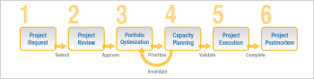

# Portfolio管理概述

## 项目Portfolio管理(PPM)概述

Portfolio或项目Portfolio管理(PPM)是对项目列表进行优先级排序和管理以实现特定业务目标的过程。 因此，项目组合是具有共同业务目标的项目集合。 有效的PPM方法的结果使管理人员能够：

* 识别组合中的所有项目。
* 了解每个项目对资源、成本和收入的影响。
* 当客户对项目组合中的项目进行优先级排序、选择或删除时，做出明智的战略决策。

通常，PPM从业人员会采用以下步骤来执行PPM:

1. 为项目选择和优先级设置评估标准。
1. 收集项目请求。
1. 根据创建的条件选择多个请求的项目作为项目组合项目。
1. 使用相同的标准优先处理选定的项目。
1. 评估执行选定项目的资源可用性。
1. 审查和评估项目组合中的项目进度，并在必要时作出调整。

## 概述 [!DNL Adobe Workfront] PPM工艺

您可以使用Portfolio管理工具，对项目进行优先排序，并确保这些项目符合您的业务目标和要求 [!DNL Workfront].

下图说明了 [!DNL Workfront]:

* [项目请求](#project-request)
* [项目审阅](#project-review)
* [项目组合的最优化](#portfolio-optimization)
* [资源规划](#resource-planning)
* [项目执行](#project-execution)
* [Project Postmortem](#project-postmortem)

### 项目请求 {#project-request}

项目Portfolio管理从项目请求开始。 在此阶段，项目所有者会创建一个项目请求，并将其提交给执行委员会或Portfolio经理进行审核。 这是他们完成项目业务案例并提交审批的时间。

有关创建业务案例和项目请求的详细信息，请参阅 [为项目创建业务案例](../../../manage-work/projects/define-a-business-case/create-business-case.md).

### 项目审阅 {#project-review}

在您提交项目请求后，Portfolio经理或执行团队会对其进行审核，并决定是否批准项目请求。 如果获得批准，则将为公司项目Portfolio选择它们。

有关组合的更多信息，请参阅 [Portfolio概述 [!DNL Adobe Workfront]](../../../manage-work/portfolios/portfolios-overview/portfolio-overview.md)有关批准业务案例的详细信息，请参阅 [批准业务案例](../../../manage-work/projects/define-a-business-case/approve-business-case.md).

### 项目组合的最优化 {#portfolio-optimization}

在将所有项目添加到项目组合后，Portfolio经理会根据项目的价值、一致性和对组织的好处来优化项目并对其进行优先级设置。

有关组合优化的更多信息，请参阅 [在Portfolio优化器中优化项目](../../../manage-work/portfolios/portfolio-optimizer/optimize-projects-in-portfolio-optimizer.md).

### 资源规划 {#resource-planning}

除了优化项目组合的绩效和对项目进行优先排序外，资源经理还确保为项目分配适当的资源。 他们使用 [!DNL Workfront].

根据资源的可用性，Portfolio管理器可能需要重新排定项目的优先级。

有关资源管理的详细信息，请参阅 [管理资源](../../../resource-mgmt/manage-resources.md) 中。

### 项目执行 {#project-execution}

在从Portfolio管理器收到项目批准并从资源管理器（作为项目责任人）验证资源后，您可以将项目置于 [!UICONTROL 当前] 用户可以开始工作以完成项目。 建议在此阶段捕获项目的基线，以在项目的原始状态中为项目提供一个参考点。

有关在 [!DNL Workfront]，请参阅 [管理项目](../../../manage-work/projects/manage-projects/manage-projects-overview.md).\
有关在项目上创建基线的更多信息，请参阅 [创建项目基线](../../../manage-work/projects/create-projects/create-baselines.md).

### Project Postmortem {#project-postmortem}

项目组合中的项目完成后，您可以通过创建基线并将其与原始基线进行比较来检查每个项目是否成功。

有关在项目上创建基线的更多信息，请参阅 [创建项目基线](../../../manage-work/projects/create-projects/create-baselines.md).
