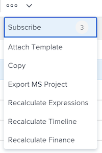
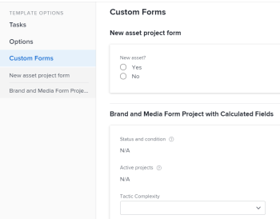

# 将模板附加到项目

<!-- Audited: 10/2025 -->

您可以在项目的初始创建阶段或创建项目后，将模板附加到项目。

有关使用模板创建项目的详细信息，请参阅[使用模板创建项目](../../../manage-work/projects/create-projects/create-project-from-template.md)。

## 访问要求

+++ 展开以查看本文中各项功能的访问要求。

<table style="table-layout:auto"> 
 <col> 
 <col> 
 <tbody> 
  <tr> 
   <td role="rowheader">Adobe Workfront包</td> 
   <td> 
任何
 </td> 
  </tr> 
  <tr> 
   <td role="rowheader">Adobe Workfront许可证</td> 
   <td> 
标准

    
规划

    
 </td> 
  </tr> 
  <tr> 
   <td role="rowheader">访问级别配置</td> 
   <td> 
编辑对项目的访问权限 
 
查看对模板的访问权限
</td> 
  </tr> 
  <tr> 
   <td role="rowheader">对象权限</td> 
   <td> 
管理项目的权限
 
查看模板的权限或更高版本
 </td> 
  </tr> 
 </tbody> 
</table>

有关此表中信息的更多详细信息，请参阅Workfront文档中的[访问要求](/help/quicksilver/administration-and-setup/add-users/access-levels-and-object-permissions/access-level-requirements-in-documentation.md)。

+++

<!--Old:
 
 <table style="table-layout:auto"> 
 <col> 
 <col> 
 <tbody> 
  <tr> 
   <td role="rowheader">Adobe Workfront plan</td> 
   <td> 
Any 
 </td> 
  </tr> 
  <tr> 
   <td role="rowheader">Adobe Workfront license</td> 
   <td> 
New: Standard

   
Or

   
Current: Plan

    
 </td> 
  </tr> 
  <tr> 
   <td role="rowheader">Access level configurations</td> 
   <td> 
Edit access to Projects 
 
For information about project access, see <a href="../../../administration-and-setup/add-users/configure-and-grant-access/grant-access-projects.md" class="MCXref xref">Grant access to projects</a>.
 
View access to&nbsp;Templates
 
For information about template permissions, see <a href="../../../workfront-basics/grant-and-request-access-to-objects/share-a-template.md" class="MCXref xref">Share a template</a>. 
 
For information about template access, see <a href="../../../administration-and-setup/add-users/configure-and-grant-access/grant-access-templates.md" class="MCXref xref">Grant access to templates</a>.
 
Note: If you still don't have access, ask your Workfront administrator if they set additional restrictions in your access level. For information on how a Workfront administrator can modify your access level, see <a href="../../../administration-and-setup/add-users/configure-and-grant-access/create-modify-access-levels.md" class="MCXref xref">Create and modify custom access levels</a>.
 </td> 
  </tr> 
  <tr> 
   <td role="rowheader">Object permissions</td> 
   <td> 
Manage permissions to the project
 
For information about project permissions, see <a href="../../../workfront-basics/grant-and-request-access-to-objects/share-a-project.md" class="MCXref xref">Share a project in Adobe Workfront</a>. 
 
View permissions or higher to the template
 
For information on requesting additional access, see <a href="../../../workfront-basics/grant-and-request-access-to-objects/request-access.md" class="MCXref xref">Request access to objects </a>.
 </td> 
  </tr> 
 </tbody> 
</table>-->

<!--

<h2>Considerations when adding templates to projects</h2>

(NOTE: moved this to an Overview article of its own) 

Consider the following when adding templates to projects:

<ul>
<li> 
You can attach only active templates to projects. 
 </li>
<li> 
You can attach a template to a project when the project is in a status of Complete, Dead, or in Pending Approval, only when your Adobe Workfront administrator or a group administrator has enabled this functionality in the Project&nbsp;Preferences area. For information about setting project preferences, see <a href="../../../administration-and-setup/set-up-workfront/configure-system-defaults/set-project-preferences.md" class="MCXref xref">Configure system-wide project preferences</a>. 
 </li>
<li> 
Unless you exclude specific template tasks from being added in the attachment process, all template tasks are added to the existing project. 
 </li>
<li> 
Most template settings are added to the project. 
 </li>
<li> 
Some settings from the template automatically transfer to the project, unless you specifically mark them to be excluded. 

Example: </b>">
<b>Example: </b>

For example, these settings are added to the project:

<ul>
<li>Start&nbsp;From field</li>
<li>Custom forms and the information on them</li>
<li>Queue Details </li>
<li>Financial settings </li>
</ul>

 </li>
</ul>

-->

## 将模板附加到现有项目 {#attach-a-template-to-an-existing-project}

您可以从项目页面、项目列表或报表将模板附加到项目。

{{step1-to-projects}}

1. 在&#x200B;**项目**&#x200B;页面上，选择要将模板附加到的项目。

1. 单击项目名称右侧的&#x200B;**更多**&#x200B;图标下拉列表。

   

   或

   转到项目列表或报告并选择项目，然后单击列表顶部的&#x200B;**更多**&#x200B;图标下拉列表。

   

1. 单击&#x200B;**附加模板**。 将显示&#x200B;**附加模板**&#x200B;框。

1. 开始在&#x200B;**搜索模板**&#x200B;字段中键入要附加的模板的名称，然后在模板显示在列表中时单击该名称。

   或

   单击&#x200B;**其他模板**&#x200B;区域中的模板名称。

   右边显示的模板预览包含有关模板的以下信息：

   * 持续时间
   * 所有者
   * 顶级任务数（包括前3个顶级任务的列表）
   * 任务总数
   * 附加的自定义表单的名称

   

1. （可选）单击模板名称右侧的&#x200B;**收藏夹**&#x200B;图标以将其标记为收藏并将其移至&#x200B;**收藏夹**&#x200B;列表。

1. （可选）再次单击&#x200B;**收藏夹**&#x200B;图标以将其从&#x200B;**收藏夹**&#x200B;列表中删除。
1. 单击&#x200B;**自定义并附加**。 将打开&#x200B;**附加模板**&#x200B;侧面板。

1. （可选）更新以下部分中的信息：

   <table style="table-layout:auto"> 
    <col> 
    <col> 
    <tbody> 
     <tr> 
      <td role="rowheader" colspan="2"> 
“任务”部分
 
  
 </td> 
     </tr> 
     <tr> 
      <td role="rowheader">以下选定的模板任务已导入到项目。 取消选择要排除的项目。 </td> 
      <td>在将模板附加到项目之前，取消选择要从模板中排除的任何任务。</td> 
     </tr> 
     <tr> 
      <td role="rowheader">选择要作为此模板中任务的前置任务的项目任务。</td> 
      <td> 
单击该字段以显示项目任务列表，然后选择在模板任务开始之前必须完成的任务。 或者，您可以跳过此步骤，并在附加模板后在项目中设置关系。 
 
 选择<strong>依赖项类型</strong>、<strong>滞后时间</strong>信息，如果您希望通过选中<strong>强制执行前置任务</strong>复选框来强制执行前置任务，请选中该复选框。 
 </td> 
     </tr> 
     <tr> 
      <td role="rowheader">选择要作为此模板中任务的父级的项目任务。</td> 
      <td> 选择要指定为所有模板任务的父级任务的项目任务。 如果不进行选择，则所有模板任务都会显示在当前项目任务的末尾。 您可以跳过此步骤，并在附加模板后在项目中移动任务。</td> 
     </tr> 
     <tr> 
      <td role="rowheader" colspan="2"> 
“选项”部分
 
  
 </td> 
     </tr> 
     <tr> 
      <td role="rowheader">以下选定的项目已转移到项目。 取消选择要排除的项目。</td> 
      <td> 
在将模板附加到项目之前，取消选中要从模板中排除的任何信息的复选框。 有关每个字段的更多信息，请参阅<a href="../../../manage-work/projects/create-and-manage-templates/attach-template-to-project-overview.md" class="MCXref xref">将模板附加到项目的概述</a>。 
 
重要提示：如果选中<strong>队列属性和问题设置</strong>框，则模板的队列详细信息将覆盖项目的队列详细信息。 在这种情况下，模板的“路由规则”、“队列主题”和“主题组”将添加到项目的路由规则、队列主题和主题组。  如果项目设置为请求队列，而您附加到项目的模板未设置为请求队列，则如果您选中<strong>队列属性和问题设置</strong>框，项目的队列信息将被删除。  如果取消选择<strong>队列属性和问题设置</strong>框，则会保留项目的所有队列设置设置，并且不会附加模板中的队列设置设置。 
 </td> 
     </tr> 
     <tr> 
      <td role="rowheader" colspan="2"> 
自定义Forms部分
 
  
 </td> 
     </tr> 
     <tr> 
      <td role="rowheader">自定义Forms</td> 
      <td> 
将自定义表单附加到模板时，其名称会显示在左侧面板中。 
 </td> 
     </tr> 
    </tbody> 
   </table>

1. （可选）更新自定义表单中的信息。 此信息将传输到项目。

   >[!TIP]
   >
   >* 当模板上的自定义表单包含空必填字段时，此步骤是必需的。
   >* 如果模板自定义表单中的字段在项目上已存在并包含信息，则它们将保留已在项目上的信息。 在附加模板时无法编辑它们。

1. 单击&#x200B;**附加模板。**
1. 单击&#x200B;**取消附件**&#x200B;以停止附加模板。

   或

   允许附件完成以将模板添加到项目。

   附加模板后，您可以编辑项目并根据需要调整任何任务、信息或设置。

1. （可选）在左侧面板中，单击&#x200B;**项目详细信息**，然后单击&#x200B;**概述**，以查看附加在&#x200B;**项目关系**&#x200B;区域中的模板的名称。

   >[!TIP]
   >
   >如果将多个模板附加到项目，则只有您首先附加的模板才会显示在此字段中。 有关信息，请参阅本文中的[将多个模板附加到现有项目并查看模板信息](#attach-multiple-templates-to-an-existing-project-and-view-template-information)部分。

1. （可选）从附加了模板的项目中删除模板信息。 有关信息，请参阅[从项目中删除模板信息](../../../manage-work/projects/create-and-manage-templates/remove-template-from-project.md)。

## 将多个模板附加到现有项目并查看模板信息 {#attach-multiple-templates-to-an-existing-project-and-view-template-information}

您可以按照本文中[将模板附加到现有项目](#attach-a-template-to-an-existing-project)部分中描述的步骤，将多个模板（一次一个）附加到同一项目。 这会将每个模板中的任务和其他信息添加到项目中。

>[!TIP]
>
>当您将多个模板附加到项目时，只有您首先附加的模板才会显示在项目详细信息区域中。

要查看将哪个模板应用于项目，请执行以下操作：

{{step1-to-projects}}

1. 在&#x200B;**项目**&#x200B;页面上，选择具有附加模板的项目。

1. 单击左侧面板中的&#x200B;**项目详细信息**。

1. 在&#x200B;**项目关系**&#x200B;下的&#x200B;**概述**&#x200B;部分底部的&#x200B;**模板**&#x200B;字段中找到附加到项目的模板的名称。

   

