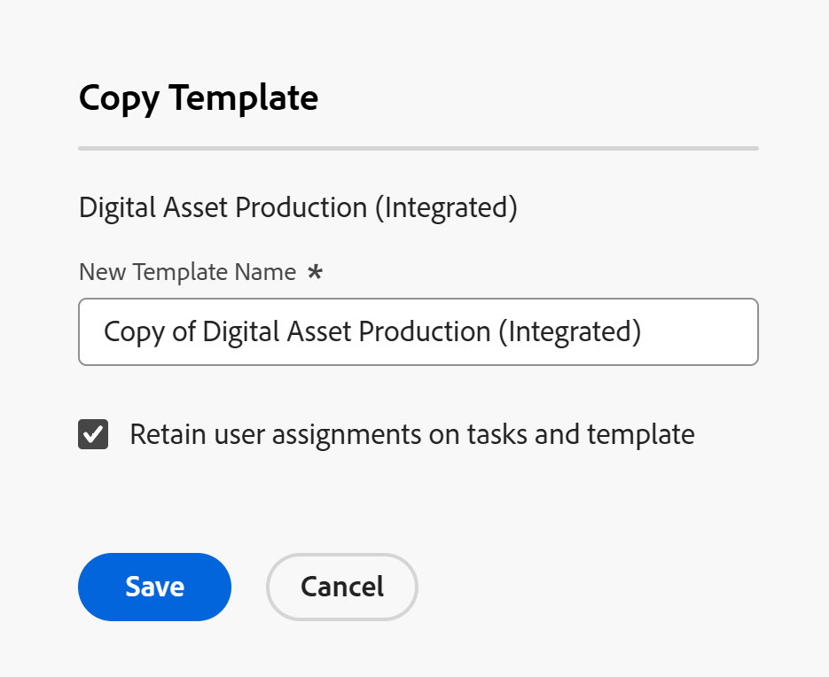

# 复制项目模板

<!--Audited: 5/2025-->

除了从头开始创建项目模板之外，您还可以复制现有项目模板并在Adobe Workfront中对其进行修改。

## 访问要求

+++ 展开以查看本文中各项功能的访问要求。

您必须具有以下访问权限。

<table style="table-layout:auto"> 
 <col> 
 <col> 
 <tbody> 
  <tr> 
   <td role="rowheader">Adobe Workfront计划</td> 
   <td> 
任何 
 </td> 
  </tr> 
  <tr> 
   <td role="rowheader">Adobe Workfront许可证*</td> 
   <td>
新增：标准
 
   
当前：计划 
 </td> 
  </tr> 
  <tr> 
   <td role="rowheader">访问级别配置</td> 
   <td> 
编辑对模板的访问权限
 </td> 
  </tr> 
  <tr> 
   <td role="rowheader">对象权限</td> 
   <td> 
查看模板或更高权限
  </td> 
  </tr> 
 </tbody> 
</table>

*有关信息，请参阅Workfront文档中的[访问要求](/help/quicksilver/administration-and-setup/add-users/access-levels-and-object-permissions/access-level-requirements-in-documentation.md)。

+++

## 有关复制模板的注意事项

始终将以下项目从现有模板复制到新模板：

* 模板任务
* 模板任务默认信息(任务默认审批流程、任务默认自定义Forms)
* 自定义表单
* 风险
* 队列设置信息
* Portfolio和程序
* 审批
* 文档
* 原始模板任务转移到新模板的天数。 如果需要，必须更改模板的“开始”或“完成”日期（取决于其调度模式）以更新模板任务的日期。

以下项目绝不会从现有模板复制到新模板：

* 记帐费率
* 用户评论

## 复制模板

<!--ensure steps and casing on the fields and buttons is accurate with unshim-->

1. 转到要复制的模板。
1. 单击标题中模板名称右侧的&#x200B;**更多**&#x200B;菜单，然后单击&#x200B;**复制**。

   将打开&#x200B;**复制模板**&#x200B;框。

   

1. 在&#x200B;**新模板名称**&#x200B;字段中指定模板的名称。

   默认情况下，Workfront会按照以下格式设置新名称： `Copy of Original template name`。

1. 如果要将所有任务和模板分配从原始模板传送到新模板，请选择&#x200B;**保留任务和模板上的用户分配**&#x200B;选项。 模板任务分配，以及模板所有者和发起人都会转移到复制的模板。
1. 单击&#x200B;**保存**&#x200B;以创建模板副本。

   新模板将显示在Workfront的“模板”区域的“模板”列表中。
