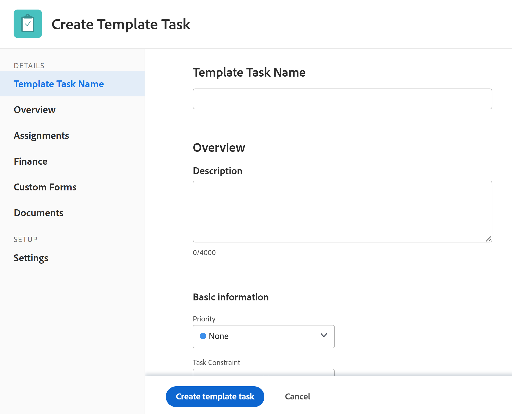

# 创建项目模板

<!-- Audited: 10/2025 -->

<!--remove all instances of new/ old experience and redo the steps when the toggle is removed-->

<!--

 

The highlighted information on this page refers to functionality not yet generally available. It is available only in the Preview environment for all customers. The same features will also be available in the Production environment for all customers starting with a week from the Preview release.      

For more information, see [Interface modernization](/help/quicksilver/product-announcements/product-releases/interface-modernization/interface-modernization.md).  

-->

您可以在“模板”区域中创建和删除模板。 在构建新模板时，您可以为所有任务和未来项目设置输入信息。 然后，此信息将传输到您从模板创建的任何项目。

>[!NOTE]
>
>模板及其任务没有实际日期，而是指示任务可能从哪天（从未来项目可能开始的时间）开始以及任务可能需要在哪一天完成。 使用模板创建未来项目时，项目将接收实际日期。 有关信息，请参阅[创建项目](../create-projects/create-project.md)。

您可以通过以下方式创建新模板：

* 从头开始，如本文所述。
* 从现有项目中，通过将项目另存为模板。

  有关从现有项目创建模板的详细信息，请参阅[将项目另存为模板](../../../manage-work/projects/manage-projects/save-project-as-template.md)。

* 通过从另一个模板复制它。

  有关复制现有模板的详细信息，请参阅[复制项目模板](../../../manage-work/projects/create-and-manage-templates/copy-template.md)。

* 通过导入Blueprint。 您必须是Workfront管理员才能导入Blueprint。 有关信息，请参阅[配置Blueprint](../../../administration-and-setup/blueprints/configure-template-package.md)。

## 访问权限要求

+++ 展开可查看本文所述功能的访问权限要求。

<table style="table-layout:auto"> 
 <col> 
 <col> 
 <tbody> 
  <tr> 
   <td role="rowheader">Adobe Workfront 包</td> 
   <td> 
“任一”
 </td> 
  </tr> 
  <tr> 
   <td role="rowheader">Adobe Workfront许可证</td> 
   <td> 
标准 

规划
 
您必须是系统管理员才能从Blueprint导入模板
 </td> 
  </tr> 
  <tr> 
   <td role="rowheader">访问级别配置</td> 
   <td> 
编辑对模板的访问权限
 </td> 
  </tr> 
  <tr> 
   <td role="rowheader">对象权限</td> 
   <td> 
默认情况下，您对创建的模板具有管理权限
  </td> 
  </tr> 
 </tbody> 
</table>

有关此表中信息的更多详细信息，请参阅Workfront文档中的[访问要求](/help/quicksilver/administration-and-setup/add-users/access-levels-and-object-permissions/access-level-requirements-in-documentation.md)。

+++

<!--
Old:
<table style="table-layout:auto"> 
 <col> 
 <col> 
 <tbody> 
  <tr> 
   <td role="rowheader">Adobe Workfront plan</td> 
   <td> 
Any
 </td> 
  </tr> 
  <tr> 
   <td role="rowheader">Adobe Workfront license</td> 
   <td> 
New: Standard 

Or 

Current: Plan 
 
You must be a system administrator to import templates from Blueprints
 </td> 
  </tr> 
  <tr> 
   <td role="rowheader">Access level configurations*</td> 
   <td> 
Edit access to Templates
 </td> 
  </tr> 
  <tr> 
   <td role="rowheader">Object permissions</td> 
   <td> 
You have Manage permissions to the templates you create, by default
  </td> 
  </tr> 
 </tbody> 
</table>
-->

## 创建模板

{{step1-to-templates}}

1. 单击&#x200B;**新建模板**。

1. （视情况而定）根据您的组织使用的文档存储，单击下列选项之一：

   * **新建模板**，当Workfront管理员选择&#x200B;**Adobe云存储**&#x200B;或&#x200B;**旧版Workfront**，并且他们选择或未选择&#x200B;**允许用户选择存储提供程序**&#x200B;设置时。
   * **新模板（旧版存储）**，当Workfront管理员选择&#x200B;**Adobe云存储**&#x200B;或&#x200B;**旧版Workfront**，并且他们还选择了&#x200B;**允许用户选择存储提供程序**&#x200B;设置时。

     仅当在“设置”区域中选择了&#x200B;**允许用户选择存储提供程序**&#x200B;设置时，才会显示此选项。

     有关详细信息，请参阅[为您的组织启用Adobe云存储](/help/quicksilver/administration-and-setup/set-up-workfront/configure-system-defaults/enable-esm.md)。

     模板随即创建，其默认名称将遵循以下模式，具体取决于Workfront用于文档的存储空间：

      * Worfront-storage模板的&#x200B;**无标题模板**。

        旧版Workfront存储模板在其名称旁显示&#x200B;**旧版Workfront存储**&#x200B;图标。

      * **无标题模板 — Adobe云存储模板的&lt;月日，年小时。分钟。秒>**

        >[!IMPORTANT]
        >
        >使用Adobe存储的模板必须具有唯一的名称。

   

1. 在模板标题中指定新模板的名称，然后按&#x200B;**Enter。**
1. 单击左侧面板中的&#x200B;**模板任务**&#x200B;部分。
1. 单击&#x200B;**开始添加模板任务**&#x200B;以添加内联任务

   或

   单击&#x200B;**新建模板任务**，开始在&#x200B;**新建模板任务**&#x200B;框中将任务添加到模板。

   单击&#x200B;**新建模板任务**&#x200B;后，**创建模板任务**&#x200B;框将打开。

   

1. （视情况而定）在&#x200B;**创建模板任务**&#x200B;框中更新以下区域的信息：

   * 模板任务名称
   * 概述
   * 分配
   * 财务
   * 自定义表单
   * 文档
   * 设置

   更新模板任务的信息与编辑模板任务类似。

   有关详细信息，请参阅[编辑模板任务](/help/quicksilver/manage-work/projects/create-and-manage-templates/edit-template-task.md)。

   >[!NOTE]
   >
   >您无法将周期性任务添加到模板。

1. 单击&#x200B;**创建模板任务**。

1. （可选）添加模板任务后，在&#x200B;**模板任务**&#x200B;部分中，单击任务列表右上角的&#x200B;**甘特图**&#x200B;图标以查看模板任务列表的可视表示形式。

   >[!TIP]
   >
   >不能直接从模板任务甘特图编辑任务。

1. 若要向新模板添加信息，请单击标题中模板名称右侧的&#x200B;**更多**&#x200B;菜单，然后单击&#x200B;**编辑**。

   有关编辑模板的信息，请参阅[编辑项目模板](../../../manage-work/projects/create-and-manage-templates/edit-templates.md)。

   >[!NOTE]
   >
   >项目模板与组（或缺少组）的关联会影响项目、任务和问题首选项如何确定模板中的某些设置。
   >
   >有关详细信息，请参阅[创建和修改组的项目模板](../../../administration-and-setup/manage-groups/work-with-group-objects/create-and-modify-a-groups-templates.md)一文中的“首选项如何应用于模板和模板任务”一节。

1. 单击&#x200B;**保存**。
1. （可选）将以下项目添加到模板

   * 文档
   * 风险
   * 审批流程
   * 记帐费率
   * 费用
   * 队列详细信息
   * 主题组和队列主题

1. （可选）将以下项目添加到模板中的任务：

   * 文档
   * 费用
   * 审批

   有关信息，请参阅[编辑项目模板](../../../manage-work/projects/create-and-manage-templates/edit-templates.md)一文中的“向模板添加更多项”一节。

