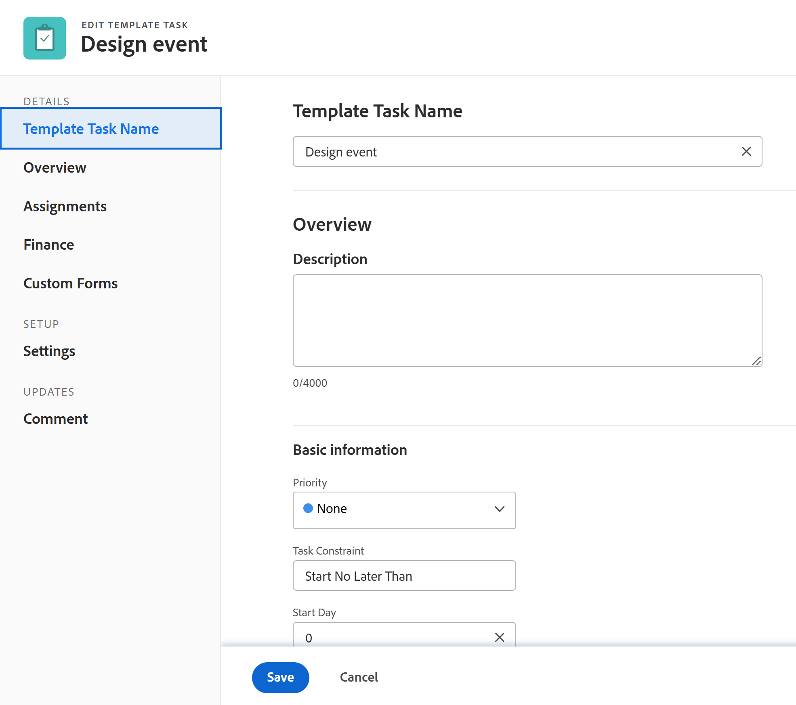

# 编辑模板任务

<!--Audited: 11/2025-->

<!--take out production and preview references and new/ old experiences at release-->

<!--
 

The highlighted information on this page refers to functionality not yet generally available. It is available only in the Preview environment for all customers. The same features will also be available in the Production environment for all customers starting with a week from the Preview release.      

For more information, see [Interface modernization](/help/quicksilver/product-announcements/product-releases/interface-modernization/interface-modernization.md).  

 -->

创建模板后，可以编辑模板任务的信息。 在使用模板创建项目或将模板附加到项目后，您在模板任务上更新的信息将与项目任务相关联。

有关创建模板的信息，请参阅[创建项目模板](../../../manage-work/projects/create-and-manage-templates/create-template.md)。

您可以一次编辑一个模板任务，也可以批量编辑模板任务。

>[!NOTE]
>
>您无法批量编辑属于不同模板的模板任务。 您只能编辑属于同一模板的模板任务。

## 访问要求

+++ 展开以查看本文中各项功能的访问要求。

<table style="table-layout:auto"> 
 <col> 
 <col> 
 <tbody> 
  <tr> 
   <td role="rowheader">Adobe Workfront包</td> 
   <td> 
任何
 </td> 
  </tr> 
  <tr> 
   <td role="rowheader">Adobe Workfront许可证</td> 
   <td> 
标准

   
规划 
</td> 
  </tr> 
  <tr> 
   <td role="rowheader">访问级别配置</td> 
   <td> 
编辑对模板的访问权限
  </td> 
  </tr> 
  <tr> 
   <td role="rowheader">对象权限 </td> 
   <td> 
管理模板的权限。 
 
您无法共享模板任务。 
 </td> 
  </tr> 
 </tbody> 
</table>

有关详细信息，请参阅Workfront文档中的[访问要求](/help/quicksilver/administration-and-setup/add-users/access-levels-and-object-permissions/access-level-requirements-in-documentation.md)。

+++

<!--Old:

<table style="table-layout:auto"> 
 <col> 
 <col> 
 <tbody> 
  <tr> 
   <td role="rowheader">Adobe Workfront plan</td> 
   <td> 
Any
 </td> 
  </tr> 
  <tr> 
   <td role="rowheader">Adobe Workfront license*</td> 
   <td> 
Standard 

   
Plan 
 </td> 
  </tr> 
  <tr> 
   <td role="rowheader">Access level</td> 
   <td> 
Edit access to Templates
  </td> 
  </tr> 
  <tr> 
   <td role="rowheader">Object permissions </td> 
   <td> 
Manage permissions for a template. 
 
You cannot share a template task. 
 </td> 
  </tr> 
 </tbody> 
</table>-->

## 先决条件

在开始之前，您必须

* 创建模板。

  有关创建模板的信息，请参阅[创建项目模板](../../../manage-work/projects/create-and-manage-templates/create-template.md)。

## 编辑模板任务

您可以使用“编辑模板任务”或“模板任务详细信息”区域编辑模板任务。

{{step1-to-templates}}

1. 单击模板名称以将其打开。
1. 单击左侧面板中的&#x200B;**模板任务**。
1. 单击列表中的模板任务的名称以打开该模板任务。
1. 要编辑有关模板任务的有限信息，请执行以下操作：
   1. （可选）单击左侧面板中的&#x200B;**更新**&#x200B;以将更新添加到模板任务。 使用模板创建项目时，模板任务更新未传输到项目任务。
   1. （可选）单击左侧面板中的&#x200B;**文档**&#x200B;以将文档添加到模板任务。 当您使用模板创建项目时，文档将传输到项目任务。
   1. （视情况而定）要编辑有关模板任务的有限信息，请单击左侧面板中的&#x200B;**模板任务详细信息**，然后转到“详细信息”部分的各个区域以编辑每个区域的信息。
   1. （可选）执行以下任一操作：
      * 单击&#x200B;**全部折叠**&#x200B;图标以折叠所有区域。
      * 单击&#x200B;**编辑**&#x200B;图标，然后从下面的任何区域进行选择，或单击&#x200B;**编辑全部**&#x200B;以编辑所有区域的信息：

         * 概述
         * 自定义Forms
只有当模板任务附加了自定义表单时，才会显示自定义表单的名称。
         * 财务

        >[!TIP]
        >
        >有关详细信息区域中显示的所有字段的信息，请继续使用“编辑模板任务”框编辑所有字段，如下所述。

   1. （可选）单击左侧面板中的&#x200B;**子任务**&#x200B;部分以添加模板任务的子项。 为模板任务添加子任务与添加项目任务子任务类似。 有关信息，请参阅文章[创建子任务](/help/quicksilver/manage-work/tasks/create-tasks/create-subtasks.md)中的“从任务子任务创建子任务”部分。
   1. （可选）单击左侧面板中的&#x200B;**费用**，然后将费用添加到模板任务。 使用模板创建项目时，模板任务费用将转移到未来的项目任务。
   1. （可选）单击左侧面板中的&#x200B;**批准**&#x200B;以创建批准，或将全局或组级别的批准附加到模板任务。 审批转移到未来的项目任务。
   1. （可选）单击左侧面板中的&#x200B;**前置任务**&#x200B;部分，为模板任务添加前置任务。 添加模板任务前置任务与添加项目任务前置任务类似。 有关信息，请参阅[使用前置任务区域创建前置任务关系](/help/quicksilver/manage-work/tasks/use-prdcssrs/create-predecessors-in-predecessors-area.md)。

1. （可选）要批量编辑多个模板任务，请选择多个模板任务，然后单击模板列表顶部的&#x200B;**编辑**。
1. （视情况而定）要同时编辑有关模板任务或多个任务的所有信息，请单击以从列表中选择这些任务，然后单击列表顶部的&#x200B;**编辑**&#x200B;图标。

   新体验中会显示&#x200B;**编辑模板任务**&#x200B;框。

   

   >[!TIP]
   >
   >您还可以在列表中选择模板任务，然后单击标题中模板任务名称右侧的&#x200B;**编辑**&#x200B;以打开&#x200B;**编辑模板任务**&#x200B;框。

   继续编辑模板任务，如本文中的[使用新体验](#edit-a-template-task-using-the-new-experience)编辑模板任务部分中所述。

1. （可选）单击&#x200B;**编辑模板任务**&#x200B;框底部的&#x200B;**切换回旧体验**&#x200B;以打开旧体验中的&#x200B;**编辑模板任务**&#x200B;框。

   

1. 请考虑在以下任意部分中指定信息：

   * [概述](#overview)
   * [财务](#finance)
   * [设置](#settings)
   * [任务](#assignments)
   * [自定义表单](#custom-forms)
   * [评论](#comment)

1. 继续编辑模板任务，如本文中的[使用旧体验](#edit-a-template-task-using-the-old-experience)编辑模板任务部分所述。

### 使用旧体验编辑模板任务

#### 概述 {#overview}

1. 按如上所述开始编辑模板任务。
1. 单击&#x200B;**概述**。

   

1. 更新以下任一项：

   <table style="table-layout:auto"> 
    <col> 
    <col> 
    <tbody> 
     <tr> 
      <td role="rowheader"><strong>名称</strong> </td> 
      <td>指定模板任务的名称。 批量编辑模板任务时不显示此字段。</td> 
     </tr> 
     <tr> 
      <td role="rowheader"><strong>描述</strong> </td> 
      <td>添加有关模板任务的其他信息。</td> 
     </tr> 
     <tr> 
      <td role="rowheader"><strong>URL</strong> </td> 
      <td>指定与模板任务的相关信息相关的Web链接。</td> 
     </tr> 
     <tr> 
      <td role="rowheader"><strong>优先级</strong> </td> 
      <td> 
这是一个可视标志，可用于设置模板任务的优先级。 
 
从以下选项中选择：
 
       <ul> 
        <li> 
<strong>无</strong> 
 </li> 
        <li> 
<strong>低</strong> 
 </li> 
        <li> 
 <b>正常</b>
 </li> 
        <li> 
<b>高</b> 
 </li> 
        <li> 
<b>紧急</b> 
 </li> 
       </ul> 
根据您的Workfront管理员选择的项目偏好设置，优先级名称可能有所不同。 有关编辑优先级的详细信息，请参阅<a href="../../../administration-and-setup/customize-workfront/creating-custom-status-and-priority-labels/create-customize-priorities.md" class="MCXref xref">创建和自定义优先级</a>。
 </td> 
     </tr> 
     <tr> 
      <td role="rowheader"><strong>持续时间类型</strong> </td> 
      <td> 
从此模板创建的未来任务将具有此持续时间类型。  持续时间类型标识以下各项之间的关系：
 
 — 分配给任务的资源数
 
 — 完成任务所需的总工作量
 
 — 任务的总持续时间。 
 
持续时间类型使您能够根据任务的需要设置一致的资源分配。 有关任务的持续时间类型的详细信息，请参阅<a href="../../../manage-work/tasks/taskdurtn/task-duration-and-duration-type.md" class="MCXref xref">任务持续时间和持续时间类型概览</a>。
 
从以下选项中选择：
 
       <ul> 
        <li> 
计算的工作分配 
 </li> 
        <li> 
计算的工作量 
 </li> 
        <li> 
投入比导向 
 </li> 
        <li> 
简单   
 </li> 
       </ul> </td> 
     </tr> 
     <tr> 
      <td role="rowheader"><strong>持续时间</strong> </td> 
      <td> 
指定未来任务的持续时间，以分钟、小时、天、周或月为单位。 从此模板创建的未来任务将具有此处指定的持续时间。
 
默认情况下，Workfront会以天为单位测量持续时间。 这是您允许任务在必须完成之前保持未完成的时间。 当任务的<strong>持续时间类型</strong>为<strong>简单</strong>或<strong>任务限制</strong>为<strong>固定日期</strong>时，无法指定任务的持续时间。
 
<b>重要</b>
 
持续时间通常是模板任务的计划开始日期与计划完成日期之间的时间量，因此，它会影响模板的时间表。 这会确定从模板创建的未来项目的时间线。 
 </td> 
     </tr> 
     <tr> 
      <td role="rowheader"><strong>计划小时数</strong> </td> 
      <td> 
指定使用此模板创建的项目上未来任务的计划小时数。 这是任务被分派人完成任务所花费的实际时间。 当<strong>持续时间类型</strong>设置为<strong>计算的工作分配</strong>时，您只能指定任务的计划小时数。 
 </td> 
     </tr>

   <tr> 
      <td role="rowheader"><strong>任务限制</strong> </td> 
      <td> 
从此模板创建的项目上的任务将具有此限制。 任务约束标识必须完成任务的时间。 
 
从以下选项中选择：
 
       <ul> 
        <li><strong>固定日期</strong>。 指定<strong>计划开始</strong>和<strong>计划完成日期。</strong></li> 
        <li><strong>必须在</strong>开始。 指定<strong>计划开始日期。</strong></li> 
        <li><strong>必须在</strong>完成。 指定<strong>计划完成日期</strong>。</li> 
        <li><strong>尽快</strong> </li> 
        <li><strong>尽可能迟</strong> </li> 
        <li style="font-weight: bold;"><strong>最早可用时间</strong> </li> 
        <li style="font-weight: bold;"><strong>最新可用时间</strong> </li> 
        <li>开始时间不晚于。 指定<strong>计划开始日期</strong>。</li> 
        <li><strong>开始时间不早于</strong>。 指定<strong>计划开始日期</strong>。</li> 
        <li><strong>完成时间不超过</strong>。 指定<strong>计划完成日期</strong>。</li> 
        <li><strong>完成时间不早于</strong>。 指定<strong>计划完成日期</strong>。</li> 
       </ul> 
有关任务限制的详细信息，请参阅<a href="../../../manage-work/tasks/task-constraints/task-constraint-overview.md" class="MCXref xref">任务限制概述</a>。
 </td> 
     </tr> 
     <tr> 
      <td role="rowheader">开始日期（可选且有条件） </td> 
      <td> 
 只有当“任务约束”是以下任一条件时，才能指定模板任务的开始日期：
 
       <ul> 
        <li>必须开始时间</li> 
        <li>开始时间不早于</li> 
        <li>开始时间不晚于</li> 
        <li>固定日期</li> 
       </ul> 
这将对应于未来项目时间线中任务开始的日期。 对于所有其他限制，Workfront会根据任务之间的前置任务依赖关系计算开始日期。 
 </td> 
     </tr> 
     <tr> 
      <td role="rowheader"><strong>完成日</strong>（可选和有条件） </td> 
      <td> 
 只有当“任务约束”是以下任一条件时，才能指定模板任务的“完成日”：
 
       <ul style="list-style-type: circle;"> 
        <li>必须完成时间</li> 
        <li>完成时间不早于</li> 
        <li>完成时间不晚于</li> 
        <li>固定日期</li> 
       </ul> 
这将对应于在将来项目的时间表中完成任务的日期。 对于所有其他限制，Workfront会根据持续时间和前置任务依赖关系计算完成日期。 
 </td> 
     </tr> 
    </tbody> 
   </table>

1. （可选）根据要修改的信息，继续编辑以下部分。

   或

   单击&#x200B;**保存更改**。

#### 财务 {#finance}

1. 按如上所述开始编辑模板任务。
1. 单击&#x200B;**财务**。

   

1. 更新以下任一项：

   <table style="table-layout:auto"> 
    <col> 
    <col> 
    <tbody> 
     <tr> 
      <td role="rowheader"><strong>成本类型</strong> </td> 
      <td> 
为将来任务指定成本类型。 这将根据任务的小时数确定如何计算任务成本。 
 
从以下选项中选择：
 
       <ul> 
        <li> 
无费用 
 </li> 
        <li> 
固定小时 
 </li> 
        <li> 
用户小时 
 </li> 
        <li> 
角色小时 
 </li> 
       </ul> 
有关跟踪成本的更多信息，请参阅<a href="../../../manage-work/projects/project-finances/track-costs.md" class="MCXref xref">跟踪成本</a>。
 </td> 
     </tr> 
     <tr> 
      <td role="rowheader"><strong>收入类型</strong> </td> 
      <td> 
指定未来任务的收入类型。 这将根据任务的小时数确定如何计算任务收入。
 
从以下选项中选择： 
 
       <ul> 
        <li> 
不可计费
 </li> 
        <li> 
用户每小时
 </li> 
        <li> 
角色每小时
 </li> 
        <li> 
固定每小时
 </li> 
        <li> 
受限用户小时
 </li> 
        <li> 
受限角色小时
 </li> 
        <li> 
用户小时加固定
 </li> 
        <li> 
角色小时加固定
 </li> 
        <li> 
固定收入
 </li> 
       </ul> 
有关跟踪收入的更多信息，请参阅<a href="../../../manage-work/projects/project-finances/billing-and-revenue-overview.md" class="MCXref xref">账单和收入概述</a>。
 </td> 
     </tr> 
    </tbody> 
   </table>

1. （可选）根据要修改的信息，继续编辑以下部分。

   或

   单击&#x200B;**保存更改**。

#### 设置 {#settings}

1. 按如上所述开始编辑模板任务。
1. 单击&#x200B;**设置**。

   

1. 更新以下任一项：

   <table style="table-layout:auto"> 
    <col> 
    <col> 
    <tbody> 
   <tr> 
      <td role="rowheader">
<b>里程碑</b>
</strong> </td> 
      <td> 
选择要与所选模板任务关联的里程碑。

   
<b>重要</b>

   
您必须将里程碑路径与模板关联才能显示该字段。 有关详细信息，请参阅<a href="../create-and-manage-templates/edit-templates.md">编辑项目模板</a>。
 
   </td> 
     </tr>
     <tr> 
      <td role="rowheader"><strong>跟踪模式</strong> </td> 
      <td> 
指定将如何跟踪未来任务的进度状态。 
 
从以下选项中选择：
 
       <ul> 
        <li> 
<strong>用户必须更新</strong> 
 </li> 
        <li> 
<strong>假定时间为</strong> 
 </li> 
        <li> 
<strong>忽略迟到警告</strong> 
 </li> 
        <li> 
<strong>自动完成</strong> 
 </li> 
        <li> 
<strong>前置任务</strong> 
 </li> 
       </ul> 
有关任务跟踪模式的详细信息，请参阅<a href="../../../manage-work/tasks/task-information/task-tracking-mode.md" class="MCXref xref">任务跟踪模式概述</a>。
 </td> 
     </tr> 
     <tr> 
      <td role="rowheader"><strong>审批流程</strong> </td> 
      <td> 
选择要与模板任务关联的审批流程。 您的Workfront管理员必须定义系统级任务批准流程，然后才能将其与模板任务关联。 对审批流程具有管理权限的用户也可以创建特定于组的审批流程。有关创建审批流程的详细信息，请参阅<a href="../../../administration-and-setup/customize-workfront/configure-approval-milestone-processes/create-approval-processes.md" class="MCXref xref">为工作项创建审批流程</a>。
 
添加审批流程时，请考虑以下事项： 
 
       <ul> 
       <li>列表中仅显示有效的审批流程。 </li> 
       <li> 
系统范围及组特定的批准流程会显示在列表中。 与模板组以外的组关联的审批流程不会显示在列表中。
 
重要提示：如果与模板关联的组发生更改，则组特定的审批流程将变成一次性的审批流程。 有关对项目组的更改或审批流程中的更改如何影响审批设置的详细信息，请参阅<a href="../../../administration-and-setup/customize-workfront/configure-approval-milestone-processes/how-changes-affect-group-approvals.md" class="MCXref xref">组和审批流程更改如何影响分配的审批流程</a>。 
 </li> 
       <li> 
如果您添加了一次性审批流程，它在此字段显示为“&lt;Custom&gt;”。 有关信息，请参阅<a href="../../../review-and-approve-work/manage-approvals/associate-approval-with-work.md" class="MCXref xref">将新的或现有的审批流程与工作关联</a>。 
 <!--
(NOTE: this will be valid only for Classic when they edit the Edit Template box in NWE)
--> </li> 
       <li> 
批量编辑模板任务时，存在以下情况：
 
       <ul> 
       <li> 
从同一模板组中选择模板任务时，系统级别和组级别审批流程都会显示在此字段中。
 </li> 
       <li> 
当您从不同的模板组中选择模板任务时，此字段只显示系统级别的审批流程。
 </li> 
       <li> 
当任何模板任务附加一次性审批流程时，它将被您选择的系统级别或组级别审批流程替换。 
 </li> 
       </ul> </li> 
       </ul> </td> 
     </tr> 
     <tr> 
      <td role="rowheader"><strong>提醒通知</strong> </td> 
      <td> 
选择要附加到模板任务的提醒通知。 它们将被附加到从此模板创建的项目中的未来任务。 系统管理员必须先配置提醒通知，然后才能在任务中选择它们。 有关配置提醒通知的详细信息，请参阅<a href="../../../administration-and-setup/manage-workfront/emails/set-up-reminder-notifications.md" class="MCXref xref">设置提醒通知</a>。
 </td> 
     </tr> 
    </tbody> 
   </table>

1. （可选）根据要修改的信息，继续编辑以下部分。

   或

   单击&#x200B;**保存更改**。

#### 任务 {#assignments}

1. 按如上所述开始编辑模板任务。
1. 单击&#x200B;**分配**。

   

1. 单击&#x200B;**添加被分派人**&#x200B;以将新的被分派人添加到模板任务。 您可以将用户、角色或团队分配给任务。 一项任务可以有多个被分配人。 从此模板任务创建时，将来任务将分配相同的资源。
1. （可选）如果您有多个被分配人，请选择&#x200B;**所有者**&#x200B;单选按钮以指示哪个用户或角色被视为任务所有者或主要被分配人。 Workfront将您分配给模板任务的第一个用户或工作角色标记为所有者或主要被分配人。
1. （有条件，可选）如果您的&#x200B;**持续时间类型**&#x200B;是&#x200B;**计算的工作量**&#x200B;或&#x200B;**投入比导向**，请为每个被分配人指定&#x200B;**分配%**（分配百分比）。 这是指从被分派人计划起他们可在此任务上花费的时间。 更改被分配人的分配百分比将更改任务的已计划小时数。
1. （有条件且可选）如果您的&#x200B;**持续时间类型**&#x200B;是&#x200B;**简单**，请指定每个被分派人的&#x200B;**小时**

   或

   指定模板任务的&#x200B;**计划小时数**&#x200B;的总数。 这会在所有被分配人之间平均分配总小时数。

1. （有条件且可选）如果&#x200B;**持续时间类型**&#x200B;为简单，请指定模板任务的&#x200B;**持续时间**（以天为单位）。 这将成为从此模板创建的任务的持续时间。
1. （可选）从&#x200B;**被分派人的角色**&#x200B;下拉菜单中选择一个角色。 这是被分派人可以在这项未来的任务中履行的职责。 下拉菜单中仅显示与其配置文件中每个被分配人关联的工作角色。
1. （可选）根据要修改的信息，继续编辑以下部分。

   或

   单击&#x200B;**保存更改**。

#### 自定义表单 {#custom-forms}

您可以定义在任务添加到项目时，默认自动附加到任务的自定义表单。 有关设置项目以包含默认任务自定义表单的信息，请参阅[编辑项目](../../../manage-work/projects/manage-projects/edit-projects.md)一文中的“任务”一节。

在从模板创建项目时，您还可以通过向模板任务添加自定义表单来将自定义表单添加到项目的未来任务中。

1. 按如上所述开始编辑模板任务。
1. 单击&#x200B;**自定义Forms**。

   

1. 选择要与模板任务关联的一个或多个自定义表单。

   您必须先构建自定义表单，然后才可在此字段中选择它们。
列表中仅显示活动的自定义表单。
有关生成自定义表单的详细信息，请参阅[创建自定义表单](/help/quicksilver/administration-and-setup/customize-workfront/create-manage-custom-forms/form-designer/design-a-form/design-a-form.md)。
您最多可以向一个模板任务添加十个自定义表单。
表单会自动添加到从模板创建的任务中。
1. （视情况而定，可选）如果将自定义表单附加到模板任务，请编辑表单上的任何字段。 在保存模板任务之前，必须指定所有必填字段。

   >[!NOTE]
   >
   >根据Workfront管理员为自定义表单中的分区设置权限的方式，并非每个人都可以查看或编辑给定自定义表单上的相同字段。 编辑自定义表单分区中字段的权限取决于您对模板任务或未来任务的权限。\
   >有关设置自定义表单分区的权限的信息，请参阅[共享自定义表单](../../../administration-and-setup/customize-workfront/create-manage-custom-forms/share-access-to-a-custom-form.md)。\
   >有关设置任务权限的信息，请参阅[共享任务](../../../workfront-basics/grant-and-request-access-to-objects/share-a-task.md)。\
   >有关设置模板权限的信息，请参阅[共享模板](../../../workfront-basics/grant-and-request-access-to-objects/share-a-template.md)。

1. （可选）根据要修改的信息，继续编辑以下部分。

   或

   单击&#x200B;**保存更改**。

#### 评论 {#comment}

1. 按如上所述开始编辑模板任务。
1. 单击&#x200B;**评论**。

   

1. 在可用字段中指定要显示在模板任务的更新流中的注释。 此注释对具有查看模板和模板任务的权限以及查看注释访问权限的所有人可见。
1. 单击&#x200B;**保存更改**。

   当您或其他用户从此模板创建项目时，应用到模板任务的所有设置都将成为项目任务的设置。

### 使用新体验编辑模板任务

在新版Experience中打开&#x200B;**编辑模板任务**&#x200B;框后，请考虑在以下任意部分中指定信息：

* [模板任务名称](#template-task-name)
* [概述](#overview-1)
* [任务](#assignments-1)
* [财务](#finance-1)
* [自定义表单](#custom-forms-1)
* [设置](#settings-1)
* [评论](#comment-1)

#### 模板任务名称

>[!TIP]
>
>批量编辑模板任务时，“模板任务名称”部分不可用。

1. 按如上所述开始编辑模板任务。
1. 在“编辑模板任务”框中，单击&#x200B;**模板任务名称**，然后添加该模板任务的名称。

   批量编辑模板任务时，此视图不可用。

1. （可选）根据要修改的信息，继续编辑以下部分。

   或

   单击&#x200B;**保存**。

#### 概述 {#overview-1}

1. 按如上所述开始编辑模板任务。
1. 在&#x200B;**编辑模板任务**&#x200B;框中，单击左侧面板中的&#x200B;**概述**。

   

1. 更新以下任一项：

   <table style="table-layout:auto"> 
    <col> 
    <col> 
    <tbody> 
     <tr> 
      <td role="rowheader"><strong>描述</strong> </td> 
      <td>添加有关模板任务的其他信息。</td> 
     </tr> 
     <tr> 
      <td role="rowheader"><strong>优先级</strong> </td> 
      <td> 
这是一个可视标志，可用于设置模板任务的优先级。 
 
从以下选项中选择：
 
       <ul> 
        <li> 
<strong>无</strong> 
 </li> 
        <li> 
<strong>低</strong> 
 </li> 
        <li> 
 <b>正常</b>
 </li> 
        <li> 
<b>高</b> 
 </li> 
        <li> 
<b>紧急</b> 
 </li> 
       </ul> 
根据您的Workfront管理员选择的项目偏好设置，优先级名称可能有所不同。 有关编辑优先级的详细信息，请参阅<a href="../../../administration-and-setup/customize-workfront/creating-custom-status-and-priority-labels/create-customize-priorities.md" class="MCXref xref">创建和自定义优先级</a>。
 </td> 
     </tr> 
     <tr> 
      <td role="rowheader"><strong>任务限制</strong> </td> 
      <td> 
从此模板创建的项目上的任务将具有此限制。 任务约束标识必须完成任务的时间。 
 
从以下选项中选择：
 
       <ul> 
        <li><strong>固定日期</strong>。 指定<strong>计划开始</strong>和<strong>计划完成日期。</strong></li> 
        <li><strong>必须在</strong>开始。 指定<strong>计划开始日期。</strong></li> 
        <li><strong>必须在</strong>完成。 指定<strong>计划完成日期</strong>。</li> 
        <li><strong>尽快</strong> </li> 
        <li><strong>尽可能迟</strong> </li> 
        <li style="font-weight: bold;"><strong>最早可用时间</strong> </li> 
        <li style="font-weight: bold;"><strong>最新可用时间</strong> </li> 
        <li>开始时间不晚于。 指定<strong>计划开始日期</strong>。</li> 
        <li><strong>开始时间不早于</strong>。 指定<strong>计划开始日期</strong>。</li> 
        <li><strong>完成时间不超过</strong>。 指定<strong>计划完成日期</strong>。</li> 
        <li><strong>完成时间不早于</strong>。 指定<strong>计划完成日期</strong>。</li> 
       </ul> 
有关任务限制的详细信息，请参阅<a href="../../../manage-work/tasks/task-constraints/task-constraint-overview.md" class="MCXref xref">任务限制概述</a>。
 </td> 
     </tr> 
     <tr> 
      <td role="rowheader">开始日期（可选且有条件） </td> 
      <td> 
 只有当“任务约束”是以下任一条件时，才能指定模板任务的开始日期：
 
       <ul> 
        <li>必须开始时间</li> 
        <li>开始时间不早于</li> 
        <li>开始时间不晚于</li> 
        <li>固定日期</li> 
       </ul> 
这将对应于未来项目时间线中任务开始的日期。 对于所有其他限制，Workfront会根据任务之间的前置任务依赖关系计算开始日期。 
 </td> 
     </tr> 
     <tr> 
      <td role="rowheader"><strong>完成日</strong>（可选和有条件） </td> 
      <td> 
 只有当“任务约束”是以下任一条件时，才能指定模板任务的“完成日”：
 
       <ul style="list-style-type: circle;"> 
        <li>必须完成时间</li> 
        <li>完成时间不早于</li> 
        <li>完成时间不晚于</li> 
        <li>固定日期</li> 
       </ul> 
这将对应于在将来项目的时间表中完成任务的日期。 对于所有其他限制，Workfront会根据持续时间和前置任务依赖关系计算完成日期。 
 </td> 
     </tr> 
     <tr> 
      <td role="rowheader"><strong>URL</strong> </td> 
      <td>指定与模板任务的相关信息相关的Web链接。</td> 
     </tr>

   <tr> 
      <td role="rowheader"><strong>工作投入</strong> </td> 
      <td>从以下选项中进行选择：
      <ul><li>小</li>
      <li>媒介</li>
      <li>大</li></ul>

   
<b>重要</b>

      
仅当您在编辑模板时选择<b>使用工作投入以自动计算任务已计划小时数</b>设置时，才会在编辑模板任务时显示工作投入字段。

   </td> 
     </tr> 
     </tbody> 
   </table>

1. （可选）根据要修改的信息，继续编辑以下部分。

   或

   单击&#x200B;**保存**。

#### 任务 {#assignments-1}

1. 按如上所述开始编辑模板任务。
1. 在&#x200B;**编辑模板任务**&#x200B;框中，单击左侧面板中的&#x200B;**工作**。

   

1. 在&#x200B;**搜索人员、角色或团队**&#x200B;字段中，开始键入被分配人的姓名，然后当该姓名显示在列表中时将其选定

   或

   单击&#x200B;**分配给我**&#x200B;以将模板任务分配给您自己。
1. 请考虑更新以下信息：

   <table style="table-layout:auto"> 
      <col> 
      <col> 
      <tbody>

   <tr> 
         <td role="rowheader"><strong>持续时间类型</strong> </td> 
         <td> 
从此模板创建的未来任务将具有此持续时间类型。  持续时间类型标识以下各项之间的关系：
 
         <ul>
         <li>
分配给任务的资源数
 </li>
         <li>
完成任务所需的总工作量
</li> 
         <li>
任务的总持续时间 
</li></ul> 
通过使用持续时间类型，您可以根据任务的需求设置一致的资源分配。 有关任务的持续时间类型的详细信息，请参阅<a href="../../../manage-work/tasks/taskdurtn/task-duration-and-duration-type.md" class="MCXref xref">任务持续时间和持续时间类型概览</a>。
 
从以下选项中选择：
 
         <ul> 
         <li> 
计算的工作分配 
 </li> 
         <li> 
计算的工作量 
 </li> 
         <li> 
投入比导向 
 </li> 
         <li> 
简单   
 </li> 
         </ul> </td> 
      </tr> 
      <tr> 
         <td role="rowheader"><strong>持续时间</strong> </td> 
         <td> 
指定未来任务的持续时间，以分钟、小时、天、周或月为单位。 从此模板创建的未来任务将具有此处指定的持续时间。
 
默认情况下，Workfront会以天为单位测量持续时间。 这是您允许任务在必须完成之前保持未完成的时间。 当任务的<strong>持续时间类型</strong>为<strong>简单</strong>或<strong>任务限制</strong>为<strong>固定日期</strong>时，无法指定任务的持续时间。
 
<b>重要</b>
 
持续时间通常是模板任务的计划开始日期与计划完成日期之间的时间量，因此，它会影响模板的时间表。 这会确定从模板创建的未来项目的时间线。 
 </td> 
      </tr> 
      <tr> 
         <td role="rowheader"><strong>计划小时数</strong> </td> 
         <td> 
指定使用此模板创建的项目上未来任务的计划小时数。 这是任务被分派人完成任务所花费的实际时间。 当<strong>持续时间类型</strong>设置为<strong>计算的工作分配</strong>时，您只能指定任务的计划小时数。 
 </td> 
      </tr> 
   </tbody> 
      </table>

1. （可选）根据要修改的信息，继续编辑以下部分。

   或

   单击&#x200B;**保存**。

#### 财务 {#finance-1}

1. 按如上所述开始编辑模板任务。
1. 在&#x200B;**编辑模板任务**&#x200B;框中，单击左侧面板中的&#x200B;**财务**。

   

1. 更新以下任一项：

   <table style="table-layout:auto"> 
    <col> 
    <col> 
    <tbody> 
     <tr> 
      <td role="rowheader"><strong>成本类型</strong> </td> 
      <td> 
为将来任务指定成本类型。 这将根据任务的小时数确定如何计算任务成本。 
 
从以下选项中选择：
 
       <ul> 
        <li> 
无费用 
 </li> 
        <li> 
固定小时 
 </li> 
        <li> 
用户小时 
 </li> 
        <li> 
角色小时 
 </li> 
       </ul> 
有关跟踪成本的更多信息，请参阅<a href="../../../manage-work/projects/project-finances/track-costs.md" class="MCXref xref">跟踪成本</a>。
 </td> 
     </tr> 
     <tr> 
      <td role="rowheader"><strong>收入类型</strong> </td> 
      <td> 
指定未来任务的收入类型。 这将根据任务的小时数确定如何计算任务收入。
 
从以下选项中选择： 
 
       <ul> 
        <li> 
不可计费
 </li> 
        <li> 
用户每小时
 </li> 
        <li> 
角色每小时
 </li> 
        <li> 
固定每小时
 </li> 
        <li> 
受限用户小时
 </li> 
        <li> 
受限角色小时
 </li> 
        <li> 
用户小时加固定
 </li> 
        <li> 
角色小时加固定
 </li> 
        <li> 
固定收入
 </li> 
       </ul> 
有关跟踪收入的更多信息，请参阅<a href="../../../manage-work/projects/project-finances/billing-and-revenue-overview.md" class="MCXref xref">账单和收入概述</a>。
 </td> 
     </tr> 
    </tbody> 
   </table>

1. （可选）根据要修改的信息，继续编辑以下部分。

   或

   单击&#x200B;**保存**。

#### 自定义表单 {#custom-forms-1}

您可以定义在任务添加到项目时，默认自动附加到任务的自定义表单。 有关设置项目以包含默认任务自定义表单的信息，请参阅[编辑项目](../../../manage-work/projects/manage-projects/edit-projects.md)一文中的“任务”一节。

在从模板创建项目时，您还可以通过向模板任务添加自定义表单来将自定义表单添加到项目的未来任务中。

1. 按如上所述开始编辑模板任务。
1. 在&#x200B;**编辑模板任务**&#x200B;框中，单击左侧面板中的&#x200B;**自定义Forms**。

   

1. 选择要与模板任务关联的一个或多个自定义表单。

   您必须先构建自定义表单，然后才可在此字段中选择它们。
列表中仅显示活动的自定义表单。

   有关生成自定义表单的详细信息，请参阅[创建自定义表单](/help/quicksilver/administration-and-setup/customize-workfront/create-manage-custom-forms/form-designer/design-a-form/design-a-form.md)。

   您最多可以向一个模板任务添加十个自定义表单。
表单会自动添加到从模板创建的任务中。
1. （视情况而定，可选）如果将自定义表单附加到模板任务，请编辑表单上的任何字段。 在保存模板任务之前，必须指定所有必填字段。

   >[!NOTE]
   >
   >根据Workfront管理员为自定义表单中的分区设置权限的方式，并非每个人都可以查看或编辑给定自定义表单上的相同字段。 编辑自定义表单分区中字段的权限取决于您对模板任务或未来任务的权限。\
   >有关设置自定义表单分区的权限的信息，请参阅[共享自定义表单](../../../administration-and-setup/customize-workfront/create-manage-custom-forms/share-access-to-a-custom-form.md)。\
   >有关设置任务权限的信息，请参阅[共享任务](../../../workfront-basics/grant-and-request-access-to-objects/share-a-task.md)。\
   >有关设置模板权限的信息，请参阅[共享模板](../../../workfront-basics/grant-and-request-access-to-objects/share-a-template.md)。

1. （可选）根据要修改的信息，继续编辑以下部分。

   或

   单击&#x200B;**保存**。

#### 设置 {#settings-1}

1. 按如上所述开始编辑模板任务。
1. 在&#x200B;**编辑模板任务框**&#x200B;中，单击左侧面板中的&#x200B;**设置**。

   

1. 更新以下任一项：

   <table style="table-layout:auto"> 
    <col> 
    <col> 
    <tbody> 
   <tr> 
      <td role="rowheader">
<b>里程碑</b>
</strong> </td> 
      <td> 
选择要与所选模板任务关联的里程碑。

   
<b>重要</b>

   
您必须将里程碑路径与模板关联才能显示该字段。 有关详细信息，请参阅<a href="../create-and-manage-templates/edit-templates.md">编辑项目模板</a>。
 
   </td> 
     </tr>
     <tr> 
      <td role="rowheader"><strong>跟踪模式</strong> </td> 
      <td> 
指定将如何跟踪未来任务的进度状态。 
 
从以下选项中选择：
 
       <ul> 
        <li> 
<strong>用户必须更新</strong> 
 </li> 
        <li> 
<strong>假定时间为</strong> 
 </li> 
        <li> 
<strong>忽略迟到警告</strong> 
 </li> 
        <li> 
<strong>自动完成</strong> 
 </li> 
        <li> 
<strong>前置任务</strong> 
 </li> 
       </ul> 
有关任务跟踪模式的详细信息，请参阅<a href="../../../manage-work/tasks/task-information/task-tracking-mode.md" class="MCXref xref">任务跟踪模式概述</a>。
 </td> 
     </tr> 
     <tr> 
      <td role="rowheader"><strong>提醒通知</strong> </td> 
      <td> 
选择要附加到模板任务的提醒通知。 它们将被附加到从此模板创建的项目中的未来任务。 系统管理员必须先配置提醒通知，然后才能在任务中选择它们。 有关配置提醒通知的详细信息，请参阅<a href="../../../administration-and-setup/manage-workfront/emails/set-up-reminder-notifications.md" class="MCXref xref">设置提醒通知</a>。
 </td> 
     </tr> 
     <tr> 
      <td role="rowheader"><strong>审批流程</strong> </td> 
      <td> 
选择要与模板任务关联的审批流程。 您的Workfront管理员必须定义系统级任务批准流程，然后才能将其与模板任务关联。 对审批流程具有管理权限的用户也可以创建特定于组的审批流程。有关创建审批流程的详细信息，请参阅<a href="../../../administration-and-setup/customize-workfront/configure-approval-milestone-processes/create-approval-processes.md" class="MCXref xref">为工作项创建审批流程</a>。
 
添加审批流程时，请考虑以下事项： 
 
       <ul> 
       <li>列表中仅显示有效的审批流程。 </li> 
       <li> 
系统范围及组特定的批准流程会显示在列表中。 与模板组以外的组关联的审批流程不会显示在列表中。
 
重要提示：如果与模板关联的组发生更改，则组特定的审批流程将变成一次性的审批流程。 有关对项目组的更改或审批流程中的更改如何影响审批设置的详细信息，请参阅<a href="../../../administration-and-setup/customize-workfront/configure-approval-milestone-processes/how-changes-affect-group-approvals.md" class="MCXref xref">组和审批流程更改如何影响分配的审批流程</a>。 
 </li> 
       <li> 
如果您添加了一次性审批流程，它在此字段显示为“&lt;Custom&gt;”。 有关信息，请参阅<a href="../../../review-and-approve-work/manage-approvals/associate-approval-with-work.md" class="MCXref xref">将新的或现有的审批流程与工作关联</a>。 
  </li> 
       <li> 
批量编辑模板任务时，存在以下情况：
 
       <ul> 
       <li> 
从同一模板组中选择模板任务时，系统级别和组级别审批流程都会显示在此字段中。
 </li> 
       <li> 
当您从不同的模板组中选择模板任务时，此字段只显示系统级别的审批流程。
 </li> 
       <li> 
当任何模板任务附加一次性审批流程时，它将被您选择的系统级别或组级别审批流程替换。 
 </li> 
       </ul> </li> 
       </ul> </td> 
     </tr>

   </tbody> 
   </table>

1. （可选）根据要修改的信息，继续编辑以下部分。

   或

   单击&#x200B;**保存**。

#### 评论 {#comment-1}

1. 按如上所述开始编辑模板任务。
1. 在&#x200B;**编辑模板任务**&#x200B;框中，单击左侧面板中的&#x200B;**注释**。

   

1. 在&#x200B;**将更新添加到模板任务**&#x200B;区域，指定要在可用字段的模板任务的更新流中显示的注释。 此注释对具有查看模板和模板任务的权限以及查看注释访问权限的所有人可见。
1. 单击&#x200B;**保存**。

   当您或其他用户从此模板创建项目时，应用到模板任务的所有设置都将成为项目任务的设置。

