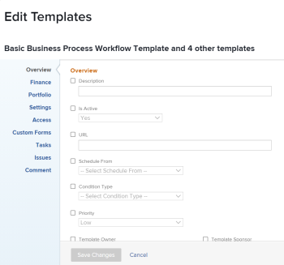

# 编辑项目模板

<!--drafted
The highlighted information on this page refers to functionality not yet generally available. It is available only in the Preview environment. 
-->

<!--
<The Resource Pools part also duplicates in the "Working with Resource Pools" article

-->

您可以编辑项目模板以反映项目流程和设置中的更改。 在模板上更新并保存更改后，当使用模板创建项目时，新项目中会显示新更改。 您对模板所做的更改不会反映在当前使用该模板的项目中。

## 访问要求

您必须具有以下访问权限才能执行本文中的步骤：

<table style="table-layout:auto"> 
 <col> 
 <col> 
 <tbody> 
  <tr> 
   <td role="rowheader">Adobe Workfront计划*</td> 
   <td> 
任意 
 </td> 
  </tr> 
  <tr> 
   <td role="rowheader">Adobe Workfront许可证*</td> 
   <td> 
计划 
 </td> 
  </tr> 
  <tr> 
   <td role="rowheader">访问级别*</td> 
   <td> 
编辑对模板的访问权限
 
如果您仍然没有访问权限，请咨询Workfront管理员，他们是否在您的访问级别设置了其他限制。 有关对模板的访问信息，请参阅 <a href="../../../administration-and-setup/add-users/configure-and-grant-access/grant-access-templates.md" class="MCXref xref">授予对模板的访问权限</a>. 有关Workfront管理员如何更改访问级别的信息，请参阅 <a href="../../../administration-and-setup/add-users/configure-and-grant-access/create-modify-access-levels.md" class="MCXref xref">创建或修改自定义访问级别</a>. 
 </td> 
  </tr> 
  <tr> 
   <td role="rowheader">对象权限</td> 
   <td> 
    <ul> 
     <li> 
向模板贡献权限，以在“模板详细信息”选项卡中对其进行编辑
 </li> 
     <li> 
在“编辑模板”框中管理模板的权限以对其进行编辑
 </li> 
    </ul> 
 有关模板权限的信息，请参阅 <a href="../../../workfront-basics/grant-and-request-access-to-objects/share-a-template.md" class="MCXref xref">共享模板</a>. 
 
有关请求其他访问权限的信息，请参阅 <a href="../../../workfront-basics/grant-and-request-access-to-objects/request-access.md" class="MCXref xref">请求对对象的访问 </a>.
 </td> 
  </tr> 
 </tbody> 
</table>

*要了解您拥有的计划、许可证类型或访问权限，请联系您的Workfront管理员。

## 编辑模板 {#edit-a-template}

<!--
Editing a template differs depending on what environment you choose. 

### Edit a template in the Production environment {#edit-a-template-in-the-production-environment} 

1. Go to the template you want to edit.
1. (Conditional) To edit limited information about the template,  click **Template Details** in the left panel, then go to the areas listed in the left panel to edit information for each area. 
1. To edit information in the Details section, click the **Edit** icon , then select from any of the areas below, or click **Edit all** to edit information in all areas:

   * Overview
   * Custom Forms

     Names of customs forms display only if there are custom forms attached to the object.
   
   * Finance

   >[!TIP]
   >
   >For information about all fields that display in the Details area, continue with editing all fields using the Edit Template box below.

1. (Conditional) To edit all information about the template, click the **More** menu  next to the name of the template, then click **Edit**.

   The **Edit Template** box opens. The sections in this box contain the same fields available in  the Template Details section .

1. Consider editing information in any of the following sections:

   * [Overview](#overview) 
   * [Finance](#finance) 
   * [Portfolio](#portfolio) 
   * [Settings](#settings) 
   * [Access](#access) 
   * [Custom Forms](#custom-forms) 
   * [Tasks](#tasks) 
   * [Issues](#issues) 
   * [Comment](#comment)

### Overview {#overview}

1. Begin editing your template as described above.
1. In the **Edit Template** box, click **Overview**.

   

1. Update the following fields:

   <table style="table-layout:auto"> 
    <col> 
    <col> 
    <tbody> 
     <tr> 
      <td role="rowheader"><strong>Name</strong></td> 
      <td>Specify a name for the template.</td> 
     </tr> 
     <tr> 
      <td role="rowheader"><strong>Description</strong></td> 
      <td>Add additional information about the template.</td> 
     </tr> 
     <tr> 
      <td role="rowheader"><strong>Is Active</strong></td> 
      <td>
Select this checkbox if you want the template to be active. Other users can find this template and attach it to projects when creating projects. Deselect this checkbox if you want to deactivate templates that are no longer used. Deactivated templates cannot be attached to projects. This is enabled by default. 

<b>TIP</b>
      
      You can deactivate a template from the template header as described in the [Activate or deactivate a template](#activate-or-deactivate-a-template) section in this article.
</td> 
     </tr> 
     <tr> 
      <td role="rowheader"><strong>URL</strong></td> 
      <td>Specify a web link that relates to information about this template.</td> 
     </tr> 
     <tr> 
      <td role="rowheader"><strong>Schedule From</strong></td> 
      <td>
Specify whether the project using this template is scheduled from the <strong>Start Date</strong>, or from the <strong>Completion Date</strong>. This selection determines the planned dates of the future tasks on the project using this template. 

Select from the following: 
 
       <ul> 
        <li>
<strong>Schedule From Start Date</strong>: The Start Date of the template is actually the Start Day. When you schedule a template from Start Date, Adobe Workfront calculates the Completion Day of the template based on the Duration of all the template tasks. The Start Day of the template becomes the Planned Start Date of the future project.
</li> 
        <li>
<strong>Schedule from Completion Date</strong>: The Completion Date of the template is actually the Completion Day. When you schedule a template from Completion Date, Workfront calculates the Start Day of the template based on the Duration of all the template tasks. The Completion Day of the template becomes the Planned Completion Date of the future project. 
</li> 
       </ul>
For more information about the Start and Completion Days of template tasks, see <a href="../../../manage-work/projects/create-and-manage-templates/overview-of-start-completion-day-on-template.md" class="MCXref xref">Overview of Start and Completion Days in a template</a>. 

The Schedule From setting for templates is similar to that of projects. Your Workfront administrator selects the default Schedule From setting for the projects in your system. For information about setting project defaults, see <a href="../../../administration-and-setup/set-up-workfront/configure-system-defaults/set-project-preferences.md" class="MCXref xref">Configure system-wide project preferences</a>.
</td> 
     </tr> 
     <tr> 
      <td role="rowheader"><strong>Condition Type</strong></td> 
      <td>
Select between the following Condition Types:
 
       <ul> 
        <li><strong>Manual:</strong> The project owner sets the Condition of the project on the project manually. <strong></strong></li> 
        <li><strong>Progress Status:</strong> Workfront automatically sets the Condition of the future project based on the Progress Status of tasks on the Critical Path. For more information about understanding Progress Status, see <a href="../../../manage-work/tasks/task-information/task-progress-status.md" class="MCXref xref">Task Progress Status overview</a>.</li> 
       </ul></td> 
     </tr> 
     <tr> 
      <td role="rowheader"><strong>Priority</strong></td> 
      <td>
This is just a visual flag for you which allows you to prioritize your future projects. Select from the following options:
 
       <ul> 
        <li>
<strong>None</strong>
</li> 
        <li>
<strong>Low</strong>
</li> 
        <li>
<strong>Normal</strong>
</li> 
        <li>
<strong>High</strong>
</li> 
        <li>
<strong>Urgent</strong>
</li> 
       </ul>

Depending on the Project Preferences selected by your Workfront administrator, the names of priorities might be different for you. For more information about editing priorities, see <a href="../../../administration-and-setup/customize-workfront/creating-custom-status-and-priority-labels/create-customize-priorities.md" class="MCXref xref">Create and customize priorities</a>.

</td> 
     </tr> 
     <tr> 
      <td role="rowheader"><strong>Template Owner</strong></td> 
      <td>
The user who is designated as the Template Owner must be a Workfront active user. 

Consider the following about the user designated as the Template Owner: 
 
       <ul> 
        <li>They are automatically given Manage permissions to the template. </li> 
        <li>They are added to the project team and are automatically given Manage permissions to the project created from the template. </li> 
        <li>They become the Project Owner, when the project is created from this template. </li> 
       </ul></td> 
     </tr> 
     <tr> 
      <td role="rowheader"><strong>Template Sponsor</strong></td> 
      <td>
The user specified in this field becomes the Project Sponsor, when the template is added to the project. This user is added to the project team and is automatically given view permissions to the project. The user who is designated as the Template Sponsor must be a Workfront active user. 
</td> 
     </tr> 
     <tr> 
      <td role="rowheader"><strong>Resource Manager</strong></td> 
      <td>
The specified users are automatically given manage permissions to the future projects and can assign resources to the tasks and issues of the projects. You can specify more than one Resource Manager. 
</td> 
     </tr> 
     <tr data-mc-conditions="QuicksilverOrClassic.Quicksilver"> 
      <td role="rowheader"><strong>Group</strong></td> 
      <td>
In the drop-down list, select the group that you want to be associated with projects created from the template. It can be a group of any level. 

You can make sure you are selecting the right group by hovering over it and clicking the information icon  that displays next to it. This displays a tooltip listing information about the group, such as the hierarchy of groups above it and its administrators.
 
<b>NOTES</b>
      
    <ul> 
    <li>
In the Projects area on a group's page, when someone creates a project using a template that doesn't have a group selected, the system associates the currently open group with the project.

This is different from other areas where the system associates a user's Home Group with the project when the user creates the project using a template that doesn't have a group selected.

    </li> 
      <li>
If a user selects a template that has a group selected while creating a project—or while converting a task or issue to a project—the user can choose a different group for the project.
</li> 
      <li>Though this field is available in templates only in the new Adobe Workfront experience, you can see it in lists and reports both there and in Adobe Workfront Classic. </li> 
      </ul> 
</td> 
     </tr> 
     <tr> 
      <td role="rowheader"><strong>Company</strong></td> 
      <td>
Specify the Company that you want to associate with the template. Only active companies display in the list.
</td> 
     </tr> 
    </tbody> 
   </table>

1. (Optional) Continue editing the following sections, depending on the information you want to modify.

   Or

   Click **Save Changes**.

### Finance {#finance}

1. Begin editing your template as described above.
1. In the **Edit Template** box, click **Finance**.

   

1. Update the following fields:

   <table style="table-layout:auto"> 
    <col> 
    <col> 
    <tbody> 
     <tr> 
      <td role="rowheader"><strong>Performance Index Method</strong></td> 
      <td>
Specify whether the Earned Value metrics of the future project are calculated using hours or costs. For more information about the Performance Index Method, see <a href="../../../manage-work/projects/project-finances/set-pim.md" class="MCXref xref">Set the Performance Index Method (PIM)</a>. 
</td> 
     </tr> 
     <tr> 
      <td role="rowheader"><strong>Budget</strong></td> 
      <td>
Specify a Budget for the projects that are created from this template.
</td> 
     </tr> 
     <tr> 
      <td role="rowheader"><strong>Fixed Cost</strong></td> 
      <td>
Specify the Fixed Cost for the projects that are created from this template. This is different than the Labor Cost which comes from the hours on the project and the Expense Cost which comes from the amount of expenses on the project. The Fixed Cost of a project is taken into account when calculating the Net Value of a project and it is part of the Budgeted Cost.
</td> 
     </tr> 
     <tr> 
      <td role="rowheader"><strong>Fixed Revenue</strong></td> 
      <td>
Specify the Fixed Revenue for the projects that are created from this template.
</td> 
     </tr> 
     <tr> 
      <td role="rowheader"><strong>Template Currency</strong></td> 
      <td>
Specify the currency for the future project, if it is different than the default currency of your system. This field is not visible if you have only the default currency in the system. For more information about currency, see <a href="../../../administration-and-setup/manage-workfront/exchange-rates/set-up-exchange-rates.md" class="MCXref xref">Set up exchange rates</a>.
</td> 
     </tr> 
     <tr> 
      <td role="rowheader"><strong>Require time to be approved for this project</strong></td> 
      <td>
Select this option to require the Project Owner of the future project created from this template to approve time logged on the project. If you are using Billing Records and you select this option, only the approved hours on the project appear as available billable hours for the Billing Records. Approving time on the project is independent of approving timesheets. For more information about requiring time to be approved on a project, see <a href="../../../manage-work/projects/manage-projects/require-time-approval-for-projects.md" class="MCXref xref">Require time to be approved for a project</a>.
</td> 
     </tr> 
    </tbody> 
   </table>

1. (Optional) Continue editing the following sections, depending on the information you want to modify.

   Or

   Click **Save Changes**.

### Portfolio {#portfolio}

1. Begin editing your template as described above.
1. In the **Edit Template** box, click **Portfolio**.

   

1. Update the following fields:

   <table style="table-layout:auto">
    <col> 
    <tbody> 
     <tr> 
      <td role="rowheader"><strong>Portfolio</strong></td> 
      <td>
Specify a Portfolio for the projects that are created from this template. You must create a Portfolio first, before it appears in the drop-down list. 

Only active portfolios display in the list. For more information about creating portfolios, see <a href="../../../manage-work/portfolios/create-and-manage-portfolios/create-portfolios.md" class="MCXref xref">Create a portfolio </a>.
</td> 
     </tr> 
     <tr> 
      <td role="rowheader"><strong>Program</strong></td> 
      <td>
If you selected a Portfolio for the template, specify a <strong>Program</strong> for the future project. Some Portfolios might not have Programs. You must create a Program first, before it appears in this drop-down list. Only active programs display in the list.

For more information about creating programs, see <a href="../../../manage-work/portfolios/create-and-manage-programs/create-program.md" class="MCXref xref">Create a program</a>.
</td> 
     </tr> 
     <tr> 
      <td role="rowheader"><strong>Planned Benefit</strong></td> 
      <td>
Specify the Planned Benefit of the projects that are created from this template. The Planned Benefit is used in the Business Case of the project and the Portfolio Optimizer. 

For more information about the Planned Benefit of a project, see <a href="../../../manage-work/projects/project-finances/project-planned-benefit.md" class="MCXref xref">Overview of project Planned Benefit</a>. The Planned Benefit of a project is taken into account when the Net Value of a project is calculated. 

For more information about using the Portfolio Optimizer, see <a href="../../../manage-work/portfolios/portfolio-optimizer/manage-projects-in-portfolio-optimizer.md" class="MCXref xref">Manage projects in the Portfolio Optimizer</a> 
</td> 
     </tr> 
    </tbody> 
   </table>

1. (Optional) Continue editing the following sections, depending on the information you want to modify.

   Or

   Click **Save Changes**.

### Settings {#settings}

1. Begin editing your template as described above.
1. In the **Edit Template** box, click **Settings**.

   

1. Update the following fields: 

   <table style="table-layout:auto"> 
    <col> 
    <col> 
    <tbody> 
     <tr> 
      <td role="rowheader"><strong>Milestone Path</strong> </td> 
      <td> 
Select a Milestone Path for the template. Only active milestone paths display in the list. For more information about Milestone Paths, see <a href="../../../administration-and-setup/customize-workfront/configure-approval-milestone-processes/create-milestone-path.md" class="MCXref xref">Create a milestone path</a>.
 </td> 
     </tr> 
     <tr> 
      <td role="rowheader"><strong>Completion Mode</strong> </td> 
      <td> 
Controls how the future project will be marked as Complete.  Select from the following options:
 
       <ul> 
        <li> 
<strong>Automatic</strong>: The project is marked Complete when all the tasks and issues are completed.
 </li> 
        <li> 
<strong>Manual</strong>: You have to manually select the Complete status for the project, when all the tasks and issues are completed. 
 </li> 
       </ul> </td> 
     </tr> 
     <tr> 
      <td role="rowheader"><strong>Summary Completion Mode</strong> </td> 
      <td> 
Controls how the parent tasks on the future project are marked as Complete.  Select from the following options:
 
       <ul> 
        <li> 
<strong>Automatic</strong>: The parent tasks are marked Complete and they update their percent complete automatically, as the children tasks are completed and the percent complete of the children is updated. 
 </li> 
        <li> 
<strong>Manual</strong>: You have to manually update the percent complete and the status of the parent tasks, independently of what changes are made to the children tasks. 
 </li> 
       </ul> </td> 
     </tr> 
     <tr> 
      <td role="rowheader"><strong>Update Type</strong> </td> 
      <td> 
Controls when the changes you make to the timeline of the future project are saved on the project. 
 
       <b>EXAMPLE </b> 
        
The following changes to the project trigger an update to the timeline of the project:
 
        <ul> 
         <li> 
update the dates of tasks
 </li> 
         <li> 
change predecessor relationships 
 </li> 
         <li> 
change parent-child relationships
 </li> 
         <li> 
add or remove assignments in addition to changing the task constraint or duration type.
 </li> 
        </ul> 
       
 
Select from the following options: 
 
       <ul> 
        <li> 
<strong>Automatic and On Change</strong> (Default setting): The future project timeline is updated each time a change occurs in the project or in another project that the timeline is dependent on (On Change). The project timeline is also updated each night (Automatic). This is the recommended setting for this field because it ensures that the project timeline is always up to date. When you perform an action on a task or project that triggers a timeline recalculation, all available dates are immediately displayed, allowing you to continue working. On projects with more than 100 tasks, dates that require longer recalculations display briefly as a question mark (between 1 and 5 seconds, or up to a minute for large projects). This indicates that the recalculation is not yet finished, and the dates are subject to change. 
 </li> 
       </ul> 
       <ul> 
        <li> 
<strong>Change Only</strong>: The project timeline is updated each time a change occurs in the project or in another project that the timeline is dependent on. You might want to select this option if changes rarely occur in the project or in other projects that the timeline is dependent on. 
 </li> 
       </ul> 
       <ul> 
        <li> 
<strong>Automatic Only</strong>: The project timeline is updated each night; it is not updated immediately after changes are made. You might want to select this option if many changes occur each day in the project or in other projects that the timeline is dependent on. However, be aware that you chose this setting, as the project will not update at the same time that the changes are made. 
 </li> 
       </ul> 
       <ul> 
        <li> 
<strong>Manual Only</strong>: The project timeline is updated only when you select the option to Recalculate Timelines, as described in <a href="../../../manage-work/projects/manage-projects/recalculate-project-timeline.md" class="MCXref xref">Recalculate project timelines</a>. 
 </li> 
       </ul> 
You might want to select this option if you are making many changes to the project at one time, and you want the timeline recalculation to occur after all of the changes have been made (rather than after each individual change).
 </td> 
     </tr> 
     <tr> 
      <td role="rowheader"><strong>Schedule</strong> </td> 
      <td> 
Select a schedule for your template. This will become the schedule of the project that is created from this template. This should be the same schedule assigned to most people that are working on the project. You must create a schedule before you can assign it to a template. For more information about creating schedules, see <a href="../../../administration-and-setup/set-up-workfront/configure-timesheets-schedules/create-schedules.md" class="MCXref xref">Create a schedule</a>.  If you have not created custom schedules in your system, the Default Schedule is selected. 
 </td> 
     </tr> 
     <tr> 
      <td role="rowheader"><strong>User Time Off</strong> </td> 
      <td> 
Determines whether the time off of the Primary Assignee of a task adjusts the task planned dates. When you attach the template to an existing project, and the template has a different setting for this field than the project, the setting on the project remains unchanged. The default option for this setting for a new template is the same as the system-level project preference. 
 
For information about the project preferences at the System level, see <a href="../../../administration-and-setup/set-up-workfront/configure-system-defaults/set-project-preferences.md" class="MCXref xref">Configure system-wide project preferences</a>. 
 
For information about how this setting affects the task dates on a project, see <a href="../../../manage-work/projects/manage-projects/edit-projects.md" class="MCXref xref">Edit projects</a>. Select from the following options: 
 
       <ul> 
        <li> 
<strong>Consider user time off in task durations</strong>: When selecting this option, the planned dates of the tasks on the project created from this template adjust according to the time off of the Primary Assignee of the task, if the time off occurs during the duration of the task. 
 </li> 
        <li> 
<strong>Ignore user time off in task durations</strong>: When selecting this option, the planned dates of the tasks on the project created from this template remain as originally planned, even if the Primary Assignee of the task has time off during the duration of the task. 
 </li> 
       </ul> </td> 
     </tr> 
     <tr> 
      <td role="rowheader"><strong>Resource Leveling Mode</strong> </td> 
      <td> 
Select from the following options: 
 
       <ul> 
        <li> 
<strong>Manual</strong>: you must manually level your resources on the project created from this template (this is the default setting)
 </li> 
        <li> 
<strong>Automatic:</strong> Workfront levels the resources on the future project.  For more information about Resource Leveling, see <a href="../../../manage-work/gantt-chart/use-the-gantt-chart/level-resources-in-gantt.md" class="MCXref xref">Level Resources in the Gantt Chart </a>. 
 </li> 
       </ul> </td> 
     </tr> 
     <tr> 
      <td role="rowheader"><strong>Risk</strong> </td> 
      <td> 
Define the level of risk of the projects created from this template. The risk is just an indicator of how risky a project can be. You can prioritize the execution of your projects based on the level of risk. Consider selecting from the following levels of risk: 
 
       <ul> 
        <li> 
<strong>Very Low</strong> 
 </li> 
        <li> 
<strong>Low</strong> 
 </li> 
        <li> 
<strong>Medium</strong> 
 </li> 
        <li> 
<strong>High</strong> 
 </li> 
        <li> 
<strong>Very High</strong> 
 </li> 
       </ul> </td> 
     </tr> 
     <tr> 
      <td role="rowheader"><strong>Resource Pools</strong> </td> 
      <td> 
Specify the resource pools associated with the template. Resource pools are collections of users that are needed at the same time for the completion of a project. For more information about resource pools, see <a href="../../../resource-mgmt/resource-planning/resource-pools/work-with-resource-pools.md" class="MCXref xref"> Resource pools overview </a>.
 
 
<b>NOTE</b> 
      
      When you edit templates in bulk, only the resource pools that are common to all the templates selected appear in this field. If the templates selected have no shared resource pools, this field will be empty. The resource pools you specify here will overwrite the templates' individual resource pools.
 
 </td> 
     </tr> 
     <tr> 
      <td role="rowheader"><strong>Approval Process</strong> </td> 
      <td> 
Select the approval process you want to associate with the template. Your Workfront administrator or a user with administrative access to Approval Processes must define system-level or group-level project approval processes before you can associate them with a template. For more information about creating approval processes, see <a href="../../../administration-and-setup/customize-workfront/configure-approval-milestone-processes/create-approval-processes.md" class="MCXref xref">Create an approval process for work items</a>.
 
Consider the following when adding approval processes: 
 
      <ul> 
      <li>Only active approval processes display in the list. </li> 
      <li> 
System-wide and group-specific approval processes display in the list. An approval process associated with a group other than that of the template does not display in the list.
 
<b>IMPORTANT</b> 
      
      If the group associated with the template changes, the group-specific approval process becomes a single-use approval process. For more information about how changes to the group of the project or changes in the approval process affect approval settings, see <a href="../../../administration-and-setup/customize-workfront/configure-approval-milestone-processes/how-changes-affect-group-approvals.md">How group and approval process changes affect assigned approval processes</a>. 
 </li> 
      <li> 
If you added a single-use approval process, it displays as "Custom" in this field. For information, see <a href="../../../review-and-approve-work/manage-approvals/associate-approval-with-work.md" class="MCXref xref">Associate a new or existing approval process with work</a>. 
 
      </li> 
      <li> 
When bulk-editing templates, the following scenarios exist:
 
      <ul> 
         <li> 
When you select templates from the same group, both system-level and group-level approval processes display in this field.
 </li> 
         <li> 
When you select templates from different groups, only system-level approval processes display in this field.
 </li> 
         <li> 
When any of the templates has a single-use approval process attached, it is replaced by the system-level you select. 
 </li> 
      </ul> </li> 
      </ul> </td> 
     </tr> 
     <tr> 
      <td role="rowheader"><strong>Filter Hour Types</strong> </td> 
      <td> 
Consider the following:
 
Select <strong>No</strong> to make all project-specific hour types available on the future project. (This is the default selection)
 
Or
 
Select <strong>Yes</strong> to make only a subset of the project-specific hour types available on the future project, then select the hour types you want to make available. (Hold the Shift key to select multiple hour types.)
 
If you select this option, only the hour types you select are made available to select when logging hours on the project (or on tasks and issues within the project). You must select at least one hour type; if you select this option and you do not select any hour types, all hour types are made available on the project.
 
The same hour type selections must be made at the individual user level in order for the user to see these hour type options on the project. 
 
For more information about defining hour types at the user level, see the section <a href="../../../timesheets/create-and-manage-timesheets/log-time.md#understa" class="MCXref xref">Log time</a> in <a href="../../../timesheets/create-and-manage-timesheets/log-time.md" class="MCXref xref">Log time</a>.
 </td> 
     </tr> 
     <tr> 
      <td role="rowheader"><strong>Reminder Notification</strong> </td> 
      <td>Select the Reminder Notification that should be associated with the future project. You must configure Reminder Notifications for projects for this field to appear during editing a template.  For more information about configuring Reminder Notifications, see <a href="../../../administration-and-setup/manage-workfront/emails/set-up-reminder-notifications.md" class="MCXref xref">Set up reminder notifications</a>.</td> 
     </tr> 
    </tbody> 
   </table>

1. (Optional) Continue editing the following sections, depending on the information you want to modify.  
   Or
1. Click **Save Changes**.

### Access {#access}

1. Begin editing your template as described above.
1. In the **Edit Template** box, click **Access**.

   

   The Access you specify for your template will become the Access of users associated with the project when the template is used to create a project.

   Specify the following **Access** information for the template:

   <table style="table-layout:auto"> 
    <col> 
    <col> 
    <tbody> 
     <tr> 
      <td role="rowheader"><strong>When someone is assigned to a task</strong> </td> 
      <td> 
Select from <strong>View</strong>, <strong>Contribute,</strong> or <strong>Manage</strong> access to a task. The user assigned to a task is automatically granted this access to the task. 
 </td> 
     </tr> 
     <tr> 
      <td role="rowheader"><strong>Also grant access to the project</strong> </td> 
      <td> 
 Select from <strong>View</strong>, <strong>Contribute</strong>, or <strong>Manage</strong> access to the project. The user assigned to a task is automatically granted this access to the project, as well. 
 </td> 
     </tr> 
     <tr> 
      <td role="rowheader"><strong>When someone is assigned to an issue</strong> </td> 
      <td> 
Select from <strong>View</strong>, <strong>Contribute,</strong> or <strong>Manage</strong> access to an issue. The user assigned to an issue is automatically granted this access to the issue. 
 </td> 
     </tr> 
     <tr> 
      <td role="rowheader"><strong>Also grant access to the project</strong> </td> 
      <td> 
 Select from <strong>View</strong>, <strong>Contribute</strong>, or <strong>Manage</strong> access to the project. The user assigned to an issue is automatically granted this access to the project, as well. 
 </td> 
     </tr> 
     <tr> 
      <td role="rowheader"><strong>When someone submits a request: Give them access</strong> </td> 
      <td> 
 Select from <strong>View</strong>, <strong>Contribute</strong>, or <strong>Manage</strong> access to the request. When they submit a request to the project, they are granted this access to the request they submitted. For more information, see <a href="../../../workfront-basics/grant-and-request-access-to-objects/share-an-issue.md" class="MCXref xref">Share an issue </a>.
 </td> 
     </tr> 
     <tr> 
      <td role="rowheader"><strong>People from the same company will inherit the same permissions for all requests</strong> </td> 
      <td> 
Select this field if you want people from the same company to have the same access to all the requests on the project, whether they submitted them or not.
 </td> 
     </tr> 
     <tr> 
      <td role="rowheader"><strong>When someone is given access to this project: Give them access to ...</strong> </td> 
      <td> 
Select the access options that you want users to have on the project, if the project is shared with them. Select the specific options for their access, if they are designated as <strong>Viewers</strong>, <strong>Contributors</strong>, or <strong>Managers</strong> when sharing the project with them. 
 </td> 
     </tr> 
    </tbody> 
   </table>

1. (Optional) Continue editing the following sections, depending on the information you want to modify.

   Or

   Click **Save Changes**.

### Custom Forms {#custom-forms}

1. Begin editing your template as described above.
1. In the **Edit Template** box, click **Custom Forms**.

   

1. Select the custom form or forms that you want to associate with the template. You must build the custom forms before they are available to select in this field.

   Only active custom forms display in the list. For more information about building custom forms, see [Create or edit a custom form](../../../administration-and-setup/customize-workfront/create-manage-custom-forms/create-or-edit-a-custom-form.md).

   You can add up to ten custom forms to a template.

   The forms will be added to the project that is created from this template. 

1. (Optional) Continue editing the following section, depending on the information you want to modify.

   Or

   Click **Save Changes**.

### Tasks {#tasks}

You can define the defaults that will be associated with all the new tasks when you add them to a project that is created from the template.

For information about how these settings affect creating new tasks, see [Create tasks overview](../../../manage-work/tasks/create-tasks/create-tasks-overview.md).

1. Begin editing your template as described above.
1. In the **Edit Template** box, click **Tasks**.

   

1. In the **Task Default Approval Process** box, select the Approval Process you want to associate with all new tasks when you add them to a project created from this template. You must create an Approval Process for tasks before you can associate it with tasks. Only active approval processes display in the list. For more information about creating Approval Processes, see [Creating Approval Processes](../../../administration-and-setup/customize-workfront/configure-approval-milestone-processes/create-approval-processes.md).
1. In the **Task Default Custom Forms** box, select the custom form or forms that you want to associate with all new tasks when you add them to a project created from this template. You must build the custom forms before they are available to select in this field. Only active custom forms display in the list. For more information about building custom forms, see [Creating Custom Forms](../../../administration-and-setup/customize-workfront/create-manage-custom-forms/create-or-edit-a-custom-form.md). You can associate up to ten custom forms with a task.
1. (Optional) **Select Use Work Effort to automatically calculate task Planned Hours** if you want to enable managing task effort by using&nbsp;Work Effort instead of Planned Hours in the project created from the template.
1. (Conditional and optional) If you selected Use Work Effort to automatically calculate task Planned Hours, click the drop-down menu to update the percentage for each level of Work Effort. The following percentage values are the defaults:
 
   | Work Effort level |Percentage value|
   |---|---|
   | Small |25% |
   | Medium |50% |
   | Large |75% |

  For information about using Work Effort to manage the effort on tasks on projects, see [Work Effort overview](../../../manage-work/tasks/task-information/work-effort.md).

1. (Optional) Continue editing the following section, depending on the information you want to modify.

   Or

   Click **Save Changes**.

### Issues {#issues}

By editing issue settings, you can prevent users from adding issues inline in the future project created from the template.

1. Begin editing your template as described above.
1. In the **Edit Template** box, click **Issues**.

   

1. (Optional) Deselect the **Allow users to add issues inline** option. It is enabled by default.

   When disabling this option users cannot add issues inline to the project or the tasks in the Issues section, when the project is created from the template.

   >[!TIP]
   >
   >Disable this option if you want to enforce users to complete the New Issue Fields or the custom forms associated with new issues.

   When disabling this option, users with permissions to add issues to the project created from the template can do so by using the New Issue button or a request queue associated with the project.

   For more information about configuring issue settings on projects, see the [Issue Settings](../../../manage-work/projects/manage-projects/edit-projects.md#issue) section in the article [Edit projects](../../../manage-work/projects/manage-projects/edit-projects.md).

   For information about creating issues on projects, see [Create issues](../../../manage-work/issues/manage-issues/create-issues.md). 

1. (Optional) Continue editing the following section, depending on the information you want to modify.

   Or

   Click **Save Changes**.

### Comment {#comment}

1. Begin editing your template as described above.
1. In the **Edit Template** box, click **Comment**.

   

1. Specify a comment that you want to display in the updates stream of the template in the available field.

   This comment is visible for everyone with View access to the template and with access to view Notes.

1. Click **Save Changes**.

   Your changes will be submitted for this template.

   Now, when you use this template to create a project all these settings will transfer to the new project.

   <!--drafted section below for the edit template story: 
   remove this tag and add the Preview blurb at the top of this article in yellow, if it's not already there. Keep the "div class" tags below until 23.1 production: 

### Edit a template in the Preview environment {#edit-a-template-in-the-preview-environment}
-->

1. 转到要编辑的模板。
1. （视情况而定）要编辑有关模板的有限信息，请单击 **模板详细信息** 在左侧面板中，转到左侧面板中列出的区域以编辑每个区域的信息。
1. 要编辑详细信息部分中的信息，请单击 **编辑** 图标 ，然后从下面的任意区域进行选择，或单击 **编辑全部** 要编辑所有区域的信息，请执行以下操作：

   * 概述
   * 自定义表单

   只有在对象附有自定义表单时，海关表单的名称才会显示。

   * 财务
   >[!TIP]
   >
   >有关“详细信息”区域中显示的所有字段的信息，请继续使用下面的“编辑模板”框编辑所有字段。

1. （视情况而定）要编辑有关模板的所有信息，请单击 **更多** 菜单  在模板名称旁边，单击 **编辑**.

   的 **编辑模板** 框中。 此框中的部分包含模板详细信息部分中提供的相同字段。

1. 请考虑在以下任一部分中编辑信息：

   * [模板名称](#template-name)
   * [概述](#overview-preview)
   * [财务](#finance-preview)
   * [自定义表单](#custom-forms-preview)
   * [项目设置](#project-settings)
   * [任务设置](#task-settings)
   * [问题设置](#issue-settings)
   * [访问权限](#access-preview)

### 模板名称{#template-name}

1. 按如上所述开始编辑模板。
1. 在 **编辑模板** 框，单击 **模板名称**.
1. （可选）根据要修改的信息，继续编辑以下部分

   或

   单击&#x200B;**保存**。

### 概述 {#overview-preview}

1. 按如上所述开始编辑模板。
1. 在 **编辑模板** 框，单击 **概述**.

   

1. 更新以下字段：

   <table style="table-layout:auto"> 
       <col> 
       <col> 
       <tbody> 
         <tr> 
         <td role="rowheader"><strong>描述</strong></td> 
         <td>添加有关模板的其他信息。</td> 
       </tr> 
         <tr> 
         <td role="rowheader"><strong>优先级</strong></td> 
         <td>
这只是一个可视标记，允许您对未来项目进行优先排序。 从以下选项中进行选择：
 
         <ul> 
         <li>
<strong>无</strong>
</li> 
         <li>
<strong>低</strong>
</li> 
         <li>
<strong>正常</strong>
</li> 
         <li>
<strong>高</strong>
</li> 
         <li>
<strong>紧急</strong>
</li> 
         </ul>

根据Workfront管理员选择的项目首选项，优先级名称可能会因您而异。 有关编辑优先级的更多信息，请参阅 <a href="../../../administration-and-setup/customize-workfront/creating-custom-status-and-priority-labels/create-customize-priorities.md" class="MCXref xref">创建和自定义优先级</a>.

</td> 
       </tr> 
       <tr> 
       <td role="rowheader"><strong>URL</strong></td> 
         <td>指定与此模板相关的信息相关的Web链接。</td> 
       </tr>
       <tr> 
       <td role="rowheader"><strong>完成情况类型</strong></td> 
       <td>
在以下条件类型之间进行选择：
 
         <ul> 
         <li><strong>手动：</strong> 项目所有者在项目上手动设置项目的条件。 <strong></strong></li> 
         <li><strong>进度状态：</strong> Workfront会根据关键路径上任务的进度状态自动设置未来项目的条件。 有关了解进度状态的详细信息，请参阅 <a href="../../../manage-work/tasks/task-information/task-progress-status.md" class="MCXref xref">任务进度状态概述</a>.</li> 
       </ul>
         </td> 
         </tr> 
       <tr> 
         <td role="rowheader"><strong>时间表模式</strong></td> 
         <td>
指定是否计划从 <strong>开始日期</strong>，或 <strong>完成日期</strong>. 此选择使用此模板确定项目上未来任务的计划日期。 

从以下选项中进行选择： 
 
       <ul> 
       <li>
<strong>从开始日期开始计划</strong>:模板的开始日期实际上是开始日期。 从开始日期计划模板时，Adobe Workfront会根据所有模板任务的持续时间计算模板的完成日。 模板的开始日期将变为将来项目的计划开始日期。
</li> 
       <li>
<strong>从完成日期开始的计划</strong>:模板的完成日期实际上是完成日。 从完成日期计划模板时，Workfront会根据所有模板任务的持续时间计算模板的开始日。 模板的完成日将变为未来项目的计划完成日期。 
</li> 
       </ul>
有关模板任务的开始和完成天数的详细信息，请参阅 <a href="../../../manage-work/projects/create-and-manage-templates/overview-of-start-completion-day-on-template.md" class="MCXref xref">模板中的开始和完成天数概述</a>. 

模板的“计划自”设置与项目设置类似。 您的Workfront管理员会为您系统中的项目选择默认的计划来源设置。 有关设置项目默认值的信息，请参阅 <a href="../../../administration-and-setup/set-up-workfront/configure-system-defaults/set-project-preferences.md" class="MCXref xref">配置系统范围的项目首选项</a>.
</td> 
       </tr>

   <tr> 
         <td role="rowheader"><strong>项目组合</strong></td> 
         <td>
为从此模板创建的项目指定Portfolio。 您必须先创建Portfolio，然后才能将其显示在下拉列表中。 

列表中仅显示有效的项目组合。 有关创建项目组合的更多信息，请参阅 <a href="../../../manage-work/portfolios/create-and-manage-portfolios/create-portfolios.md" class="MCXref xref">创建项目组合 </a>.
</td> 
       </tr> 
       <tr> 
         <td role="rowheader"><strong>项目群</strong></td> 
         <td>
如果您为模板选择了Portfolio，请指定 <strong>项目</strong> 为将来的项目。 某些Portfolio可能没有程序。 必须先创建程序，然后程序才会显示在此下拉列表中。 列表中仅显示活动程序。

有关创建程序的更多信息，请参阅 <a href="../../../manage-work/portfolios/create-and-manage-programs/create-program.md" class="MCXref xref">创建项目</a>.
</td> 
       </tr>  
       <tr data-mc-conditions="QuicksilverOrClassic.Quicksilver"> 
         <td role="rowheader"><strong>组</strong></td> 
         <td>
在下拉列表中，选择要与从模板创建的项目关联的组。 它可以是任意级别的组。 

您可以通过将鼠标悬停在正确的组上并单击信息图标来确保选择正确的组  显示在其旁边的。 此时会显示工具提示，其中列出了有关群组的信息，例如群组上的群组层次结构及其管理员。
 
<b>注释</b>

   <ul> 
       <li>
在群组页面的“项目”区域中，当有人使用未选择群组的模板创建项目时，系统会将当前打开的群组与项目关联。

这与当用户使用未选择组的模板创建项目时，系统将用户的主组与项目关联的其他区域不同。
</li> 
       <li>
如果用户在创建项目时选择了一个已选定组的模板（或在将任务或问题转换为项目时），则用户可以为项目选择其他组。
</li> 
       <li>尽管此字段仅在新的Adobe Workfront体验的模板中可用，但您可以在该体验的列表和报表中以及Adobe Workfront Classic中都看到该字段。 </li> 
         </ul> 
</td> 
       </tr> 
       <tr> 
         <td role="rowheader"><strong>公司</strong></td> 
         <td>
指定要与模板关联的公司。 列表中仅显示活动的公司。
</td> 
       </tr> 
       <tr> 
         <td role="rowheader"><strong>模板所有者</strong></td> 
         <td>
指定为模板所有者的用户必须是Workfront活动用户。 

请考虑以下关于指定为模板所有者的用户的信息： 
 
         <ul> 
         <li>系统会自动为模板授予“管理”权限。 </li> 
         <li>项目团队中会添加这些项目，并自动为使用模板创建的项目授予“管理”权限。 </li> 
         <li>当使用此模板创建项目时，这些用户即成为项目所有者。 </li> 
         </ul></td> 
       </tr> 
       <tr> 
         <td role="rowheader"><strong>模板提供方</strong></td> 
         <td>
将模板添加到项目后，此字段中指定的用户将成为项目赞助商。 此用户将添加到项目团队，并自动获得项目的查看权限。 指定为模板赞助商的用户必须是Workfront活动用户。 
</td> 
       </tr> 
       <tr> 
         <td role="rowheader"><strong>资源管理器</strong></td> 
         <td>
指定用户会自动获得对未来项目的管理权限，并可以为项目的任务和问题分配资源。 您可以指定多个资源管理器。 
</td> 
       </tr> 
      </table>

1. （可选）根据要修改的信息，继续编辑以下部分。

   或

   单击&#x200B;**保存**。

### 财务 {#finance-preview}

1. 按如上所述开始编辑模板。
1. 在 **编辑模板** 框，单击 **金融**.

   

1. 更新以下字段：

   <table style="table-layout:auto"> 
       <col> 
       <col> 
       <tbody>
       <tr> 
         <td role="rowheader"><strong> 货币</strong></td> 
         <td>
如果将来项目的货币与系统的默认货币不同，请指定该货币。 如果系统中只有默认货币，则此字段不可见。 有关货币的更多信息，请参阅 <a href="../../../administration-and-setup/manage-workfront/exchange-rates/set-up-exchange-rates.md" class="MCXref xref">设置汇率</a>.
</td> 
       </tr>
       <tr> 
       <td role="rowheader"><strong>预算</strong></td> 
       <td>
为从此模板创建的项目指定预算。
</td> 
       </tr>  
       <tr> 
         <td role="rowheader"><strong>绩效指数方法</strong></td> 
         <td>
选择Workfront如何计算未来项目的挣值量度。 从以下选项中进行选择：
         <ul>
         <li>基于小时</li>
         <li>基于成本</li>
         </ul>

   有关性能索引方法的详细信息，请参阅 <a href="../../../manage-work/projects/project-finances/set-pim.md" class="MCXref xref">设置性能索引方法(PIM)</a>. 
</td>
   </tr> 
         <tr> 
         <td role="rowheader"><strong>计划收益</strong></td> 
         <td>
指定从此模板创建的项目的计划效益。 “计划好处”用于项目和Portfolio优化程序的业务案例。 

有关项目计划效益的详细信息，请参阅 <a href="../../../manage-work/projects/project-finances/project-planned-benefit.md" class="MCXref xref">项目计划效益概述</a>. 在计算项目的净值时，会考虑项目的计划效益。 

有关使用Portfolio优化器的更多信息，请参阅 <a href="../../../manage-work/portfolios/portfolio-optimizer/manage-projects-in-portfolio-optimizer.md" class="MCXref xref">在Portfolio优化器中管理项目</a> 
</td> 
       </tr> 
       <tr> 
         <td role="rowheader"><strong>固定成本</strong></td> 
         <td>
为从此模板创建的项目指定固定成本。 这与项目工时产生的人工成本和项目费用金额产生的费用成本不同。 在计算项目的净值时，会考虑项目的固定成本，并且它是预算成本的一部分。
</td> 
       </tr> 
       <tr> 
       <td role="rowheader"><strong>固定收入</strong></td> 
       <td>
为通过此模板创建的项目指定固定收入。
</td> 
       </tr> 
       <tr> 
       <td role="rowheader"><strong>该项目需要批准时间</strong></td> 
       <td>
选择此选项可要求从此模板创建的未来项目的项目所有者批准项目的登录时间。 如果您使用“开单记录”并选择此选项，则只有项目上已批准的小时数才显示为“开单记录”的可计费小时数。 项目的批准时间与批准时间表无关。 有关需要在项目上获得批准的时间的详细信息，请参阅 <a href="../../../manage-work/projects/manage-projects/require-time-approval-for-projects.md" class="MCXref xref">需要时间来批准项目</a>.
</td> 
       </tr> 
       </tbody> 
      </table>

1. （可选）根据要修改的信息，继续编辑以下部分。

   或

   单击&#x200B;**保存**。

### 自定义表单 {#custom-forms-preview}

1. 按如上所述开始编辑模板。
1. 在 **编辑模板** 框，单击 **自定义Forms**.

   

   已附加到模板的自定义表单的名称将显示在左侧面板中。

1. 在 **添加自定义表单** 字段，然后选择要与模板关联的自定义表单。 您必须先构建自定义表单，然后才能在此字段中进行选择。

   列表中仅显示活动的自定义表单。 有关构建自定义表单的更多信息，请参阅 [创建或编辑自定义表单](../../../administration-and-setup/customize-workfront/create-manage-custom-forms/create-or-edit-a-custom-form.md).

   您最多可以在模板中添加10个自定义表单。

   表单将添加到从此模板创建的项目中。

1. （可选）更新自定义表单上任意字段中的信息。 信息将传输到将从模板创建的项目。

1. （可选）单击 **x** 图标，然后单击 **删除** 从模板中删除。

1. （可选）根据要修改的信息，继续编辑以下部分。

   或

   单击&#x200B;**保存**。

### 项目设置 {#project-settings}

1. 按如上所述开始编辑模板。
1. 在 **编辑模板** 框，单击 **项目设置**.

   

1. 更新以下字段：

   <table style="table-layout:auto"> 
       <col> 
       <col> 
       <tbody> 
       <tr> 
       <td role="rowheader"><strong>里程碑路径</strong> </td> 
       <td> 
为模板选择里程碑路径。 列表中仅显示活动的里程碑路径。 有关里程碑路径的更多信息，请参阅 <a href="../../../administration-and-setup/customize-workfront/configure-approval-milestone-processes/create-milestone-path.md" class="MCXref xref">创建里程碑路径</a>.
 </td> 
       </tr> 
       <tr> 
         <td role="rowheader"><strong>完成模式</strong> </td> 
         <td> 
控制将来项目标记为“完成”的方式。  从以下选项中进行选择：
 
         <ul> 
         <li> 
<strong>自动</strong>:完成所有任务和问题后，项目将标记为“完成”。
 </li> 
         <li> 
<strong>手动</strong>:完成所有任务和问题后，您必须手动选择项目的“完成”状态。 
 </li> 
         </ul> </td> 
       </tr> 
       <tr> 
       <td role="rowheader"><strong>摘要完成模式</strong> </td> 
       <td> 
控制将来项目中的父任务标记为“完成”的方式。  从以下选项中进行选择：
 
       <ul> 
       <li> 
<strong>自动</strong>:父任务被标记为“完成”，并且随着子任务的完成和子任务的完成百分比的更新，父任务会自动更新其完成百分比。 
 </li> 
       <li> 
<strong>手动</strong>:您必须手动更新父任务的完成百分比和状态，而与对子任务所做的更改无关。 
 </li> 
       </ul> </td> 
       </tr> 
       <tr> 
         <td role="rowheader"><strong>更新类型</strong> </td> 
         <td> 
控制您对未来项目时间轴所做的更改何时保存在项目上。 
 
         <b>示例 </b> 
         
对项目的以下更改会触发对项目时间轴的更新：
 
         <ul> 
         <li> 
更新任务日期
 </li> 
         <li> 
更改前置关系 
 </li> 
         <li> 
更改父子关系
 </li> 
         <li> 
除了更改任务约束或持续时间类型之外，还可添加或删除分配。
 </li> 
         </ul> 
         
 
从以下选项中进行选择： 
 
         <ul> 
         <li> 
<strong>自动和更改</strong> （默认设置）：每当项目或时间轴所依赖的其他项目中发生更改（取决于更改）时，将来的项目时间轴都会更新。 项目时间轴也会在每晚更新（自动）。 此字段是推荐的设置，因为它可确保项目时间轴始终为最新。 当您对触发时间轴重新计算的任务或项目执行操作时，将立即显示所有可用日期，从而允许您继续工作。 在任务超过100个的项目上，需要更长时间重新计算的日期会短暂地显示为问号（在1到5秒之间，或对于大型项目，最长为1分钟）。 这表示重新计算尚未完成，并且日期可能会发生更改。 
 </li> 
         </ul> 
         <ul> 
         <li> 
<strong>仅更改</strong>:每当项目或时间轴所依赖的其他项目中发生更改时，项目时间轴都会更新。 如果项目或时间轴所依赖的其他项目中很少发生更改，您可能需要选择此选项。 
 </li> 
         </ul> 
         <ul> 
         <li> 
<strong>仅自动</strong>:项目时间表每天晚上都会更新；所做的更改不会立即更新。 如果项目或时间轴所依赖的其他项目中每天发生许多更改，您可能需要选择此选项。 但请注意，您选择了此设置，因为项目不会在进行更改的同时进行更新。 
 </li> 
         </ul> 
         <ul> 
         <li> 
<strong>仅手动</strong>:仅当您选择“重新计算时间轴”选项时，项目时间轴才会更新，如 <a href="../../../manage-work/projects/manage-projects/recalculate-project-timeline.md" class="MCXref xref">重新计算项目时间表</a>. 
 </li> 
         </ul> 
如果您同时对项目进行多次更改，并且希望在所有更改（而不是在每次更改后）之后重新计算时间轴，则可能需要选择此选项。
 </td> 
       </tr> 
       <tr> 
         <td role="rowheader"><strong>计划</strong> </td> 
         <td> 
选择模板的计划。 这将成为从此模板创建的项目的计划。 这应该是分配给大多数正在项目中工作的人员的相同计划。 必须先创建计划，然后才能将其分配给模板。 有关创建计划的详细信息，请参阅 <a href="../../../administration-and-setup/set-up-workfront/configure-timesheets-schedules/create-schedules.md" class="MCXref xref">创建计划</a>.  如果尚未在系统中创建自定义计划，则会选中“默认计划”。 
 </td> 
       </tr> 
       <tr> 
         <td role="rowheader"><strong>用户空闲时间</strong> </td> 
         <td> 
确定任务的主要任务负责人的休息时间是否调整任务计划日期。 将模板附加到现有项目，并且该模板与项目具有不同的此字段设置时，项目中的设置将保持不变。 新模板的此设置的默认选项与系统级别项目首选项相同。 
 
有关系统级别的项目首选项的信息，请参阅 <a href="../../../administration-and-setup/set-up-workfront/configure-system-defaults/set-project-preferences.md" class="MCXref xref">配置系统范围的项目首选项</a>. 
 
有关此设置如何影响项目上的任务日期的信息，请参阅 <a href="../../../manage-work/projects/manage-projects/edit-projects.md" class="MCXref xref">编辑项目</a>. 从以下选项中进行选择： 
 
         <ul> 
         <li> 
<strong>考虑任务持续时间中的用户休息时间</strong>:选择此选项时，根据任务的主要任务负责人的休假时间（如果在任务期间发生休假）来调整从此模板创建的项目上任务的计划日期。 
 </li> 
         <li> 
<strong>忽略任务持续时间中的用户超时</strong>:选择此选项时，从此模板创建的项目上任务的计划日期仍保持原始计划状态，即使任务的主要任务负责人在任务期间有时间休息也是如此。 
 </li> 
         </ul> </td> 
       </tr> 
       <tr> 
         <td role="rowheader"><strong>资源均衡模式</strong> </td> 
         <td> 
从以下选项中进行选择： 
 
         <ul> 
         <li> 
<strong>手动</strong>:您必须在通过此模板创建的项目上手动级别资源（这是默认设置）
 </li> 
         <li> 
<strong>自动：</strong> Workfront对未来项目的资源进行分级。  有关资源平整的详细信息，请参阅 <a href="../../../manage-work/gantt-chart/use-the-gantt-chart/level-resources-in-gantt.md" class="MCXref xref">甘特图中的级别资源 </a>. 
 </li> 
         </ul> </td> 
       </tr> 
       <tr> 
         <td role="rowheader"><strong>风险</strong> </td> 
         <td> 
定义使用此模板创建的项目的风险级别。 风险只是一个指标，表明一个项目的风险有多大。 您可以根据风险级别优先执行项目。 考虑从以下风险级别进行选择： 
 
         <ul> 
         <li> 
<strong>很低</strong> 
 </li> 
         <li> 
<strong>低</strong> 
 </li> 
         <li> 
<strong>中</strong> 
 </li> 
         <li> 
<strong>高</strong> 
 </li> 
         <li> 
<strong>很高</strong> 
 </li> 
         </ul> </td> 
       </tr> 
       <tr> 
         <td role="rowheader"><strong>资源池</strong> </td> 
         <td> 
指定与模板关联的资源池。 资源池是项目完成时需要的用户集合。 有关资源池的详细信息，请参阅 <a href="../../../resource-mgmt/resource-planning/resource-pools/work-with-resource-pools.md" class="MCXref xref"> 资源池概述 </a>.
 
 
<b>注释</b>

   批量编辑模板时，此字段中只会显示所有选定模板共有的资源池。 如果选定的模板没有共享资源池，则此字段将为空。 您在此处指定的资源池将覆盖模板的各个资源池。
 
 </td>
   </tr>
       <tr> 
         <td role="rowheader"><strong>过滤小时类型</strong> </td> 
         <td> 
请考虑以下事项：
 
选择 <strong>否</strong> 以在将来的项目中提供所有特定于项目的小时类型。 （这是默认选择）
 
或
 
选择 <strong>是</strong> 要使将来项目中仅提供项目特定小时类型的子集，请选择要提供的小时类型。 （按住Shift键可选择多个小时类型。）
 
如果选择此选项，则在记录项目上的小时数（或记录项目中的任务和问题）时，只能选择您选择的小时类型。 必须至少选择一小时类型；如果选择此选项，并且未选择任何小时类型，则项目中将提供所有小时类型。
 
必须在单个用户级别选择相同的小时类型，以便用户在项目中查看这些小时类型选项。 
 
有关在用户级别定义小时类型的详细信息，请参阅部分 <a href="../../../timesheets/create-and-manage-timesheets/log-time.md#understa" class="MCXref xref">日志时间</a> in <a href="../../../timesheets/create-and-manage-timesheets/log-time.md" class="MCXref xref">日志时间</a>.
 </td> 
       </tr> 
       <tr> 
         <td role="rowheader"><strong>审批流程</strong> </td> 
         <td> 
选择要与模板关联的审批流程。 您的Workfront管理员或对审批流程具有管理访问权限的用户必须定义系统级别或组级别的项目审批流程，然后才能将它们与模板关联。 有关创建审批流程的更多信息，请参阅 <a href="../../../administration-and-setup/customize-workfront/configure-approval-milestone-processes/create-approval-processes.md" class="MCXref xref">为工作项创建审批流程</a>.
 
添加审批流程时，请考虑以下事项： 
 
         <ul> 
         <li>列表中仅显示活动的批准流程。 </li> 
         <li> 
系统范围和特定于组的审批流程将显示在列表中。 与模板以外的组关联的批准流程不会显示在列表中。
 
<b>重要信息</b>

   如果与模板关联的组发生更改，则特定于组的审批流程将变成一次性审批流程。 有关项目组更改或审批流程更改如何影响审批设置的详细信息，请参阅 <a href="../../../administration-and-setup/customize-workfront/configure-approval-milestone-processes/how-changes-affect-group-approvals.md">组和审批流程更改如何影响分配的审批流程</a>. 
 </li>
   <li> 
如果您添加了一次性使用的批准流程，则该流程会在此字段中显示为“自定义”。 有关信息，请参阅 <a href="../../../review-and-approve-work/manage-approvals/associate-approval-with-work.md" class="MCXref xref">将新审批流程或现有审批流程与工作关联</a>. 
 
         </li> 
         <li> 
批量编辑模板时，会出现以下情况：
 
         <ul> 
            <li> 
从同一组中选择模板时，系统级别和组级别的审批流程都会显示在此字段中。
 </li> 
            <li> 
从不同组中选择模板时，此字段中只显示系统级别的审批流程。
 </li> 
            <li> 
当任何模板附加了一次性使用的批准流程时，它将被您选择的系统级别替换。 
 </li> 
         </ul> </li> 
         </ul> </td> 
       </tr> 
       <tr> 
         <td role="rowheader"><strong>提醒通知</strong> </td> 
         <td>选择应与将来项目关联的提醒通知。 您必须配置项目提醒通知，以便此字段在编辑模板时显示。  有关配置提醒通知的更多信息，请参阅 <a href="../../../administration-and-setup/manage-workfront/emails/set-up-reminder-notifications.md" class="MCXref xref">设置提醒通知</a>.</td> 
       </tr> 
       </tbody> 
      </table>

1. （可选）根据要修改的信息，继续编辑以下部分。\
   或
1. 单击&#x200B;**保存**。

### 任务设置 {#task-settings}

在将所有新任务添加到从模板创建的项目时，您可以定义将与其关联的默认值。

有关这些设置如何影响创建新任务的信息，请参阅 [创建任务概述](../../../manage-work/tasks/create-tasks/create-tasks-overview.md).

1. 按如上所述开始编辑模板。
1. 在 **编辑模板** 框，单击 **任务设置**.

   

1. 在 **任务默认审批流程** 框中，选择要与所有新任务关联的审批流程。 必须先为任务创建审批流程，然后才能将其与任务关联。 列表中仅显示活动的批准流程。 有关创建审批流程的更多信息，请参阅 [创建审批流程](../../../administration-and-setup/customize-workfront/configure-approval-milestone-processes/create-approval-processes.md).
1. 在 **任务默认自定义Forms** 框中，选择要与所有新任务关联的自定义表单。 您必须先构建自定义表单，然后才能在此字段中进行选择。 列表中仅显示活动的自定义表单。 有关构建自定义表单的更多信息，请参阅 [创建自定义Forms](../../../administration-and-setup/customize-workfront/create-manage-custom-forms/create-or-edit-a-custom-form.md). 一个任务最多可以关联10个自定义表单。
1. （可选）选择 **使用工作量自动计算任务计划小时数** 如果要在从模板创建的项目中使用“工作量”而不是“计划时间”来启用管理任务工作。
1. （视情况而定和可选）如果您选择使用工作量自动计算任务计划小时数，请单击下拉菜单以更新每个工作级别的百分比。 默认值为以下百分比值：

   | 工作量 | 百分比值 |
   |---|---|
   | 小 | 25% |
   | 中 | 50% |
   | 大 | 75% |

   有关使用工作量管理项目中任务的工作量的信息，请参阅 [工作概述](../../../manage-work/tasks/task-information/work-effort.md).

1. （可选）根据要修改的信息，继续编辑以下部分。

   或

   单击&#x200B;**保存**。

### 问题设置 {#issue-settings}

通过编辑问题设置，您可以阻止用户在将来使用该模板创建的项目中添加内嵌问题。

1. 按如上所述开始编辑模板。
1. 在 **编辑模板** 框，单击 **问题设置**.

   

1. （可选）取消选择 **允许用户在内联中添加问题** 选项。 默认情况下处于启用状态。

   禁用此选项时，当从模板创建项目时，用户无法在项目或“问题”部分的任务中添加内联问题。

   >[!TIP]
   >
   >如果要强制用户填写新问题字段或与新问题关联的自定义表单，请禁用此选项。

   在禁用此选项时，有权向从模板创建的项目添加问题的用户可以使用“新建问题”按钮或与项目关联的请求队列来添加问题。

   有关在项目中配置问题设置的更多信息，请参阅 [问题设置](../../../manage-work/projects/manage-projects/edit-projects.md#issue) 章节 [编辑项目](../../../manage-work/projects/manage-projects/edit-projects.md).

   有关创建项目问题的信息，请参阅 [创建问题](../../../manage-work/issues/manage-issues/create-issues.md).

1. （可选）根据要修改的信息，继续编辑以下部分。

   或

   单击&#x200B;**保存**。

### 访问权限 {#access-preview}

1. 按如上所述开始编辑模板。
1. 在 **编辑模板** 框，单击 **访问**.

   

   当使用模板创建项目时，您为模板指定的访问权限将变为与项目关联的用户的访问权限。

   指定以下内容 **访问** 模板信息：

   <table style="table-layout:auto"> 
       <col> 
       <col> 
       <tbody> 
       <tr> 
         <td role="rowheader"><strong>将某人分配到任务时</strong> </td> 
         <td> 
从 <strong>查看</strong>, <strong>贡献、</strong> 或 <strong>管理</strong> 对任务的访问权限。 分配给任务的用户将自动授予该任务的访问权限。 
 </td> 
       </tr> 
       <tr> 
         <td role="rowheader"><strong>还授予对项目的访问权限</strong> </td> 
         <td> 
 从 <strong>查看</strong>, <strong>Contribute</strong>或 <strong>管理</strong> 访问项目。 分配给任务的用户也会自动授予对项目的此访问权限。 
 </td> 
       </tr> 
       <tr> 
         <td role="rowheader"><strong>将某人分配到问题时</strong> </td> 
         <td> 
从 <strong>查看</strong>, <strong>贡献、</strong> 或 <strong>管理</strong> 对问题的访问权限。 分配给问题的用户将自动授予对问题的此访问权限。 
 </td> 
       </tr> 
       <tr> 
         <td role="rowheader"><strong>还授予对项目的访问权限</strong> </td> 
         <td> 
 从 <strong>查看</strong>, <strong>Contribute</strong>或 <strong>管理</strong> 访问项目。 分配给问题的用户也会自动授予对项目的此访问权限。 
 </td> 
       </tr> 
       <tr> 
         <td role="rowheader"><strong>当某人提交请求时：授予他们访问权限</strong> </td> 
         <td> 
 从 <strong>查看</strong>, <strong>Contribute</strong>或 <strong>管理</strong> 访问请求。 当他们向项目提交请求时，他们将获得对所提交请求的访问权限。 有关更多信息，请参阅 <a href="../../../workfront-basics/grant-and-request-access-to-objects/share-an-issue.md" class="MCXref xref">共享问题 </a>.
 </td> 
       </tr> 
       <tr> 
         <td role="rowheader"><strong>来自同一公司的人员将继承所有请求的相同权限</strong> </td> 
         <td> 
如果您希望来自同一公司的人员对项目中的所有请求具有相同的访问权限（无论他们是否提交了请求），请选择此字段。
 </td> 
       </tr> 
       <tr> 
         <td role="rowheader"><strong>当某人有权访问此项目时：授予他们访问……</strong> </td> 
         <td> 
如果与用户共享了项目，请选择您希望用户在项目中拥有的访问选项。 如果指定为 <strong>查看器</strong>, <strong>参与者</strong>或 <strong>经理</strong> 与他们共享项目时。 
 </td> 
       </tr> 
       </tbody> 
      </table>

1. （可选）根据要修改的信息，继续编辑以下部分。

   或

   单击&#x200B;**保存**。

   您将为此模板提交更改。

   现在，使用此模板创建项目时，所有这些设置都将传输到新项目。

## 批量编辑模板

您可以批量编辑模板，并同时更新其所有信息。

要批量编辑模板，请执行以下操作：

1. 单击 **主菜单** 图标  在Adobe Workfront的右上角。

1. 单击 **模板**.
1. 在列表中选择多个模板。
1. 单击 **编辑**.

   的 **编辑模板** 对话框。

   

1. 单击左侧的部分以编辑所有选定的模板。

   有关编辑模板信息的更多信息，请参阅 [编辑模板](#edit-a-template) 章节。

1. 单击 **保存更改**.

   现在，您所做的所有更改在所有选定的模板上均可见。

## 向模板添加任务

创建模板并编辑模板信息后，可向其添加任务。

向模板添加任务与向项目添加任务类似。

有关向项目添加任务的更多信息，请参阅 [在项目中创建任务](../../../manage-work/tasks/create-tasks/create-tasks-in-project.md).

在向模板添加任务时，模板的持续时间和模板的开始和完成天数会相应地发生更改。 有关模板和模板任务的开始和结束天数的信息，请参阅 [模板中的开始和完成天数概述](../../../manage-work/projects/create-and-manage-templates/overview-of-start-completion-day-on-template.md).

## 向模板添加其他项目

创建模板并编辑模板信息后，可向其添加更多项目。 从模板创建项目时，您添加的项目将可供您使用。

将以下项目添加到模板与将其添加到项目相同：

* 文档
* 风险

   有关创造风险的更多信息，请参阅 [在项目中创建和编辑风险](../../../manage-work/projects/define-a-business-case/create-edit-risks-on-projects.md#create)  章节 [在项目中创建和编辑风险](../../../manage-work/projects/define-a-business-case/create-edit-risks-on-projects.md).

* 审批流程

   有关将审批流程与工作关联的信息，请参阅 [将新审批流程或现有审批流程与工作关联](../../../review-and-approve-work/manage-approvals/associate-approval-with-work.md).

* 记帐费率

   有关覆盖项目开单费率的详细信息，请参阅 [改写职务职责开单费率和计算项目收入的概述](../../../manage-work/projects/project-finances/override-role-billing-rates-and-calculate-project-revenue.md).

* 费用

   有关添加费用的详细信息，请参阅 [管理项目费用](../../../manage-work/projects/project-finances/manage-project-expenses.md).

* 主题组和队列主题

   有关将主题组和队列主题添加到项目或模板的详细信息，请参阅 [创建请求队列](../../../manage-work/requests/create-and-manage-request-queues/create-request-queue.md).

您可以向模板中的任务添加以下项目：

* 文档
* 费用

   有关添加费用的详细信息，请参阅 [管理项目费用](../../../manage-work/projects/project-finances/manage-project-expenses.md).

* 审批

   有关将审批与工作关联的详细信息，请参阅 [将新审批流程或现有审批流程与工作关联](../../../review-and-approve-work/manage-approvals/associate-approval-with-work.md).

## 激活或停用模板

如果希望用户无法找到模板并从中创建项目，则可以停用该模板。 您既不能将已停用的模板附加到项目，也不能将其用于创建项目。

停用的模板不会影响使用它们创建的现有项目。

要停用模板，请执行以下操作：

1. 转到活动模板，然后单击 **更多**  菜单，然后单击 **停用**.

   

   模板不再处于活动状态，用户将无法再找到该模板以从中创建项目。
1. （可选）要激活模板，请单击 **更多**  菜单，然后单击 **激活**.

   模板现在处于活动状态，可附加到项目或用于创建项目。