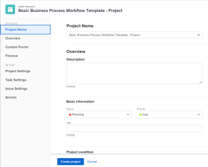

# 使用模板创建项目

您可以将模板用作创建项目的框架。 如果您的项目经常重复，则对新项目的一般时间轴使用模板可使您不必重复构建相同的项目。

模板为您提供了一种捕获与项目关联的可重复流程、信息和设置的方法。 与模板关联的信息被传输到项目。 这包括任务、分配、持续时间、文档、财务详细信息、风险和自定义表单。

>[!TIP]
>
>Workfront将新项目的组和状态定义如下：
>
>* 从模板创建的新项目的默认状态与Workfront管理员在主项目首选项区域或组管理员(或Workfront管理员)在组的项目首选项区域定义的状态相对应。 有关配置项目首选项的信息，请参阅 [配置系统范围的项目首选项](../../../administration-and-setup/set-up-workfront/configure-system-defaults/set-project-preferences.md) 或 [为组配置项目首选项](../../../administration-and-setup/manage-groups/create-and-manage-groups/configure-project-preferences-group.md).
>
>* 新项目的组是模板的组。 如果模板未与组关联，则项目的组是创建项目的用户的主组。
>
>* 新项目的可用状态与项目组的状态匹配，该组是模板组或创建项目的用户的主组。

您可以使用以下选项从模板创建项目：

* 从“项目”区域的模板创建项目
* 在模板级别通过模板创建项目
* 将模板附加到现有项目

   有关信息，请参阅 [将模板附加到项目](../../../manage-work/projects/create-and-manage-templates/attach-template-to-project.md).

* 从“组”区域的模板创建项目

## 访问要求

<!--drafted for P&P:

<table style="table-layout:auto"> 
 <col> 
 <col> 
 <tbody> 
  <tr> 
   <td role="rowheader">Adobe Workfront plan*</td> 
   <td> 
Any 
 </td> 
  </tr> 
  <tr> 
   <td role="rowheader">Workfront license*</td> 
   <td> 
Current license: Standard 

   Or
   
Legacy license: Plan 

    </td> 
  </tr> 
  <tr> 
   <td role="rowheader">Access level configurations*</td> 
   <td> 
Edit access to Projects and to Templates
 
<b>NOTE</b>
   
   If you still don't have access, ask your Workfront administrator if they set additional restrictions in your access level. For information about access to projects, see <a href="../../../administration-and-setup/add-users/configure-and-grant-access/grant-access-projects.md" class="MCXref xref">Grant access to projects</a>. For information on how a Workfront administrator can change your access level, see <a href="../../../administration-and-setup/add-users/configure-and-grant-access/create-modify-access-levels.md" class="MCXref xref">Create or modify custom access levels</a>. 
 </td> 
  </tr> 
  <tr> 
   <td role="rowheader">Object permissions</td> 
   <td> 
View permissions to a template
 
When you create a project you automatically receive Manage permissions to the project 
 
 For information about project permissions, see <a href="../../../workfront-basics/grant-and-request-access-to-objects/share-a-project.md" class="MCXref xref">Share a project in Adobe Workfront</a>.
 
For information on requesting additional access, see <a href="../../../workfront-basics/grant-and-request-access-to-objects/request-access.md" class="MCXref xref">Request access to objects </a>.
 </td> 
  </tr> 
 </tbody> 
</table>
-->

您必须具有以下访问权限才能执行本文中的步骤：

<table style="table-layout:auto"> 
 <col> 
 <col> 
 <tbody> 
  <tr> 
   <td role="rowheader">Adobe Workfront计划*</td> 
   <td> 
任意 
 </td> 
  </tr> 
  <tr> 
   <td role="rowheader">Workfront许可证概述*</td> 
   <td> 
计划 
 </td> 
  </tr> 
  <tr> 
   <td role="rowheader">访问级别*</td> 
   <td> 
编辑对项目和模板的访问权限
 
<b>注释</b>

如果您仍然没有访问权限，请咨询Workfront管理员，他们是否在您的访问级别设置了其他限制。 有关访问项目的信息，请参阅 <a href="../../../administration-and-setup/add-users/configure-and-grant-access/grant-access-projects.md" class="MCXref xref">授予对项目的访问权限</a>. 有关Workfront管理员如何更改访问级别的信息，请参阅 <a href="../../../administration-and-setup/add-users/configure-and-grant-access/create-modify-access-levels.md" class="MCXref xref">创建或修改自定义访问级别</a>. 
 </td>
</tr> 
  <tr> 
   <td role="rowheader">对象权限</td> 
   <td> 
查看模板的权限
 
在创建项目时，您会自动收到该项目的“管理”权限 
 
 有关项目权限的信息，请参阅 <a href="../../../workfront-basics/grant-and-request-access-to-objects/share-a-project.md" class="MCXref xref">在Adobe Workfront中共享项目</a>.
 
有关请求其他访问权限的信息，请参阅 <a href="../../../workfront-basics/grant-and-request-access-to-objects/request-access.md" class="MCXref xref">请求对对象的访问 </a>.
 </td> 
  </tr> 
 </tbody> 
</table>

&#42;要了解您拥有的计划、许可证类型或访问权限，请联系您的Workfront管理员。

## 从“项目”区域的模板创建项目

您可以从主菜单的“项目”区域，或从项目组合或项目群的“项目”区域创建项目。

1. 执行下列操作之一：

   * 单击 **主菜单** ，单击 **项目**，然后展开 **新建项目**.
   * 转到项目组合，然后展开 **新建项目**.

      >[!TIP]
      >
      >当您使用组合中的模板创建项目时，新项目的Portfolio字段会更新，以显示您选择从中创建项目的组合。 如果指定了Portfolio，则会覆盖模板上的模板字段。

   * 转到项目，然后展开 **新建项目**.

      >[!TIP]
      >
      >使用项目的模板创建项目时，新项目的“项目”(Program)字段会更新，以显示您选择从中创建项目的项目。 模板的Portfolio字段会更新，以显示您选择从中创建项目的项目组合。 如果指定了程序和Portfolio字段，则会覆盖模板中的程序和模板字段。

   * 如果您是群组管理员，则还可以在您管理的群组的“项目”部分创建项目。 有关更多信息，请参阅 [创建和修改组的项目](../../../administration-and-setup/manage-groups/work-with-group-objects/create-and-modify-a-groups-projects.md).

      >[!TIP]
      >
      >使用组中的模板创建项目时，只有在未指定模板的组字段时，才会在新项目的组字段中显示从中创建项目的组。 如果指定了模板组字段，则新项目的组字段即为模板的组字段。
   <!--
   
(this, above, is hyperlinked to the classic version of this article; the Milestone View steps are similar to creating a project in Classic than to the way you do it in NWE)

   -->

   

1. 在 **收藏模板** 列表

   

   或

   执行以下操作：

   1. 选择 **从模板新建项目**.
   1. 在 **搜索模板** 字段中，开始键入模板的名称，并在模板显示在列表中时单击该名称。
   1. 查看右侧的模板详细信息。

      模板详细信息包括：

      * 模板持续时间
      * 模板所有者
      * 包括前三个任务名称的顶级任务数
      * 模板中所有任务的数量
      * 模板自定义表单的名称
   1. （可选）将鼠标悬停在模板名称的名称上，然后单击 **收藏夹** **图标**  将其标记为收藏以供将来使用。

      或

      展开 **收藏模板** 列表，然后从下拉列表中选择一个模板。

      >[!TIP]
      >
      >您最多可以有40个Workfront项目标记为收藏。 这包括模板和其他项目。

   1. 单击 **使用模板** 选择模板时。

   

   >[!NOTE]
   >
   >如果将里程碑视图应用于项目列表，请在 **“从模板新建”部分**.
   >
   >
   >   >

1. 的 **新建项目** 框中。

   

1. 如果模板中已填充字段，则会在 **新建项目** 框中。 您可以编辑预填充的值，以更好地与项目匹配。 有关更多信息，请参阅 [编辑项目](../../../manage-work/projects/manage-projects/edit-projects.md).
1. 单击 **创建项目**.

   如果您在上一步中未更改新建项目，则模板中定义的所有详细信息都会自动与它们关联。

## 从“模板”区域的模板创建项目

您可以从模板开始创建项目，而不是从“项目”区域开始。

 

1. 从 **主菜单**，单击 **模板**.

1. 单击要使用的模板的名称。
1. 单击 **更多** 菜单 ，然后单击 **创建项目。**

   

   的 **新建项目** 框中。

1. 为项目指定名称，然后查看每个部分并进行任何必要的更改。

   

   如果模板中已填充字段，则会在 **新建项目** 框中。 您可以编辑预填充的值，以更好地与项目匹配。 有关更多信息，请参阅 [编辑项目](../../../manage-work/projects/manage-projects/edit-projects.md).

1. 单击 **创建项目。**

   如果您在上一步中未更改新建项目，则模板中定义的所有详细信息都会自动与它们关联。
