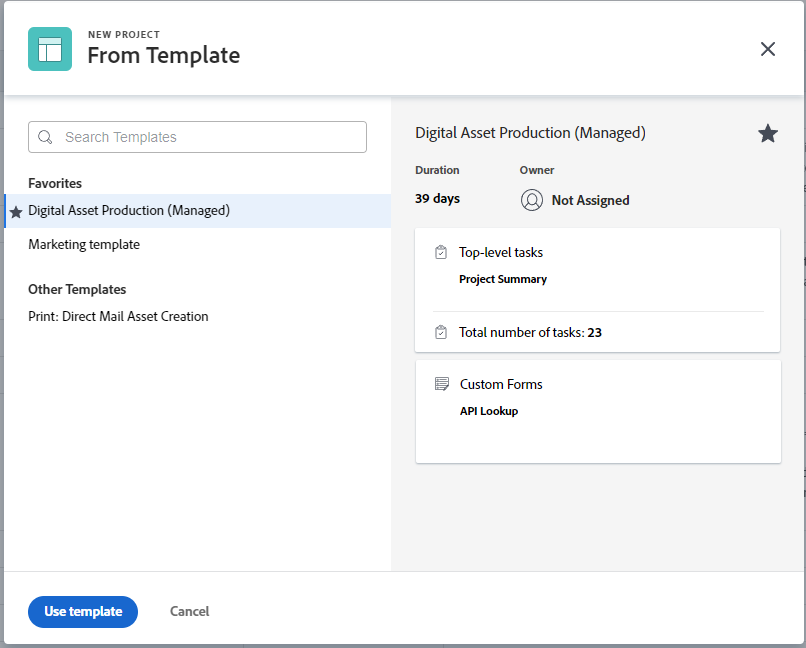

# 使用模板创建项目

<!-- Audited: 01/2024 -->

您可以将模板用作在Adobe Workfront中创建项目的框架。 如果您的项目经常重复，则使用模板作为新项目的常规时间线可让您避免重复构建相同的项目。

模板为您提供了一种捕获与项目关联的可重复流程、信息和设置的方法。 与模板关联的信息被传输到项目。 这包括任务、分配、持续时间、文档、财务详细信息、风险和自定义表单。

>[!TIP]
>
>Workfront按如下方式定义新项目的组和状态：
>
>* 通过模板创建的新项目的默认状态与您的Workfront管理员在项目偏好设置主区域中定义的状态相对应，或与组管理员(或Workfront管理员)在组的“项目偏好设置”区域中定义的状态相对应。 有关配置项目首选项的信息，请参阅 [配置系统范围的项目首选项](../../../administration-and-setup/set-up-workfront/configure-system-defaults/set-project-preferences.md) 或 [配置组的项目首选项](../../../administration-and-setup/manage-groups/create-and-manage-groups/configure-project-preferences-group.md).
>
>* 新项目的组是模板的组。 如果模板未与组关联，则项目组是创建项目的用户的主组。
>
>* 新项目可用的状态与项目组的状态匹配，该项目组是模板的组，或者是创建项目的用户的主组。

可使用以下选项从模板创建项目：

* 在项目区域的模板中创建项目
* 在模板级别从模板创建项目
* 将模板附加到现有项目

  有关信息，请参阅 [将模板附加到项目](../../../manage-work/projects/create-and-manage-templates/attach-template-to-project.md).

* 从组区域的模板创建项目

## 访问要求

<!--drafted for P&P:

<table style="table-layout:auto"> 
 <col> 
 <col> 
 <tbody> 
  <tr> 
   <td role="rowheader">Adobe Workfront plan*</td> 
   <td> 
Any 
 </td> 
  </tr> 
  <tr> 
   <td role="rowheader">Workfront license*</td> 
   <td> 
Current license: Standard 

   Or
   
Legacy license: Plan 

    </td> 
  </tr> 
  <tr> 
   <td role="rowheader">Access level configurations*</td> 
   <td> 
Edit access to Projects and to Templates
 
<b>NOTE</b>
   
   If you still don't have access, ask your Workfront administrator if they set additional restrictions in your access level. For information about access to projects, see <a href="../../../administration-and-setup/add-users/configure-and-grant-access/grant-access-projects.md" class="MCXref xref">Grant access to projects</a>. For information on how a Workfront administrator can change your access level, see <a href="../../../administration-and-setup/add-users/configure-and-grant-access/create-modify-access-levels.md" class="MCXref xref">Create or modify custom access levels</a>. 
 </td> 
  </tr> 
  <tr> 
   <td role="rowheader">Object permissions</td> 
   <td> 
View permissions to a template
 
When you create a project you automatically receive Manage permissions to the project 
 
 For information about project permissions, see <a href="../../../workfront-basics/grant-and-request-access-to-objects/share-a-project.md" class="MCXref xref">Share a project in Adobe Workfront</a>.
 
For information on requesting additional access, see <a href="../../../workfront-basics/grant-and-request-access-to-objects/request-access.md" class="MCXref xref">Request access to objects </a>.
 </td> 
  </tr> 
 </tbody> 
</table>
-->

您必须具有以下权限才能执行本文中的步骤：

<table style="table-layout:auto"> 
 <col> 
 <col> 
 <tbody> 
  <tr> 
   <td role="rowheader">Adobe Workfront计划</td> 
   <td> 
任何 
 </td> 
  </tr> 
  <tr> 
   <td role="rowheader">Workfront许可证</td> 
   <td> 
新增：标准

        
或

        
当前：计划 
 </td> 
  </tr> 
  <tr> 
   <td role="rowheader">访问级别配置</td> 
   <td> 
编辑对项目和模板的访问权限
 </td> 
  </tr> 
  <tr> 
   <td role="rowheader">对象权限</td> 
   <td> 
查看模板的权限
 
在创建项目时，您会自动收到该项目的管理权限。
</td> 
  </tr> 
 </tbody> 
</table>

有关此表中信息的更多详细信息，请参见 [Workfront文档中的访问要求](/help/quicksilver/administration-and-setup/add-users/access-levels-and-object-permissions/access-level-requirements-in-documentation.md).

## 在项目区域的模板中创建项目

您可以从主菜单的项目区域，或从项目组合或项目群的项目区域创建项目。

>[!NOTE]
>
>您的系统或组管理员可以使用布局模板修改您的界面。 在这种情况下，以下步骤中引用的部分和区域名称在您的Workfront实例中可能有所不同。

1. 执行下列操作之一：

   * 单击 **[!UICONTROL 主菜单]** 图标  单击Adobe Workfront右上角的或者（如果可用）单击 **[!UICONTROL 主菜单]** 图标  左上角。 单击 **项目**，然后展开 **新建项目**.
   * 转到项目组合，然后展开 **新建项目**.

     >[!TIP]
     >
     >使用项目组合中的模板创建项目时，新项目的“Portfolio”字段会更新，以显示您选择从中创建项目的项目组合。 如果已指定，这会覆盖模板上的Portfolio字段。

   * 转到项目，然后展开 **新建项目**.

     >[!TIP]
     >
     >使用项目群中的模板创建项目时，新项目的“项目群”字段会更新以显示您选择从中创建项目的项目群。 模板的Portfolio字段将更新，以显示您选择从中创建项目的项目群的项目组合。 如果已指定，这将覆盖模板中的“程序”和“Portfolio”字段。

   * 如果您是组管理员，则还可以在所管理组的项目部分中创建项目。 有关更多信息，请参阅 [创建和修改组的项目](../../../administration-and-setup/manage-groups/work-with-group-objects/create-and-modify-a-groups-projects.md).

     >[!TIP]
     >
     >使用组中的模板创建项目时，仅当未指定模板的组字段时，从中创建项目的组才会显示在新项目的组字段中。 如果指定了模板的“组”字段，则新项目的“组”字段是模板的“组”字段。

   <!--
   
(this, above, is hyperlinked to the classic version of this article; the Milestone View steps are similar to creating a project in Classic than to the way you do it in NWE)

   -->

   

1. 单击中模板的名称 **收藏模板** 列表。

   

   或

   执行以下操作：

   1. 选择 **通过模板新建项目**.
   1. 在 **搜索模板** 字段中，开始键入模板的名称，并在模板显示在列表中时单击该模板。
   1. 查看右侧的模板详细信息。

      模板详细信息包括：

      * 模板持续时间
      * 模板所有者
      * 顶级任务的数量，包括前三个任务的名称
      * 模板中所有任务的数量
      * 模板自定义表单的名称

   1. （可选）将鼠标悬停在左窗格中的模板名称上，然后单击 **收藏夹** **图标**  将其标记为将来最常使用。

      或

      展开 **收藏模板** 列表并从下拉列表中选择一个模板。

      >[!TIP]
      >
      >您最多可以将40个Workfront项目标记为收藏。 这包括模板和其他项目。

   1. 单击 **使用模板** 当您选择了模板时。

      

      >[!NOTE]
      >
      >如果您已将里程碑视图应用于项目列表，请在 **从“模板”部分新建**.
      >
      >
      >
      >

   此 **新建项目** 框打开。

   

1. 如果某个字段已填充到模板中，则该字段会预填充到 **新建项目** 盒子。 您可以编辑预填充的值以更好地匹配您的项目。 有关更多信息，请参阅 [编辑项目](../../../manage-work/projects/manage-projects/edit-projects.md).
1. 单击 **创建项目**.

   如果您在上一步中没有更改模板中定义的所有详细信息，则它们会自动与新创建的项目关联。

## 从模板区域中的模板创建项目

您可以从模板开始创建项目，而不是从项目区域开始。

{{step1-to-templates}}

1. 单击要使用的模板的名称。
1. 单击 **更多** 菜单 ，然后单击 **创建项目**.

   

   此 **新建项目** 框打开。

1. 输入项目的名称，然后查看每个部分并进行任何必要的更改。

   

   如果某个字段已填充到模板中，则该字段会预填充到 **新建项目** 盒子。 您可以编辑预填充的值以更好地匹配您的项目。 有关更多信息，请参阅 [编辑项目](../../../manage-work/projects/manage-projects/edit-projects.md).

1. 单击 **创建项目**.

   如果您在上一步中没有更改模板中定义的所有详细信息，则它们会自动与新创建的项目关联。
