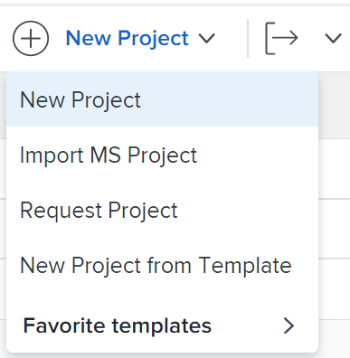
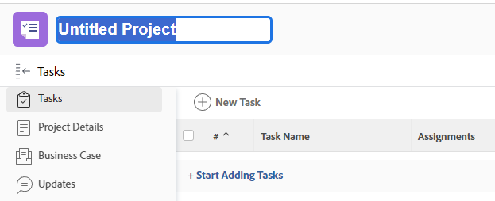

# 创建项目

<!--

(NOTE:this is linked from the UI from the Projects global nav section in classic. Do not change/ remove)

-->

<!-- Audited: 12/2023 -->

项目代表在Adobe Workfront中需要完成的大量工作。

## 访问要求

<!--drafted for P&P - replace table below with this:

<table style="table-layout:auto"> 
 <col> 
 <col> 
 <tbody> 
  <tr> 
   <td role="rowheader">Workfront plan*</td> 
   <td> 
Any
 </td> 
  </tr> 
  <tr> 
   <td role="rowheader">Workfront license*</td> 
   <td> 
Current license: Standard 

   Or
   
Legacy license: Plan 

    </td> 
  </tr> 
  <tr> 
   <td role="rowheader">Access level*</td> 
   <td> 
Edit access to Projects
 
<b>NOTE</b>
   
   If you still don't have access, ask your Workfront administrator if they set additional restrictions in your access level. For information about access to projects, see <a href="../../../administration-and-setup/add-users/configure-and-grant-access/grant-access-projects.md" class="MCXref xref">Grant access to projects</a>. For information on how a Workfront administrator can change your access level, see <a href="../../../administration-and-setup/add-users/configure-and-grant-access/create-modify-access-levels.md" class="MCXref xref">Create or modify custom access levels</a>. 
 </td> 
  </tr> 
  <tr> 
   <td role="rowheader">Object permissions</td> 
   <td> 
When you create a project you automatically receive Manage permissions to the project 
 
 For information about project permissions, see <a href="../../../workfront-basics/grant-and-request-access-to-objects/share-a-project.md" class="MCXref xref">Share a project in Adobe Workfront</a>.
 
For information on requesting additional access, see <a href="../../../workfront-basics/grant-and-request-access-to-objects/request-access.md" class="MCXref xref">Request access to objects </a>.
 </td> 
  </tr> 
 </tbody> 
</table>

-->
+++ 展开以查看本文中各项功能的访问要求。

您必须具有以下权限才能执行本文中的步骤：

<table style="table-layout:auto"> 
 <col> 
 <col> 
 <tbody> 
  <tr> 
   <td role="rowheader">Adobe Workfront计划</td> 
   <td> 
任何
 </td> 
  </tr> 
  <tr> 
   <td role="rowheader">Adobe Workfront许可证</td> 
   <td> 
新增：标准

        
或

        
当前：计划 
 </td> 
  </tr> 
  <tr> 
   <td role="rowheader">访问级别配置</td> 
   <td> 
编辑对项目的访问权限
 </td> 
  </tr> 
  <tr> 
   <td role="rowheader">对象权限</td> 
   <td> 
在创建项目时，您会自动收到该项目的管理权限。
 </td> 
  </tr> 
 </tbody> 
</table>

有关此表中信息的更多详细信息，请参见 [Workfront文档中的访问要求](/help/quicksilver/administration-and-setup/add-users/access-levels-and-object-permissions/access-level-requirements-in-documentation.md).

+++

## 创建项目的方法

您可以使用以下方法之一在Workfront中创建项目：

* 无需使用模板即可从头开始创建项目。 本文介绍了如何从头开始创建项目。

* 复制现有项目。\
  有关复制项目的详细信息，请参阅 [复制项目](../../../manage-work/projects/manage-projects/copy-project.md).

* 使用模板。\
  有关使用模板创建新项目的更多信息，请参阅 [使用模板创建项目](../../../manage-work/projects/create-projects/create-project-from-template.md).

* 从Microsoft项目导入项目。\
  有关从MS Project导入项目的详细信息，请参阅 [从Microsoft项目导入项目](../../../manage-work/projects/create-projects/import-project-from-ms-project.md).

* 使用快速启动导入项目。

  作为Workfront管理员，您可以使用快速启动导入项目。

  有关在Workfront中使用kick-starts导入数据的信息，请参阅 [使用快速启动模板将数据导入Adobe Workfront](../../../administration-and-setup/manage-workfront/using-kick-starts/import-data-via-kickstarts.md).

  有关使用快速启动导入项目的信息，请参阅 [快速启动方案：简单的项目和任务导入准备](../../../administration-and-setup/manage-workfront/using-kick-starts/kick-starts-scenario-simple-project-task-import-prep.md).

* 从Adobe Workfront Scenario Planner中的方案发布计划。 Scenario Planner需要额外的许可证。 有关Workfront Scenario Planner的信息，请参阅 [Scenario Planner概述](../../../scenario-planner/scenario-planner-overview.md). 有关通过发布计划创建项目的信息，请参阅  [通过在场景规划程序中发布计划来更新或创建项目](../../../scenario-planner/publish-scenarios-update-projects.md).

## 先决条件

在开始之前，您必须确保：

* 您的系统或组管理员在设置区域中启用了“允许用户在不使用模板的情况下创建项目”偏好设置。

  有关更多信息，请参阅 [配置系统范围的项目首选项](../../../administration-and-setup/set-up-workfront/configure-system-defaults/set-project-preferences.md).

## 新项目默认设置

在创建项目时，Workfront会对其应用一组默认设置。 例如，创建项目时会预设“状态”、“组”和“计划模式”。

请考虑以下事项：

* 作为Workfront管理员或组管理员，您可以在配置整个Workfront实例或组的项目首选项时为新项目配置默认设置。
* Workfront会先应用组的设置（如果有），然后再应用Workfront管理员设置的设置。
* 新项目的默认状态与您的Workfront管理员在主“项目首选项”区域中定义的状态相对应，或与组管理员(或Workfront管理员)在组的“项目首选项”区域中定义的状态相对应。

  >[!NOTE]
  >
  >我们建议新项目的默认状态为“正在计划”。 当您对新项目进行更改时，这将确保不会向分配给项目的用户发送通知。
  >
  >有关为新项目设置默认状态和其他默认设置的详细信息，请参阅 [配置系统范围的项目首选项](../../../administration-and-setup/set-up-workfront/configure-system-defaults/set-project-preferences.md) 或 [配置组的项目首选项](../../../administration-and-setup/manage-groups/create-and-manage-groups/configure-project-preferences-group.md).

* 以下场景存在于Workfront如何定义新项目的组和状态：

   * 如果从头开始创建项目，则项目的组是您的主组。

     项目的状态是您的主组（如果有）或Workfront实例的项目首选项中的默认状态。 在创建项目时，您可以将默认状态更改为项目组可用的任何状态。

   * 如果使用模板创建项目，则模板中的设置优先于Workfront或组管理员建立的设置。

     新项目的组是模板的组。 如果模板未与组关联，则项目组是创建项目的用户的主组。

     通过模板创建的新项目的默认状态与您的Workfront管理员在主“项目首选项”区域中定义的状态相对应，或与组管理员(或Workfront管理员)在组的“项目首选项”区域中定义的状态相对应。 从模板创建项目时，可以将默认状态更改为项目组的任何状态，即模板的组或创建项目的用户的主组。

   * 如果通过转化问题创建项目，则新项目的组是问题现有项目的组。 如果转化问题的用户无权访问问题的项目或问题的项目没有组，则新项目的组是转化问题的用户的主组。

     新项目的状态与项目关联的组的组状态匹配，即原始项目的组或转换问题的用户的主组。

     如果通过转化问题创建项目时使用模板，请参阅上面第二个场景，了解哪个组和哪个状态Workfront适用于新项目。

## 从头开始创建项目

>[!NOTE]
>
>如果您使用模板创建项目，我们建议您也看到此文章 [使用模板创建项目](/help/quicksilver/manage-work/projects/create-projects/create-project-from-template.md).

1. 执行下列操作之一：

   * 单击 **[!UICONTROL 主菜单]** 图标  单击Adobe Workfront右上角的或者（如果可用）单击 **[!UICONTROL 主菜单]** 图标  左上角。 单击 **项目**，然后展开 **新建项目**.
   * 转到项目组合，然后展开 **新建项目**.
   * 转到项目，然后展开 **新建项目**.
   * 如果您是组管理员，则还可以在所管理组的项目部分中创建项目。 有关更多信息，请参阅 [创建和修改组的项目](../../../administration-and-setup/manage-groups/work-with-group-objects/create-and-modify-a-groups-projects.md).

   

1. 单击 **新建项目** 在菜单中，从头开始创建项目。
1. 键入项目的名称。 按Enter键保存名称。

   

   项目页面的标题显示项目的当前运行状况和进度的快速概述。 项目标题中的信息会随着项目信息的更新而更改。

1. 单击 **开始添加任务**.

   或

   单击 **新建任务** 以向项目添加任务并向其分配资源。

   有关将任务添加到项目的详细信息，请参阅 [在项目中创建任务](../../../manage-work/tasks/create-tasks/create-tasks-in-project.md).

1. 通过单击 **更多** 菜单，然后 **编辑**  在项目名称旁边。

   此 **编辑项目** 对话框打开。

   有关编辑项目的更多信息，请参阅 [编辑项目](../../../manage-work/projects/manage-projects/edit-projects.md).

1. （可选）配置项目设置并添加任务后，您可以将项目的状态更改为 **当前**.

   这表示项目现在已准备好开始，并且分配给任务的用户现在可以开始处理这些任务。

   有关项目状态的更多信息，请参阅 [访问系统项目状态的列表](../../../administration-and-setup/customize-workfront/creating-custom-status-and-priority-labels/project-statuses.md).
