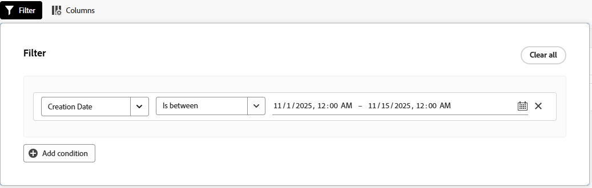

# 创建和查看项目快照

项目经理通常需要将项目的过去数据与当前状态进行比较，以做出明智的决策，并查看其项目随时间的变化。

通过Adobe Workfront中的快照，您可以快速准确地查看快照（在特定日期和时间拍摄的）和项目当前数据之间的这些差异，从而帮助您更有效地管理项目并做出更好的决策。 快照比较并排显示了项目的发展情况。

## 访问权限要求

+++ 展开可查看本文所述功能的访问权限要求。

<table style="table-layout:auto"> 
 <col> 
 <col> 
 <tbody> 
  <tr> 
   <td>Adobe Workfront 包</td> 
   <td> 
工作流 Ultimate
 </td> 
  </tr> 
  <tr> 
   <td>Adobe Workfront许可证</td> 
    <td>标准</td> 
  </tr> 
  <tr> 
   <td>访问级别配置</td> 
   <td>编辑对项目的访问权限</td> 
  </tr> 
  <tr> 
   <td>对象权限</td> 
   <td>查看快照时，您可以查看您有权查看原始项目的所有字段 </td> 
  </tr> 
 </tbody> 
</table>

有关详细信息，请参阅Workfront文档中的[访问要求](/help/quicksilver/administration-and-setup/add-users/access-levels-and-object-permissions/access-level-requirements-in-documentation.md)。

+++

## 创建快照

1. 转到项目。
1. 在左侧面板中，单击&#x200B;**快照**。

   

1. 单击&#x200B;**新建快照**。
1. 在&#x200B;**新建快照**&#x200B;对话框中键入快照的名称，然后单击&#x200B;**保存**。

   快照名称将显示在列表中。

   >[!NOTE]
   >
   >创建快照时，无法立即查看。 根据后台运行的数据，准备就绪最多可能需要4小时。 快照尚不可用时，创建状态为&#x200B;**待处理**；您可以查看快照时，创建状态为&#x200B;**就绪**。

## 查看单个快照

1. 转到项目，然后单击左侧面板中的&#x200B;**快照**。
1. 单击列表中的快照名称以将其打开。 状态必须为&#x200B;**就绪**，然后才能打开。

   >[!TIP]
   >
   >屏幕顶部的痕迹导航链接回项目，并帮助您识别您正在查看快照。

   快照显示创建快照时存在的以下项：

   * 项目中任务和子任务的层次结构
   * 项目详细信息和任何附加到详细信息的自定义表单
   * 关联的项目及其层次结构
   * 问题
   * 费率
   * 账单记录
   * 费用<!--* Bookings (on its own line of course when they get released)-->
   * 项目团队（“人员”选项卡）

   您可以通过过滤、排序、添加和删除列或应用视图来自定义快照中的任何列表。 时间分段KPI可用于添加到快照视图。 有关详细信息，请参阅本文中的[自定义快照列表](#customize-snapshot-lists)。

## 比较快照

1. 转到项目，然后单击左侧面板中的&#x200B;**快照**。
1. 选择用于比较快照的选项：

   * 若要比较两个或多个快照，请选中列表中快照旁边的复选框，然后单击屏幕底部操作栏中的&#x200B;**比较**。
   * 若要将快照与当前项目进行比较，请选中列表中快照旁边的复选框，然后在屏幕底部的操作栏中单击&#x200B;**与当前比较**。

     >[!NOTE]
     >
     >要比较的每个快照的状态必须为&#x200B;**就绪**。

1. 在“比较”屏幕上，展开每个快照和当前项目以查看下面的层次结构。

   

1. 您可以通过排序、添加和删除列或应用视图来自定义比较。 有关详细信息，请参阅本文中的[自定义快照列表](#customize-snapshot-lists)。

## 导出快照

您可以以.xlsx或.csv格式导出所有快照的列表或快照比较。 所有显示的列都包含在导出的文件中。

1. 单击快照列表或快照比较上的&#x200B;**导出**&#x200B;图标。
1. 选择导出文件的格式。

   文件已保存到您的计算机。 系统可能会提示您选择位置。

1. （可选）使用相应的应用程序打开导出的列表。

## 自定义快照列表

通过过滤、排序、添加和删除列或应用视图，可以定制所有快照的列表，以及快照或比较内的任何列表。

有关列表自定义设置的详细信息，请参阅[使用增强列表](/help/quicksilver/workfront-basics/navigate-workfront/use-lists/enhanced-lists.md)。

### 筛选列表中的项目

过滤器可帮助您减少在列表中显示的信息量。

1. 单击列表上方的&#x200B;**筛选器**。
1. 在“筛选器”框中，单击&#x200B;**添加条件**。
1. 选择要作为筛选依据的字段。
1. 选择过滤器修饰符，例如“具有任意”、“不具有任何”、“早于”或“晚于”。 根据过滤依据的字段类型，修改量选项会有所不同。
1. 选择一个或多个字段值。 根据筛选依据的字段类型，系统可能会提示您从列表中选择项目、搜索该项目或使用日历选择日期范围。

   

   该过滤器将自动应用于列表。

1. 单击&#x200B;**添加条件**&#x200B;以向筛选器添加其他条件。

   您可以通过AND或OR连接器连接多个过滤器。

1. 应用筛选器后，您可以再次打开&#x200B;**筛选器**&#x200B;选项以更改筛选器选项或清除所有筛选器。

   将筛选器应用于列表时，**筛选器**&#x200B;按钮上将显示一个指示器。

   

### 在列表中排序

要对各个列进行排序：

1. 将鼠标悬停在该列上，然后单击向下箭头并选择&#x200B;**排序**。

   列名旁边的图标表示该列表按该列中的值和排序方向排序。

   

### 自定义列表中的列

您可以隐藏、显示和重新排序列表中的列。

1. 单击列表上方的&#x200B;**列**。

   快照列表列

1. 使用切换可显示或隐藏列表中的列。
1. 要重新排序列，请单击&#x200B;**拖动**&#x200B;图标并将列移动到所需的位置。 移动列会自动更改列表。

   >[!NOTE]
   >
   >主字段是列表中的第一列。 它固定在第一个位置，不能更改其列。 如果列数很大，则主字段会冻结在左侧，当您水平滚动时，将始终看到主字段。
   >
   >字段名称旁边的图标显示字段类型，如文本或日期字段。

   隐藏列时，**列**&#x200B;按钮上会显示一个指示符。 重新排序列时，不显示该指示符。

   隐藏列的

### 使用列管理器添加和删除列

您可以在一些增强列表中使用列管理器，以轻松地在列表中添加和删除列。 您可以添加或删除Workfront中已存在的作为列的系统字段和自定义字段。

1. 单击表右上角的&#x200B;**+**&#x200B;图标以打开&#x200B;**列管理器**&#x200B;框。

   快照的

1. 在&#x200B;**可用**&#x200B;列中搜索现有对象字段，然后单击该字段名称右侧的&#x200B;**+**&#x200B;以将其添加到&#x200B;**已选定**&#x200B;列。
1. 单击&#x200B;**已选定**&#x200B;列中某个字段右侧的&#x200B;**-**&#x200B;以将其从列表中删除。
1. 单击&#x200B;**保存**。

   该列表会根据您所做的选择更新列。

### 将视图应用于列表

要应用或创建视图，请执行以下操作：

1. 单击&#x200B;**视图**&#x200B;下拉列表并选择现有视图以将其应用于列表

   或者

   单击&#x200B;**新建视图**&#x200B;以创建一个视图。

   快照上的

1. （视情况而定）若要添加新视图，请输入视图的名称，然后单击&#x200B;**创建**。
1. （可选）隐藏、显示或重新排列列。 有关详细信息，请参阅[自定义列表中的列](#customize-columns-in-a-list)。
1. （可选）筛选列表。 有关详细信息，请参阅列表[中的](#filter-items-in-a-list)筛选项。

对视图的更改会自动保存。 下次应用此视图时，列和筛选器设置将保持其设置方式。 有关视图的详细信息，请参阅[使用增强列表](/help/quicksilver/workfront-basics/navigate-workfront/use-lists/enhanced-lists.md)。
