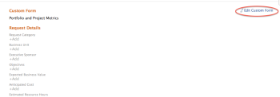

# 将自定义表单附加到业务案例

自定义Forms用于收集未显示在现有Adobe Workfront字段中的信息。

有关创建自定义Forms的更多信息，请参阅文章[创建自定义表单](/help/quicksilver/administration-and-setup/customize-workfront/create-manage-custom-forms/form-designer/design-a-form/design-a-form.md)。

## 访问权限要求

<!--Audit: 06/2025-->

+++ 展开可查看本文所述功能的访问权限要求。

<table style="table-layout:auto"> 
 <col> 
 <col> 
 <tbody> 
  <tr> 
   <td role="rowheader">
Adobe Workfront 包
</td> 
   <td> 
Prime或更高版本

  </tr> 
  <tr> 
   <td role="rowheader">
Adobe Workfront许可证/p&gt;</td> 
   <td> 
   
标准 
 
   
规划 
 </td> 
  </tr> 
  <tr> 
   <td role="rowheader">访问级别配置</td> 
   <td> 
编辑对项目的访问权限
  </td> 
  </tr> 
  <tr> 
   <td role="rowheader">
对象权限
</td> 
   <td> 
管理项目的权限或更高
  </td> 
  </tr> 
 </tbody> 
</table>

有关信息，请参阅Workfront文档中的[访问要求](/help/quicksilver/administration-and-setup/add-users/access-levels-and-object-permissions/access-level-requirements-in-documentation.md)。

+++

## 将自定义Forms附加到项目

您可以在以下区域将自定义Forms附加到项目：

* 编辑项目时，位于项目详细信息部分。
* 编辑项目时，在编辑项目框中。
* 批量编辑多个项目时，从项目列表中。

  有关在编辑一个或多个项目时将自定义表单附加到项目的信息，请参阅文章[编辑项目](../../../manage-work/projects/manage-projects/edit-projects.md)。

* 在构建项目的业务案例时，在业务案例中，如本文所述。

有关将自定义表单附加到对象的信息，请参阅[将自定义表单添加到对象](../../../workfront-basics/work-with-custom-forms/add-a-custom-form-to-an-object.md)。

## 将自定义Forms附加到业务案例

要将自定义从添加到业务案例，您的Workfront管理员需要在“设置”中选择此选项。 有关在设置中启用自定义表单的详细信息，请参阅[配置系统范围项目首选项](../../../administration-and-setup/set-up-workfront/configure-system-defaults/set-project-preferences.md)。

要附加自定义表单，请执行以下操作：

1. 转到要将表单附加到的项目，然后单击左侧面板中的&#x200B;**业务案例**。 此时将显示业务案例。

1. 在&#x200B;**自定义表单**&#x200B;分区中，从下拉菜单中选择要附加的自定义表单。 自定义表单显示在下面的&#x200B;**添加的表单**&#x200B;部分中。

1. （可选）要展开自定义表单详细信息，请单击自定义表单名称左侧的箭头。

   

<!--
1. (Optional) Select **Edit Custom Form**.  
  

1. (Optional) Specify information in the fields of the custom form, then click **Save** .
-->
