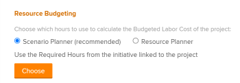

# 使用方案计划员在业务案例中预算资源

在资源计划中，您可以使用“Adobe Workfront方案计划员”对在构建业务案例时完成项目中的工作所必需的职务职责进行预算。

有关创建业务案例的更多信息，请参阅 [为项目创建业务案例](../../../manage-work/projects/define-a-business-case/create-business-case.md).

>[!TIP]
>
>在系统层方案规划器中输入的与项目链接的方案的任务职责信息，在发布方案时显示在项目业务案例的资源预算区域。 方案规划器仅在新的Adobe Workfront体验中可用，并且需要额外的许可证。 有关Workfront方案规划器的信息，请参阅 [方案计划员概述](../../../scenario-planner/scenario-planner-overview.md).

您还可以使用资源计划器对业务案例中的资源进行预算。 有关更多信息，请参阅以下内容：

* [业务案例中的预算资源](../../../manage-work/projects/define-a-business-case/budget-resources-in-business-case.md)

<!--* [Budget resources by project in the Resource Planner](../../../resource-mgmt/resource-planning/budget-by-project-resource-planner-d.md)-->

>[!NOTE]
>
>我们建议您在开始处理项目时决定是使用资源计划员还是方案计划员。 在项目生命周期中经常在两个资源之间切换可能会导致项目资源预算方式不一致。

## 访问要求

您必须具备以下条件：

<table style="table-layout:auto"> 
 <col> 
 </col> 
 <col> 
 </col> 
 <tbody> 
  <tr> 
   <td role="rowheader">Adobe Workfront计划*</td> 
   <td> 
业务或更高版本
 </td> 
  </tr> 
  <tr> 
   <td role="rowheader">Adobe Workfront许可证*</td> 
   <td> 
审阅或更高版本
 </td> 
  </tr> 
  <tr> 
   <td role="rowheader">产品</td> 
   <td> 
您必须为Adobe Workfront方案规划器购买额外的许可证才能访问本文中所述的功能。
 
有关获取Workfront方案计划员的信息，请参阅 <a href="../../../scenario-planner/access-needed-to-use-sp.md" class="MCXref xref">使用方案计划员所需的访问权限</a>. 
 </td> 
  </tr> 
  <tr> 
   <td role="rowheader">访问级别配置*</td> 
   <td> 
编辑对以下项的访问权限： 
 
    <ul> 
     <li> 
项目
 </li> 
     <li> 
财务数据
 </li> 
     <li> 
场景计划器 
 </li> 
    </ul> 
有关预算资源所需访问权限的信息，另请参阅 <a href="../../../resource-mgmt/resource-planning/access-needed-to-budget-resources.md" class="MCXref xref">在Adobe Workfront获得预算资源所需的资源</a>.
 
注意：如果您仍然没有访问权限，请咨询Adobe Workfront管理员，他们是否在您的访问级别设置了其他限制。 有关Workfront管理员如何修改访问级别的信息，请参阅 <a href="../../../administration-and-setup/add-users/configure-and-grant-access/create-modify-access-levels.md" class="MCXref xref">创建或修改自定义访问级别</a>.
 </td> 
  </tr> 
  <tr> 
   <td role="rowheader">对象权限</td> 
   <td> 
管理项目的权限
 
有关请求其他访问权限的信息，请参阅 <a href="../../../workfront-basics/grant-and-request-access-to-objects/request-access.md" class="MCXref xref">请求对对象的访问 </a>.
 </td> 
  </tr> 
 </tbody> 
</table>

&#42;要了解您拥有的计划、许可证类型或访问权限，请联系您的Workfront管理员。

## 先决条件

在开始之前，您必须执行以下操作：

* 使用方案计划员创建计划。

   有关信息，请参阅 [在方案计划员中创建和编辑计划](../../../scenario-planner/create-and-edit-plans.md).

* 创建计划方案并将其链接到项目。

   确保您指明了方案所需的作业角色信息，并使用此信息更新链接的项目。

   有关更多信息，请参阅以下文章：

   * [在方案规划器中创建和编辑方案](../../../scenario-planner/create-and-edit-initiatives.md)
   * [在方案计划器中将项目导入计划](../../../scenario-planner/import-projects-to-plans.md)
   * [通过在方案规划器中发布方案来更新或创建项目](../../../scenario-planner/publish-scenarios-update-projects.md).

* 尽管这些不是先决条件，但我们还建议执行以下操作：

   * 将项目任务分配给方案计划员中预算的任务职责。
   * 指示项目任务的计划小时数。

      这有助于您了解任务可能需要完成的工作量，这有助于您决定资源在预算中花费多少时间才能完成任务。

      有关将任务与计划小时数关联的信息，请参阅 [编辑任务](../../../manage-work/tasks/manage-tasks/edit-tasks.md).

## 在业务案例中使用方案规划器对与方案关联的项目预算资源

>[!IMPORTANT]
您可以将资源预算为15年。 如果您对持续时间超过15年的项目的资源进行预算，则预算信息可能不准确。
<!--
><MadCap:conditionalText data-mc-conditions="QuicksilverOrClassic.Draft mode">>
>(is this still accurate for the Scenario Planner?)>
></MadCap:conditionalText>>
>-->

1. 转到要对资源进行预算的项目。

   >[!TIP]
   这是链接到方案规划器中某个方案的项目，其关联的方案至少已发布一次。

1. 单击 **商业案例** 中。
1. （视情况而定）在 **资源预算编制** ，请执行以下操作之一：

   * 如果您刚从方案计划员发布信息，请在 **选择用于计算项目预算人工成本的小时数** 字段，然后单击 **选择**.

      

   * 如果先前为项目的预算资源选择了资源计划员，请单击 **更改** > **方案规划器** > **选择**.

      

      Workfront使用关联方案中所需的工作职责小时数来计算项目的预算人工成本。 这是推荐的选项。 成本以项目的币种显示在业务案例中。

      >[!IMPORTANT]
      使用方案计划员对项目的资源进行预算时，预算的人工成本会显示在Workfront的以下区域：
      * 业务案例的资源预算区域
      * 系统层方案计划员作为链接到项目的方案的人员成本。 有关更多信息，请参阅 [在方案规划器中创建和编辑方案](../../../scenario-planner/create-and-edit-initiatives.md).

1. （可选）单击 **在方案计划器中查看** 打开包含链接到项目的方案的计划。 这会在新的浏览器选项卡中打开方案规划器。
1. （可选）更新有关计划的信息。 有关更多信息，请参阅 [在方案规划器中创建和编辑方案](../../../scenario-planner/create-and-edit-initiatives.md).

   >[!NOTE]
   在对项目上的“资源预算”区域进行每次更改后，您必须发布该方案才能进行更新。
