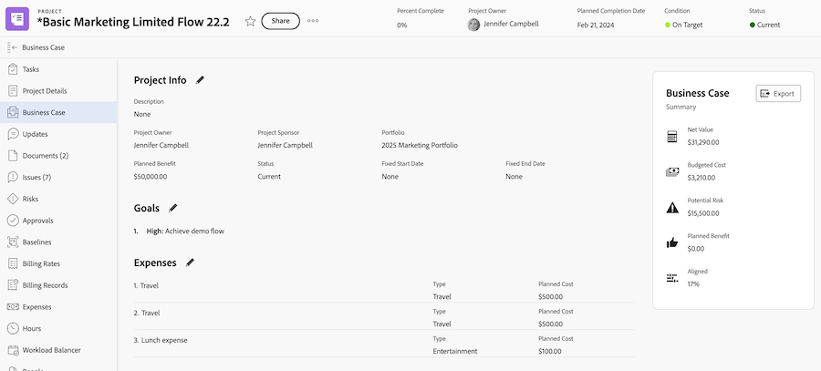
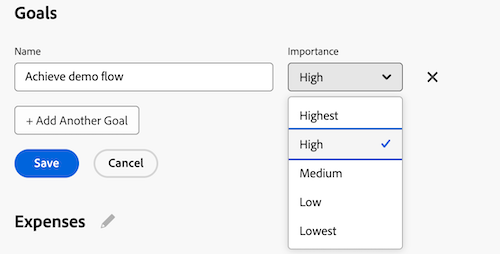

# 创建业务案例目标

<!-- Audited: 6/2025 -->

在创建业务案例的过程中，您可以创建一组目标以定义项目目标。 这些目标用于将完成项目的目的传达给Portfolio经理或项目发起人。

<!--

(NOTE: below snippet: NWE only, not classic)

-->

>[!TIP]
>
>您可以为组织创建未与项目的单个业务案例关联的战略目标。 您必须有权访问Adobe Workfront目标才能创建战略目标。 然后，您可以将他们与其业务案例之外的项目联系起来。 有关使用Workfront目标创建目标的信息，请参阅[Adobe Workfront目标概述](../../../workfront-goals/goal-management/wf-goals-overview.md)。

在为项目创建业务案例目标时，请考虑以下事项：

* 业务案例目标是特定于项目的。 您无法将目标从一个项目复制到另一个项目或在系统级别建立目标；必须在每个项目的级别定义目标。
* 您的Adobe Workfront管理员或组管理员必须启用项目的“目标”部分，才能将其显示在业务案例中。 有关为项目启用业务案例字段的信息，请参阅[配置系统范围的项目首选项](../../../administration-and-setup/set-up-workfront/configure-system-defaults/set-project-preferences.md)。

* 目标不是项目业务案例中的强制部分。

  即使未定义“目标”部分，项目也可以在Portfolio优化器中接收要优先处理的得分。

  有关Portfolio Optimizer分数的详细信息，请参阅[将记分卡应用于项目并生成一致性分数](../../../manage-work/projects/define-a-business-case/apply-scorecard-to-project-to-generate-alignment-score.md)。

* 您无法报告业务案例目标。

## 访问权限要求

+++ 展开可查看本文所述功能的访问权限要求。

<table style="table-layout:auto"> 
 <col> 
 </col> 
 <col> 
 </col> 
 <tbody> 
  <tr> 
   <td role="rowheader">
Adobe Workfront 包
</td> 
   <td> 
Prime或更高版本

  </tr> 
  <tr> 
   <td role="rowheader">
Adobe Workfront许可证
</td>
   <td> 
   
标准
 
   
规划 
 
   </td> 
  </tr> 
  <tr> 
   <td role="rowheader">访问级别配置</td> 
   <td> 
编辑对项目的访问权限
 </td> 
  </tr> 
  <tr> 
   <td role="rowheader">
对象权限
</td> 
   <td> 
管理项目的权限或更高
 </td> 
  </tr> 
 </tbody> 
</table>

有关信息，请参阅Workfront文档中的[访问要求](/help/quicksilver/administration-and-setup/add-users/access-levels-and-object-permissions/access-level-requirements-in-documentation.md)。

+++

## 向项目的业务案例添加目标

{{step1-to-projects}}

1. 在项目列表中，选择要为其定义业务案例目标的项目。

1. 在左侧面板中，单击&#x200B;**业务案例**。 将显示&#x200B;**业务案例**&#x200B;部分。

   

1. 在&#x200B;**目标**&#x200B;部分中，单击&#x200B;**编辑目标**。

1. 在第一个字段中，输入目标描述。

1. 在&#x200B;**重要性**&#x200B;下拉菜单中，为此目标选择重要性级别（或优先级）：

   * 最高
   * 高
   * 媒介
   * 低
   * 最低

   

   >[!NOTE]
   >
   >您无法自定义目标的重要性级别。

1. （可选）要添加另一个目标，请单击“添加另一个目标”**&#x200B;**&#x200B;并重复步骤5-6。

1. 单击&#x200B;**保存**。
