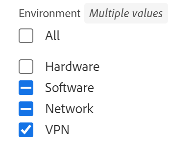
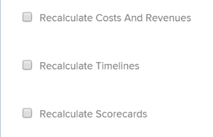

# 编辑项目

<!--Audited: 07/2024-->

<!--The highlighted information on this page refers to functionality not yet generally available. It is available for all customers in the Preview environment and for a select group of customers in the Production environment.-->

<!--

***Linked to many articles,

The Resource Pools part also duplicates in the "Working with Resource Pools" article 

The Update Type section is also documented in Selecting the Project Update Type article

Keep the reference link to the other article that also documents the Update Type) 

(NOTE 2: information described here also exists in these articles:

** Project Overview area

**Manage project Finance area

If you need to update just one field, check to see if that field is also listed there and update in both places.)

-->

您可以根据需要经常在Adobe Workfront中编辑项目。 我们建议您在项目状态更改为当前后对其执行最低程度的编辑，通过向整个项目团队发送更改通知来避免混淆。

理想情况下，当项目处于规划状态时，应编辑项目。 有关项目团队的信息，请参阅[项目团队概述](../../../manage-work/projects/planning-a-project/project-team-overview.md)。

## 访问要求

+++ 展开以查看本文中各项功能的访问要求。

<table style="table-layout:auto"> 
 <col> 
 <col> 
 <tbody> 
  <tr> 
   <td role="rowheader">Adobe Workfront计划</td> 
   <td> 
任何
 </td> 
  </tr> 
  <tr> 
   <td role="rowheader">Adobe Workfront许可证*</td> 
   <td>
新增：标准 
 
   或
   
当前：计划 
 </td> 
  </tr> 
  <tr> 
   <td role="rowheader">访问级别配置</td> 
   <td> 
编辑对项目的访问权限
 </td> 
  </tr> 
  <tr> 
   <td role="rowheader">对象权限</td> 
   <td> 
     
管理项目的权限 
 
     </td> 
  </tr> 
 </tbody> 
</table>

*有关此表中信息的更多详细信息，请参阅Workfront文档中的[访问要求](/help/quicksilver/administration-and-setup/add-users/access-levels-and-object-permissions/access-level-requirements-in-documentation.md)。

+++

## 编辑项目的限制

有一些限制可能会阻止您编辑项目。

编辑项目时，请考虑以下事项：

* 您无法编辑处于批准流程中的项目，但记录时间并更改状态除外。
* 仅当您的Workfront管理员或组管理员在“项目首选项”区域中启用了此功能时，您才可以将文档或模板附加到状态为“完成”、“废弃”或“未决批准”的项目。 有关设置项目首选项的信息，请参阅[配置系统范围项目首选项](../../../administration-and-setup/set-up-workfront/configure-system-defaults/set-project-preferences.md)。
* 您只能编辑有关处于非活动状态或完成状态的项目的以下信息：

   * 修改现有费用。
   * 添加、删除或编辑自定义表单。

## 编辑项目

通过编辑项目，您可以修改项目的信息和设置，以及项目上的任务和问题。

本文中提到的某些设置可能会根据其在创建项目的模板中的状态从默认状态进行修改。

有关编辑模板的信息，请参阅[编辑项目模板](../../../manage-work/projects/create-and-manage-templates/edit-templates.md)。

有关从模板创建项目的信息，请参阅[使用模板创建项目](/help/quicksilver/manage-work/projects/create-projects/create-project-from-template.md)。

{{step1-to-projects}}

1. （可选）单击右上角的&#x200B;**我所在的项目**&#x200B;或&#x200B;**我拥有的项目**&#x200B;以显示您拥有的项目或您属于项目团队的项目。

   

   >[!NOTE]
   >
   >如果您是组管理员，则可以在组区域和项目区域查看和编辑组的项目。 有关详细信息，请参阅[创建和修改组的项目](../../../administration-and-setup/manage-groups/work-with-group-objects/create-and-modify-a-groups-projects.md)。

1. 单击要编辑的项目名称以打开项目页面。

1. （可选）要编辑有关项目的有限信息，请单击左侧面板中的&#x200B;**项目详细信息**。 如果要编辑有关项目的所有信息，请继续执行步骤5。<!--accurate?!-->

   

   >[!NOTE]
   >
   >根据Workfront管理员或组管理员修改布局模板的方式，项目详细信息区域中的字段可能会重新排列或不显示。 有关信息，请参阅[使用布局模板自定义详细信息视图](../../../administration-and-setup/customize-workfront/use-layout-templates/customize-details-view-layout-template.md)。

   要编辑“详细信息”部分中的信息，请执行以下操作：

   1. （可选）单击右上角的&#x200B;**全部折叠**&#x200B;图标以折叠所有区域。
   1. （可选且有条件）折叠区域时，单击每个区域旁边的&#x200B;**向右箭头** 以展开要编辑的区域。
   1. 有关在项目详细信息选项卡中编辑信息的更多信息，请参阅以下文章：

      * [在项目概述区域管理信息](../../../manage-work/projects/manage-projects/understand-project-overview-area.md)
      * [管理项目财务方面的信息](../../../manage-work/projects/project-finances/manage-project-finance-area.md)

   1. （可选）要附加自定义表单，请在&#x200B;**添加自定义表单**&#x200B;字段中开始键入表单的名称，然后在表单显示在列表中时将其选中，然后单击&#x200B;**保存更改**。
   1. （可选）单击&#x200B;**导出**&#x200B;图标以将概述和自定义表单信息导出到PDF文件，然后单击&#x200B;**导出**。 从以下项中选择：

      * 选择全部（仅在至少附加一个自定义表单时显示）
      * 概述
      * 一个或多个自定义表单的名称

      PDF文件将下载到您的计算机。

      

      有关详细信息，请参阅[导出自定义表单和对象详细信息](../../../workfront-basics/work-with-custom-forms/export-custom-forms-details.md)。

   有关在项目详细信息部分中可见的字段的信息，请继续在编辑项目框中编辑项目，如下所述。
1. 要编辑有关项目的所有信息，请单击项目名称旁边的&#x200B;**更多**&#x200B;菜单，然后单击&#x200B;**编辑**。

   或

   从项目列表中选择一个或多个项目，然后单击列表顶部的&#x200B;**编辑**&#x200B;图标。

   有关批量编辑项目的更多信息，请参阅本文中的[批量编辑项目](#edit-projects-in-bulk)部分。

   将打开&#x200B;**编辑项目**&#x200B;框。

   >[!IMPORTANT]
   >
   >您必须具有项目的管理权限才能看到编辑选项。

   所有项目字段在编辑项目框中可用，并按左侧面板中列出的区域分组。

   >[!NOTE]
   >
   >根据您的Workfront管理员或组管理员如何修改布局模板，编辑项目框左侧面板中的区域或这些区域中列出的任何字段可能会重新排列或不显示。 有关信息，请参阅[使用布局模板自定义详细信息视图](../../../administration-and-setup/customize-workfront/use-layout-templates/customize-details-view-layout-template.md)。

1. （视情况而定）如果您单击&#x200B;**更多**&#x200B;菜单，然后单击&#x200B;**编辑**，请更新左侧面板中列出的以下任意区域的信息：

   * [项目名称](#project-name)
   * [概述](#overview)
   * [自定义表单](#custom-forms)
   * [财务](#finance)
   * [项目设置](#project-settings)
   * [任务设置](#task-settings)
   * [问题设置](#issue-settings)
   * [访问权限](#access)

   >[!NOTE]
   >
   >根据Workfront管理员为项目的详细信息区域设置布局模板的方式，您的环境中编辑项目框中的部分和字段可能会有所不同。 有关信息，请参阅[使用布局模板自定义详细信息视图](../../../administration-and-setup/customize-workfront/use-layout-templates/customize-details-view-layout-template.md)。

### 项目名称 {#project-name}

1. 按如上所述开始编辑项目。
1. 单击左侧面板中的&#x200B;**项目名称**。

   

1. 更新项目的名称。

   批量编辑项目时，无法编辑项目名称。

### 概述 {#overview}

1. 按如上所述开始编辑项目。
1. 单击左侧面板中的&#x200B;**概述**。

   

1. 更新有关项目的以下信息：

   <table style="table-layout:auto"> 
      <col> 
      <col> 
      <tbody> 
      <tr> 
         <td role="rowheader"><strong>描述</strong> </td> 
         <td> 
添加有关项目的其他信息。
 </td> 
      </tr> 
      <tr> 
         <td role="rowheader"><strong>状态</strong> </td> 
         <td> 
选择项目的状态。 在所有任务和问题完成之前，您无法将项目标记为完成。 有关项目状态的信息，请参阅<a href="../../../administration-and-setup/customize-workfront/creating-custom-status-and-priority-labels/project-statuses.md" class="MCXref xref">访问系统项目状态列表</a>
 </td> 
      </tr> 
      <tr> 
         <td role="rowheader"><strong>优先级</strong> </td> 
         <td> 
 
这只是一个可视标记，可让您设置项目的优先级。
 
根据您的Workfront管理员选择的项目偏好设置，优先级名称可能有所不同。 有关编辑优先级的详细信息，请参阅<a href="../../../administration-and-setup/customize-workfront/creating-custom-status-and-priority-labels/create-customize-priorities.md" class="MCXref xref">创建和自定义优先级</a>
 
 </td> 
      </tr> 
      <tr> 
         <td role="rowheader"><strong>URL</strong> </td> 
         <td> 
指定与此项目信息相关的Web链接。
 </td> 
      </tr> 
      <tr> 
         <td role="rowheader"><strong>条件类型</strong> </td> 
         <td> 
在以下条件类型之间进行选择： 
         <ul> 
         <li><strong>手动：</strong>项目所有者手动设置项目的条件。</li> 
         <li><strong>进度状态：</strong> Workfront会根据关键路径上任务的进度状态自动设置条件。 有关了解进度状态的详细信息，请参阅<a href="../../../manage-work/tasks/task-information/task-progress-status.md" class="MCXref xref">任务进度状态概述</a>。</li> 
         </ul>
您的Workfront管理员或组管理员为系统或组选择项目条件的计算方式默认值。 有关设置项目默认设置的信息，请参阅<a href="../../../administration-and-setup/set-up-workfront/configure-system-defaults/set-project-preferences.md" class="MCXref xref">配置系统范围的项目首选项</a>。 

 </td> 
      </tr> 
      <tr> 
         <td role="rowheader"><strong>条件</strong> </td> 
         <td> 
 
（仅在您为<strong>条件类型</strong>选择<strong>手动</strong>后显示）：选择条件以指示项目的进展情况。 
 
有关如何自动或手动设置项目完成情况的信息，请参阅<a href="../../../manage-work/projects/manage-projects/project-condition-and-condition-type.md" class="MCXref xref">项目完成情况和完成情况类型概述</a>
 
 </td> 
      </tr> 
      <tr> 
         <td role="rowheader"><strong>计划模式</strong> </td> 
         <td> 
指定是从开始日期还是从完成日期开始计划项目。 此选择确定项目上任务的计划日期。 
         <ul> 
         <li><strong>开始日期</strong>：默认情况下，项目的第一个任务的计划开始日期与项目相同。 有关任务计划开始日期的信息，请参阅<a href="../../../manage-work/tasks/task-information/task-planned-start-date.md" class="MCXref xref">任务计划开始日期概览</a>。 项目时间线从开始日期开始计算，项目完成日期由系统根据所有任务的持续时间来计算。 </li> 
         <li><strong>完成日期</strong>：项目的最后一个任务的计划完成日期与项目相同。 项目时间线从完成日期开始计算，项目开始日期由系统计算，从项目完成日期减去所有任务的持续时间。 </li> 
         </ul>
您的Workfront管理员或组管理员为您的系统或组选择默认的计划模式设置。 有关设置项目默认设置的信息，请参阅<a href="../../../administration-and-setup/set-up-workfront/configure-system-defaults/set-project-preferences.md" class="MCXref xref">配置系统范围的项目首选项</a>。

 </td> 
      </tr> 
      <tr> 
         <td role="rowheader"><strong>计划开始日期和时间</strong> </td> 
         <td> 
 
指定选择<strong>从开始日期</strong>开始计划的日期。  
 
当您选择<strong>从完成日期</strong>开始计划，此字段为只读字段。 
 
 </td> 
      </tr> 
      <tr> 
         <td role="rowheader"><strong>计划完成日期和时间</strong> </td> 
         <td> 
指定选择<strong>从完成日期</strong>开始计划的日期。 
 
当您选择<strong>从开始日期</strong>开始计划，这是只读字段。 
 </td> 
      </tr> 
      <tr> 
         <td role="rowheader"><strong>项目组合</strong></td> 
         <td>指示项目所属的Portfolio。 必须先创建一个Portfolio，然后它才会显示在下拉列表中。 只有活动项目组合可以与项目关联。 有关创建项目组合的详细信息，请参阅<a href="../../../manage-work/portfolios/create-and-manage-portfolios/create-portfolios.md" class="MCXref xref">创建项目组合</a>。
         
<b>注释</b>

         
您必须具有项目组合的管理权限才能将其添加到项目中或从中删除。

      </td> 
      </tr> 
      <tr> 
         <td role="rowheader"><strong>项目群</strong></td> 
         <td> 
如果为项目选择了Portfolio，请为项目指定项目群。 某些Portfolio可能没有程序。 必须先创建项目，然后它才会显示在此下拉列表中。 只有活动的项目群才能与项目关联。 
 
有关创建程序的详细信息，请参阅<a href="../../../manage-work/portfolios/create-and-manage-programs/create-program.md" class="MCXref xref">创建程序</a>。
 
      
<b>注释</b>

         
您必须具有项目的管理权限才能在项目中添加或删除项目。
   
      </td> 
      </tr> 
      <tr> 
         <td role="rowheader"><strong>组</strong></td> 
         <td> 
 
指定与项目关联的组的名称。 
这是必填字段。 不能有与组不关联的项目。 
 
您可以确保选择正确的组，方法是将鼠标悬停在该组上，然后单击该组旁边显示的信息图标。 这将显示一个工具提示，其中列出了有关组的信息，例如组及其上各组的层次结构。
 默认情况下，以下组之一在创建项目时自动与项目关联，除非您指定其他组：
 
         <ul> 
         <li> 
从“项目”区域创建项目时，项目创建者的主组与项目相关联。 
 
从项目组合或项目群的项目分区创建项目时，也是如此。
 </li> 
         <li> 
从设置区域中的组主页创建项目时，该组与项目相关联。
 </li> 
         </ul> 
 
  
 
         
<b>注释</b>

         <ul>
         <li>
如果项目或其任务或问题与组级自定义状态关联，则更改项目组可能会导致项目状态、任务或问题更改以与新组匹配。
</li>
         <li>
如果项目或其任务或问题已使用组级自定义状态与组级审批流程关联，则更改组可能会导致上一个组的审批状态与系统级现有的审批状态之间发生冲突。

         
在更新组之前，请考虑删除项目或其任务或问题的组级别审批流程。

         
有关创建组级审批流程的信息，请参阅<a href="../../../administration-and-setup/manage-groups/work-with-group-objects/create-and-modify-groups-approval-processes.md" class="MCXref xref">组级审批流程</a>。

         
有关创建组级自定义状态的信息，请参阅<a href="../../../administration-and-setup/manage-groups/manage-group-statuses/create-or-edit-a-group-status.md" class="MCXref xref">创建或编辑组状态</a>
</li></ul> </td> 
      </tr> 
      <tr> 
         <td role="rowheader"><strong>公司</strong> </td> 
         <td> 
指定与项目关联的公司。 必须先创建公司，然后才能将其与项目关联。 只有活动的公司才能与项目关联。 有关创建公司的信息，请参阅<a href="../../../administration-and-setup/set-up-workfront/organizational-setup/create-and-edit-companies.md" class="MCXref xref">创建和编辑公司</a>。
 </td> 
      </tr> 
      <tr> 
         <td role="rowheader"><strong>项目所有者</strong> </td> 
         <td> 
开始键入用户的名称以将其添加到项目中，然后在列表中显示该用户时将其选定。 用户将添加到项目团队，并自动获得项目的“管理”权限。 指定为项目所有者的用户必须是Workfront活动用户。

         </td> 
      </tr> 
      <tr> 
         <td role="rowheader"><strong>项目赞助者</strong> </td> 
         <td> 
开始键入用户的名称以将其添加到项目中，然后在列表中显示该用户时将其选定。 用户将添加到项目团队，并自动获得项目的“查看”权限。 指定为项目发起人的用户必须是Workfront活动用户。 
 </td> 
      </tr> 
      <tr> 
         <td role="rowheader"><strong>资源管理者</strong> </td> 
         <td> 
 开始键入用户的名称以将其添加到项目中，然后在用户显示在列表时选择用户。 用户将添加到项目团队，并自动获得项目的管理权限，并且可以为项目上的任务和问题分配资源。 即使从资源管理器字段中移除，用户仍保留对项目的管理权限。 可以指定多个资源管理器。 
 </td> 
      </tr>

   <tr> 
         <td role="rowheader"><strong>转换的问题发起人</strong> </td> 
         <td> 
 默认情况下，此字段自动填充为创建项目转换来源问题的用户的名称。 您可以在Workfront中使用任何其他用户名更新此名称。  
 </td> 
      </tr>

   </tbody> 
      </table>

   >[!TIP]
   >
   >在更新项目所有者、项目发起人和资源管理器字段时，请注意头像、用户的主要角色或其电子邮件地址以区分具有相同名称的用户。
   >
   >用户必须与至少一个工作角色关联，才能在添加时查看工作角色。
   >
   >您必须在访问级别中启用“查看联系信息”设置，用户才能查看用户的电子邮件。 有关信息，请参阅[授予用户访问权限](../../../administration-and-setup/add-users/configure-and-grant-access/grant-access-other-users.md)。

1. （可选）根据要修改的信息，继续编辑以下部分

   或

   单击&#x200B;**保存**。

### 自定义表单 {#custom-forms}

根据您的访问级别和您对项目的权限，存在以下场景：

* 如果您没有项目的“编辑自定义表单”权限，则无法编辑任何附加的自定义表单上的字段。 您只能查看附加到项目的自定义表单上的字段。
* 如果您对自定义表单上的某个分区具有“查看”（而不是“编辑”）权限，则无法编辑该分区中的字段。
* 如果您无权访问附加到项目的其中一个自定义表单上的分区，则该分区不会显示在编辑项目框中。

选择多个项目进行批量编辑时，存在以下情况：

* 如果您对至少一个选定项目没有“编辑自定义表单”权限，则无法编辑任何附加的自定义表单上的字段。 您只能查看附加的自定义表单上的字段
* 如果您对自定义表单上的某个分区具有“查看”（而不是“编辑”）权限，则无法编辑该分区中的字段。 您只能查看该部分中的字段。
* 如果您无权访问附加到至少一个项目的其中一个自定义表单上的分区，则该分区不会显示在编辑项目框中。
* 如果在附加到所有项目的任何自定义表单上具有必填字段，并且选择一个字段而没有实际编辑它，则必须放弃对该字段的更改或向其添加信息，然后才能保存所选项目。 如果根本未选择必填字段，则可以保存所选项目，即使必填字段为空也是如此。

有关自定义表单访问权限的信息，请参阅以下文章：

* [共享自定义表单](../../../administration-and-setup/customize-workfront/create-manage-custom-forms/share-access-to-a-custom-form.md)
* [组织和预览表单](/help/quicksilver/administration-and-setup/customize-workfront/create-manage-custom-forms/form-designer/design-a-form/organize-a-form.md)

要在编辑项目时编辑自定义表单上的信息，请执行以下操作：

1. 按如上所述开始编辑项目。
1. 单击左侧面板中的&#x200B;**自定义Forms**。

   

1. 单击&#x200B;**添加自定义表单**&#x200B;框并从列表中选择一个表单以将其附加到项目。 默认情况下，前40个表单按字母顺序显示。 如果在列表中看不到该表单，请开始键入其名称，然后当表单出现在列表中时将其选定。

   >[!NOTE]
   >
   >您必须先构建自定义表单，然后才可在此字段中选择它们。 列表中只显示活动的自定义表单。 有关生成自定义表单的详细信息，请参阅[使用表单设计器设计表单](/help/quicksilver/administration-and-setup/customize-workfront/create-manage-custom-forms/form-designer/design-a-form/design-a-form.md)。 您最多可以向一个项目添加十个自定义表单。

1. （视情况而定）如果您将自定义表单附加到项目，请编辑表单上的任何字段。 在保存项目之前，必须指定所有必填字段。
1. （可选）单击自定义表单名称右侧的&#x200B;**X图标**&#x200B;以将其删除，然后单击&#x200B;**删除**。
1. （可选）根据要修改的信息，继续编辑以下部分

   或

   单击&#x200B;**保存**。

### 财务 {#finance}

根据您的访问级别和您对项目的权限，存在以下场景：

* 如果您对项目具有“查看财务数据”和“查看财务”权限，则只能查看“财务”部分中的字段。 您无法编辑此分区中的字段。
* 如果您具有项目的“编辑财务数据”和“管理财务”权限，则可以更新此部分中的字段。

选择多个项目进行批量编辑时，存在以下情况：

* 如果您至少选择一个您具有“查看财务”（而不是“管理财务”）权限的项目，则只能查看此分区中所有选定项目的字段。 不能批量编辑Finance节中的字段。
* 如果至少选择一个您没有财务权限的项目，则根本不会显示此分区。

要编辑“财务”区域中的字段，请执行以下操作：

1. 按如上所述开始编辑项目。
1. 单击左侧面板中的&#x200B;**财务**。

   

1. 更新项目的以下财务信息：

   <table style="table-layout:auto"> 
    <col> 
    <col> 
    <tbody> 
     <tr data-mc-conditions=""> 
      <td role="rowheader"><strong>货币</strong> </td> 
      <td> 
 
如果项目货币与系统的默认货币不同，请指定该项目的货币。 如果项目中已存在财务信息，则无法更改项目的货币。 如果系统中只有默认货币，则此字段不可见。 
 
有关货币的详细信息，请参阅<a href="../../../administration-and-setup/manage-workfront/exchange-rates/set-up-exchange-rates.md" class="MCXref xref">设置汇率</a>。 
 
 </td> 
     </tr> 
     <tr> 
      <td role="rowheader"><strong>预算</strong> </td> 
      <td> 指定项目的预算。 </td> 
     </tr> 
     <tr> 
      <td role="rowheader"><strong>绩效指数方法</strong> </td> 
      <td> 
选择<b>基于小时</b>或<b>基于成本</b>以指示项目的实现值指标（如成本绩效指数或估计的实际成本）是否使用小时或成本计算。 
 
有关绩效指数方法的详细信息，请参阅<a href="../../../manage-work/projects/project-finances/set-pim.md" class="MCXref xref">设置绩效指数方法(PIM)</a>。 
 
您的Workfront管理员或组管理员为您的系统或您的组选择默认的“性能索引方法”设置。 有关设置项目默认设置的信息，请参阅<a href="../../../administration-and-setup/set-up-workfront/configure-system-defaults/set-project-preferences.md" class="MCXref xref">配置系统范围的项目首选项</a>。
 </td> 
     </tr> 
     <tr> 
      <td role="rowheader"><strong>完工估算</strong> </td> 
      <td> 
 
指定Workfront应如何计算完工估算(EAC)。 

      从以下选项中选择： 
      <ul><li><b>在项目级别计算</b></li>
      <li><b>从任务/子任务汇总</b></li> </ul>
      
有关如何计算完工估算值的详细信息，请参阅<a href="../../../manage-work/projects/project-finances/calculate-eac.md" class="MCXref xref">计算完工估算(EAC)</a>。
 
您的Workfront或组管理员为您的系统或组选择默认的完成时估计值。 有关设置项目默认设置的信息，请参阅<a href="../../../administration-and-setup/set-up-workfront/configure-system-defaults/set-project-preferences.md" class="MCXref xref">配置系统范围的项目首选项</a>。
 
 </td> 
     </tr> 
     <tr> 
      <td role="rowheader"><strong>计划的收益</strong> </td> 
      <td> 
估计项目的计划收益。 这在项目的业务案例和Portfolio优化器中使用。 有关项目计划权益的详细信息，请参阅<a href="../../../manage-work/projects/project-finances/project-planned-benefit.md" class="MCXref xref">项目计划权益概述</a>。 在计算项目净值时，将考虑项目的计划收益。 
 
有关详细信息，请参阅<a href="../../../manage-work/portfolios/portfolio-optimizer/manage-projects-in-portfolio-optimizer.md" class="MCXref xref">在Portfolio优化器中管理项目</a> 。 
 </td> 
     </tr> 
     <tr> 
      <td role="rowheader"><strong>实际收益</strong> </td> 
      <td> 
估计项目的实际收益。 这是一个货币金额，表示在该项目完成之后您的公司或部门将获得的利益。 
 </td> 
     </tr> 
      <tr> 
      <td role="rowheader"><strong>固定成本</strong> </td> 
      <td> 
指定项目的固定成本。 这与来自项目小时数的人工成本和来自项目费用金额的费用成本不同。 在计算项目的净值时，将考虑项目的固定成本，它也是预算成本的一部分。 
 </td> 
     </tr> 
     <tr> 
      <td role="rowheader"><strong>固定收入</strong> </td> 
      <td> 
指定项目的固定收入。 
 </td> 
     </tr> 
    </tbody> 
   </table>

1. （可选）根据要修改的信息，继续编辑以下部分。

   或

   单击&#x200B;**保存**。

### 项目设置 {#project-settings}

1. 按如上所述开始编辑项目。
1. 单击左侧面板中的&#x200B;**项目设置**。

   

1. 更新以下信息：

   <table style="table-layout:auto"> 
      <col> 
      <col> 
      <tbody> 
      <tr> 
      <td role="rowheader"><strong>里程碑路径</strong> </td> 
       <td> 
选择项目的里程碑路径。 列表中只显示活动里程碑路径。
 
有关里程碑路径的详细信息，请参阅<a href="../../../administration-and-setup/customize-workfront/configure-approval-milestone-processes/create-milestone-path.md" class="MCXref xref">创建里程碑路径</a>。
 </td> 
      </tr> 
      <tr> 
      <td role="rowheader"><strong>完成模式</strong> </td> 
      <td> 
控制如何将项目标记为完成。 从以下选项中选择： 
       <ul> 
       <li>
<strong>自动</strong>：在所有任务和问题都完成时，项目被标记为“完成”。

只有在任务完成时项目状态为当前时，项目状态才会自动更改为完成。 
</li> 
       <li><strong>手动</strong>：当所有任务和问题都完成时，您必须手动选择项目的“完成”状态。</li> 
       </ul>
 </td> 
       </tr> 
       <tr> 
       <td role="rowheader"><strong>摘要完成模式</strong></td> 
       <td> 
控制如何将父级任务标记为“完成”。 从以下选项中选择： 
       <ul> 
       <li><strong>自动</strong>：父任务标记为“完成”，当子任务完成且子任务的完成百分比更新时，父任务会自动更新其完成百分比。 </li> 
       <li><strong>手动</strong>：您必须手动更新父任务的完成百分比和状态，而不考虑对子任务所做的更改。 这样，即使子任务不完整，您也可以将父任务标记为已完成。 </li> 
       </ul>
 </td> 
       </tr> 
       <tr> 
       <td role="rowheader"><strong>更新类型</strong></td> 
       <td> 
控制将对项目时间线所做的更改保存在项目或父任务中的时间。 例如，对项目的以下更改会触发对项目时间线的更新： 
       <ul> 
       <li>更新任务日期</li> 
       <li>更改任务的前置任务关系</li> 
       <li>
除了更改任务限制或持续时间类型外，还可以更改父子关系，添加或删除分配。

任务更新时，其父对象（父任务或项目）会在“更新类型”指示的时间更新。 

如果在选择“更改时自动更新”或“仅更改”更新类型时，父对象未在更改后立即更新，请刷新页面

从以下选项中选择： 

- <strong>更改时自动更新</strong>（默认设置）：每次在项目或项目所依赖的其他项目中发生更改时，项目的时间表都会更新（更改时）。 项目时间表也会每晚更新（自动）。

这是此字段的推荐设置，因为它可确保项目始终保持最新。

在触发时间表重新计算的任务或项目上执行操作时，所有可用日期都会立即显示，使您可以继续工作。 在具有100个以上任务的项目中，需要更长时间重新计算的日期会短暂显示为问号（介于1和5秒之间，对于大型项目，最多会显示一分钟）。 这表示重新计算尚未完成，并且日期可能会发生更改。

- <strong>仅更改</strong>：每次在项目或项目所依赖的其他项目中发生更改时，项目的时间表都会更新。 如果项目或时间线所依赖的其他项目中很少发生更改，您可能需要选择此选项。

- <strong>仅限自动</strong>：项目时间线每晚都会更新；进行更改后时间线不会立即更新。

如果项目或时间线所依赖的其他项目每天发生许多更改，您可能需要选择此选项。 但是，请注意，您选择了此设置，因为项目不会在进行更改的同时更新。

- <strong>仅手动</strong>：仅当您选择“重新计算时间表”选项时，项目时间表才会更新。 有关手动重新计算项目时间线的详细信息，请参阅<a href="../../../manage-work/projects/manage-projects/recalculate-project-timeline.md" class="MCXref xref">重新计算项目时间线</a>。 

如果要一次对项目进行多项更改，并且希望在所有更改完成后（而不是在每次更改后）重新计算时间线，则可能需要选择此选项。
</li> 
       </ul>
 </td> 
       </tr> 
       <tr> 
       <td role="rowheader"><strong>计划</strong> </td> 
       <td> 
为您的项目选择计划。 该时间表应与分配给大多数参与项目工作的人员的时间表相同。 您必须先创建计划，然后才能将其分配给项目或用户。 如果尚未在系统中创建自定义计划，则选择“默认计划”。
 
有关创建计划的详细信息，请参阅<a href="../../../administration-and-setup/set-up-workfront/configure-timesheets-schedules/create-schedules.md" class="MCXref xref">创建计划</a>。 
 </td> 
       </tr> 
       <tr> 
       <td role="rowheader"><strong>用户空闲时间</strong> </td> 
       <td> 
确定任务的主要被分配人的休息时间是否调整项目上的任务计划日期。 

您的Workfront管理员或组管理员为您的系统或您的组选择此设置的默认值。 有关设置项目默认设置的信息，请参阅<a href="../../../administration-and-setup/set-up-workfront/configure-system-defaults/set-project-preferences.md" class="MCXref xref">配置系统范围的项目首选项</a>。 

从以下选项中选择： - <strong>考虑任务持续时间中的用户休息时间</strong>：选择此选项时，如果休息时间发生在任务持续时间中，则任务的计划日期会根据任务的主要被分配人的休息时间进行调整。 

例如，如果一项约束为尽快的任务计划于6月1日开始并在6月3日完成，而主要被分配人将6月2日标记为休假，当启用此选择时，任务计划日期为6月1日至6月4日。 根据任务限制，存在以下方案： 
 
       <ul> 
       <li>对于与起始日期（尽快、最早可用时间、开始时间不早于、开始时间不晚于、必须开始时间）的计划相关的任务约束，计划起始日期不会更改，但计划完成日期会更改。</li> 
       <li>对于与从完成日期开始的计划相关的任务限制（尽可能迟，最晚可用时间，完成时间不早于，完成时间不晚于，必须完成时间），计划完成日期不会更改，但计划起始日期会更改。</li> 
       <li>对于固定日期受限的任务，计划开始日期和完成日期都不会更改。 </li> 
       </ul>
选择此设置时，任务的持续时间不会更改。 根据任务限制，只有计划的日期会更改。 有关任务限制的信息，请参阅<a href="../../../manage-work/tasks/task-constraints/task-constraint-overview.md" class="MCXref xref">任务限制概述</a>。 

- <strong>忽略任务持续时间中的用户空闲时间</strong>：选择此选项时，即使任务的主要被分配人在任务持续时间里有空闲时间，项目上任务的计划日期仍保持原计划。 

为此设置选择选项时，请考虑以下事项：
 
       <ul> 
       <li>
新项目的此设置的默认选项与系统级别项目首选项相同。 

有关系统级别的项目首选项的信息，请参阅<a href="../../../administration-and-setup/set-up-workfront/configure-system-defaults/set-project-preferences.md" class="MCXref xref">配置系统范围的项目首选项</a>。 
</li> 
       <li>将模板附加到现有项目时，项目上的设置将更新以匹配其中一个模板。 </li> 
       <li>
Workfront会根据任务的任务限制值确定要调整的计划任务日期。 根据具体情况，计划开始日期或计划完成日期（或同时使用两者）可能会受到影响，甚至可能保持不变。 例如，如果任务的限制为固定日期，则当主要被分配者具有休假时，日期不会调整，即使选择了<strong>考虑任务持续时间中的用户休假</strong>。 
</li> 
       </ul></td> 
      </tr> 
      <tr> 
       <td role="rowheader"><strong>资源均衡模式</strong> </td> 
       <td> 
 
从以下选项中选择：
 
- <strong>手动</strong>：您必须手动调配资源（这是默认设置）
 
- <strong>自动</strong>： Workfront可分级您的资源。
 
有关资源均衡的更多信息，请参阅甘特图</a>中的<a href="../../../manage-work/gantt-chart/use-the-gantt-chart/level-resources-in-gantt.md" class="MCXref xref">均衡资源。
 
 </td> 
      </tr> 
      <tr> 
       <td role="rowheader"><strong>风险</strong> </td> 
       <td> 
 
定义项目的风险级别。 风险只是一个指示器，表明一个项目可能有多大的风险。 您可以根据风险级别安排项目执行的优先级。
 
 
考虑从以下风险级别中选择：
 
 — 非常低
 
 — 低
 
- MEDIUM
 
 — 高
 
 — 非常高
 
您无法自定义此处指示的风险级别。
 
这些风险与项目存续期间可能发生的潜在风险无关，您应在项目的“风险”选项卡中或业务案例中记录这些风险。 有关潜在项目风险的信息，请参阅<a href="../../../administration-and-setup/set-up-workfront/configure-system-defaults/edit-create-risk-types.md" class="MCXref xref">编辑和创建风险类型</a>。 
 
 
 </td> 
      </tr> 
      <tr> 
       <td role="rowheader"><strong>资源池</strong> </td> 
       <td> 
 
指定与项目关联的资源池。 资源池是完成项目同时需要的用户集合，用于在资源规划者中进行项目预算。 有关资源池的详细信息，请参阅<a href="../../../resource-mgmt/resource-planning/resource-pools/work-with-resource-pools.md" class="MCXref xref">资源池概述</a>。 
 
批量编辑项目时，此字段仅显示所有选定项目通用的资源池。 如果所选项目没有共享资源池，则此字段将为空。 您在此处指定的资源池将覆盖项目的各个资源池。
 
 </td> 
      </tr> 
      <tr> 
       <td role="rowheader"> <strong>允许公司级别的记帐费率覆盖项目级别的记帐费率</strong></td> 
       <td>选择此选项可允许公司级别的记帐费率覆盖历史工作角色费率，除非这些费率标记为已记帐。 启用此选项将覆盖历史工作角色费率，除非将它们标记为已记帐。  有关详细信息，请参阅<a href="../../../manage-work/projects/project-finances/override-project-level-with-company-level-billing-rates.md" class="MCXref xref">使用公司级别的记帐费率覆盖项目级别的记帐费率</a>。</td> 
      </tr> 
      <tr> 
       <td role="rowheader"><strong>该项目需要批准时间</strong></td> 
       <td> 
 选择此选项可要求项目所有者批准项目登录时间。 如果您使用开单记录并选择此选项，则只有项目中的已批准小时数显示为开单记录的可用开单小时数。 项目中的批准时间与批准时间表无关。 
 
有关项目需要批准时间的详细信息，请参阅<a href="../../../manage-work/projects/manage-projects/require-time-approval-for-projects.md" class="MCXref xref">项目需要批准时间</a>。
 </td> 
      </tr> 
      <tr> 
       <td role="rowheader"><strong>筛选小时类型</strong>和 <strong>小时类型</strong></td> 
       <td> 
 
从以下选项中选择：
 
       <ul> 
       <li> 
选择<strong>否</strong>以使所有特定于项目的小时类型在项目上可用。 （这是默认选项）
 
或
 </li> 
       <li>选择<strong>是</strong>以仅使项目特定小时类型的子集在项目上可用，然后从<b>小时类型</b>字段中选择要使其可用的小时类型。</li> 
       
<b>提示</b>

       
选择<b>否</b>时，<b>小时类型</b>字段不可编辑。
 
       
如果选择此选项，则在记录项目（或项目中的任务和问题）的小时数时，只有您选择的小时类型才可供选择。 您必须至少选择一个小时类型；如果选择此选项，但未选择任何小时类型，则所有小时类型都将在项目上可用。
 </ul>

   
必须在单个用户级别做出相同的小时类型选择，以便用户查看项目中的这些小时类型选项。 有关在用户级别定义小时类型的详细信息，请参阅<a href="../../../timesheets/create-and-manage-timesheets/log-time.md" class="MCXref xref">记录时间</a>。 
 
 </td> 
      </tr> 
      <tr data-mc-conditions=""> 
       <td role="rowheader"><strong>提醒通知</strong> </td> 
       <td> 
 
选择应与项目关联的提醒通知。 您必须为项目配置提醒通知，此字段才能在编辑项目期间显示。 有关配置提醒通知的详细信息，请参阅<a href="../../../administration-and-setup/manage-workfront/emails/set-up-reminder-notifications.md"><a href="../../../administration-and-setup/manage-workfront/emails/set-up-reminder-notifications.md" class="MCXref xref">设置提醒通知</a> .</a>
 
 </td> 
      </tr> 
      <tr data-mc-conditions=""> 
       <td role="rowheader"><strong>审批流程</strong></td> 
       <td> 
选择要与项目关联的审批流程。 您的Workfront管理员必须定义系统级别的审批流程，然后才能将其与项目关联。 对审批流程具有管理权限的用户也可以创建特定于组的审批流程。有关创建审批流程的详细信息，请参阅<a href="../../../administration-and-setup/customize-workfront/configure-approval-milestone-processes/create-approval-processes.md" class="MCXref xref">为工作项创建审批流程</a>。
 
添加审批流程时，请考虑以下事项： 
 
       <ul> 
       <li>列表中仅显示有效的审批流程。 </li> 
       <li> 
系统范围及组特定的批准流程会显示在列表中。 与项目组以外的组关联的审批流程不会显示在列表中。
 
如果与项目关联的组发生更改，则组特定的审批流程会变成单次使用的审批流程。 有关对项目组的更改或审批流程中的更改如何影响审批设置的详细信息，请参阅<a href="../../../administration-and-setup/customize-workfront/configure-approval-milestone-processes/how-changes-affect-group-approvals.md" class="MCXref xref">组和审批流程更改如何影响分配的审批流程</a>。 
 </li> <!--(NOTE: this bullet stays here although the sections it might appear in are QS only, so we can use the snippet for both Qs and classic)-->
       
批量编辑项目时，存在以下情况：
 
       <ul> 
       <li> 
从同一组中选择项目时，系统层和组层审批流程都会显示在此字段中。
 </li> 
       <li> 
从不同的组中选择项目时，此字段仅显示系统级别的审批流程。
 </li> 
       <li> 
当任何项目附加一次性审批流程时，它将被您选择的系统层或组层审批流程替换。 
 </li> 
      </ul> </td> 
      </tr> 
      <tr> 
      </tr> 
      </tbody> 
      </table>

1. （可选）根据要修改的信息，继续编辑以下部分。

   或

   单击&#x200B;**保存**。

### 任务设置 {#task-settings}

您可以定义在将所有新任务添加到项目时将与它们关联的默认值。

有关这些设置如何影响创建新任务的信息，请参阅[创建任务概述](../../../manage-work/tasks/create-tasks/create-tasks-overview.md)一文中的[将任务添加到项目时的任务默认值](../../../manage-work/tasks/create-tasks/create-tasks-overview.md#understa)部分。

1. 按如上所述开始编辑项目。
1. 单击左侧面板中的&#x200B;**任务设置**。

   

1. 在&#x200B;**任务默认审批流程**&#x200B;框中，选择将新任务添加到项目时要与所有新任务关联的任务审批流程。

   您的Workfront管理员（或具有批准流程管理访问权限的用户）必须创建任务的系统级或组级批准流程，然后才能将其与项目关联。 列表中仅显示有效的审批流程。 有关创建批准流程的信息，请参阅[为工作项创建批准流程](../../../administration-and-setup/customize-workfront/configure-approval-milestone-processes/create-approval-processes.md)。 有关对项目组的更改或审批流程中的更改如何影响审批设置的信息，请参阅[组和审批流程更改如何影响分配的审批流程](../../../administration-and-setup/customize-workfront/configure-approval-milestone-processes/how-changes-affect-group-approvals.md)。

   批量编辑项目时，存在以下情况：

   * 从同一组中选择多个项目时，系统级别和组特定的任务审批流程都会显示在此字段中。
   * 从不同组中选择多个项目时，此字段仅显示系统级任务审批流程。

1. 在&#x200B;**任务默认自定义Forms**&#x200B;框中，选择将任务添加到项目时要与所有新任务关联的一个或多个自定义表单。 您必须先构建自定义表单，然后才可在此字段中选择它们。 列表中仅显示活动的自定义表单。 有关生成自定义表单的详细信息，请参阅[使用表单设计器设计表单](/help/quicksilver/administration-and-setup/customize-workfront/create-manage-custom-forms/form-designer/design-a-form/design-a-form.md)。 您最多可以将十个自定义表单与一个任务关联。
1. （可选）如果要通过使用工作投入而不是计划小时数来启用管理任务投入，请选择&#x200B;**使用工作投入以自动计算任务计划小时数**。

   

1. （视情况而定，可选）如果您选择了使用工作投入以自动计算任务已计划小时数，请单击每个工作级别的下拉菜单，并为每个级别选择一个百分比。 以下百分比值为默认值：

   | 大小 | 百分比 |
   |---|---|
   | 小 | 25% |
   | 中 | 50% |
   | 大 | 75% |

   >[!TIP]
   >
   >当项目更新类型设置为自动并选择此设置时，任务的已计划小时数将根据任务持续时间和工作投入百分比进行更新（如果它们设置为零）。 有关使用工作投入来计划任务工作的更多信息，请参阅[工作投入概述](../../../manage-work/tasks/task-information/work-effort.md)。

1. （可选）根据要修改的信息，继续编辑以下部分。

   或

   单击&#x200B;**保存**。

### 问题设置 {#issue-settings}

1. 按如上所述开始编辑项目。
1. 单击左侧面板中的&#x200B;**问题设置**。

   

1. （可选）取消选择&#x200B;**允许用户添加内联问题**&#x200B;选项。 默认情况下，该复选框处于选中状态。

   取消选择此选项时，用户无法将内联问题添加到项目或问题分区中的任务。

   >[!TIP]
   >
   >如果要强制用户完成新问题字段或与新问题关联的自定义表单，请取消选择此选项。 允许用户输入内联问题，这允许他们在创建问题时绕过新问题字段和自定义表单。 有关为新问题设置字段和自定义表单的信息，请参阅[创建请求队列](../../../manage-work/requests/create-and-manage-request-queues/create-request-queue.md)。

   取消选择此选项时，具有将问题添加到项目或任务权限的用户可以通过以下方式执行此操作：

   * 单击项目或任务的问题部分中问题列表顶部的新问题。
   * 当项目配置为请求队列时，他们可以在请求区域输入新请求。

   >[!NOTE]
   >
   >在批量编辑项目时，如果至少有一个项目启用了此设置，则会启用此设置；如果所有选定项目都禁用此设置，则会禁用此设置。

   <!--drafted for bulk edit projects: the statement above needs to be corrected when the new UI for bulk edit projects is updated; not sure if we'll need to describe this at all or we can cover this in  a "Considerations" mini section inside the Editing in bulk section below- ??? -->

1. （可选）根据要修改的信息，继续编辑以下部分。

   或

   单击&#x200B;**保存**。

### 访问权限 {#access}

1. 按如上所述开始编辑项目。
1. 单击左侧面板中的&#x200B;**访问**。

   

1. 为项目指定以下&#x200B;**访问**&#x200B;信息：

   <table style="table-layout:auto"> 
    <col> 
    <col> 
    <tbody> 
     <tr data-mc-conditions=""> 
      <td role="rowheader"><strong>将某人分派到一个任务时</strong></td> 
      <td>
从<strong>查看</strong>、<strong>Contribute、</strong>或<strong>管理</strong>任务访问权限中进行选择。 分配给任务的用户会被自动授予该任务的此访问权限。
</td> 
     </tr> 
     <tr data-mc-conditions=""> 
      <td role="rowheader"><strong>还授予对项目的访问权限</strong></td> 
      <td>
从<strong>查看</strong>、<strong>Contribute</strong>或<strong>管理</strong>项目访问权限中进行选择。 此外，分配给任务的用户也被自动授予此项目访问权限。 
</td> 
     </tr> 
     <tr data-mc-conditions=""> 
      <td role="rowheader"><strong>将某人分派到一个问题时</strong></td> 
      <td>
从<strong>查看</strong>、<strong>Contribute、</strong>或<strong>管理</strong>问题访问权限中进行选择。 分配给问题的用户会被自动授予该问题的此访问权限。 有关详细信息，请参阅<a href="../../../workfront-basics/grant-and-request-access-to-objects/share-an-issue.md" class="MCXref xref">共享问题</a>。 
</td> 
     </tr> 
     <tr data-mc-conditions=""> 
      <td role="rowheader"><strong>还授予对项目的访问权限</strong></td> 
      <td>
从<strong>查看</strong>、<strong>Contribute</strong>或<strong>管理</strong>项目访问权限中进行选择。 分配给问题的用户也被自动授予此项目访问权限。 
</td> 
     </tr> 
     <tr data-mc-conditions=""> 
      <td role="rowheader"><strong>当某人提交请求时：授予他们访问权限</strong></td> 
      <td>
从<strong>查看</strong>、<strong>Contribute</strong>或<strong>管理</strong>请求访问权限中进行选择。 当项目还是一个请求队列并且用户向项目提交请求时，他们被授予对所提交请求的此访问权限。 有关将项目设置为请求队列的信息，请参阅<a href="../../../manage-work/requests/create-and-manage-request-queues/create-request-queue.md" class="MCXref xref">创建请求队列</a>。 
</td> 
     </tr> 
     <tr data-mc-conditions=""> 
      <td role="rowheader"><strong>同一公司的人将为所有请求继承相同的访问权限。</strong></td> 
      <td>
如果您希望来自同一公司的人员对项目中的所有请求（无论他们是否提交请求）具有相同的访问权限，请选择此字段。 
</td> 
     </tr> 
     <tr> 
      <td role="rowheader"><strong>当授予某人此项目的访问权限时：指示的默认访问权限……</strong></td> 
      <td>
选择您希望用户在项目上拥有的访问选项（如果项目与其共享）。 如果在与他们共享项目时，他们被指定为<strong>查看者</strong>、<strong>参与者</strong>或<strong>经理</strong>，请选择他们访问的特定选项。 

<strong>管理</strong>权限级别中的<strong>删除</strong>权限决定了用户是否可以删除项目本身。 如果对任务和问题具有<strong>管理</strong>权限，则对项目具有<strong>管理</strong>访问权限的用户可以删除项目中的任务和问题，而不管是否选择了此选项。 
</td> 
     </tr> 
    </tbody> 
   </table>

1. 单击&#x200B;**保存**。

### 链接的文件夹

链接的文件夹功能会自动在Adobe Experience Manager Assets中创建文件夹，并将这些文件夹连接到Workfront。

仅当满足以下所有条件时，才会显示此部分：

* 您的组织已迁移到Adobe Admin Console
* 贵组织已启用并配置与Adobe Experience Manager的集成
* 用于创建此项目的模板已启用并配置了链接文件夹。

有关编辑链接文件夹的说明，请参阅在Experience Manager Assets集成中使用工作流一文中的[在项目中编辑工作流值](/help/quicksilver/documents/adobe-workfront-for-experience-manager-assets-essentials/use-aem-workflows.md#edit-workflow-values-in-a-project)。

>[!NOTE]
>
>由于链接文件夹是在创建项目时创建的，因此对现有项目上的链接文件夹工作流进行编辑将无效。 在创建项目时按预期编辑这些值。

## 在项目标题中编辑项目（受限）

您可以在项目标题中编辑有限数量的信息。

您的系统或组管理员可以自定义您在项目标题中看到的字段。

默认情况下，项目标题中包含以下字段。

* 项目名称
* 完成百分比
* 项目所有者
* 计划完成日期和时间

  >[!NOTE]
  >
  >仅当从完成日期开始计划项目时，您才可以编辑此字段。 从开始日期开始安排项目时，Workfront会根据任务的持续时间计算规划完成日期和时间。

* 完成情况

  >[!NOTE]
  >
  >仅当项目的“完成情况类型”为“手动”时，才能编辑此字段。 当“条件类型”设置为“进度状态”时，Workfront会根据任务的进度计算条件。 有关信息，请参阅[项目完成情况和完成情况类型的概述](../../../manage-work/projects/manage-projects/project-condition-and-condition-type.md)。

* 状态
* 如果在当前审批流程中将您设置为审批者，则做出审批决策

## 批量编辑项目

您可以批量编辑项目并同时更新所有选定项目的信息。

批量编辑项目时，请考虑以下事项：

* 您在所有选定项目上更改的信息会覆盖各个项目的现有信息，但资源管理器字段除外。

  在批量编辑项目时添加新资源管理器会将该管理器添加到所有选定的项目。 如果其他资源管理器与所选项目相关联，则除了通过批量编辑添加的项目外，这些资源管理器还会保留在项目中。

* 为同一字段选择具有不同值的项目时，该字段在编辑项目框中显示“多个值”指示符。 复选框、单选按钮和切换的字段旁边有一个“多个值”指示器。

  

* 除了“多个值”指示符之外，如果所选项目中至少一个项目的选项不同，则具有多个选项的字段会以下列方式之一显示：

   * 复选框字段有一行，而不是针对某些已选中但未选中所有选定项目的选项的复选框。

     

   * 切换类型字段显示灰显，中间为针对某些项目启用的选项进行切换，但并非针对所有选定项目启用该选项。

  

   * 如果单选按钮类型的字段已选定某些选项，但并非全部选定，则会将所有单选按钮显示为空白。

     

* 在多选项字段（例如显示为一组切换或复选框的字段）中更新一个选项时，所选项目之间的所有其他选项必须匹配。

  >[!IMPORTANT]
  >
  >例如，您可能会有一个包含三个复选框（选项1、选项2和选项3）的复选框字段，对于所有项目，选项1处于未选中状态，对于某些项目，选项2和3处于选中状态，对于其他选定项目，选项3处于未选中状态。 如果要为所有项目选中选项1，则还必须使选项2和3与所有选定项目匹配，然后才能保存更改，因此您必须选择这些项目或取消选择它们，以便它们在所有选定项目上匹配。 如果不更改任何选项，则可以按原样保存该字段，并且项目将保持其当前对所有选项的选择。

* 当您选择属于不同组的多个项目时，“状态”字段中显示的状态是系统级别状态，而不是组级别状态。

要批量编辑项目，请执行以下操作：

{{step1-to-projects}}

1. 在列表中选择多个项目。
1. 单击列表顶部的&#x200B;**编辑**&#x200B;图标。
将打开**编辑项目**&#x200B;对话框。

   

根据您的Workfront管理员或组管理员如何修改布局模板，编辑项目框左侧面板中的区域或这些区域中列出的任何字段可能会重新排列或不显示。 有关信息，请参阅[使用布局模板自定义详细信息视图](../../../administration-and-setup/customize-workfront/use-layout-templates/customize-details-view-layout-template.md)。

1. 单击&#x200B;**概述**&#x200B;可编辑有关所选项目的一般信息。  有关编辑“概述”区域的详细信息，请参阅本文中的[概述](#overview)部分。

   >[!TIP]
   >
   >您编辑的字段以浅紫色背景显示。

1. 单击&#x200B;**自定义Forms**&#x200B;以编辑、添加或替换与所选项目关联的自定义表单。

   附加到所有选定项目的自定义表单显示在&#x200B;**自定义Forms**&#x200B;区域的&#x200B;**通用**&#x200B;子部分中的自定义表单。

   

   >[!TIP]
   >
   >   所有选定项目通用的表单名称将显示在编辑项目框的左侧面板中。

1. 在&#x200B;**添加自定义表单**&#x200B;字段中开始键入自定义表单的名称。

   

   已附加到所选项目的自定义表单显示在&#x200B;**添加自定义表单**&#x200B;字段的&#x200B;**附加表单**&#x200B;子部分中。

   可在&#x200B;**添加自定义表单**&#x200B;字段中添加&#x200B;**子部分的** Forms中显示可与项目关联但未附加到任何选定项目的其他自定义表单。

1. 单击以在&#x200B;**添加自定义表单**&#x200B;或&#x200B;**Forms中选择其他自定义表单，以便在列表中显示时添加**&#x200B;子分区。

   当自定义表单已附加到某些选定项目时，表单名称旁边会显示指示，指示添加表单时有多少项目已附加表单。

1. （可选）单击自定义表单名称右侧的&#x200B;**x**&#x200B;图标，然后单击&#x200B;**删除**&#x200B;以将其从所有选定项目中删除。

   >[!CAUTION]
   >
   >删除自定义表单导致表单上所有现有的自定义字段信息丢失。 无法恢复此操作。

   有关编辑自定义表单的更多信息，请参阅本文中的[自定义Forms](#custom-forms)部分。

1. 单击&#x200B;**财务**编辑所有选定项目的财务信息。
有关编辑“财务”区域的详细信息，请参阅本文中的[财务](#finance)部分。
1. 单击&#x200B;**项目设置**可编辑所有选定项目的设置。
有关编辑“项目设置”区域的详细信息，请参阅本文中的[项目设置](#project-settings)部分。
1. 单击&#x200B;**任务设置**可编辑所有选定项目的任务设置。
有关编辑“任务设置”区域的详细信息，请参阅本文中的[任务设置](#task-settings)部分。
1. 单击&#x200B;**问题设置**可编辑所有选定项目的问题设置。
有关编辑“问题设置”区域的详细信息，请参阅本文中的[问题设置](#issue-settings)部分。
1. 单击&#x200B;**访问**可编辑所有选定项目的访问设置。
有关编辑“访问”区域的详细信息，请参阅本文中的[访问](#access)部分。
1. （可选）要删除您在“编辑项目”框中添加的任何信息，请将鼠标悬停在已编辑的字段上，然后单击该字段右上角的&#x200B;**x**&#x200B;放弃图标。

   

1. （可选）单击&#x200B;**编辑项目**&#x200B;页面底部的&#x200B;**取消**&#x200B;以删除对所有项目所做的所有更改。
1. 单击&#x200B;**保存**。

<!-- Old information for how to bulk edit in classic/ before project bulk edit redesign: 

### Edit projects in bulk in the Production environment

To edit projects in bulk:

1. Click the **Main Menu** icon  in the upper-right corner of Adobe Workfront.

1. Click **Projects**.  
1. Select several projects in the list.
1. Click **Edit**.

   The **Edit Projects** dialog box opens.

   

1. Specify the information on all selected projects in the following sections:

   * **Overview**

     For information, see the [Overview](#overview) section in this article.
   
   * **Finance**

     For information, see the [Finance](#finance) section in this article.
   
   * **Portfolio**

     For information, see the "Project association" section in the [Overview](#overview) section in this article.
   
   * **Settings**

     For information, see the [Project Settings](#project-settings) section in this article.
   
   * **Access**

     For information, see the [Access](#access) section in this article.
   
   * **Custom Forms**

     For information, continue with step 7 below.

     <!--   
     
(NOTE:&nbsp;make sure this stays accurate)
   
     

   * **Tasks**

     For information, see the [Task Settings](#task-settings) section in this article.
   
   * **Issues**

     For information, see the   [Issue Settings](#issue-settings) section in this article.
   
   * **Comment**

     For information, continue with step 9 below.

     <!--   
     
(NOTE: ensure this step stays accurate)
   
     

1. (Optional) In the Settings area, select any of the following options:

   * **Recalculate Costs and Revenues**: Select this option to recalculate Costs and Revenues on all projects selected.
   * **Recalculate Timelines**: Select this option to recalculate the Timelines of all projects selected.
   * **Recalculate Scorecards**: Select this option to recalculate the Scorecard values for all projects selected.

   

1. Click **Custom Forms** to edit the custom forms attached to all the projects selected.

   If the projects selected do not have any common custom forms, no forms are listed in this section.

   You can edit only the fields on the forms that are attached to all projects selected and which you have permissions to edit. 

1. (Optional) In the Custom Forms section, select the **Recalculate Custom Expressions** option to ensure that all Calculated Custom Fields that are on the Custom Forms attached to the projects selected are up to date.

   >[!IMPORTANT]
   >
   >We recommend not to select more than 500 projects at a time when you recalculate custom expressions.

1. (Optional) Click **Comment**, then select the Post an update to each project box and specify a comment that you want to display in the updates stream of the project in the available field and do one of the following:

   * Click the **People** icon  to tag a user who will be notified about your comment.
   * Click the **Lock** icon  to restrict your comment only to people within your company.

   This comment is visible for everyone with View access to the project and with access to view Notes.

1. Click **Save Changes**.

   All changes you made are now visible on all the selected projects.

-->