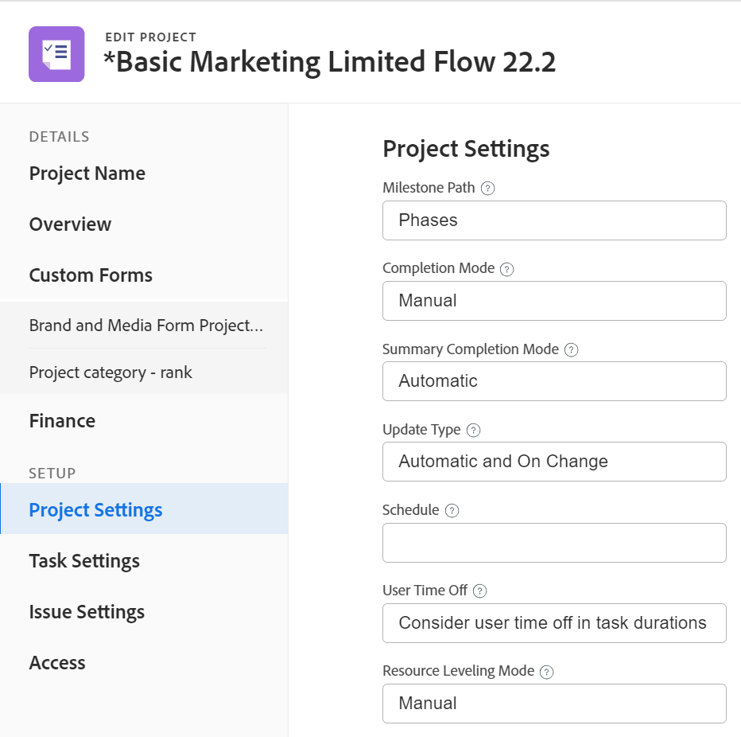

# 编辑项目

<!--drafted for bulk editing projects: 
The highlighted information on this page refers to functionality not yet generally available. It is available only in the Preview environment. -->

<!--

***Linked to many articles,

The Resource Pools part also duplicates in the "Working with Resource Pools" article -

The Update Type section is also documented in Selecting the Project Update Type article

Keep the reference link to the other article that also documents the Update Type) 

(NOTE 2: information described here also exists in these articles:

** Project Overview area

**Manage project Finance area

If you need to update just one field, check to see if that field is also listed there and update in both places.)

-->

您可以根据需要经常在Adobe Workfront中编辑项目。 我们建议您在项目状态更改为当前后对其执行最小程度的编辑，以便通过向整个项目团队发送更改通知来避免混淆。 理想情况下，当项目处于规划状态时，应编辑项目。 有关项目团队的信息，请参阅 [项目团队概述](../../../manage-work/projects/planning-a-project/project-team-overview.md).

## 访问要求

<!--drafted - replace table at P&P:

<table style="table-layout:auto"> 
 <col> 
 <col> 
 <tbody> 
  <tr> 
   <td role="rowheader">Adobe Workfront plan*</td> 
   <td> 
Any
 </td> 
  </tr> 
  <tr> 
   <td role="rowheader">Adobe Workfront license*</td> 
   <td>
Current license: Standard 
 
   Or
   
Legacy license: Plan 
 </td> 
  </tr> 
  <tr> 
   <td role="rowheader">Access level configurations*</td> 
   <td> 
Edit access to Projects
 
If you still don't have access, ask your Workfront administrator if they set additional restrictions in your access level. For information about access to projects, see <a href="../../../administration-and-setup/add-users/configure-and-grant-access/grant-access-projects.md" class="MCXref xref">Grant access to projects</a>. For information on how a Workfront administrator can change your access level, see <a href="../../../administration-and-setup/add-users/configure-and-grant-access/create-modify-access-levels.md" class="MCXref xref">Create or modify custom access levels</a>. 
 </td> 
  </tr> 
  <tr> 
   <td role="rowheader">Object permissions</td> 
   <td> 
    <ul> 
     <li> 
Contribute permissions to a project to edit it in the Project Details area 
 </li> 
     <li> 
Manage permissions to a project to edit it in the Edit Project box
 </li> 
    </ul> 
 For information about project permissions, see <a href="../../../workfront-basics/grant-and-request-access-to-objects/share-a-project.md" class="MCXref xref">Share a project in Adobe Workfront</a>.
 
For information on requesting additional access, see <a href="../../../workfront-basics/grant-and-request-access-to-objects/request-access.md" class="MCXref xref">Request access to objects </a>.
 </td> 
  </tr> 
 </tbody> 
</table>
-->
您必须具有以下权限才能执行本文中的步骤：

<table style="table-layout:auto"> 
 <col> 
 <col> 
 <tbody> 
  <tr> 
   <td role="rowheader">Adobe Workfront计划*</td> 
   <td> 
任意
 </td> 
  </tr> 
  <tr> 
   <td role="rowheader">Adobe Workfront许可证*</td> 
   <td> 
计划 
 </td> 
  </tr> 
  <tr> 
   <td role="rowheader">访问级别配置*</td> 
   <td> 
编辑对项目的访问权限
 
如果您仍然没有访问权限，请咨询Workfront管理员是否对您的访问级别设置了其他限制。 有关访问项目的信息，请参阅 <a href="../../../administration-and-setup/add-users/configure-and-grant-access/grant-access-projects.md" class="MCXref xref">授予对项目的访问权限</a>. 有关Workfront管理员如何更改您的访问级别的信息，请参阅 <a href="../../../administration-and-setup/add-users/configure-and-grant-access/create-modify-access-levels.md" class="MCXref xref">创建或修改自定义访问级别</a>. 
 </td> 
  </tr> 
  <tr> 
   <td role="rowheader">对象权限</td> 
   <td> 
    <ul> 
     <li> 
为项目分配权限，以便在项目详细信息区域编辑项目 
 </li> 
     <li> 
管理对项目的权限，以便在编辑项目框中编辑项目
 </li> 
    </ul> 
 有关项目权限的信息，请参阅 <a href="../../../workfront-basics/grant-and-request-access-to-objects/share-a-project.md" class="MCXref xref">在Adobe Workfront中共享项目</a>.
 
有关请求其他访问权限的信息，请参阅 <a href="../../../workfront-basics/grant-and-request-access-to-objects/request-access.md" class="MCXref xref">请求访问对象 </a>.
 </td> 
  </tr> 
 </tbody> 
</table>

*要了解您拥有什么计划、许可证类型或访问权限，请与Workfront管理员联系。

## 编辑项目的限制

有一些限制可能会阻止您编辑项目。

编辑项目时，请考虑以下事项：

* 您无法编辑正在审批流程中的项目，但记录时间除外。
* 仅当您的Workfront管理员或组管理员在“项目首选项”区域中启用了此功能时，您才可以将文档或模板附加到状态为“完成”、“废弃”或“未决批准”的项目。 有关设置项目首选项的信息，请参阅 [配置系统范围的项目首选项](../../../administration-and-setup/set-up-workfront/configure-system-defaults/set-project-preferences.md).
* 您只能编辑处于非活动状态或完成状态的项目的以下信息：

   * 修改现有费用。
   * 添加、删除或编辑自定义表单。

## 编辑项目

通过编辑项目，可修改项目的信息和设置，以及项目上的任务和问题。

本文中提到的一些设置可能会根据其在创建项目的模板中的状态从默认状态进行修改。 有关编辑模板的信息，请参阅 [编辑项目模板](../../../manage-work/projects/create-and-manage-templates/edit-templates.md).

1. 单击 **主菜单** 图标  (在Adobe Workfront的右上角)，然后单击 **项目**.
1. （可选）单击 **我在处理的项目** 或 **我拥有的项目** ，以显示您拥有的项目或您属于项目团队的项目。

   

1. 单击要编辑的项目名称以打开项目页面。

   >[!NOTE]
   >
   >如果您是组管理员，则可以在“组”区域以及“项目”区域中查看和编辑组的项目。 有关更多信息，请参阅 [创建和修改组的项目](../../../administration-and-setup/manage-groups/work-with-group-objects/create-and-modify-a-groups-projects.md).

1. （可选）要编辑有关项目的有限信息，请单击 **项目详细信息** （在左侧面板中）。

   

   >[!NOTE]
   >
   >根据Workfront管理员或组管理员修改布局模板的方式，项目详细信息区域中的字段可能会重新排列或不显示。 有关信息，请参阅 [使用布局模板自定义详细信息视图](../../../administration-and-setup/customize-workfront/use-layout-templates/customize-details-view-layout-template.md).

   要编辑“详细信息”部分中的信息，请执行以下操作：

   1. （可选）单击 **全部折叠** 图标来折叠所有区域。
   1. （可选和视情况而定）折叠区域时，单击 **右指箭头**  ，以展开要编辑的区域。
   1. 有关在项目详细信息选项卡中编辑信息的更多信息，请参阅以下文章：

      * [管理项目概述区域中的信息](../../../manage-work/projects/manage-projects/understand-project-overview-area.md)
      * [管理项目财务方面的信息](../../../manage-work/projects/project-finances/manage-project-finance-area.md)
   1. （可选）要附加自定义表单，请在 **添加自定义表单** 字段，然后在列表中显示该字段时将其选定，然后单击 **保存更改**.
   1. （可选）单击 **导出** 图标  要将概述和自定义表单信息导出到PDF文件，请单击 **导出**. 从以下项中选择：

      * 选择全部（仅在至少附加一个自定义表单时显示）
      * 概述
      * 一个或多个自定义表单的名称

      PDF文件将下载到您的计算机。

      

      有关更多信息，请参阅 [导出自定义表单和对象详细信息](../../../workfront-basics/work-with-custom-forms/export-custom-forms-details.md).
   有关“项目详细信息”部分中可见的字段的信息，请按照以下所述继续编辑“编辑项目”框中的项目。
1. 要编辑有关项目的所有信息，请单击 **更多** 菜单  在项目名称旁边，然后单击 **编辑**.

   或

   从项目列表中，选择一个项目，然后单击 **编辑** 图标  位于列表顶部。

   此 **编辑项目** 框打开。

   >[!IMPORTANT]
   >
   >您必须具有项目的管理权限才能看到编辑选项。

   所有项目字段在“编辑项目”框中均可用，并按左侧面板中列出的区域分组。

   >[!NOTE]
   >
   >根据Workfront管理员或组管理员修改布局模板的方式，编辑项目框左侧面板中的区域或这些区域中列出的任何字段可能会重新排列或不显示。 有关信息，请参阅 [使用布局模板自定义详细信息视图](../../../administration-and-setup/customize-workfront/use-layout-templates/customize-details-view-layout-template.md).

1. （视情况而定）如果您单击 **更多** 菜单，然后 **编辑**，请考虑更新左侧面板中列出的以下任何区域中的信息：

   * [项目名称](#project-name)
   * [概述](#overview)
   * [自定义表单](#custom-forms)
   * [财务](#finance)
   * [项目设置](#project-settings)
   * [任务设置](#task-settings)
   * [问题设置](#issue-settings)
   * [访问权限](#access)

   >[!NOTE]
   >
   >根据Workfront管理员为项目的详细信息区域设置布局模板的方式，您的环境中编辑项目框中的部分和字段可能会有所不同。 有关信息，请参阅 [使用布局模板自定义详细信息视图](../../../administration-and-setup/customize-workfront/use-layout-templates/customize-details-view-layout-template.md).

### 项目名称 {#project-name}

1. 按如上所述开始编辑项目。
1. 单击 **项目名称** （在左侧面板中）。

   

1. 更新项目的名称。

   批量编辑项目时，无法编辑项目名称。

### 概述 {#overview}

1. 按如上所述开始编辑项目。
1. 单击 **概述** （在左侧面板中）。

   

1. 更新关于项目的以下信息：

   <table style="table-layout:auto"> 
    <col> 
    <col> 
    <tbody> 
     <tr> 
      <td role="rowheader"><strong>描述</strong> </td> 
      <td> 
添加有关项目的其他信息。
 </td> 
     </tr> 
     <tr> 
      <td role="rowheader"><strong>状态</strong> </td> 
      <td> 
选择项目的状态。 在所有任务和问题完成之前，您无法将项目标记为“完成”。 有关项目状态的信息，请参阅 <a href="../../../administration-and-setup/customize-workfront/creating-custom-status-and-priority-labels/project-statuses.md" class="MCXref xref">访问系统项目状态列表</a>
 </td> 
     </tr> 
     <tr> 
      <td role="rowheader"><strong>优先级</strong> </td> 
      <td> 
 
这只是一个可视标记，可让您优先考虑项目。
 
根据Workfront管理员选择的项目偏好设置，优先级名称可能会有所不同。 有关编辑优先级的更多信息，请参阅 <a href="../../../administration-and-setup/customize-workfront/creating-custom-status-and-priority-labels/create-customize-priorities.md" class="MCXref xref">创建和自定义优先级</a>
 
 </td> 
     </tr> 
     <tr> 
      <td role="rowheader"><strong>URL</strong> </td> 
      <td> 
指定与此项目信息相关的Web链接。
 </td> 
     </tr> 
     <tr> 
      <td role="rowheader"><strong>完成情况类型</strong> </td> 
      <td> 
在以下条件类型之间进行选择： 
        <ul> 
         <li><strong>手动：</strong> 项目所有者手动设置项目的条件。</li> 
         <li><strong>进度状态：</strong> Workfront会根据关键路径上任务的进度状态自动设置条件。 有关了解进度状态的更多信息，请参阅 <a href="../../../manage-work/tasks/task-information/task-progress-status.md" class="MCXref xref">任务进度状态概述</a>.</li> 
        </ul>
您的Workfront管理员 或组管理员 选择系统项目完成情况计算方式的默认值 或您的组. 有关设置项目默认值的信息，请参阅 <a href="../../../administration-and-setup/set-up-workfront/configure-system-defaults/set-project-preferences.md" class="MCXref xref">配置系统范围的项目首选项</a>. 

 </td> 
     </tr> 
     <tr> 
      <td role="rowheader"><strong>完成情况</strong> </td> 
      <td> 
 
(仅在选择后显示 <strong>手动</strong> 对于 <strong>完成情况类型</strong>)：选择条件以指示项目的进展情况。 
 
有关如何自动或手动设置项目条件的信息，请参阅 <a href="../../../manage-work/projects/manage-projects/project-condition-and-condition-type.md" class="MCXref xref">项目完成情况和完成情况类型概览</a>
 
 </td> 
     </tr> 
     <tr> 
      <td role="rowheader"><strong>时间表模式</strong> </td> 
      <td> 
指定是从开始日期还是从完成日期开始安排项目。 此选择确定项目上任务的计划日期。 
        <ul> 
         <li><strong>开始日期</strong>：默认情况下，项目的第一个任务的计划开始日期与项目相同。 有关任务计划开始日期的信息，请参阅 <a href="../../../manage-work/tasks/task-information/task-planned-start-date.md" class="MCXref xref">任务计划开始日期概览</a>. 项目时间线从开始日期开始计算，而项目完成日期则由系统根据所有任务的持续时间来计算。 </li> 
         <li><strong>完成日期</strong>：项目的最后一个任务与项目具有相同的规划完成日期。 项目时间线从完成日期开始计算，项目开始日期由系统从项目完成日期减去所有任务的持续时间来计算。 </li> 
        </ul>
您的Workfront管理员 或组管理员 选择系统或组的默认“计划模式”设置。 有关设置项目默认值的信息，请参阅 <a href="../../../administration-and-setup/set-up-workfront/configure-system-defaults/set-project-preferences.md" class="MCXref xref">配置系统范围的项目首选项</a>.

 </td> 
     </tr> 
     <tr> 
      <td role="rowheader"><strong>计划开始日期和时间</strong> </td> 
      <td> 
 
指定选择时的日期 <strong>计划起始日期</strong>.  
 
选择时这是只读字段 <strong>从完成日期开始计划</strong>. 
 
 </td> 
     </tr> 
     <tr> 
      <td role="rowheader"><strong>计划完成日期和时间</strong> </td> 
      <td> 
指定选择时的日期 <strong>从完成日期开始计划</strong>. 
 
选择时这是只读字段 <strong>从开始日期计划</strong>. 
 </td> 
     </tr> 
     <tr> 
      <td role="rowheader"><strong>项目组合</strong></td> 
      <td>指示项目所属的Portfolio。 必须先创建一个Portfolio，然后才能将其显示在下拉列表中。 只有活动项目组合可以与项目关联。 有关创建项目组合的详细信息，请参阅 <a href="../../../manage-work/portfolios/create-and-manage-portfolios/create-portfolios.md" class="MCXref xref">创建项目组合 </a>.</td> 
     </tr> 
     <tr> 
      <td role="rowheader"><strong>项目群</strong></td> 
      <td> 
如果为项目选择了一个Portfolio，请为项目指定项目群。 某些Portfolio可能没有程序。 必须先创建程序，然后它才会显示在此下拉列表中。 只有活动的项目群可以与项目相关联。 
 
有关创建程序的详细信息，请参见 <a href="../../../manage-work/portfolios/create-and-manage-programs/create-program.md" class="MCXref xref">创建项目</a>.
 </td> 
     </tr> 
     <tr> 
      <td role="rowheader"><strong>组</strong></td> 
      <td> 
 
指定与项目关联的组的名称。 
这是必填字段. 不能有与组不关联的项目。 
 
将鼠标悬停在正确组上并单击信息图标，可以确保选择正确的组  旁边显示的内容。 这将显示一个工具提示，其中列出了有关组的信息，例如组及其上方的组的层次结构及其管理员。
 默认情况下，在创建项目时，以下组之一会自动与项目关联，除非您指定其他组：
 
        <ul> 
         <li> 
从“项目”区域创建项目时，项目创建者的主组与项目相关联。 
 
从项目组合或项目群的项目分区创建项目时，也是如此。
 </li> 
         <li> 
当从设置区域中的组主页创建项目时，该组与项目相关联。
 </li> 
        </ul> 
 
  
 
如果项目、其任务或问题已经与使用组级别自定义状态的组级别审批流程相关联，则更改组可能会在先前组的审批状态与系统级别现有的审批状态之间产生冲突。 在更新组之前，请考虑删除项目或其任务或问题上的组级别审批流程。 有关创建组级审批流程的信息，请参阅 <a href="../../../administration-and-setup/manage-groups/work-with-group-objects/create-and-modify-groups-approval-processes.md" class="MCXref xref">组级别审批流程</a>. 有关创建组级自定义状态的信息，请参见 <a href="../../../administration-and-setup/manage-groups/manage-group-statuses/create-or-edit-a-group-status.md" class="MCXref xref">创建或编辑组状态</a>
 </td> 
     </tr> 
     <tr> 
      <td role="rowheader"><strong>公司</strong> </td> 
      <td> 
指定与项目关联的公司。 必须先创建公司，然后才能将其与项目关联。 只有活跃的公司才能与项目相关联。 有关创建公司的信息，请参阅 <a href="../../../administration-and-setup/set-up-workfront/organizational-setup/create-and-edit-companies.md" class="MCXref xref">创建和编辑公司</a>.
 </td> 
     </tr> 
     <tr> 
      <td role="rowheader"><strong>项目所有者</strong> </td> 
      <td> 
开始键入用户的名称以将其添加到项目，然后当它显示在列表中时将其选定。 用户将添加到项目团队，并自动获得项目的“管理”权限。 指定为项目所有者的用户必须是Workfront活动用户。

      </td> 
     </tr> 
     <tr> 
      <td role="rowheader"><strong>项目赞助者</strong> </td> 
      <td> 
开始键入用户的名称以将其添加到项目，然后当它显示在列表中时将其选定。 用户将添加到项目团队，并自动获得项目的“查看”权限。 指定为项目发起人的用户必须是Workfront活动用户。 
 </td> 
     </tr> 
     <tr> 
      <td role="rowheader"><strong>资源管理器</strong> </td> 
      <td> 
 开始键入用户的名称以将其添加到项目中，然后在用户显示在列表时选择用户。 用户将添加到项目团队，并自动获得项目的“管理”权限，并可将资源分配给项目上的任务和问题。 即使用户从“资源管理器”字段中移除，他们也会维护项目的“管理”权限。 可以指定多个资源管理器。 
 </td> 
     </tr> 
    </tbody> 
   </table>

   >[!TIP]
   >
   >   在更新项目所有者、项目发起人和资源管理器字段时，请注意头像、用户的主要角色或其电子邮件地址以区分具有相同名称的用户。 用户必须与至少一个工作角色关联，才能在添加时查看该角色。

1. （可选）根据要修改的信息，继续编辑以下部分。

   或

   单击&#x200B;**保存**。

### 自定义表单 {#custom-forms}

根据您的访问级别和您对项目的权限，存在以下情况：

* 如果您对项目没有“编辑自定义表单”权限，则无法编辑任何附加的自定义表单上的字段。 您只能查看附加到项目的自定义表单上的字段。
* 如果您对自定义表单上的某个分区具有“查看”（而不是“编辑”）权限，则无法编辑该分区中的字段。
* 如果您无权访问附加到项目的其中一个自定义表单上的分区，则该分区不会显示在编辑项目框中。

当选择多个项目以批量编辑它们时，存在以下情况：

* 如果您对至少一个选定项目没有“编辑自定义表单”权限，则无法编辑任何附加的自定义表单上的字段。 您只能查看附加的自定义表单上的字段
* 如果您对自定义表单上的某个分区具有“查看”（而不是“编辑”）权限，则无法编辑该分区中的字段。 您只能查看该部分中的字段。
* 如果您无权访问附加到至少一个项目的其中一个自定义表单上的分区，则该分区不会显示在编辑项目框中。

有关自定义表单访问权限的信息，请参阅以下文章：

* [共享自定义表单](../../../administration-and-setup/customize-workfront/create-manage-custom-forms/share-access-to-a-custom-form.md)
* [向自定义表单添加分区界限](../../../administration-and-setup/customize-workfront/create-manage-custom-forms/add-a-section-break-to-a-custom-form.md)

要编辑自定义表单上的信息，请执行以下操作：

1. 按如上所述开始编辑项目。
1. 单击 **自定义Forms** （在左侧面板中）。

   

1. 单击 **添加自定义表单** 框并从列表中选择一个表单，以将其附加到项目。 默认情况下，前40个表单按字母顺序显示。 如果在列表中看不到该表单，请开始键入其名称，然后当它出现在列表中时将其选定。

   >[!NOTE]
   >
   >   您必须先构建自定义表单，然后才可在此字段中选择它们。 列表中只显示活动的自定义表单。 有关构建自定义表单的更多信息，请参阅 [创建或编辑自定义表单](../../../administration-and-setup/customize-workfront/create-manage-custom-forms/create-or-edit-a-custom-form.md). 您最多可以向一个项目添加十个自定义表单。

1. （视情况而定）如果您将自定义表单附加到项目，请编辑表单上的任何字段。 在保存项目之前，必须指定所有必填字段。
1. （可选）单击 **X图标** 要移除的自定义表单的名称右侧，然后单击 **移除**.
1. （可选）根据要修改的信息，继续编辑以下部分

   或

   单击&#x200B;**保存**。

### 财务 {#finance}

根据您的访问级别和您对项目的权限，存在以下情况：

* 如果您对项目具有“查看财务数据”和“查看财务”权限，则只能查看“财务”部分中的字段。 您无法编辑此分区中的字段。
* 如果您拥有对项目财务数据的编辑权限和管理财务权限，则可以更新此分区中的字段。

当选择多个项目以批量编辑它们时，存在以下情况：

* 如果您至少选择一个您具有“查看财务”（而不是“管理财务”）权限的项目，则只能查看此分区中所有选定项目的字段。 不能批量编辑Finance节中的字段。
* 如果您至少选择一个您没有财务权限的项目，则此分区根本不显示。

要编辑“财务”区域中的字段，请执行以下操作：

1. 按如上所述开始编辑项目。
1. 单击 **财务** （在左侧面板中）。

   

1. 更新项目的以下财务信息：

   <table style="table-layout:auto"> 
    <col> 
    <col> 
    <tbody> 
     <tr data-mc-conditions=""> 
      <td role="rowheader"><strong>货币</strong> </td> 
      <td> 
 
如果项目货币与系统的默认货币不同，请指定项目货币。 如果项目中已存在财务信息，则无法更改项目的货币。 如果系统中只有默认货币，则此字段不可见。 
 
有关货币的详细信息，请参阅 <a href="../../../administration-and-setup/manage-workfront/exchange-rates/set-up-exchange-rates.md" class="MCXref xref">设置汇率</a>. 
 
 </td> 
     </tr> 
     <tr> 
      <td role="rowheader"><strong>预算</strong> </td> 
      <td> 
指定项目的预算。 
 </td> 
     </tr> 
     <tr> 
      <td role="rowheader"><strong>绩效指数方法</strong> </td> 
      <td> 
选择 <b>基于小时</b>，或 <b>基于成本</b> 指明项目的实现值指标（如成本绩效指数或预计实际成本）是否使用小时数或成本来计算。 
 
有关“绩效指数”方法的详细信息，请参见 <a href="../../../manage-work/projects/project-finances/set-pim.md" class="MCXref xref">设置绩效指数方法(PIM)</a>. 
 
您的Workfront管理员 或组管理员 为您的系统或组选择默认的“绩效指数方法”设置。 有关设置项目默认值的信息，请参阅 <a href="../../../administration-and-setup/set-up-workfront/configure-system-defaults/set-project-preferences.md" class="MCXref xref">配置系统范围的项目首选项</a>.
 </td> 
     </tr> 
     <tr> 
      <td role="rowheader"><strong>完工估算</strong> </td> 
      <td> 
 
指定Workfront应如何计算完工估算(EAC)。 

      从以下选项中选择： 
      <ul><li><b>在项目级别计算</b></li>
      <li><b>从任务/子任务汇总</b></li> </ul>
      
有关完工估算如何计算的更多信息，请参阅 <a href="../../../manage-work/projects/project-finances/calculate-eac.md" class="MCXref xref">计算完工估算(EAC)</a>.
 
您的Workfront或组管理员为您的系统或组选择默认的估计完成时间设置。 有关设置项目默认值的信息，请参阅 <a href="../../../administration-and-setup/set-up-workfront/configure-system-defaults/set-project-preferences.md" class="MCXref xref">配置系统范围的项目首选项</a>.
 
 </td> 
     </tr> 
     <tr> 
      <td role="rowheader"><strong>计划收益</strong> </td> 
      <td> 
估计项目的计划收益。 这在项目和Portfolio优化器的业务案例中用到。 有关项目计划收益的更多信息，请参阅 <a href="../../../manage-work/projects/project-finances/project-planned-benefit.md" class="MCXref xref">项目计划收益概述</a>. 在计算项目净值时，将考虑项目的计划收益。 
 
有关更多信息，请参阅 <a href="../../../manage-work/portfolios/portfolio-optimizer/manage-projects-in-portfolio-optimizer.md" class="MCXref xref">在Portfolio优化器中管理项目</a> . 
 </td> 
     </tr> 
     <tr> 
      <td role="rowheader"><strong>实际收益</strong> </td> 
      <td> 
估计项目的实际收益。 这是货币金额，表示完成此项目后您的公司或部门将获得的利益。 
 </td> 
     </tr> 
      <tr> 
      <td role="rowheader"><strong>固定成本</strong> </td> 
      <td> 
指定项目的固定成本。 这与来自项目小时数的劳力成本和来自项目费用金额的费用成本不同。 在计算项目的净值时，将考虑项目的固定成本，它也是预算成本的一部分。 
 </td> 
     </tr> 
     <tr> 
      <td role="rowheader"><strong>固定收入</strong> </td> 
      <td> 
指定项目的固定收入。 
 </td> 
     </tr> 
    </tbody> 
   </table>

1. （可选）根据要修改的信息，继续编辑以下部分。

   或

   单击&#x200B;**保存**。

### 项目设置 {#project-settings}

1. 按如上所述开始编辑项目。
1. 单击 **项目设置** （在左侧面板中）。

   

1. 更新以下信息：

   <table style="table-layout:auto"> 
      <col> 
      <col> 
      <tbody> 
      <tr> 
      <td role="rowheader"><strong>里程碑路径</strong> </td> 
       <td> 
为项目选择里程碑路径。 列表中只显示活动里程碑路径。
 
有关里程碑路径的详细信息，请参阅 <a href="../../../administration-and-setup/customize-workfront/configure-approval-milestone-processes/create-milestone-path.md" class="MCXref xref">创建里程碑路径</a>.
 </td> 
      </tr> 
      <tr> 
      <td role="rowheader"><strong>完成模式</strong> </td> 
      <td> 
控制如何将项目标记为完成。 从以下选项中选择： 
       <ul> 
       <li>
<strong>自动</strong>：完成所有任务和问题后，项目被标记为完成。

只有在任务完成时项目状态为当前时，项目状态才会自动更改为完成。 
</li> 
       <li><strong>手动</strong>：当所有任务和问题都完成时，您必须手动选择项目的完成状态。</li> 
       </ul>
 </td> 
       </tr> 
       <tr> 
       <td role="rowheader"><strong>摘要完成模式</strong></td> 
       <td> 
控制如何将父任务标记为“完成”。 从以下选项中选择： 
       <ul> 
       <li><strong>自动</strong>：父任务被标记为“完成”，它们会在子任务完成并更新子任务的完成百分比时自动更新完成百分比。 </li> 
       <li><strong>手动</strong>：您必须手动更新完成百分比和父任务的状态，而与对子任务所做的更改无关。</li> 
       </ul>
 </td> 
       </tr> 
       <tr> 
       <td role="rowheader"><strong>更新类型</strong></td> 
       <td> 
控制何时将对项目时间线所做的更改保存在项目或父任务中。 例如，对项目进行的以下更改会触发对项目时间线的更新： 
       <ul> 
       <li>更新任务日期</li> 
       <li>更改任务的前置任务关系</li> 
       <li>
更改父子关系，添加或删除分配，以及更改任务限制或持续时间类型。

当任务更新时，其父对象（父任务或项目）会在更新类型指示的时间更新。 

如果在选择“更改时自动更新”或“仅更改”更新类型时，父对象未在更改后立即更新，请刷新页面

从以下选项中选择： 

- <strong>更改时自动更新</strong> （默认设置）：每次在项目或项目所依赖的其他项目中发生更改时，都会更新项目时间线（根据更改）。 项目时间表也会每晚更新（自动）。

这是此字段的推荐设置，因为它可确保项目始终保持最新。

对触发时间表重新计算的任务或项目执行操作时，所有可用日期都会立即显示，允许您继续工作。 在具有100多项任务的项目中，需要更长时间重新计算的日期会短暂显示为问号（介于1到5秒之间，大型项目最长为1分钟）。 这表示重新计算尚未完成，并且日期可能会发生更改。

- <strong>仅更改</strong>：每次在项目或项目所依赖的其他项目中发生更改时，项目时间线都会更新。 如果项目或时间线所依赖的其他项目中很少发生更改，您可能需要选择此选项。

- <strong>仅限自动</strong>：项目时间线每晚更新一次；时间线不会在做出更改后立即更新。

如果项目或时间线所依赖的其他项目中每天都发生许多更改，您可能需要选择此选项。 但是，请注意，您选择了此设置，因为项目不会在进行更改的同时更新。

- <strong>仅手动</strong>：仅当您选择重新计算时间表选项时，项目时间表才会更新。 有关手动重新计算项目时间表的详细信息，请参阅 <a href="../../../manage-work/projects/manage-projects/recalculate-project-timeline.md" class="MCXref xref">重新计算项目时间表</a>. 

如果要一次对项目进行多项更改，并且希望时间线重新计算在所有更改完成之后进行（而不是在每次单独更改之后），则可能需要选择此选项。
</li> 
       </ul>
 </td> 
       </tr> 
       <tr> 
       <td role="rowheader"><strong>计划</strong> </td> 
       <td> 
为您的项目选择计划。 该时间表应与分配给大多数参与项目工作的人员的时间表相同。 您必须先创建计划，然后才能将其分配给项目或用户。 如果尚未在系统中创建自定义计划，则选择“默认计划”。
 
有关创建调度的详细信息，请参见 <a href="../../../administration-and-setup/set-up-workfront/configure-timesheets-schedules/create-schedules.md" class="MCXref xref">创建计划</a>. 
 </td> 
       </tr> 
       <tr> 
       <td role="rowheader"><strong>用户空闲时间</strong> </td> 
       <td> 
确定任务的主要被分配人的空闲时间是否调整项目上的任务计划日期。 

您的Workfront管理员 或组管理员 为您的系统选择此设置的默认值 或您的组. 有关设置项目默认值的信息，请参阅 <a href="../../../administration-and-setup/set-up-workfront/configure-system-defaults/set-project-preferences.md" class="MCXref xref">配置系统范围的项目首选项</a>. 

从以下选项中选择： - <strong>考虑任务持续时间中的用户空闲时间</strong>：当选择此选项时，如果休息时间发生在任务持续期间，则任务的计划日期根据任务的主要被分配人的休息时间进行调整。 

例如，如果一项约束为“越早越好”的任务计划于6月1日开始，6月3日完成，而主要被分配人将6月2日标记为休假，则在启用此选择时，任务计划日期为6月1日至6月4日。 根据任务限制，存在以下方案： 
 
       <ul> 
       <li>对于与起始日期（尽快、最早可用时间、开始时间不早于、开始时间不晚于、必须开始时间）的计划相关的任务约束，计划起始日期不会更改，但计划完成日期会更改。</li> 
       <li>对于与从完成日期开始的计划相关的任务限制（尽可能迟，最晚可用时间，完成时间不早于，完成时间不晚于，完成时间必须晚于），计划完成日期不会更改，但计划起始日期会更改。</li> 
       <li>对于固定日期受限的任务，计划开始日期和完成日期都不会更改。 </li> 
       </ul>
选择此设置时，任务的持续时间不会更改。 只有计划日期会发生变化，具体取决于任务限制。 有关任务限制的信息，请参见 <a href="../../../manage-work/tasks/task-constraints/task-constraint-overview.md" class="MCXref xref">任务限制概述</a>. 

- <strong>忽略任务持续时间中的用户空闲时间</strong>：当选择此选项时，项目上任务的计划日期仍保持为最初计划，即使任务的主要被分配人在任务持续期间有空闲时间。 

为此设置选择选项时，请考虑以下事项：
 
       <ul> 
       <li>
新项目的此设置的默认选项与系统级别项目首选项相同。 

有关系统级别的项目首选项的信息，请参见 <a href="../../../administration-and-setup/set-up-workfront/configure-system-defaults/set-project-preferences.md" class="MCXref xref">配置系统范围的项目首选项</a>. 
</li> 
       <li>将模板附加到现有项目时，项目上的设置将更新以匹配其中一个模板。 </li> 
       <li>
Workfront决定根据任务的任务限制值调整哪些计划任务日期。 根据具体情况，计划开始日期或计划完成日期，或者两者都可能受到影响，甚至可能保持不变。 例如，如果任务的限制为固定日期，则当主要被分配人具有空闲时间时，日期不会调整，即使在 <strong>考虑任务持续时间中的用户空闲时间</strong> 已选中。 
</li> 
       </ul></td> 
      </tr> 
      <tr> 
       <td role="rowheader"><strong>资源均衡模式</strong> </td> 
       <td> 
 
从以下选项中选择：
 
- <strong>手动</strong>：您必须手动调配资源（这是默认设置）
 
- <strong>自动</strong>：Workfront可均衡您的资源。
 
有关资源均衡的详细信息，请参阅 <a href="../../../manage-work/gantt-chart/use-the-gantt-chart/level-resources-in-gantt.md" class="MCXref xref">甘特图中的均衡资源 </a>.
 
 </td> 
      </tr> 
      <tr> 
       <td role="rowheader"><strong>风险</strong> </td> 
       <td> 
 
定义项目的风险级别。 风险只是项目风险程度的一个指标。 您可以根据风险级别安排执行项目的优先顺序。
 
 
考虑从以下风险级别中进行选择：
 
- 很低
 
- 低
 
- 中
 
- 高
 
- 很高
 
您无法自定义此处指示的风险级别。
 
这些风险与项目生命周期中可能发生的潜在风险无关，您应在项目的“风险”选项卡中或业务案例中记录这些风险。 有关潜在项目风险的信息，请参阅 <a href="../../../administration-and-setup/set-up-workfront/configure-system-defaults/edit-create-risk-types.md" class="MCXref xref">编辑和创建风险类型</a>. 
 
 
 </td> 
      </tr> 
      <tr> 
       <td role="rowheader"><strong>资源池</strong> </td> 
       <td> 
 
指定与项目关联的资源池。 资源池是完成项目时所需的用户集合，允许资源规划者编制项目预算。 有关资源池的详细信息，请参见 <a href="../../../resource-mgmt/resource-planning/resource-pools/work-with-resource-pools.md" class="MCXref xref"> 资源池概述 </a>. 
 
批量编辑项目时，此字段仅显示所有选定项目通用的资源池。 如果所选项目没有共享资源池，则此字段将为空。 您在此处指定的资源池将覆盖项目的各个资源池。
 
 </td> 
      </tr> 
      <tr> 
       <td role="rowheader"> <strong>允许公司级别的记帐费率覆盖项目级别的记帐费率</strong></td> 
       <td>选择此选项可允许公司级别的记帐费率覆盖历史工作角色费率，除非这些费率标记为已记帐。 启用此选项将覆盖历史工作角色费率，除非将它们标记为已记帐。  有关更多信息，请参阅 <a href="../../../manage-work/projects/project-finances/override-project-level-with-company-level-billing-rates.md" class="MCXref xref">使用公司层记帐费率覆盖项目层记帐费率</a>.</td> 
      </tr> 
      <tr> 
       <td role="rowheader"><strong>该项目需要批准时间</strong></td> 
       <td> 
 选择此选项可要求项目所有者批准登录项目的时间。 如果您使用开单记录并选择此选项，则只有项目中的已批准小时数显示为开单记录的可用开单小时数。 项目上的批准时间与批准时间表无关。 
 
有关项目需要批准时间的更多信息，请参阅 <a href="../../../manage-work/projects/manage-projects/require-time-approval-for-projects.md" class="MCXref xref">项目需要批准时间</a>.
 </td> 
      </tr> 
      <tr> 
       <td role="rowheader"><strong>过滤小时类型</strong> 和 <strong>小时类型</strong></td> 
       <td> 
 
从以下选项中选择：
 
       <ul> 
       <li> 
选择 <strong>否</strong> 以使所有特定于项目的小时类型在项目上可用。 （这是默认选项）
 
或
 </li> 
       <li>选择 <strong>是</strong> 要使项目特定的小时类型的子集仅在项目上可用，则选择要使其可用的小时类型。 （按住Shift键可选择多个小时类型。）</li> 
       
如果选择此选项，则在记录项目小时（或项目中的任务和问题）时，只有您选择的小时类型可供选择。 您必须至少选择一个小时类型；如果选择此选项，但未选择任何小时类型，则所有小时类型都可在项目中使用。
 </ul>

   
必须在单个用户级别做出相同的小时类型选择，以便用户查看项目中的这些小时类型选项。 有关在用户级别定义小时类型的详细信息，请参见 <a href="../../../timesheets/create-and-manage-timesheets/log-time.md" class="MCXref xref">记录时间</a>. 
 
 </td> 
      </tr> 
      <tr data-mc-conditions=""> 
       <td role="rowheader"><strong>提醒通知</strong> </td> 
       <td> 
 
选择应与项目关联的提醒通知。 您必须为项目配置提醒通知，以便此字段在编辑项目期间显示。 有关配置提醒通知的更多信息，请参阅 <a href="../../../administration-and-setup/manage-workfront/emails/set-up-reminder-notifications.md"><a href="../../../administration-and-setup/manage-workfront/emails/set-up-reminder-notifications.md" class="MCXref xref">设置提醒通知</a> .</a>
 
 </td> 
      </tr> 
      <tr data-mc-conditions=""> 
       <td role="rowheader"><strong>批准流程</strong></td> 
       <td> 
选择要与项目关联的审批流程。 您的Workfront管理员必须定义系统级别的批准流程，然后才能将他们与项目关联。 对批准流程具有管理访问权限的用户也可以创建特定于组的批准流程。 有关创建审批流程的详细信息，请参阅 <a href="../../../administration-and-setup/customize-workfront/configure-approval-milestone-processes/create-approval-processes.md" class="MCXref xref">为工作项创建批准流程</a>.
 
添加审批流程时，请考虑以下事项： 
 
       <ul> 
       <li>列表中仅显示有效的审批流程。 </li> 
       <li> 
列表中将显示系统范围和组特定的批准流程。 与项目组以外的组关联的审批流程不会显示在列表中。
 
如果与项目关联的组发生更改，则组特定的审批流程会变成一次性审批流程。 有关对项目组的更改或审批流程中的更改如何影响审批设置的更多信息，请参阅 <a href="../../../administration-and-setup/customize-workfront/configure-approval-milestone-processes/how-changes-affect-group-approvals.md" class="MCXref xref">组和审批流程更改如何影响分配的审批流程</a>. 
 </li>

   <!--(NOTE: this bullet stays here although the sections it might appear in are QS only, so we can use the snippet for both Qs and classic)-->

   
批量编辑项目时，存在以下情况：

   <ul> 
   <li> 
当您从同一组中选择项目时，系统层和组层审批流程都会显示在此字段中。
 </li> 
   <li> 
当您从不同的组中选择项目时，此字段仅显示系统级别的审批流程。
 </li> 
   <li> 
当任何项目附加一次性审批流程时，它将被您选择的系统层或组层审批流程替换。 
 </li> 
   </ul> 
      </ul> </td> 
      </tr> 
      <tr> 
      </tr> 
      </tbody> 
      </table>

1. （可选）根据要修改的信息，继续编辑以下部分。

   或

   单击&#x200B;**保存**。

### 任务设置 {#task-settings}

您可以定义在将新任务添加到项目时将与所有新任务关联的默认值。

有关这些设置如何影响创建新任务的信息，请参阅部分 [将任务添加到项目时的任务默认值](../../../manage-work/tasks/create-tasks/create-tasks-overview.md#understa) 在文章中 [创建任务概述](../../../manage-work/tasks/create-tasks/create-tasks-overview.md).

1. 按如上所述开始编辑项目。
1. 单击 **任务设置** （在左侧面板中）。

   

1. 在 **任务默认审批流程** 框内，选择在将新任务添加到项目时要与所有新任务关联的任务审批流程。

   您的Workfront管理员（或对批准流程具有管理访问权限的用户）必须先为任务创建系统级别的批准流程，然后才能将其与项目关联。 列表中仅显示有效的审批流程。 有关创建批准流程的信息，请参阅 [为工作项创建批准流程](../../../administration-and-setup/customize-workfront/configure-approval-milestone-processes/create-approval-processes.md). 有关对项目组的更改或审批流程中的更改如何影响审批设置的信息，请参阅 [组和审批流程更改如何影响分配的审批流程](../../../administration-and-setup/customize-workfront/configure-approval-milestone-processes/how-changes-affect-group-approvals.md).

   批量编辑项目时，存在以下情况：

   * 从同一组中选择多个项目时，系统级别和组特定的任务审批流程都会显示在此字段中。
   * 从不同组中选择多个项目时，此字段仅显示系统级任务审批流程。

1. 在 **任务默认自定义Forms** 框中，选择将任务添加到项目时要与所有新任务关联的一个或多个自定义表单。 您必须先构建自定义表单，然后才可在此字段中选择它们。 列表中仅显示活动的自定义表单。 有关构建自定义表单的更多信息，请参阅 [创建或编辑自定义表单](../../../administration-and-setup/customize-workfront/create-manage-custom-forms/create-or-edit-a-custom-form.md). 您最多可以将十个自定义表单与一个任务关联。
1. （可选）选择 **使用工作投入以自动计算任务已计划小时数** 如果要通过使用工作投入而不是计划小时数来启用管理任务投入，请执行以下操作。

   

1. （视情况而定，可选）如果您选择了使用工作投入以自动计算任务计划小时数，请单击每个工作投入级别的下拉菜单，并为每个级别选择一个百分比。 以下百分比值为默认值：

   | 大小 | 百分比 |
   |---|---|
   | 小 | 25% |
   | 中 | 50% |
   | 大 | 75% |

   >[!TIP]
   >
   >当项目更新类型设置为自动并选择此设置时，任务的计划小时数会根据任务持续时间和工作投入百分比进行更新（如果它们被设置为零）。 有关使用工作投入计划任务的工作的详细信息，请参阅 [工作投入概述](../../../manage-work/tasks/task-information/work-effort.md).

1. （可选）根据要修改的信息，继续编辑以下部分。

   或

   单击&#x200B;**保存**。

### 问题设置 {#issue-settings}

1. 按如上所述开始编辑项目。
1. 单击 **问题设置** （在左侧面板中）。

   

1. （可选）取消选择 **允许用户添加内联问题** 选项。 默认情况下，该复选框处于选中状态。

   取消选择此选项时，用户无法将内联问题添加到项目或问题部分中的任务。

   >[!TIP]
   >
   >如果要强制用户完成新问题字段或与新问题关联的自定义表单，请取消选择此选项。 允许用户输入内联问题，这允许他们在创建问题时绕过新问题字段和自定义表单。 有关为新问题设置字段和自定义表单的信息，请参阅 [创建请求队列](../../../manage-work/requests/create-and-manage-request-queues/create-request-queue.md).

   取消选择此选项时，具有将问题添加到项目或任务权限的用户可以通过以下方式执行此操作：

   * 单击项目或任务的问题部分中问题列表顶部的新问题。
   * 当项目配置为请求队列时，他们可以在请求区域中输入新请求。

   >[!NOTE]
   >
   >在批量编辑项目时，如果至少有一个项目启用了此设置，则会启用此设置；如果所有选定的项目都禁用此设置，则会禁用此设置。

   <!--drafted for bulk edit projects: the statement above needs to be corrected when the new UI for bulk edit projects is updated; not sure if we'll need to describe this at all or we can cover this in  a "Considerations" mini section inside the Editing in bulk section below- ??? -->

1. （可选）根据要修改的信息，继续编辑以下部分。

   或

   单击&#x200B;**保存**。

### 访问权限 {#access}

1. 按如上所述开始编辑项目。
1. 单击 **访问** （在左侧面板中）。

   

1. 指定以下内容 **访问** 项目信息：

   <table style="table-layout:auto"> 
    <col> 
    <col> 
    <tbody> 
     <tr data-mc-conditions=""> 
      <td role="rowheader"><strong>将某人分派到一个任务时</strong></td> 
      <td>
选择自 <strong>视图</strong>， <strong>投稿，</strong> 或 <strong>管理</strong> 任务的访问权限。 分配给任务的用户会被自动授予该任务的此访问权限。
</td> 
     </tr> 
     <tr data-mc-conditions=""> 
      <td role="rowheader"><strong>还授予对项目的访问权限</strong></td> 
      <td>
选择自 <strong>视图</strong>， <strong>Contribute</strong>，或 <strong>管理</strong> 对项目的访问权限。 此外，分配给任务的用户会被自动授予此项目访问权限。 
</td> 
     </tr> 
     <tr data-mc-conditions=""> 
      <td role="rowheader"><strong>将某人分派到一个问题时</strong></td> 
      <td>
选择自 <strong>视图</strong>， <strong>投稿，</strong> 或 <strong>管理</strong> 问题的访问权限。 分配给问题的用户会被自动授予该问题的此访问权限。 有关更多信息，请参阅 <a href="../../../workfront-basics/grant-and-request-access-to-objects/share-an-issue.md" class="MCXref xref">共享问题 </a>. 
</td> 
     </tr> 
     <tr data-mc-conditions=""> 
      <td role="rowheader"><strong>还授予对项目的访问权限</strong></td> 
      <td>
选择自 <strong>视图</strong>， <strong>Contribute</strong>，或 <strong>管理</strong> 对项目的访问权限。 此外，分配给问题的用户会被自动授予此项目访问权限。 
</td> 
     </tr> 
     <tr data-mc-conditions=""> 
      <td role="rowheader"><strong>当某人提交请求时：授予他们访问权限</strong></td> 
      <td>
选择自 <strong>视图</strong>， <strong>Contribute</strong>，或 <strong>管理</strong> 请求的访问权限。 当项目还是请求队列并且用户向项目提交请求时，他们被授予对所提交请求的此访问权限。 有关将项目设置为请求队列的信息，请参阅 <a href="../../../manage-work/requests/create-and-manage-request-queues/create-request-queue.md" class="MCXref xref">创建请求队列</a>. 
</td> 
     </tr> 
     <tr data-mc-conditions=""> 
      <td role="rowheader"><strong>来自同一公司的人员将为所有请求继承相同的权限</strong></td> 
      <td>
如果您希望来自同一公司的人员对项目中的所有请求（无论他们是否提交请求）具有相同的访问权限，请选择此字段。 
</td> 
     </tr> 
     <tr> 
      <td role="rowheader"><strong>当授予某人此项目的访问权限时：授予他们访问权限……</strong></td> 
      <td>
选择您希望用户在项目上拥有的访问选项（如果项目与他们共享）。 如果指定为，则为其访问选择特定选项 <strong>查看器</strong>， <strong>参与者</strong>，或 <strong>经理</strong> 与他们共享项目时。 

此 <strong>删除</strong> 在中访问 <strong>管理</strong> 权限级别确定用户是否可以删除项目本身。 用户具有 <strong>管理</strong> 对项目的访问权限可以删除项目中的任务和问题，无论是否选择了此选项（如果它们具有） <strong>管理</strong> 任务和问题的权限。 
</td> 
     </tr> 
    </tbody> 
   </table>

1. 单击&#x200B;**保存**。

## 在项目标题中编辑项目（受限）

您可以在项目标题中编辑有限数量的信息。

您的系统或组管理员可以自定义您在项目标题中看到的字段。

默认情况下，项目标题中包含以下字段。

* 项目名称
* 项目所有者
* 计划完成日期和时间

   >[!NOTE]
   >
   >仅当从完成日期开始安排项目时，您才可以编辑此字段。 从开始日期开始安排项目时，Workfront会根据任务的持续时间计算规划完成日期和时间。

* 完成情况

   >[!NOTE]
   >
   >仅当项目的“完成情况类型”为“手动”时，才能编辑此字段。 当Condition Type设置为Progress Status时，Workfront根据任务的进度计算条件。 有关信息，请参阅 [项目完成情况和完成情况类型概览](../../../manage-work/projects/manage-projects/project-condition-and-condition-type.md).

* 状态
* 如果在当前审批流程中将您设置为审批者，则做出审批决策

## 批量编辑项目

您可以批量编辑项目并同时更新所有选定项目的信息。

<!--
The information you are changing on all the projects selected will overwrite the existing information on individual projects, except for the Resource Manager field. 

Adding a new resource manager when editing projects in bulk adds that manager to all the selected projects. If other resource managers are associated with the selected projects, they remain on the projects in addition to the one added through bulk edit.

Editing projects in bulk differs depending on what environment you choose to update them in. 

### Edit projects in bulk in the Production environment

-->

要批量编辑项目，请执行以下操作：

1. 单击 **主菜单** 图标  Adobe Workfront的右上角。

1. 单击 **项目**.
1. 在列表中选择多个项目。
1. 单击 **编辑**.

   此 **编辑项目** 对话框打开。

   

1. 在以下部分中指定有关所有选定项目的信息：

   * **概述**

      欲了解相关信息，请参见 [概述](#overview) 章节。

   * **财务**

      欲了解相关信息，请参见 [财务](#finance) 章节。

   * **项目组合**

      有关信息，请参阅 [概述](#overview) 章节。

   * **设置**

      欲了解相关信息，请参见 [项目设置](#project-settings) 章节。

   * **访问权限**

      欲了解相关信息，请参见 [访问](#access) 章节。

   * **自定义表单**

      有关信息，请继续执行下面的步骤7。

      <!--   
     
(NOTE:&nbsp;make sure this stays accurate)
   
     -->

   * **任务**

      欲了解相关信息，请参见 [任务设置](#task-settings) 章节。

   * **问题**

      欲了解相关信息，请参见   [问题设置](#issue-settings) 章节。

   * **评论**

      有关信息，请继续执行下面的步骤9。

      <!--   
     
(NOTE: ensure this step stays accurate)
   
     -->

1. （可选）在“设置”区域，选择以下任意选项：

   * **重新计算成本和收入**：选择此选项可重新计算所有选定项目的成本和收入。
   * **重新计算时间线**：选择此选项可重新计算所有选定项目的时间线。
   * **重新计算记分卡**：选择此选项可重新计算所有选定项目的记分卡值。

   

1. 单击 **自定义Forms** 以编辑附加到所有选定项目的自定义表单。

   如果所选项目没有任何常见的自定义表单，则此分区中未列出任何表单。

   您只能编辑表单上附加到所有选定项目并且您有权编辑的字段。

1. （可选）在自定义Forms部分中，选择 **重新计算自定义表达式** 选项，以确保附加到所选项目的自定义Forms上的所有计算自定义字段都是最新的。

   >[!IMPORTANT]
   >
   >建议在重新计算自定义表达式时不要一次选择超过500个项目。

1. （可选）单击 **注释**，然后选择向每个项目发布更新框，并在可用字段中指定要显示在项目更新流中的注释，然后执行以下操作之一：

   * 单击 **人员** 图标  标记将收到您评论通知的用户。
   * 单击 **锁定** 图标  将您的评论限制为仅向公司内部人员开放。

   此注释对具有查看项目访问权限和查看注释访问权限的每个人可见。

1. 单击 **保存更改**.

   您所做的所有更改现在在所有选定项目中均可见。

<!--drafted for bulk editing projects:  

### Edit projects in the Preview environment

Consider the following when editing projects in bulk in the Preview environment:

* When you select projects that have different values for the same field, the field displays a "Multiple values" indicator in the Edit projects box. Fields that are checkboxes, radio buttons, and toggles have a "Multiple values" indicator next to them.

   

* In addition to the "Multiple values" indicator, when the chosen options are different on at least one of the selected projects, fields that have multiple options display in one of the following ways:  

    * Checkbox fields have a line instead of a checkbox for the option that is checked for some but not for all the selected projects.

      

    * Toggle-type fields display dimmed, with the toggle in the middle for the option that is enabled for some but not for all the selected projects. 

    

    * Radio button-type fields that have some options selected but not all, display all radio buttons as empty. 

      

* When you update one option in a multiple-option field (such as a field that displays as a set of toggles or checkboxes), all other options must match between the selected projects. 

   >[!IMPORTANT]
   >
   >For example, you might have a checkbox field with three checkboxes (Option1, Option 2, and Option 3) and Option 1 is unchecked for all projects, and Option 2 and 3 are checked for some and unchecked for other projects that you selected. If you want to check Option 1 for all projects, you must also make Option 2 and 3 match for all the selected projects before you can save your changes, so you must either select them or deselect them so that they can match on all the selected projects. If you do not change any of the options, you can save the field as is, and the projects maintain their current selection for all options. 

* When you select multiple projects that belong to different groups, the statuses that display in the Status field are system-level statuses and not group-level statuses. 

To edit projects in the Preview environment: 

1. Click the **Main Menu** icon  in the upper-right corner of Adobe Workfront.
1. Click **Projects**.
1. Select several projects in the list.
1. Click the **Edit** icon  at the top of the list. 
The **Edit Projects** dialog box opens. 

   

Depending on how your Workfront administrator or Group administrator modified your Layout Template, the areas in the left panel of the Edit Project box or any fields listed in these areas might be rearranged or not display. For information, see [Customize the Details view using a layout template](../../../administration-and-setup/customize-workfront/use-layout-templates/customize-details-view-layout-template.md). 

1. Click **Overview** to edit general information about the selected projects.  For more information about editing the Overview area, see the section [Overview](#overview) in this article.

   >[!TIP]
   >
   >Fields that you edit display with a light purple background.

1. Click **Custom Forms** to edit, add, or replace custom forms associated with the selected projects. 

   The custom forms that are attached to all the selected projects display in the **Custom forms in common** subsection in the **Custom Forms** area.

    

   >[!TIP]
   >
   >   The names of the forms that are common to all selected projects display in the left panel of the Edit Projects box.

1. Start typing the name of a custom form in the **Add custom form** field.

   

   The custom forms that are already attached to the selected projects display in the **Attached forms** subsection in the **Add custom form** field. 
   
   Additional custom forms that can be associated with projects but are not attached to any of the selected projects display in the **Forms to add** subsection in the **Add custom form** field. 
   
1. Click to select the additional custom form in the **Add custom form** or **Forms to add** subsections when it displays in the list. 

   When a custom form is already attached to some of the selected projects, there is an indication next to the name of the form how many projects already have the form selected, when adding a form.  

1. (Optional) Click the **x** icon to the right of a custom form's name, then click **Remove** to remove it from all the selected projects.

   >[!CAUTION]
   >
   >   Removing custom forms causes all existing custom field information on the forms to be lost. This cannot be recovered. 

   For more information about editing custom forms, see the section [Custom Forms](#custom-forms) in this article.

1. Click **Finance** to edit financial information for all selected projects.
For more information about editing the Finance area, see the section [Finance](#finance) in this article. 
1. Click **Project Settings** to edit the settings for all selected projects.
For more information about editing the Project Settings area, see the section [Project Settings](#project-settings) in this article. 
1. Click **Task Settings** to edit the task settings for all selected projects. 
For more information about editing the Task Settings area, see the section [Task Settings](#task-settings) in this article.
1. Click **Issue Settings** to edit the issue settings for all selected projects.
For more information about editing the Issue Settings area, see the section [Issue Settings](#issue-settings) in this article.
1. Click **Access** to edit the access settings for all selected projects.
For more information about editing the Access area, see the section [Access](#access) in this article.
1. (Optional) To remove any of the information you added in the Edit Projects box, hover over an edited field, then click the **x** discard icon to the upper-right of the field. 

   

1. (Optional) Click **Cancel** at the bottom of the **Edit projects** page to remove all the changes made to all projects. 
1. Click **Save**. 

-->