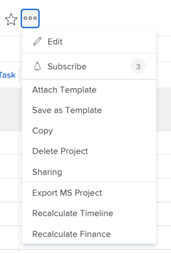

# 将项目导出到Microsoft项目

您可以将Adobe Workfront项目导出到Microsoft项目。

>[!IMPORTANT]
>
>* 并非所有Workfront字段都在Microsoft项目文件中传输。\
>  有关Workfront和Microsoft项目之间字段兼容性的更多信息，请参阅文章[将Microsoft项目字段映射到Adobe Workfront项目](../../../manage-work/projects/manage-projects/map-ms-project-fields-to-workfront.md)。
>* 我们建议您限制从一个应用程序向另一个应用程序转移项目的次数。
>

## 访问权限要求

+++ 展开可查看本文所述功能的访问权限要求。

<table style="table-layout:auto"> 
 <col> 
 <col> 
 <tbody> 
  <tr> 
   <td role="rowheader">Adobe Workfront 包</td> 
   <td> 
“任一”
 </td> 
  </tr> 
  <tr> 
   <td role="rowheader">Adobe Workfront许可证</td> 
   <td> 
浅色或更高

   
审核或更高

</td> 
  </tr> 
  <tr> 
   <td role="rowheader">访问级别配置</td> 
   <td> 
查看项目或授予更高的项目访问权限
 </td> 
  </tr> 
  <tr> 
   <td role="rowheader">对象权限</td> 
   <td> 
 查看项目或更高权限
</td> 
  </tr> 
 </tbody> 
</table>

*有关此表中信息的更多详细信息，请参阅Workfront文档中的[访问要求](/help/quicksilver/administration-and-setup/add-users/access-levels-and-object-permissions/access-level-requirements-in-documentation.md)。

+++

<!--
Old:

<table style="table-layout:auto"> 
 <col> 
 <col> 
 <tbody> 
  <tr> 
   <td role="rowheader">Adobe Workfront plan*</td> 
   <td> 
Any
 </td> 
  </tr> 
  <tr> 
   <td role="rowheader">Adobe Workfront license*</td> 
   <td> 
Review or higher
 </td> 
  </tr> 
  <tr> 
   <td role="rowheader">Access level configurations*</td> 
   <td> 
View or higher access to Projects
 
<b>NOTE</b>
   
   If you still don't have access, ask your Workfront administrator if they set additional restrictions in your access level. For information about access to projects, see <a href="../../../administration-and-setup/add-users/configure-and-grant-access/grant-access-projects.md" class="MCXref xref">Grant access to projects</a>. For information on how a Workfront administrator can change your access level, see <a href="../../../administration-and-setup/add-users/configure-and-grant-access/create-modify-access-levels.md" class="MCXref xref">Create or modify custom access levels</a>. 
 </td> 
  </tr> 
  <tr> 
   <td role="rowheader">Object permissions</td> 
   <td> 
 View or higher permissions to the project
 
For information about project permissions, see <a href="../../../workfront-basics/grant-and-request-access-to-objects/share-a-project.md" class="MCXref xref">Share a project in Adobe Workfront</a>.
 
For information on requesting additional access, see <a href="../../../workfront-basics/grant-and-request-access-to-objects/request-access.md" class="MCXref xref">Request access to objects </a>.
 </td> 
  </tr> 
 </tbody> 
</table>
-->

## 将项目从Workfront导出到Microsoft项目

您可以从项目页面、项目列表或报表中从Workfront导出项目。

1. 转到要导出的项目，然后单击项目名称右侧的&#x200B;**更多**&#x200B;图标

   

   或

   转到项目列表或报告并选择项目，然后单击列表顶部的“更多”图标。

   

1. 单击&#x200B;**导出MS项目**。

   该项目将作为XML文件下载到您的计算机，并且已准备好将其导入Microsoft项目。
