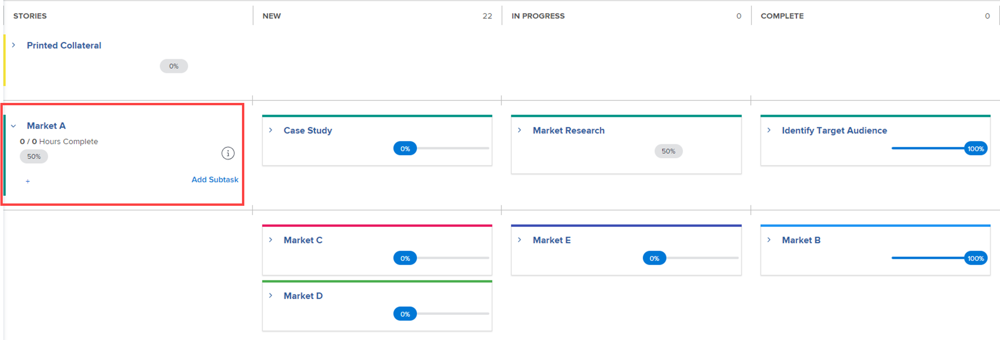

# 在Agile视图中管理项目

您可以利用项目的Agile功能，而无需Agile实践通常伴随的管理挑战（例如管理团队积压或创建迭代）。

如果要在使用团队积压工作的Agile环境中工作，并允许您从积压工作上的任务创建迭代，请按照 [在敏捷环境中工作](../../../agile/work-in-an-agile-environment/work-in-an-agile-environment.md).

## 访问要求

您必须具有以下权限才能执行本文中的步骤：

<table style="table-layout:auto"> 
 <col> 
 <col> 
 <tbody> 
  <tr> 
   <td role="rowheader">Adobe Workfront计划</td> 
   <td> 
任何
 </td> 
  </tr> 
  <tr> 
   <td role="rowheader">Adobe Workfront许可证*</td> 
   <td> 
当前：审阅或更高版本
 
   
新文档：参与者或更高版本
 </td> 
  </tr> 
  <tr> 
   <td role="rowheader">访问级别配置</td> 
   <td> 
编辑对以下区域的访问权限：
 
    <ul> 
     <li> 
项目
 </li> 
     <li> 
报告、功能板、日历
 </li> 
     <li> 
筛选器、视图、分组
 </li> 
    </ul> </td> 
  </tr> 
  <tr> 
   <td role="rowheader">对象权限</td> 
   <td> 
查看项目的权限
  </td> 
  </tr> 
 </tbody> 
</table>

&#42;要了解您拥有的计划、许可证类型或访问权限，请联系您的Workfront管理员。 有关访问要求的详细信息，请参见 [Workfront文档中的访问要求](/help/quicksilver/administration-and-setup/add-users/access-levels-and-object-permissions/access-level-requirements-in-documentation.md).

## 了解Agile项目

>[!NOTE]
>
>本节仅适用于旧版Agile视图，不适用于项目的展示板视图。

* [项目中的敏捷功能](#agile-functionality-in-a-project)
* [在项目上使用敏捷视图与在开发周期上使用敏捷视图时的差异](#differences-when-using-the-agile-view-on-a-project-versus-on-an-iteration)

### 项目中的敏捷功能 {#agile-functionality-in-a-project}

在Agile视图中管理项目时，可以使用以下Agile功能：

* 完成状态\
  有关完成状态的更多详细信息，请参阅 [迭代完成状态概述](../../../agile/use-scrum-in-an-agile-team/burndown/iteration-completion-status-overview.md).

* 故事板\
  有关故事板的更多详细信息，请参见 [Scrum展示板](../../../agile/use-scrum-in-an-agile-team/scrum-board/scrum-board.md) 部分。

在项目上使用Agile视图与在纯Agile环境（包含积压和迭代）中工作有一些差异。 有关更多信息，请参阅 [在项目上使用敏捷视图与在开发周期上使用敏捷视图时的差异](#differences-when-using-the-agile-view-on-a-project-versus-on-an-iteration) 本文章中。

### 在项目上使用敏捷视图与在开发周期上使用敏捷视图时的差异 {#differences-when-using-the-agile-view-on-a-project-versus-on-an-iteration}

* [任务和子任务遵循故事板上的不同显示规则](#tasks-and-subtasks-follow-different-display-rules-on-the-story-board)
* [不使用积压工作和迭代](#backlogs-and-iterations-are-not-used)
* [任务顺序在Agile视图中维护，无法重新排序](#task-order-is-maintained-in-the-agile-view-and-cannot-be-reordered)
* [任务仅按计划小时数测量](#tasks-are-measured-only-in-planned-hours)
* [未使用Agile团队](#the-agile-team-is-not-used)
* [项目中的每个用户都可以在不同的Agile视图中查看项目](#each-user-on-the-project-can-view-the-project-in-a-different-agile-view)

#### 任务和子任务遵循故事板上的不同显示规则 {#tasks-and-subtasks-follow-different-display-rules-on-the-story-board}

* 没有父任务和子任务的任务始终显示为故事板上的单个故事卡。\
  例如，这些任务在项目列表视图中如下所示：

  

  这些任务在项目Agile视图中如下所示：

  

* 具有子任务的父任务始终显示在 **故事** 故事板上的栏。 子任务显示在父任务的泳道中。\
  例如，这些任务在项目列表视图中如下所示：

  \
  这些任务在项目Agile视图中如下所示：

  

* 第二级子任务（子任务的子任务）在直接父任务中显示为悬挂的灰色卡片。
* 第三级子任务（子任务的子任务）永远不会显示在故事板上。

#### 不使用积压工作和迭代 {#backlogs-and-iterations-are-not-used}

在Agile视图中查看项目时，不使用以下Agile组件：

* **积压：** 未使用积压，因为项目中的任何任务都会自动显示为故事。
* **迭代：** 项目时间表中当前指定的日期不是创建迭代以定义完成工作的日期，而是工作日。

#### 任务顺序在Agile视图中维护，无法重新排序 {#task-order-is-maintained-in-the-agile-view-and-cannot-be-reordered}

在敏捷故事板中查看项目时，将保持任务在项目中的显示顺序。

在Agile视图中查看项目时，无法对项目中的任务重新排序。 由于修改任务顺序可能会影响其他可能具有依赖关系的任务，因此必须在标准视图中查看项目才能修改任务顺序。

#### 任务仅按计划小时数测量 {#tasks-are-measured-only-in-planned-hours}

项目中的任务始终按计划小时数测量。

在迭代中，任务（故事）可以用小时或点来测量。

#### 未使用Agile团队 {#the-agile-team-is-not-used}

由于Agile团队完成分配给他们的迭代工作，因此Agile团队在Agile视图中查看项目时不使用。

反之，项目中的任何用户实质上是该项目的Agile团队。

#### 项目中的每个用户都可以在不同的Agile视图中查看项目 {#each-user-on-the-project-can-view-the-project-in-a-different-agile-view}

与敏捷开发周期不同，项目中的用户可以自定义自己的敏捷视图，而其他用户使用不同的敏捷视图。

在敏捷开发周期中，敏捷故事板上可用的信息（例如可用的状态列）由团队级别确定。

有关如何自定义Agile视图的信息，请参阅 [创建或自定义敏捷视图](../../../reports-and-dashboards/reports/reporting-elements/views-overview.md#customizing-an-agile-view) 在 [Adobe Workfront中的视图概述](../../../reports-and-dashboards/reports/reporting-elements/views-overview.md).

## 在Agile视图中查看项目

1. 转到任务列表或问题列表中的要在Agile视图中查看的项目。
1. 单击 **讨论区视图** 图标 .

   默认情况下，将显示项目的讨论区视图。

   

   <!--(Legacy agile view only) If you previously viewed the project in a custom agile view, the project is displayed in that view rather than in the default agile view.-->

1. （可选）单击 **配置** 设置列和卡片的选项。

   有关更多信息，请参阅 [管理展示板列](/help/quicksilver/agile/get-started-with-boards/manage-board-columns.md) 和 [自定义信息卡上显示的字段](/help/quicksilver/agile/get-started-with-boards/customize-fields-on-card.md). 请注意，您无法在项目的展示板视图中定义列策略。

1. （可选）单击 **使用旧版Agile** 使用旧版Agile视图而不是“展示板”视图。

1. （可选 — 仅限旧版Agile视图）如果您已创建自定义Agile视图，或者如果其他用户已创建自定义Agile视图并与您共享，则可以查看它，而不是默认的Agile视图。

   单击 **视图** 下拉菜单，然后单击要查看的自定义敏捷视图。

   下次单击 **敏捷** 图标。

   有关如何创建新的Agile视图的信息，请参阅 [创建和自定义Agile视图](#create-and-customize-agile-views).

   项目显示在自定义Agile视图中。

1. （视情况而定 — 仅限旧版敏捷视图）如果您的项目中的任务使用的状态不是“新建”、“进行中”或“完成”（敏捷视图的默认状态），则必须将其他状态添加到敏捷视图，才能显示这些状态的任何任务。

   如果任务处于未显示在敏捷故事板上的状态，则任务本身未显示在敏捷故事板上（但是，这些任务的完成百分比仍然构成任何父任务的完成百分比和整个项目的完成百分比）。

   要向Agile视图添加状态，请按照文章的“创建或自定义Agile视图”部分中的说明创建新的或“自定义现有Agile视图” [Adobe Workfront中的视图概述](../../../reports-and-dashboards/reports/reporting-elements/views-overview.md).

1. （可选）要返回到列表视图，请单击 **列表** 图标。

## 创建和自定义Agile视图 {#create-and-customize-agile-views}

>[!NOTE]
>
>本节仅适用于旧版Agile视图，不适用于项目的展示板视图。

与Workfront中的标准视图一样，您可以自定义现有Agile视图或从头开始创建新的Agile视图。 与标准视图不同，您不能根据现有Agile视图创建新的Agile视图。

有关创建和自定义Agile视图的详细信息，请参见 [创建或自定义敏捷视图](/help/quicksilver/reports-and-dashboards/reports/reporting-elements/create-edit-views.md#create-or-customize-an-agile-view) 部分内容 [在Adobe Workfront中创建或编辑视图](/help/quicksilver/reports-and-dashboards/reports/reporting-elements/create-edit-views.md).

## 共享现有Agile视图

>[!NOTE]
>
>本节仅适用于旧版Agile视图，不适用于项目的展示板视图。

您可以共享您创建的Agile视图，或者以共享任何其他视图、过滤器或分组的相同方式拥有对的权限。

有关更多信息，请参阅 [共享筛选器、视图或分组](../../../reports-and-dashboards/reports/reporting-elements/share-filter-view-grouping.md).

## 删除现有Agile视图

>[!NOTE]
>
>本节仅适用于旧版Agile视图，不适用于项目的展示板视图。

删除Agile视图的方式与删除任何其他视图、过滤器或分组的方式相同。

欲了解更多信息，请参见 [删除筛选器、视图和分组](/help/quicksilver/reports-and-dashboards/reports/reporting-elements/remove-filters-views-groupings.md).
