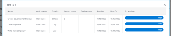
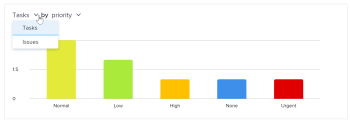

# 项目指标概述

项目量度以图表格式为您提供有关项目执行情况的常规视图。

## 访问要求

<table style="table-layout:auto"> 
 <col> 
 <col> 
 <tbody> 
  <tr> 
   <td role="rowheader">Workfront计划*</td> 
   <td> 
任何
 </td> 
  </tr> 
  <tr> 
   <td role="rowheader">Workfront许可证*</td> 
   <td> 
审核或更高 
 </td> 
  </tr> 
  <tr> 
   <td role="rowheader">访问级别*</td> 
   <td> 
查看对项目的访问权限
 
<b>注释</b>

如果您仍然没有访问权限，请咨询Workfront管理员是否对您的访问级别设置了其他限制。 有关项目访问权限的信息，请参阅<a href="../../../administration-and-setup/add-users/configure-and-grant-access/grant-access-projects.md" class="MCXref xref">授予项目访问权限</a>。 有关Workfront管理员如何更改访问级别的信息，请参阅<a href="../../../administration-and-setup/add-users/configure-and-grant-access/create-modify-access-levels.md" class="MCXref xref">创建或修改自定义访问级别</a>。 
 </td>
</tr> 
  <tr> 
   <td role="rowheader">对象权限</td> 
   <td> 
查看项目的权限
 
 有关项目权限的信息，请参阅<a href="../../../workfront-basics/grant-and-request-access-to-objects/share-a-project.md" class="MCXref xref">在Adobe Workfront中共享项目</a>。
 
有关请求其他访问权限的信息，请参阅<a href="../../../workfront-basics/grant-and-request-access-to-objects/request-access.md" class="MCXref xref">请求访问对象</a>。
 </td> 
  </tr> 
 </tbody> 
</table>

*要了解您拥有的计划、许可证类型或访问权限，请联系您的Workfront管理员。

## 先决条件

要从项目的左侧面板访问量度区域，您必须：

* 在布局模板的项目区域中启用左侧面板选项量度。

  要了解Workfront管理员或组管理员如何使用布局模板自定义左侧面板，请参阅[使用布局模板自定义左侧面板](../../../administration-and-setup/customize-workfront/use-layout-templates/customize-left-panel.md)。

## 项目量度区域概述

项目量度可让您可视化项目中所发生的情况，从而快速评估项目的需求和状态。

在量度区域中，您可以查看项目的整体运行状况以及：

* 工作处于活动状态或已停止的位置
* 有分配给他们的未结工作项
* 逾期或接近计划完成日期的任务或问题的详细信息

您还可以深入到每个图表，更详细地查看特定类别中的任务或问题。

若要了解有关查看这些任务或问题的详细信息，请参阅[查看量度详细信息](#view-metrics-details)。

>[!TIP]
>
>要查看某个项目、项目组合等中一组项目的更高级别指标，请导航到增强的分析区域。\
>要了解有关增强型分析的更多信息，请参阅[增强型分析概述](../../../enhanced-analytics/enhanced-analytics-overview.md)。

## 项目KPI

关键绩效指标(KPI)显示在量度区域的顶部。

这些KPI可划分为以下类别：

| 已完成的任务 | **已完成任务**&#x200B;显示处于完成状态的任务数。 此数字还包括具有相当于完成的自定义状态的任务。 |
|---|---|
| 未完成的任务 | **未完成任务**&#x200B;显示未处于“完成”或“已关闭”状态或等同于“完成”状态的任务数。 |
| 超期任务 | **超期任务**&#x200B;显示已超过计划完成日期且未处于“完成”或“已关闭”状态，或等同于“完成”或“已关闭”状态的任务数。 |
| 任务总数 | **任务总数**&#x200B;显示项目中的任务总数。 |

>[!TIP]
>
>要显示特定KPI的工作项列表，请单击该KPI。 在该列表中，您可以单击特定工作项以在新选项卡中查看更多详细信息。\
>\
>有关详细信息，请参阅[查看量度详细信息](#view-metrics-details)。

## 任务或问题条形图

在项目KPI下方显示的条形图中，您可以查看项目中工作项的状态或优先级。 默认情况下，选择任务视图。

在此图表中选择状态后，您可以查看项目中任务或问题的所有状态。 每个状态都分组到图表中的一个条形中。 所有默认系统状态和自定义状态都将显示在此图表中。

在此图表中选择优先级后，您可以查看项目中任务或问题的所有优先级。

>[!TIP]
>
>要显示具有特定状态或优先级的工作项列表，请单击图表中的条形。 在该列表中，您可以单击特定工作项以在新选项卡中查看更多详细信息。\
>\
>有关详细信息，请参阅[查看量度详细信息](#view-metrics-details)。

## 圆环图

使用位于项目KPI下方的圆环图，可以查看项目中已完成工作项与未完成工作项的比率。

在图表上方的下拉菜单中，可以选择：

| 所有任务 | 选择&#x200B;**任务**&#x200B;会显示项目中的任务总数，以及已完成和未完成任务之间的比率。 |
|---|---|
| 所有问题 | 选择&#x200B;**问题**&#x200B;会显示项目中的问题总数以及已完成问题与未完成问题之间的比率。 |

>[!TIP]
>
>要显示已完成或未完成的工作项列表，请单击圆环图中的该部分。 在该列表中，您可以单击特定工作项以在新选项卡中查看更多详细信息。\
>\
>有关详细信息，请参阅[查看量度详细信息](#view-metrics-details)。

## 被分派人条形图

被分派人条形图显示分配给项目中每个人的任务数。 此数字会因您从下拉菜单中选择的类别而异。

您可以选择按以下类别查看项目的任务分配：

| 完成 | 选择&#x200B;**完成**&#x200B;显示分配给每个用户已完成的任务数。 |
|---|---|
| 未完成 | 选择&#x200B;**未完成**&#x200B;将显示分配给每个用户但尚未完成的任务数。 |
| 近期的 | 选择&#x200B;**近期**&#x200B;显示分配给每个用户但尚未达到计划开始日期的任务数。 |
| 超期 | 选择&#x200B;**过期**&#x200B;显示分配给每个用户的已超过计划完成日期但尚未完成的任务数。 |

>[!TIP]
>
>要显示选定类别中分配给特定用户的工作项列表，请单击图表中用户名旁边的栏。 在该列表中，您可以单击特定工作项以在新选项卡中查看更多详细信息。\
>\
>有关详细信息，请参阅[查看量度详细信息](#view-metrics-details)。

## 查看量度详细信息 {#view-metrics-details}

您可以与“量度”区域中的图表进行交互，以查看图表的不同方面，或者更细致地查看图表中的任务和问题。

1. 转到要查看其量度的项目。
1. 在左侧面板中，单击&#x200B;**显示更多**&#x200B;以显示更多部分，然后单击&#x200B;**量度**。\
   默认情况下，“度量”区域中的图表会显示任务的信息。\
   

1. （视情况而定）如果图表上显示下拉箭头，请单击图表上的&#x200B;**下拉箭头**&#x200B;图标，然后从菜单中选择所需的选项。\
   有关每个图表的菜单中所显示选项的信息，请参阅上面的相关部分。

1. （可选）要更详细地了解页面上任何量度的任务或问题，请执行以下操作：

   1. 单击要查看其详细信息的元素，例如分配给特定用户的任务、具有高优先级的问题或所有过期任务。

      此时将显示任务或问题列表。

      

   1. 使用列表底部的箭头找到要查看的任务或问题。

      或

      选择特定编号以在特定页面上显示任务或问题。

      

   1. 选择任务或问题以查看更多详细信息。

      任务或问题将在新选项卡中打开。

1. （可选）要将项目量度仪表板导出到.png文件，请单击&#x200B;**导出**&#x200B;图标，然后从下拉菜单中选择&#x200B;**导出为PNG**。

   >[!TIP]
   >
   >导出操控板时，导出的文件仅包括当前在视区中显示的内容。 要在导出的文件中包含某些内容，您可能需要在页面上上下滚动或调整浏览器的缩放设置。
