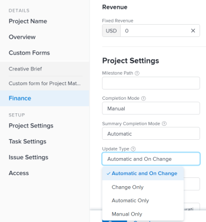

# 选择项目更新类型

通过选择项目的更新类型，您可以控制对项目时间线所做的更改在父任务或项目上的保存频率。

更新项目时间线时，会根据对项目及其任务所做的更改或对时间线所依赖的其他项目所做的更改来重新计算项目时间线。

例如，对项目上的任务进行以下更改会触发时间线的更新  项目的：

* 更新任务日期
* 更改任务的前置任务关系
* 除了更改任务限制或持续时间类型外，还可以更改父子关系，添加或删除分配。

## 访问要求

<!-- drafted for P&P:

<table style="table-layout:auto"> 
 <col> 
 <col> 
 <tbody> 
  <tr> 
   <td role="rowheader">Adobe Workfront plan*</td> 
   <td> 
Any 
 </td> 
  </tr> 
  <tr> 
   <td role="rowheader">Adobe Workfront license*</td> 
   <td> 
Current license: Standard
 
   Or
   
Legacy license: Plan 
 </td> 
  </tr> 
  <tr> 
   <td role="rowheader">Access level configurations*</td> 
   <td> 
Edit access to Projects
 
<b>NOTE</b>
   
   If you still don't have access, ask your Workfront administrator if they set additional restrictions in your access level. For information on how a Workfront administrator can modify your access level, see <a href="../../../administration-and-setup/add-users/configure-and-grant-access/create-modify-access-levels.md" class="MCXref xref">Create or modify custom access levels</a>.
 </td> 
  </tr> 
  <tr> 
   <td role="rowheader">Object permissions</td> 
   <td> 
Manage permissions to a project
 
For information on requesting additional access, see <a href="../../../workfront-basics/grant-and-request-access-to-objects/request-access.md" class="MCXref xref">Request access to objects </a>.
 </td> 
  </tr> 
 </tbody> 
</table>
-->

您必须具有以下权限才能执行本文中的步骤：

<table style="table-layout:auto"> 
 <col> 
 <col> 
 <tbody> 
  <tr> 
   <td role="rowheader">Adobe Workfront计划*</td> 
   <td> 
任何 
 </td> 
  </tr> 
  <tr> 
   <td role="rowheader">Adobe Workfront许可证*</td> 
   <td> 
计划 
 </td> 
  </tr> 
  <tr> 
   <td role="rowheader">访问级别配置*</td> 
   <td> 
编辑对项目的访问权限
 
<b>注释</b>

如果您仍然没有访问权限，请咨询Workfront管理员是否对您的访问级别设置了其他限制。 有关Workfront管理员如何修改您的访问级别的信息，请参阅<a href="../../../administration-and-setup/add-users/configure-and-grant-access/create-modify-access-levels.md" class="MCXref xref">创建或修改自定义访问级别</a>。
 </td>
</tr> 
  <tr> 
   <td role="rowheader">对象权限</td> 
   <td> 
管理项目的权限
 
有关请求其他访问权限的信息，请参阅<a href="../../../workfront-basics/grant-and-request-access-to-objects/request-access.md" class="MCXref xref">请求访问对象</a>。
 </td> 
  </tr> 
 </tbody> 
</table>

&#42;要了解您拥有什么计划、许可证类型或访问权限，请与Workfront管理员联系。

## 更新项目的更新类型

任务更新时，其父对象（父任务或项目）会在“更新类型”指示的时间更新。  要为项目指定更新类型，请执行以下操作：

1. 转到要指定其更新类型的项目。
1. 单击项目名称旁边的更多菜单，然后单击&#x200B;**编辑** 。

1. 单击&#x200B;**项目****设置**。

   

1. 在&#x200B;**更新类型**&#x200B;字段中，选择是希望Workfront每天自动计算项目的时间表（如有更改），还是希望项目经理手动计算项目的时间表。

   从下面的列表中选择选项。 

   >[!IMPORTANT]
   >
   >如果项目的时间表超过15年，Workfront不会自动计算时间表或在发生更改时计算时间表。 超过15年的项目的更新类型始终为手动。

   * **更改时自动更新：**&#x200B;这是默认设置。 每次在项目或时间线所依赖的其他项目中发生更改时，项目时间线都会更新。 项目的时间表每晚也会更新。 \
     这是推荐的设置，因为它可确保项目时间线始终保持最新。

     当您更新任务或项目并触发时间表重新计算时，所有可用日期都会立即显示，让您能够继续工作。 在具有100个以上任务的项目中，需要更长时间计算的日期将灰显。

     

     这表示重新计算尚未完成，并且日期可能会发生更改。

   * **仅更改：**&#x200B;每次在项目或时间线所依赖的其他项目中发生更改时，项目时间线都会更新；不会发生计划的更新。\
     如果担心系统性能并且项目或时间线所依赖的其他项目中很少发生更改，您可能需要选择此选项。

   * **仅限自动：**&#x200B;项目时间线每晚都更新；更改后不会立即更新。\
     如果担心系统性能以及项目或时间线所依赖的其他项目中每天发生许多更改，您可能需要选择此选项。

     >[!NOTE]
     >
     >如果项目处于Planning状态，则不会每晚自动重新计算。 它只会在更改时重新计算。

   * **仅手动：**&#x200B;仅当您选择&#x200B;**重新计算时间表**&#x200B;的选项时，项目时间表才会更新，如[重新计算项目时间表](../../../manage-work/projects/manage-projects/recalculate-project-timeline.md)一节中的“手动重新计算”一节所述。\
     如果要一次对项目进行多项更改，并且希望在所有更改完成后（而不是在每次更改后）重新计算时间线，则可能需要选择此选项。

1. 单击&#x200B;**保存**。
