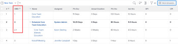

# 确定项目中的工作划分结构

为项目定义工作划分结构(WBS)是一组最终概述了项目计划的活动。 WBS将项目结果划分为可管理的工作元素，这些工作元素可用于定义里程碑和组织工作分配。

您必须拥有具有项目编辑访问权限的计划许可证才能构建项目的工作划分结构。 根据您在构建WBS时执行的活动数量，可能需要对Adobe Workfront的其他区域进行额外的访问。

我们建议您在对工作划分结构进行更改时，将项目保持为“计划”状态，以避免向项目团队中的用户发出触发通知。

## 定义项目交付项

项目的目的是向内部和外部利益攸关方提供切实的交付成果。 项目的交付内容是您希望通过完成项目来实现的结果。 结果几乎总是与至少一个交付项相关联，并且所有交付项应与一个项目相关联。

项目交付项可以是消费品、智能产出（如报表）或服务。 例如，如果您的项目范围是要建造房屋，则某些交付内容可能包括：

* 创建架构计划
* 完成管道
* 电工
* 浇地
* 框架工作
* 结束了房屋的出售。

根据项目的规模和范围，项目可以由多个交付项组成。

确定交付项后，您可以开始将它们划分为任务。 任务是您为交付项目的整体结果而获得的输出。 在定义任务时，您需要考虑以下参数：

* 完成所需的时间。
* 完成工作所需的预算。
* 完成工作所需的资源。
* 根据任务的逻辑时间表来计划资源。

在定义任务时，请确保不会为单个任务计划过多的工作。 如果任务所需的工作时间超过40小时（通常是一周的工作时间），则您可能需要在子任务中划分该工作量。 完成所有子任务后将完成主任务。

要在Workfront中定义WBS结果和交付项，我们建议您执行以下活动以创建项目任务的分层视图：

* 如果尚未执行此操作，请创建新项目。\
   有关创建项目的信息，请参阅文章 [创建项目](../../../manage-work/projects/create-projects/create-project.md).

* 为完成每个结果和可交付项所需的所有操作项创建任务。\
   有关创建任务的信息，请参阅文章 [在项目中创建任务](../../../manage-work/tasks/create-tasks/create-tasks-in-project.md) .

* 从您刚刚创建的任务中，确定哪些是主要结果，并将它们与里程碑相关联。\
   有关创建里程碑任务的信息，请参阅文章 [创建里程碑路径](../../../administration-and-setup/customize-workfront/configure-approval-milestone-processes/create-milestone-path.md) 和 [将里程碑与任务关联](../../../manage-work/tasks/manage-tasks/associate-milestones-with-tasks.md).

* 将范围过大的任务划分为子任务。 将它们与定义可交付项的父项关联。\
   有关创建子任务的信息，请参阅文章 [创建子任务](../../../manage-work/tasks/create-tasks/create-subtasks.md).

* 确定子任务之间和里程碑之间的依赖关系。\
   在依赖关系中，任务的开始取决于另一任务或一组任务的完成情况。\
   有关任务依赖关系的信息，请参阅 [任务前置任务概述](../../../manage-work/tasks/use-prdcssrs/predecessors-overview.md) 和 [在任务列表上创建前置任务关系](../../../manage-work/tasks/use-prdcssrs/create-predecessors-on-task-list.md).

* 确定在项目生命周期中的任何时刻是否需要批准和审查。 创建审批流程以满足此需求。\
   有关批准的信息，请参阅文章 [为工作项创建审批流程](../../../administration-and-setup/customize-workfront/configure-approval-milestone-processes/create-approval-processes.md).

## 估计工作计划和计划约束

创建项目的基本里程碑和任务结构后，您可以通过定义任务约束和持续时间来估计完成整个项目所需的时间。

请考虑以下事项：

* 任务约束定义何时必须开始或结束任务。

   有关定义任务约束的信息，请参阅文章 [任务约束概述](../../../manage-work/tasks/task-constraints/task-constraint-overview.md).

* 任务的持续时间是可用于完成任务的时间范围。 在估计持续时间时，您可能需要输入一个考虑延迟可能性的值。 如果以前已经完成过类似项目，您可能很清楚应在何处设置此值。

   由于持续时间是估计值，因此请务必设置乐观的时间值，以考虑可能影响任务的因素，如天气、停电、供应商困难或其他意外事件。 此外，请务必考虑是否存在任何关联的前置任务或依赖任务，以及它们如何对工作施加限制并影响任务完成。

   根据任务的持续时间类型，您可以修改任务在项目生命周期内的持续时间，但这也会影响项目的时间轴。 有关任务持续时间的信息，请参阅文章 [任务持续时间和持续时间类型概述](../../../manage-work/tasks/taskdurtn/task-duration-and-duration-type.md) .

## 分配任务

在定义了每项任务的持续时间和限制后，您可以确定谁有完成工作的时间和技能。 您可以在Workfront中将任务分配给以下实体：

* 用户\
   只有具有计划员或员工访问权限级别的用户才能分配给任务。 虽然您可以将任务分配给请求者和审阅者，但他们无法完成这些任务。 因此，我们不建议为他们分配任务。

   有关访问级别以及用户如何定义如何使用Workfront对象的信息，请参阅 [访问级别概述](../../../administration-and-setup/add-users/access-levels-and-object-permissions/access-levels-overview.md).

* 职位角色
* 团队

有关分配任务的信息，请参阅 [分配任务](../../../manage-work/tasks/assign-tasks/assign-tasks-1.md) 中。

## 管理资源

通过Workfront中的资源管理，您可以确定是否有足够的员工来完成项目。 将用户添加到项目后，Workfront会显示每个用户的利用率。 资源管理器可以查看在项目的时间范围内将人员分配给其他项目的总小时数。

>[!NOTE]
>
>只要项目的状态为“计划”，分配给用户的任务列表中就不会显示这些任务。

在财年或财季开始时，您可能希望在不了解特定工作划分结构的情况下，跨多个项目在更高级别管理您的资源。\
有关规划更高级别资源使用的信息，请参阅文章 [资源规划入门](../../../resource-mgmt/resource-planning/get-started-resource-planning.md).

在构建一个项目的工作划分结构并确保将每个任务分配给正确的资源的上下文中管理资源时，您就可以安排资源用于需要完成的工作。\
有关计划资源的信息，请参阅 [资源计划](../../../resource-mgmt/resource-scheduling/resource-scheduling-overview.md) 中。

## 估计项目财务

Workfront将计算每项任务的计划成本和项目的总成本。 任务的计划成本包括任务的所有费用以及分配给任务的员工或职责的成本。 任务、角色和员工的小时费率在任务、角色和用户创建期间分配。

有关项目财务的信息，请参阅 [项目财务](../../../manage-work/projects/project-finances/project-finances-overview.md) .

## 确定项目的批准点

通过在Workfront中创建批准流程，您可以为项目建立审核点以监控进度和潜在问题区域。 通过审批流程项目所有者可以识别哪些任务延迟和提前，查看更改了任务状态的列表的审核跟踪，并查看问题历史记录，包括问题的解决方式和问题的结束时间。 在审核项目时，项目所有者可以根据需要确定要采取哪些步骤并更新项目计划。

有关批准的信息，请参阅文章 [为工作项创建审批流程](../../../administration-and-setup/customize-workfront/configure-approval-milestone-processes/create-approval-processes.md)

## 查看WBS

要了解项目的WBS，您需要查看以下任务元素：

* 任务序列和时间表（计划的开始和完成日期以及任务持续时间）
* 前置依赖项
* 子关系和父关系
* 分配

完成WBS后，您可以在项目级别的任务列表或报表中查看该WBS。

* [在任务列表中查看WBS](#view-the-wbs-in-a-task-list)
* [在任务报表中查看WBS](#view-the-wbs-in-a-task-report)

### 在任务列表中查看WBS {#view-the-wbs-in-a-task-list}

您可以在项目级别查看任务列表。

1. 转到要查看其工作划分结构的项目。
1. 选择 **任务** 选项卡。
1. （可选）选择 **无** 在 **分组** 下拉菜单。

   工作划分结构不显示WBS中任务的缩进。

1. 从 **查看** 下拉菜单，然后选择 **工作划分** 中。

   “工作划分”(Work Breakdown)结构显示在选定视图的第二列中。

   

### 在任务报表中查看WBS {#view-the-wbs-in-a-task-report}

您可以通过执行以下操作之一来构建任务报告并显示任务的WBS:

* 将现有的工作划分结构视图应用到报表。
* 将“工作划分结构”列添加到任何自定义报表。

>[!TIP]
>
>我们建议添加项目分组，以明确任务所属的项目。 任务缩进不会显示在任务报表中。

有关构建报表的信息，请参阅文章 [创建自定义报表](../../../reports-and-dashboards/reports/creating-and-managing-reports/create-custom-report.md).

## 将项目的WBS另存为模板

如果您处理的其他项目遵循与您刚刚创建的WBS类似的工作计划，则可能需要将项目另存为模板。 在创建未来相关项目时，模板可节省时间和精力。

如果贵组织的周转率很低，请考虑等到进行用户分配以保存模板之后。 无论项目何时另存为模板，都可以在将模板附加到新项目期间删除用户分配或特定任务。

工作划分结构的以下元素可以保存在模板中，以供将来与其他项目一起使用：

* 前置依赖项
* 分配（包括项目所有者、赞助商和资源经理）
* 审批流程
* 任务约束
* 文档
* 开支及其他财务资料
* 目标
* 小时类型
* 请求队列结构
* 提醒通知
* 风险
* 记帐费率
* 共享信息
* 自定义表单

有关将项目另存为模板的信息，请参阅文章 [从项目创建模板](../../../manage-work/projects/create-and-manage-templates/create-template-from-project.md) .
