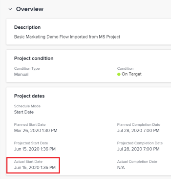

# 项目实际开始日期概览

在Adobe Workfront中，项目、任务和问题具有实际开始日期。 对于任务和问题，这是将其标记为进行中的日期。 对于项目，这是将项目中的第一个任务标记为进行中或完成的日期。

## 访问要求

+++ 展开以查看本文中各项功能的访问要求。 

<table style="table-layout:auto"> 
 <col> 
 <col> 
 <tbody> 
  <tr> 
   <td role="rowheader">Adobe Workfront包</td> 
   <td> 
任何
 </td> 
  </tr> 
  <tr> 
   <td role="rowheader">Adobe Workfront许可证</td> 
   <td>
浅色或更高
 
   
审核或更高
 </td> 
  </tr> 
  <tr> 
   <td role="rowheader">访问级别配置</td> 
   <td> 
查看项目或授予更高的项目访问权限
  </td> 
  </tr> 
  <tr> 
   <td role="rowheader">对象权限</td> 
   <td> 
查看项目或更高权限
  </td> 
  </tr> 
 </tbody> 
</table>

有关信息，请参阅Workfront文档中的[访问要求](/help/quicksilver/administration-and-setup/add-users/access-levels-and-object-permissions/access-level-requirements-in-documentation.md)。

+++

<!--Old:

<table style="table-layout:auto"> 
 <col> 
 <col> 
 <tbody> 
  <tr> 
   <td role="rowheader">Adobe Workfront plan*</td> 
   <td> 
Any
 </td> 
  </tr> 
  <tr> 
   <td role="rowheader">Adobe Workfront license*</td> 
   <td> 
Review or higher
 </td> 
  </tr> 
  <tr> 
   <td role="rowheader">Access level configurations*</td> 
   <td> 
View or higher access to Projects
 
Note: If you still don't have access, ask your Workfront administrator if they set additional restrictions in your access level. For information on how a Workfront administrator can modify your access level, see <a href="../../../administration-and-setup/add-users/configure-and-grant-access/create-modify-access-levels.md" class="MCXref xref">Create or modify custom access levels</a>.
 </td> 
  </tr> 
  <tr> 
   <td role="rowheader">Object permissions</td> 
   <td> 
View or higher permissions to a project
 
For information on requesting additional access, see <a href="../../../workfront-basics/grant-and-request-access-to-objects/request-access.md" class="MCXref xref">Request access to objects </a>.
 </td> 
  </tr> 
 </tbody> 
</table>-->

## 关于Workfront中实际开始日期的注意事项

* 实际开始日期位于项目、任务和问题的详细信息部分。 
* 创建项目、任务或问题时，不会填充这些项目的实际开始日期。
* 当项目、任务或问题中的工作实际开始时，将填写“实际开始日期”。
* 如果项目上的工作尚未开始，则“项目详细信息”选项卡上不显示“实际开始日期”。

  如果任务和问题详细信息选项卡上的工作尚未开始，则实际开始日期在它们上显示空白。

* 您可以手动修改任务或问题的实际开始日期，但不能修改项目的实际开始日期。

## 关于项目实际开始日期的注意事项

* 当出现以下任何情况时，Workfront会自动设置项目的实际日期：

   * 任务被分派人将任务的状态从&#x200B;*New*&#x200B;更改为不等于&#x200B;*New*&#x200B;的任何其他状态。

   * 任务被分派人更改任务的完成百分比。

     >[!IMPORTANT]
     >
     >将项目标记为当前时，不会填充项目实际开始日期。 实际工作必须在填入项目实际开始日期之前开始于项目任务。

     在这些情况下，项目的“实际开始日期”设置为针对项目中最早的任务发生这些操作的日期和时间。 这表明项目实际在此日期和时间开始。

## 查找项目的实际开始日期

您可以在以下区域找到项目的实际开始日期：

* 在项目的详细信息部分。
* 在项目报表或视图中，当在报表中添加对象“项目”的实际开始日期时。

  有关创建报告的信息，请参阅文章[创建自定义报告](../../../reports-and-dashboards/reports/creating-and-managing-reports/create-custom-report.md)。

要在项目的详细信息部分找到实际开始日期，请执行以下操作：

1. 单击Workfront右上角的&#x200B;**主菜单**&#x200B;图标，然后单击&#x200B;**项目**。
1. 单击要查看其实际开始日期的项目。
1. 单击左侧面板中的&#x200B;**项目详细信息**，然后转到&#x200B;**概述**&#x200B;部分。

   实际开始日期与其他项目日期一起显示。

   

