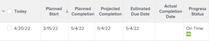
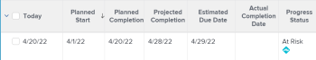
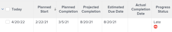

# 项目进度状态概述

<!--Audited: 12/2023-->

Adobe Workfront通过查看项目在时间线中的进度来确定项目的进度状态。 您可以配置Workfront以根据任务的进度状态的值确定项目的条件。 有关配置项目条件的更多信息，请参阅文章 [项目完成情况和完成情况类型概览](../../../manage-work/projects/manage-projects/project-condition-and-condition-type.md).

以下是Workfront中项目的进度状态：

<table style="table-layout:auto"> 
 <col> 
 <col> 
 <tbody> 
  <tr> 
   <td>准时</td> 
   <td> 项目的进度状态为 <strong>准时</strong> 如果：<ul><li>如果预计完成日期和估计完成日期早于或等于项目的计划完成日期</li></ul> 
  
 </td> 
  </tr> 
  <tr> 
   <td>处于风险中</td> 
   <td> 项目的进度状态为 <strong>处于风险</strong> 如果 <strong>所有</strong> 符合下列条件之一：<ul><li>估计完工日期和预计完工日期均在未来</li><li> 预计完成日期和预计完成日期均晚于计划完成日期</li><li> 预计完成日期晚于预计完成日期</li></ul>
  
 </td> 
  </tr> 
  <tr> 
   <td>滞后</td> 
   <td> 项目的进度状态为 <strong>滞后</strong> 如果 <strong>所有</strong> 符合下列条件之一：<ul><li>估计完工日期和预计完工日期均在未来</li><li> 预计完成日期和预计完成日期均晚于项目的计划完成日期</li><li> 预计完成日期不晚于预计完成日期</li></ul> 
  
 </td> 
  </tr> 
  <tr> 
   <td>延迟</td> 
   <td> 
     项目的进度状态为 <strong>晚的</strong> 如果 <strong>或者</strong> 符合下列条件之一：<ul><li>项目已完成，且实际完成日期迟于计划完成日期 
  
 </li> 
     <li> 
项目未完成，项目的计划完成日期为过去的日期 
  
 </li> 
    </ul> </td> 
  </tr> 
 </tbody> 
</table>

请考虑以下事项：

* 项目的预计完成日期由关键路径上的任务以及最近的预计完成日期驱动。
* 项目的预计完成日期由关键路径上的任务以及最近的预计完成日期驱动。

有关项目关键路径的信息，请参见 [项目关键路径概述](../../../manage-work/tasks/manage-tasks/critical-path.md).

有关预计完成日期的信息，请参阅 [项目、任务和问题的预计完成日期概述](../../../manage-work/projects/planning-a-project/project-projected-completion-date.md).
