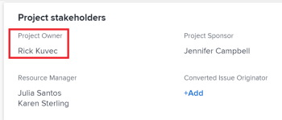

# 更新项目所有者和发起人

<!--Audited: 07/2024-->

在Adobe Workfront中创建项目时，您自动被设置为项目的项目所有者。 您可以使用其他用户更新此字段。 您还可以更新项目的项目发起人字段。

有关项目所有者和赞助者的信息，请参阅[项目所有者和赞助者概览](../../../manage-work/projects/planning-a-project/project-owners-and-sponsors.md)。

>[!TIP]
>
>您可以确定模板的所有者和发起人。 使用该模板创建项目时，模板所有者将成为项目所有者，模板发起人将成为项目发起人。
>
>如果模板没有所有者，则从模板创建项目的用户将成为项目所有者。
>
>有关编辑模板的信息，请参阅[编辑项目模板](../../../manage-work/projects/create-and-manage-templates/edit-templates.md)。

## 访问要求

<!--drafted for P&P:

<table style="table-layout:auto"> 
 <col> 
 <col> 
 <tbody> 
  <tr> 
   <td role="rowheader">Adobe Workfront plan*</td> 
   <td> 
Any
 
  
 </td> 
  </tr> 
  <tr> 
   <td role="rowheader">Adobe Workfront license*</td> 
   <td> 
Current license: Standard 
 
   Or
   
Legacy license: Plan 
 
   </td> 
  </tr> 
  <tr> 
   <td role="rowheader">Access level configurations*</td> 
   <td> 
Edit access to Projects
 
<b>NOTE</b>
   
   If you still don't have access, ask your Workfront administrator if they set additional restrictions in your access level. For information on how a Workfront administrator can modify your access level, see <a href="../../../administration-and-setup/add-users/configure-and-grant-access/create-modify-access-levels.md" class="MCXref xref">Create or modify custom access levels</a>.
 </td> 
  </tr> 
  <tr> 
   <td role="rowheader">Object permissions</td> 
   <td> 
Edit permissions to a project
 
For information on requesting additional access, see <a href="../../../workfront-basics/grant-and-request-access-to-objects/request-access.md" class="MCXref xref">Request access to objects </a>.
 </td> 
  </tr> 
 </tbody> 
</table>
-->

+++ 展开以查看本文中各项功能的访问要求。

<table style="table-layout:auto"> 
 <col> 
 <col> 
 <tbody> 
  <tr> 
   <td role="rowheader">Adobe Workfront计划</td> 
   <td> 
任何
 
  
 </td> 
  </tr> 
  <tr> 
   <td role="rowheader">Adobe Workfront许可证*</td> 
   <td>
新增：标准
 
   
当前：计划 
 </td> 
  </tr> 
  <tr> 
   <td role="rowheader">访问级别配置*</td> 
   <td> 
编辑对项目的访问权限
 </td> 
  </tr> 
  <tr> 
   <td role="rowheader">对象权限</td> 
   <td> 
编辑项目的权限
 </td> 
  </tr> 
 </tbody> 
</table>

*有关信息，请参阅Workfront文档中的[访问要求](/help/quicksilver/administration-and-setup/add-users/access-levels-and-object-permissions/access-level-requirements-in-documentation.md)。

+++

## 更新项目的项目所有者

当您将用户添加为项目的项目所有者时，Workfront会自动授予他们查看项目的权限。

1. 转到要更新的项目。
1. 单击左侧面板中的&#x200B;**项目详细信息**。
1. 单击项目详细信息区域右上角的&#x200B;**编辑**&#x200B;图标，然后单击&#x200B;**概述**。

1. 为&#x200B;**项目所有者**&#x200B;字段指定用户的名称。

   只能将活动用户指定为项目所有者。

1. 单击&#x200B;**保存更改**。

   项目所有者在项目标题和项目详细信息区域中更新。

   突出显示

## 更新项目的项目发起人

当您将用户添加为项目的项目发起人时，Workfront会自动授予他们查看项目的权限。

>[!TIP]
>
>如果您添加为项目发起人的用户是系统管理员，则他们不会添加到项目的“共享”列表中。

1. 转到要更新的项目。
1. 单击左侧面板中的&#x200B;**项目详细信息**。
1. 单击项目详细信息区域右上角的&#x200B;**编辑**&#x200B;图标，然后单击&#x200B;**概述**。

1. 为&#x200B;**项目发起人**&#x200B;字段指定用户的名称。

   只有活动用户才能指定为项目发起人。

1. 单击&#x200B;**保存更改**。

   项目发起人更新项目详细信息区域。

   突出显示
