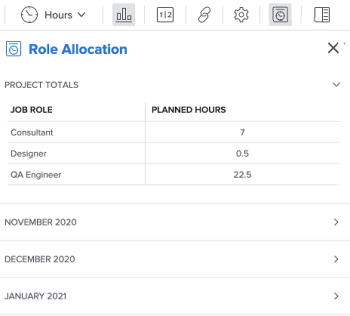

# 在“角色分配”面板中查看项目计划时数

您可以在项目的“角色分配”面板中查看分配给项目中工作项的所有作业角色的角色分配。

>[!NOTE]
>
>本文是指在项目的“角色分配”面板中查看与项目任务和问题及其分配的计划时间相关联的作业角色。 有关在使用Adobe Workfront方案计划员时使用“职责分配”面板将计划小时数与方案小时数进行协调的信息，请参阅：
>
>* [在任务列表中显示项目和方案的角色分配](../../../scenario-planner/show-role-allocation-task-list-nwe.md)
>* [在负载平衡器中显示项目和方案的角色分配](../../../scenario-planner/show-role-allocation-workload-balancer.md)
>
>  您必须具有方案计划员许可证，才能在“职责分配”面板中查看方案小时数。 有关方案计划员的信息，请参阅 [方案规划器入门](../../../scenario-planner/get-started-with-scenario-planning.md) .

## 访问要求

<!--drafted for P&P:

<table style="table-layout:auto"> 
 <col> 
 <col> 
 <tbody> 
  <tr> 
   <td role="rowheader">Adobe Workfront plan*</td> 
   <td> 
Any 
 </td> 
  </tr> 
  <tr> 
   <td role="rowheader">Adobe Workfront license*</td> 
   <td> 
Current license: Light or higher
 
   Or
   
Legacy license: Review or higher
 
   </td> 
  </tr> 
  <tr> 
   <td role="rowheader">Access level configurations*</td> 
   <td> 
View or higher access to Projects
 
If you still don't have access, ask your Workfront administrator if they set additional restrictions in your access level. For information on how a Workfront administrator can modify your access level, see <a href="../../../administration-and-setup/add-users/configure-and-grant-access/create-modify-access-levels.md" class="MCXref xref">Create or modify custom access levels</a>.
 </td> 
  </tr> 
  <tr> 
   <td role="rowheader">Object permissions</td> 
   <td> 
View or higher permissions on the project
 
For information on requesting additional access, see <a href="../../../workfront-basics/grant-and-request-access-to-objects/request-access.md" class="MCXref xref">Request access to objects </a>.
 </td> 
  </tr> 
 </tbody> 
</table>

-->

您必须具备以下条件：

<table style="table-layout:auto"> 
 <col> 
 <col> 
 <tbody> 
  <tr> 
   <td role="rowheader">Adobe Workfront计划*</td> 
   <td> 
任意 
 </td> 
  </tr> 
  <tr> 
   <td role="rowheader">Adobe Workfront许可证*</td> 
   <td> 
审阅或更高版本
 </td> 
  </tr> 
  <tr> 
   <td role="rowheader">访问级别配置*</td> 
   <td> 
查看或更高权限访问项目
 
如果您仍然没有访问权限，请咨询Workfront管理员，他们是否在您的访问级别设置了其他限制。 有关Workfront管理员如何修改访问级别的信息，请参阅 <a href="../../../administration-and-setup/add-users/configure-and-grant-access/create-modify-access-levels.md" class="MCXref xref">创建或修改自定义访问级别</a>.
 </td> 
  </tr> 
  <tr> 
   <td role="rowheader">对象权限</td> 
   <td> 
查看项目的或更高权限
 
有关请求其他访问权限的信息，请参阅 <a href="../../../workfront-basics/grant-and-request-access-to-objects/request-access.md" class="MCXref xref">请求对对象的访问 </a>.
 </td> 
  </tr> 
 </tbody> 
</table>

&#42;要了解您拥有的计划、许可证类型或访问权限，请联系您的Workfront管理员。

## 先决条件

您必须具备以下条件：

* 分配给作业角色或与作业角色关联的用户的任务或问题。

   >[!TIP]
   如果任务或问题未分配、分配给团队或分配给没有工作角色的用户，则“角色分配”面板中项目的计划时数为零。

* 持续时间大于零的任务和问题。

## 在“角色分配”面板中查看项目计划时数

1. 单击 **主菜单** 图标  在Adobe Workfront的右上角，单击 **项目**.
1. 单击项目的名称以访问该项目。 此时将打开项目页面。
1. 单击左侧面板中的以下任一选项：

   * **任务**
   * **工作负载均衡器**

1. 单击 **显示角色分配** 图标 .

   此时会显示“角色分配”面板。

   

1. 在 **角色分配** 面板： |字段 |描述| |—|—| | **作业角色** |分配给项目任务和问题的作业角色。 这些角色可以是直接分配给任务和问题的作业角色，也可以是与分配给项目任务和问题的用户相关联的作业角色。  | | **计划小时数** |分配给作业角色或与项目上的作业角色关联的用户的任务和问题的计划小时总数。 |

