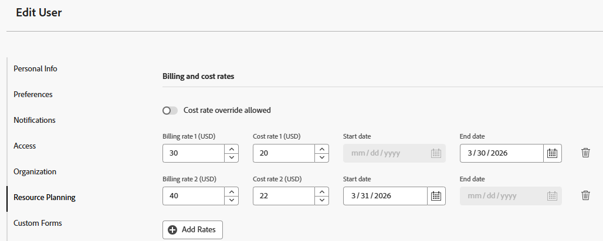
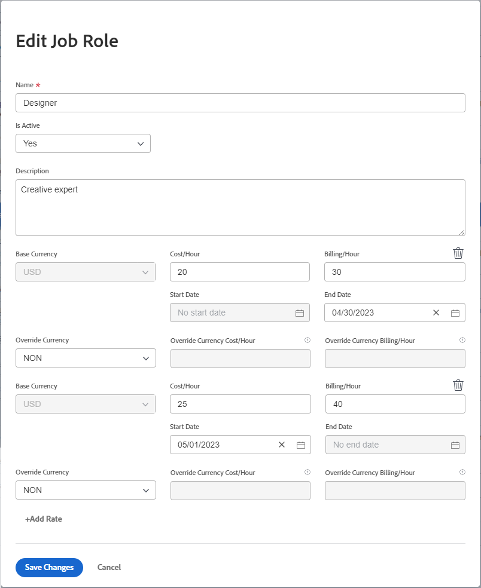

# 开单和收入概览

{{highlighted-preview}}

作为项目经理，您可以使用记帐费率来获取项目收入。

本文介绍了项目收入的跟踪。 收入的计算方式在利用率报表中有所不同。 有关利用率报表中收入计算的信息，请参阅 [查看资源利用率信息](../../../resource-mgmt/resource-utilization/view-utilization-information.md).

## 记帐费率概述

处理记帐费率时，请考虑以下事项：

* 您需要具有财务数据编辑访问权限的计划许可证以管理记帐费率。\
  有关授予对“财务数据”的访问权限的详细信息，请参见 [授予对财务数据的访问权限](../../../administration-and-setup/add-users/configure-and-grant-access/grant-access-financial.md).

* 记帐费率是与工作角色或用户关联的每个工作单位的收入额。

  将费率乘以工作花费小时数可为您的项目产生收入。

* 建立记帐费率后，您可以通过创建记帐记录来跟踪收入，以记录已记帐和未记帐的内容。

  >[!TIP]
  >
  >将开票记录标记为已开票时，无法对其进行编辑。 当费率不同并且您想要锁定项目的收入和费用信息时，这一点很重要。 将其添加到记帐记录并标记为已记帐，可防止在系统中更新费率时更新该记录。

  有关创建开票记录的更多信息，请参阅文章 [创建开票记录](../../../manage-work/projects/project-finances/create-billing-records.md).

* 您可以为用户、工作角色创建记帐费率，也可以为项目或任务创建一次性记帐费率。

>[!IMPORTANT]
>
>计算收入的费率属于记录时间的用户或其工作角色。

* [用户记帐费率](#user-billing-rates)
* [工作角色记帐费率](#job-role-billing-rates)
* [项目或任务的固定记帐费率](#fixed-billing-rates-for-projects-or-tasks)
* [覆盖记帐费率](#override-billing-rates)

### 用户记帐费率 {#user-billing-rates}

作为用户管理员，在创建用户时，您可以通过指定每小时计费字段的值以及费率的日期，将它们与日期有效的计费率相关联。

有关创建用户的更多信息，请参阅文章 [添加用户](../../../administration-and-setup/add-users/create-and-manage-users/add-users.md).

### 工作角色记帐费率 {#job-role-billing-rates}

作为Adobe Workfront管理员，在创建工作角色时，您可以通过指定每小时开单字段的值以及费率的日期，将其与日期有效的开单费率关联。

您可以使用Workfront系统的基础货币或其他自定义货币来定义工作角色记帐费率的值。

有关创建工作角色和覆盖其货币的更多信息，请参阅文章 [创建和管理职位角色](../../../administration-and-setup/set-up-workfront/organizational-setup/create-manage-job-roles.md).

### 项目或任务的固定记帐费率 {#fixed-billing-rates-for-projects-or-tasks}

除了用户和工作角色小时费率之外，您还可以使用以下固定记帐费率：

* 固定小时收入类型的固定金额
* 固定收入收入类型的固定金额

有关如何使用固定记帐费率计算收入的更多信息，请参阅 [任务收入类型概览](#overview-of-task-revenue-types).

### 覆盖记帐费率 {#override-billing-rates}

>[!IMPORTANT]
>
>您可以覆盖与工作角色关联的记帐费率。 您无法覆盖用户记帐费率或固定费率。

您可以覆盖以下工作角色记帐费率：

* 特定公司

  有关创建特定于公司的工作角色记帐费率的详细信息，请参阅 [创建和编辑公司](../../../administration-and-setup/set-up-workfront/organizational-setup/create-and-edit-companies.md).

* 特定项目

  有关创建特定于项目的工作角色计费率的更多信息，请参阅文章 [改写工作角色开单费率和计算项目收入概览](../../../manage-work/projects/project-finances/override-role-billing-rates-and-calculate-project-revenue.md).

## 跟踪收入金额

在根据任务的已计划小时数创建任务时，Workfront可以自动跟踪已计划收入。

当在任务、问题和项目上记录实际小时数时，它还可以自动跟踪实际收入。

下表显示与任务、问题和项目关联的收入类型。

<table style="table-layout:auto"> 
 <col> 
 <col> 
 <tbody> 
  <tr> 
   <td role="rowheader">计划收入</td> 
   <td> 
对于任务，这是与任务的计划小时数关联的收入。 所有任务的计划小时数累计到项目的计划小时数，有助于项目计划小时数的计算。 
 
有关Workfront中计划小时数的详细信息，请参阅 <a href="../../../manage-work/tasks/task-information/planned-hours.md" class="MCXref xref">计划小时数概述</a>. 
 
Workfront使用此公式计算任务的计划收入：

   
<code>Task Planned Revenue = Planned Hours * Billing hourly rate</code>
 
<strong>注意</strong>  公式中的开单小时费率会考虑该费率的任何日期有效更改。
 
Workfront使用以下公式计算项目的计划收入：
 
<code>Project Planned Revenue = SUM (All tasks Planned Revenue) + Fixed Revenue</code>

   
<b>注释</b>

在项目详细信息区域和项目报表中显示的项目计划收入与利用率报表中显示的计划收入不同。 
 
项目详细信息区域中的计划收入反映与任务计划小时数以及项目的固定收入关联的任务收入。 利用率报表中的计划收入仅显示与项目任务分配的计划小时数关联的计划收入。 
 
     
Example: </b>"> 
      
如果项目有1个时数为10的任务，分配给顾问时费率为$20，并且项目有$100的固定收入，则利用率报表显示计划收入$200（与任务小时数关联的计划收入）。 项目详细信息部分显示$300（任务的计划收入和项目的固定收入）。 
 
     
 
 
任务计划收入使用分配给任务的用户或工作角色的计费小时费率计算。 任务的收入类型会影响用于计算计划收入的比率（用户或角色）。 有关更多信息，请参阅本文中的以下部分：
 
    <ul> 
     <li> 
<a href="#overview-of-task-revenue-types" class="MCXref xref">任务收入类型概览</a> 
 </li> 
     <li> 
<a href="#revenue-calculations-for-tasks-based-on-user-and-role-assignments" class="MCXref xref">基于用户和角色分配的任务的收入计算</a> 
 </li> 
    </ul> 
有关利用率报表中计划收入计算的信息，请参阅 <a href="../../../resource-mgmt/resource-utilization/view-utilization-information.md" class="MCXref xref">查看资源利用率信息 </a>. 
 </td> 
  </tr> 
  <tr> 
   <td role="rowheader">实际收入*</td> 
   <td> 
与任务、问题和项目的实际小时数关联。 
 
通常，Workfront会使用以下公式计算实际收入：
 
<code>Actual Revenue = Actual Hours * Billing rate</code> 
 
<strong>注意</strong>  公式中的开单小时费率会考虑该费率的任何日期有效更改。
 
有关利用率报表中实际收入计算的信息，请参阅 <a href="../../../resource-mgmt/resource-utilization/view-utilization-information.md" class="MCXref xref">查看资源利用率信息 </a>. 
 
<b>提示</b>

您不能查看问题层的实际收入，但与问题中的实际小时数关联的收入将计入项目的实际收入。 
 </td>
</tr> 
 </tbody> 
</table>

*对于实际小时数，用户的费率始终是指记录小时数的用户或其工作角色的费率。 有关Workfront何时使用用户费率和何时使用用户工作角色费率的信息，请参阅 [收入计算](#revenue-calculations) 部分。

<!--Note from the table for Planned Revenue line: 
     
(the note below is duplicated in this article: /Content/Resource Mgmt/Resource utilization/view-utilization-information.htm and in the glossary)

    -->

例如，如果一项具有用户小时收入类型的任务计划需要2小时，而分配给它的用户的小时费率为$30/小时，则该任务的计划收入为$60。 当任务完成时，如果用户仅记录1.5小时作为完成任务所花费的实际时间，则实际收入金额为$45。 如果另一个未分配到任务的用户记录时间，则根据该用户的记帐费率计算实际收入。

您可以通过以下方式记录收入：

* 通过定义任务的收入类型，并将分配给工作项目的用户或角色与记帐费率相关联。 这将按工作项的计划小时数或实际小时数计算收入。 无论是否按小时费率收费，您都可以设置一个上限。\
  有关指定任务的收入类型的详细信息，请参阅文章 [编辑任务](../../../manage-work/tasks/manage-tasks/edit-tasks.md).

* 为任务或项目按统一固定收入费率计费。\
  如果您的任务具有固定收入，则固定收入金额将作为任务或项目的计划收入添加，任务的计划收入将作为固定收入添加到记帐记录。
* 通过为项目设置统一记帐固定收入费率，然后为项目中的任务设置小时费率。 Workfront将任务的小时费率添加到项目的统一费率。\
  例如，使用Workfront的机械师可以输入部件成本作为项目的固定收入，然后按小时对修理汽车所花费的时间计费。 然后，项目或任务的固定收入在完成时实现。

您还可以将任务标记为“不可记帐”，在这种情况下，没有与任务关联的计划或实际收入。

## 任务收入类型概览 {#overview-of-task-revenue-types}

默认情况下，所有新任务的收入类型均根据Workfront或组管理员指定的任务和问题首选项进行设置。\
有关为Workfront实例定义任务和问题首选项的更多信息，请参阅文章 [配置系统范围的任务和问题首选项](../../../administration-and-setup/set-up-workfront/configure-system-defaults/set-task-issue-preferences.md).

项目所有者可以修改任务的收入类型和项目的固定收入。\
有关指定项目的固定收入的更多信息，请参阅文章 [编辑项目](../../../manage-work/projects/manage-projects/edit-projects.md).\
有关指定任务的收入类型的详细信息，请参阅文章 [编辑任务](../../../manage-work/tasks/manage-tasks/edit-tasks.md).

您可以将以下收入类型应用于您的任务或项目：

<table border="1" cellspacing="15"> 
 <col> 
 <col> 
 <thead> 
  <tr> 
   <th> 
<strong>收入类型</strong> 
 </th> 
   <th> 
<strong>描述</strong> 
 </th> 
  </tr> 
 </thead> 
 <tbody> 
  <tr> 
   <td> 
固定收入
 </td> 
   <td> 
此类型可用于项目和任务。 
 
将模板附加到项目时，模板中的固定收入会添加到项目的固定收入。 有关信息，请参阅 <a href="../../../manage-work/projects/create-and-manage-templates/attach-template-to-project-overview.md" class="MCXref xref">将模板附加到项目的概述</a>. 
 
对于任务，无论任务分配如何，始终使用任务上指定的固定金额计算任务收入。 
 
子任务的固定收入将累计至父任务的收入，然后累计至项目的收入。 如果在父任务和/或项目上定义了固定金额，则该金额会添加到从任何子任务累计的计划收入中。
 
任务的固定收入金额可以包含在项目的记帐记录中。
 </td> 
  </tr> 
  <tr> 
   <td> 
用户小时
 </td> 
   <td> 
此类型只能用于任务。 
 
您为特定用户设置的记帐费率乘以该任务的计划小时数，即成为该任务的计划收入额。 您为特定用户设置的记帐费率乘以用户针对任务记录的小时数，即为任务的实际收入金额。  例如，如果您创建用户，并为其每小时计费字段设置$20，那么如果用户为时间表上的任务提交5小时，则该任务的实际计费金额为$100。

   
一个用户配置文件可以包含多个具有有效日期的记帐费率。 例如，第一个用户记帐费率$20于2023年4月30日结束，第二个用户记帐费率$25于2023年5月1日开始。 如果用户在4月28日提交2小时，在5月2日提交3小时用于任务，则任务的实际开单金额为$40 + $75 = $115。

   
<b>提示</b>

这是创建任务时的默认收入类型。
 </td>
</tr> 
  <tr> 
   <td> 
角色小时
 </td> 
   <td> 
此类型只能用于任务。
 
此类型类似于每小时用户数，但使用工作角色费率而不是用户费率。
 
<strong>注意</strong> 工作角色还可以具有包含有效日期的多个记帐费率。
</td> 
  </tr> 
  <tr> 
   <td> 
受限用户小时
 </td> 
   <td> 
此类型只能用于任务。
 
任务按照用户小时计费，但它们具有您可以指定的上限金额。  例如，如果用户记帐费率为$25，但任务的上限金额为$20，并且用户记录了一个小时，则任务的实际收入为$20。 
 </td> 
  </tr> 
  <tr> 
   <td> 
受限角色小时
 </td> 
   <td> 
此类型只能用于任务。
 
此类型类似于具有Cap的“每小时用户”，但使用工作角色费率而不是用户费率。 
 </td> 
  </tr> 
  <tr> 
   <td> 
用户小时加固定
 </td> 
   <td> 
此类型只能用于任务。 
 
任务按用户小时计费，但具有您可以添加到用户费率的固定金额。 在任务上指定的固定金额可以包含在项目的记帐记录中。 固定数量不会乘以任务的小时数。 只有用户计费率有效。 
 </td> 
  </tr> 
  <tr> 
   <td> 
角色小时加固定
 </td> 
   <td> 
此类型只能用于任务。 
 
任务按照角色每小时计费一次，但有一个附加的固定金额，您可以将其添加至角色费率。 在任务上指定的固定金额可以包含在项目的记帐记录中。 固定数量不会乘以任务的小时数。 只有工作角色记帐费率有效。 
 </td> 
  </tr> 
  <tr> 
   <td> 
固定小时
 </td> 
   <td> 
此类型只能用于任务。
 
您为任务设置的上限或固定金额乘以针对任务输入的小时数（无论用户或其职位角色如何）即是计费金额。
 </td> 
  </tr> 
  <tr> 
   <td> 
不可记帐
 </td> 
   <td> 
此类型只能用于任务。
 
此收入类型对收入没有影响。 
 
如果父对象具有此设置，则仍会正常应用具有计费类型的子任务。
 
当对财务数据没有访问权限的用户或对模板没有财务权限的用户从该模板创建项目时，这是项目上任务的默认收入类型。
 
有关访问财务数据的信息，请参阅文章 <a href="../../../administration-and-setup/add-users/configure-and-grant-access/grant-access-financial.md" class="MCXref xref">授予对财务数据的访问权限</a>. 有关对象的财务权限的信息，请参阅文章 <a href="../../../workfront-basics/grant-and-request-access-to-objects/sharing-permissions-on-objects-overview.md" class="MCXref xref">对象权限共享概述</a>. 有关从模板创建项目的信息，请参阅文章 <a href="../../../manage-work/projects/create-projects/create-project-from-template.md" class="MCXref xref">使用模板创建项目</a>. 
 </td> 
  </tr> 
 </tbody> 
</table>

## 父任务的收入概览

如果将具有开单信息的独立任务更改为父任务，则新的父任务仍会保留以前应用的任何开单信息，以及以前应用的小时数。 来自记录到子任务小时数的任何计费信息将作为实际收入汇总到新的父任务中。

子任务的计划收入也会累计到父任务。

## 问题收入概述

问题没有计划或实际收入额，但它们可以具有实际成本。

如果您记录问题的小时数，并使用标记为“计为收入”的小时类型，则Workfront会根据登录该时间的用户的费率计算实际成本金额。 此数字将添加到项目的实际成本。 小时数也可以包含在开票记录中。

有关跟踪成本的更多信息，请参阅文章 [跟踪成本](../../../manage-work/projects/project-finances/track-costs.md).

有关小时类型的更多信息，请参阅文章 [管理小时类型](../../../administration-and-setup/set-up-workfront/configure-timesheets-schedules/hour-types.md).

## 收入计算

* [基于用户和角色分配的任务的收入计算](#revenue-calculations-for-tasks-based-on-user-and-role-assignments)

### 基于用户和角色分配的任务的收入计算 {#revenue-calculations-for-tasks-based-on-user-and-role-assignments}

在计算任务的收入时，请考虑以下事项：

* 如果用户或工作角色显示费率$0.00，Workfront会将其读取为有效金额，然后将该金额乘以任务中的小时数来计算收入。 如果要不显示任务的收入，请确保用户或工作角色的记帐费率的字段为空。
* 应用工作角色记帐费率时，Workfront使用项目层的覆盖费率，而不是每次在项目上有覆盖费率时在系统层定义的该角色的记帐费率。
* 对于实际收入，如果用户或工作角色具有多个具有有效日期的记帐费率，则任务收入是用户已记录时间的每个时间期间的收入总和。 计划收入基于时间期的计划小时数。
* 如果任务中有多个被分配人，则以下列出的方案适用于每个被分配人。

有一个基于任务分配的收入计算中使用的费率的层次结构。

如果您的Workfront管理员启用了 **手动将工作角色分配给小时条目** 时间表和小时偏好设置区域中的设置，并且项目的用户记录时间选择不同的角色来与此时间关联，则任务或项目的实际收入始终根据与小时条目关联的角色进行计算。 有关为特定工作角色启用日志记录时间的信息，请参阅文章 [时间表和小时首选项](../../../administration-and-setup/set-up-workfront/configure-timesheets-schedules/timesheet-and-hour-preferences.md).

根据收入类型和任务分配的性质计算任务收入时，存在以下方案：

* **任务的收入类型为“每小时用户”**

  <table style="table-layout:auto"> 
   <col> 
   <col> 
   <col> 
   <col> 
   <tbody> 
    <tr> 
     <td role="rowheader">记帐/小时费率</td> 
     <td>无分配</td> 
     <td>用户分配</td> 
     <td>工作角色分配</td> 
    </tr> 
    <tr> 
     <td role="rowheader">计划收入的每小时记帐费率</td> 
     <td>$0.00</td> 
     <td> 如果用户档案中有记帐费率，则该费率用于计算计划收入。 否则，将使用其主要工作角色的系统记帐费率。  
<b>注意</b>  可以将用户与其辅助工作角色之一分配给任务，但此处改为使用主要工作角色的速率。

如果在分配期间用户的角色发生了变化，则在重新计算项目财务时将应用正确的费率。
</td> 
     <td>
如果已将费率卡附加到项目，则根据费率卡中的工作角色计算计划收入。
 
可以在项目级别覆盖记帐费率。
</td> 
    </tr> 
    <tr> 
     <td role="rowheader">实际收入的每小时记帐费率</td> 
     <td>如果记录小时数的用户在其配置文件中具有记帐费率，则会使用该费率。 
      当在高级分配中具有特定于位置分配的用户或角色记录时间时，将使用位置的费率。
      否则，将使用其主要工作角色的记帐费率。 如果没有与用户或其主要角色关联的记帐费率，则实际收入为$0.00。  
<b>注释</b>

  计算时只考虑与记录时间的用户关联的费率，即使将另一个用户分配给任务也是如此。
</td>
  <td>如果记录小时数的用户在其配置文件中具有记帐费率，则会使用该费率。  当在高级分配中具有特定于位置分配的用户或角色记录时间时，将使用位置的费率。 否则，将使用其主要工作角色的记帐费率。 如果没有与用户或其主要角色关联的记帐费率，则实际收入为$0.00。  
<b>注释</b>

  计算时只考虑与记录时间的用户关联的费率，即使将另一个用户分配给任务也是如此。
</td>
  <td>如果记录小时数的用户在其配置文件中具有记帐费率，则会使用该费率。 否则，将使用其主要工作角色的记帐费率。 
<b>注释</b>

  如果用户日志记录时间没有关联的计费率，并且他们没有工作角色或其工作角色的计费率，则使用与任务关联的工作角色的费率。 如果此角色没有记帐费率，则收入为$0.00
</td>
  </tr> 
   </tbody> 
  </table>

* **任务的收入类型为每小时角色**

  <table style="table-layout:auto"> 
   <col> 
   <col> 
   <col> 
   <col> 
   <tbody> 
    <tr> 
     <td role="rowheader">记帐/小时费率</td> 
     <td>无分配</td> 
     <td>用户分配</td> 
     <td>工作角色分配</td> 
    </tr> 
    <tr> 
     <td role="rowheader">计划收入的每小时记帐费率</td> 
     <td>$0.00</td> 
     <td>
Workfront查看用户在任务中履行的工作角色以计算计划收入。  如果用户未与任务中的任何角色关联，则收入为$0.00。
 
<strong>注意</strong> 如果在分配期间用户的角色发生了变化，则在重新计算项目财务时将应用正确的费率。
 </td> 
     <td>
如果已将费率卡附加到项目，则根据费率卡中的工作角色计算计划收入。
 
可以在项目级别覆盖记帐费率。
</td> 
    </tr> 
    <tr> 
     <td role="rowheader">实际收入的每小时记帐费率</td> 
     <td>Workfront使用记录时间的用户的主要工作角色的计费率。  当在高级分配中具有特定于位置分配的用户或角色记录时间时，将使用位置的费率。  如果记录时间的用户没有与其关联的工作角色，或者如果主要工作角色没有记帐费率，则实际收入为$0.00。 </td> 
     <td> 如果将记录时间的用户分配给任务，则使用与任务中的用户相关联的工作角色的记帐费率来计算实际收入。  当在高级分配中具有特定于位置分配的用户或角色记录时间时，将使用位置的费率。  否则，将使用其主要工作角色的记帐费率。 如果用户没有主要工作角色，或其主要工作角色没有记帐费率，则实际收入为$0.00。 </td> 
     <td>如果为该任务分配了记录时间的用户的某个工作角色，则使用该工作角色费率。 如果分配给任务的工作角色未与记录时间的用户关联，则使用用户主要角色的记帐费率计算实际收入。 如果用户没有工作角色，或者没有与其主要工作角色关联的费率，则使用分配给任务的工作角色的费率。 </td> 
    </tr> 
   </tbody> 
  </table>

<!--

Ideal table but does not come across Markdown

<table style="table-layout:auto">
<col>
<col>
<col>
<col>
<col>
<col>
<col>
<tbody>
<tr>
<td colspan="3">Revenue Type = User Hourly</td>
<td colspan="4">Revenue Type = Role Hourly</td>
</tr>
<tr>
<td> 
 
 </td>
<td> 
<strong>No Assignment</strong> 
 </td>
<td> 
<strong>User Assignment</strong> 
 </td>
<td> 
<strong>Job Role Assignment</strong> 
 </td>
<td> 
<strong>No Assignment</strong> 
 </td>
<td> 
<strong>User Assignment</strong> 
 </td>
<td> 
<strong>Job Role Assignment</strong> 
 </td>
</tr>
<tr>
<td> 
<strong>Billing per hour rate for Planned Revenue</strong> 
 </td>
<td> 
$0.00
 </td>
<td> 
 If a user has a billing rate in their profile, then that rate is used to calculate Planned Revenue. Otherwise, the system billing rate of their primary job role is used.  <note type="note">
The user can be assigned to the task with one of their secondary job roles, but the rate of the primary job role is used here instead.
</note>
 </td>
<td> 
 The system billing rate of the job role assigned to the task is used to calculate Planned Revenue. 
 </td>
<td> 
$0.00
 </td>
<td> 
Workfront looks at the job role that the user fulfills on the task to calculate the Planned Revenue.  If the user is not associated with any role on the task, the Revenue is $0.00. 
 </td>
<td> 
The billing rate of the job role assigned to the task is used to calculate Planned Revenue. 
 
 
 
 
 </td>
</tr>
<tr>
<td> 
<strong>Billing per hour rate for Actual Revenue</strong> 
 </td>
<td colspan="2"> 
If the user logging the hours has a billing rate in their profile, that rate is used.  Otherwise, the billing rate of their primary job role is used. If there is no billing rate associated with the user or their primary role, the Actual Revenue is $0.00.  <note type="note">
Only the rates associated with the user logging the time are taken into account for the calculation, even when another user is assigned to the task.
</note>
 </td>
<td> If the user logging the hours has a billing rate in their profile, that rate is used. Otherwise, the billing rate of their primary job role is used. <note type="note">
If the user logging time has no billing rate associated with them, and they do not have a job role or a billing rate for their job role, then the rate from the job role associated with the task is used. If there is no billing rate for this role, the revenue is $0.00
</note></td>
<td> 
Workfront uses the billing rate of the primary job role of the user logging the time.  If the user logging the time has no job role associated with them, or if the primary job role has no billing rate, the Actual Revenue is $0.00. 
 </td>
<td> 
 If the user logging the time is assigned to the task, the billing rate of the job role associated with the user on the task is used to calculate the Actual Revenue. Otherwise, the billing rate of their primary job role is used. If the user has no primary job role or if their primary job role has no billing rate, the Actual Revenue is $0.00. 
 </td>
<td> 
If one of the job roles of the user logging the time is assigned to the task, that job role rate is used. If the job role assigned to the task is not associated with the user logging the time, then the billing rate of the primary role of the user is used to calculate the Actual Revenue. If the user does not have a job role or there is no rate associated with their primary job role, then the rate of the job role assigned to the task is used. 
 </td>
</tr>
</tbody>
</table>

-->

### 项目的收入计算

您可以跟踪项目的以下收入类型：

* 项目的计划收入按以下公式计算：

  `Project Planned Revenue = SUM(Task Planned Revenue)+ Fixed Revenue`

  有关如何计算任务计划收入的信息，请参阅 [基于用户和角色分配的任务的收入计算](#revenue-calculations-for-tasks-based-on-user-and-role-assignments) 部分。

* 项目的实际收入按以下公式计算：

  `Project Actual Revenue = SUM (Task Actual Revenue) + (Hours logged for the project x User Billing per Hour Rate) + SUM (Hours logged for the issues x User Billing per Hour rate)`

有关如何计算任务实际收入的信息，请参阅 [基于用户和角色分配的任务的收入计算](#revenue-calculations-for-tasks-based-on-user-and-role-assignments) 部分。

对于与直接记录到项目或问题的小时数关联的实际收入，Workfront使用记录项目时间的用户的记帐费率。 如果用户没有与其配置文件关联的记帐费率，Workfront将使用其主要工作角色的记帐费率。 如果两个费率均为零，则与项目或问题记录的小时数关联的实际收入为零。
