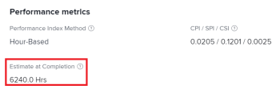

# 计算完工估算(EAC)

<!--
<p data-mc-conditions="QuicksilverOrClassic.Draft mode">(NOTE: Linked to the product. Do not change link!) </p>
-->

作为性能量度，完工估算(EAC)表示项目或任务完工后的预计总成本。

作为一项设置，它允许您定义应如何计算EAC值。 

## 访问要求

您必须具有以下权限才能执行本文中的步骤：

<table style="table-layout:auto"> 
 <col> 
 <col> 
 <tbody> 
  <tr> 
   <td role="rowheader">Adobe Workfront计划*</td> 
   <td> <p>任何</p> </td> 
  </tr> 
  <tr> 
   <td role="rowheader">Adobe Workfront许可证*</td> 
   <td> <p>审核或更高</p> </td> 
  </tr> 
  <tr> 
   <td role="rowheader">访问级别配置*</td> 
   <td> <p>查看对项目和财务数据的访问权限</p> <p><b>注释</b>

如果您仍然没有访问权限，请咨询Workfront管理员是否对您的访问级别设置了其他限制。 有关Workfront管理员如何修改您的访问级别的信息，请参阅<a href="../../../administration-and-setup/add-users/configure-and-grant-access/create-modify-access-levels.md" class="MCXref xref">创建或修改自定义访问级别</a>。</p> </td>
</tr> 
  <tr> 
   <td role="rowheader">对象权限</td> 
   <td> <p>具有查看财务的权限的项目的查看权限或更高权限</p> <p>有关请求其他访问权限的信息，请参阅<a href="../../../workfront-basics/grant-and-request-access-to-objects/request-access.md" class="MCXref xref">请求访问对象</a>。</p> </td> 
  </tr> 
 </tbody> 
</table>

&#42;要了解您拥有什么计划、许可证类型或访问权限，请与Workfront管理员联系。

## 定义如何计算EAC

作为项目系统首选项的一部分，Adobe Workfront管理员可以定义如何计算EAC。 可通过以下两种方法之一计算EAC：

* [在项目级别计算](#calculate-at-the-project-level)
* [从任务和子任务汇总](#roll-up-from-tasks-and-subtasks)

有关在Workfront中设置项目首选项的更多信息，包括如何计算完工估算，请参阅[配置系统范围的项目首选项](../../../administration-and-setup/set-up-workfront/configure-system-defaults/set-project-preferences.md)。

作为项目经理，您还可以在项目的财务子选项卡中的项目级别更改此首选项。 有关编辑项目财务子选项卡的详细信息，请参阅[管理项目财务区域的信息](../../../manage-work/projects/project-finances/manage-project-finance-area.md)。

### 在项目级别计算 {#calculate-at-the-project-level}

在EAC公式中输入实际小时数/实际人工成本来确定父任务和项目的EAC。 此计算包括直接添加到父任务或项目的实际小时数/成本和费用。

### 从任务和子任务汇总 {#roll-up-from-tasks-and-subtasks}

父任务和项目的EAC通过汇总每个子任务的EAC来确定。 此计算不包括直接添加到父任务或项目的实际小时数/成本和费用。

## 如何基于性能指标法(PIM)计算EAC

在Workfront中，EAC的计算取决于项目选择的绩效指数方法(PIM)。 有关为系统或项目设置PIM的详细信息，请参阅[设置绩效指数方法(PIM)](../../../manage-work/projects/project-finances/set-pim.md)。

* [使用基于小时的PIM计算EAC](#calculate-eac-using-hour-based-pim)
* [使用基于成本的PIM计算EAC](#calculate-eac-using-cost-based-pim)

### 使用基于小时的PIM计算EAC {#calculate-eac-using-hour-based-pim}

```
EAC = Total Planned Hours / CPI*
```

&#42;如果成本绩效指数[计算成本绩效指数(CPI)](../../../manage-work/projects/project-finances/calculate-cpi.md) = 0，则EAC =总计划小时数+实际小时数。 当已捕获小时数，但项目/任务已完成0%时，会发生这种情况。

有关计算CPI的详细信息，请参阅[计算成本绩效指数(CPI)](../../../manage-work/projects/project-finances/calculate-cpi.md)。

### 使用基于成本的PIM计算EAC {#calculate-eac-using-cost-based-pim}

使用以下公式计算项目的EAC：

```
EAC = EAC Labor + EAC Expense 
```

<pre>EAC人工=  <em>IF</em> CPI人工&lt;&gt; 0 THEN EAC人工=计划人工成本/ CPI人工</pre><pre><em>ELSE</em> EAC  人工=计划人工成本+实际人工成本</pre><pre>CPI劳力=如果实际劳力成本&lt;&gt; 0，则CPI劳力=已执行的预算成本总计/实际劳力成本</pre><pre>否则，CPI人工= 1 </pre>计算EAC时，考虑以下字段：

* 已执行的总预算成本工作(BCWP) =计划工作的预算成本（预算成本）与迄今为止已完成任务的百分比相乘的结果。

  有关已执行总预算成本工作(BCWP)的信息，请参阅[计算已执行预算成本工作(BCWP)](../../../manage-work/projects/project-finances/calculate-bcwp.md)。

   * **对于非父级任务：**

     ```
     Total Budgeted Cost Work Performed = Planned Hours * (Percent Complete/100)
     ```

   * **对于父任务：**
已执行的总预算成本工作=所有直接子任务的“已执行的总预算成本工作”字段的总和。

   * 项目&#x200B;**：**
已执行的预算成本工时总计=所有顶层任务（父任务和独立任务）的已执行预算成本工时总计字段的总和。 

* EAC费用=将已发生的实际费用成本添加到未发生的计划费用成本的结果。 计算公式如下：

  ```
  EAC Expense = Incurred Actual Expense Cost + Not Incurred Planned Expense
  ```

   * 发生的实际费用成本=所有费用的“计划金额”字段之和，其中“实际金额”字段> 0。 例如，如果您为任务1创建费用，并在“计划金额”字段中输入$500.00，在“实际金额”字段中输入> 0的金额（即$600.00），则此任务的已发生计划费用成本为$500.00。
   * 未发生计划费用=所有费用的“实际金额”字段= 0的“计划金额”字段之和。 例如，如果您为任务1创建两个费用，其中第一个费用的“计划金额”字段中的值为$500.00，实际金额中的值为$600.00，第二个费用的“计划金额”字段中的值为$300.00，实际金额字段的值为$0.00，则此任务的“未发生的计划费用”值为$300.00。 

## 在项目或任务中找到EAC

1. 转到要在其中查看EAC的项目或任务。
1. 在项目或任务的左侧面板中展开&#x200B;**项目详细信息**&#x200B;或&#x200B;**任务详细信息**，具体取决于您查看EAC的位置。

1. 单击&#x200B;**财务**。 

   EAC值显示在&#x200B;**完工估算**&#x200B;字段中。

   
