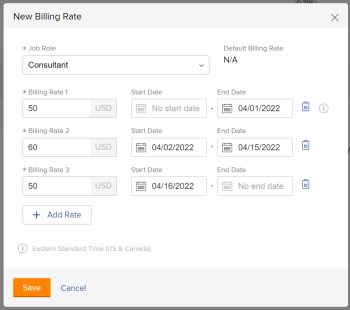

# 改写工作角色开单费率和计算项目收入概览

{{highlighted-preview}}

当记帐费率乘以项目所花费的小时数时，可以使用记帐费率计算项目收入。 有关记帐费率和收入的更多信息，请参阅文章[记帐和收入概览](../../../manage-work/projects/project-finances/billing-and-revenue-overview.md)。

<!--
<div data-mc-conditions="QuicksilverOrClassic.Draft mode">
<p>(NOTE: drafted because the only procedure here was moved to a different article.&nbsp;This stays as an overview)</p>
<h2>Access requirements</h2>
<p>You must have the following access to perform the steps in this article:</p>
<table style="table-layout:auto">
<col>
<col>
<tbody>
<tr>
<td role="rowheader">Adobe Workfront plan*</td>
<td> <p>Any</p> </td>
</tr>
<tr>
<td role="rowheader">Adobe Workfront license*</td>
<td> <p>Plan </p> </td>
</tr>
<tr>
<td role="rowheader">Access level configurations*</td>
<td> <p>Edit access to Projects and Financial&nbsp;Data</p> <note type="note">
If you still don't have access, ask your Workfront administrator if they set additional restrictions in your access level. For information on how a Workfront administrator can modify your access level, see
<a href="../../../administration-and-setup/add-users/configure-and-grant-access/create-modify-access-levels.md" class="MCXref xref">Create or modify custom access levels</a>.
</note> </td>
</tr>
<tr>
<td role="rowheader">Object permissions</td>
<td> <p>Manage permissions to the project with permissions to Manage Finance</p> <p>For information on requesting additional access, see <a href="../../../workfront-basics/grant-and-request-access-to-objects/request-access.md" class="MCXref xref">Request access to objects </a>.</p> </td>
</tr>
</tbody>
</table>
<p>*To find out what plan, license type, or access you have, contact your Workfront administrator.</p>
</div>
-->

## 工作角色开单费率和角色每小时收入类型概览

作为Adobe Workfront管理员，您可以将记帐费率与用户和职位角色关联。\
有关创建用户并将其与记帐费率关联的更多信息，请参阅文章[添加用户](../../../administration-and-setup/add-users/create-and-manage-users/add-users.md)。 有关创建工作角色并将其与记帐费率关联的更多信息，请参阅文章[创建和管理工作角色](../../../administration-and-setup/set-up-workfront/organizational-setup/create-manage-job-roles.md)。

无法覆盖与用户关联的记帐费率。

可以在公司或项目级别覆盖与工作角色关联的记帐费率。

要根据工作角色的记帐费率计算项目收入，项目任务的&#x200B;**收入类型**&#x200B;必须是以下之一：

* 角色每小时
* 受限角色小时
* 角色小时加固定

有关&#x200B;**收入类型**&#x200B;和记帐费率的详细信息，请参阅[记帐和收入概览](../../../manage-work/projects/project-finances/billing-and-revenue-overview.md)。

## 计算收入时记帐费率覆盖的层次结构

工作角色可以通过以下方式与其关联记帐费率：

* 作为Workfront管理员，您可以在创建工作角色时定义与工作角色关联的系统级别记帐费率。\
  有关创建工作角色的更多信息，请参阅[创建和管理工作角色](../../../administration-and-setup/set-up-workfront/organizational-setup/create-manage-job-roles.md)。

* 作为Workfront管理员，您可以在创建公司时为同一工作角色定义公司级别的记帐费率。\
  当Workfront计算与此公司关联的项目的收入时，将角色分配给任务时使用公司记帐费率，而不是此工作角色的系统级记帐费率。\
  公司级别更改的工作角色费率将影响与该公司关联的所有项目。

  >[!NOTE]
  >
  >如果您需要更新公司记帐费率，项目费率不会自动更新。 您必须先从项目中移除公司，更新公司的费率，然后将公司重新附加到项目中，然后新的公司费率才能对项目生效。 有关将公司附加到项目的说明，请参阅[编辑项目](../../../manage-work/projects/manage-projects/edit-projects.md)。

  有关创建特定于公司的工作角色记帐费率的详细信息，请参阅[创建和编辑公司](../../../administration-and-setup/set-up-workfront/organizational-setup/create-and-edit-companies.md)。

* 作为Workfront管理员，您可以在编辑项目时启用一个选项，以便在用户手动重新计算项目财务时将更改应用到项目中的公司级别记帐费率。\
  有关详细信息，请参阅[用公司级别的记帐费率覆盖项目级别的记帐费率](../../../manage-work/projects/project-finances/override-project-level-with-company-level-billing-rates.md)。

<div class="preview">

* 作为Workfront管理员，您可以根据位置和日期定义每个角色具有多个计费费率的费率卡。 将费率卡附加到项目后，所有角色（如果使用位置，则按位置）及其关联的记帐费率将添加到项目的记帐费率部分。 附加费率卡会覆盖项目上的任何现有记帐费率。

  有关详细信息，请参阅[管理费率卡](/help/quicksilver/administration-and-setup/set-up-workfront/configure-system-defaults/manage-rate-cards.md)和[将费率卡附加到项目](/help/quicksilver/manage-work/projects/project-finances/attach-rate-card-to-project.md)。

</div>

* 作为项目经理，您可以在项目层为相同工作角色定义开单费率。\
  项目上工作角色费率的更改将仅影响该项目。

  有关覆盖项目角色费率的信息，请参阅[覆盖项目级别的工作角色记帐费率](../../../manage-work/projects/project-finances/override-job-role-billing-rates-at-the-project-level.md)。

>[!IMPORTANT]
>
>如果工作角色在系统层、公司层和项目层与开单费率关联，Workfront则在使用工作角色费率时，使用项目层工作角色的开单费率计算任务的收入。 所有任务的收入将累计到项目的收入。

## 覆盖项目级别的工作角色记帐费率

作为项目经理，您可以指定特定项目上工作角色的记帐费率。 此项目级别的记帐费率将覆盖此工作角色的系统级别的记帐费率。 Workfront使用工作角色的项目级别记帐费率来计算收入，而不是使用系统级别的记帐费率。

<span class="preview">您还可以向项目附加费率卡，它将工作角色记帐费率从费率卡导入到项目中。</span>

有关如何覆盖项目级别的工作角色记帐费率的信息，请参阅[覆盖项目级别的工作角色记帐费率](../../../manage-work/projects/project-finances/override-job-role-billing-rates-at-the-project-level.md)。

有关使用哪个工作角色计算项目收入的更多信息，请参阅[账单和收入概览](../../../manage-work/projects/project-finances/billing-and-revenue-overview.md)中的“基于用户和角色分配的任务收入计算”部分。 <span class="preview">有关将费率卡附加到项目的信息，请参阅[将费率卡附加到项目](/help/quicksilver/manage-work/projects/project-finances/attach-rate-card-to-project.md)。</span>

>[!NOTE]
>
>在实际收入中，应用到标记为已记帐的记帐记录的小时数的记帐费率，不应受记帐记录记帐后发生的记帐费率覆盖的影响。

<!--
<div data-mc-conditions="QuicksilverOrClassic.Draft mode">
<p>(NOTE: drafted and linked above to the stand-alone article for overriding billing rates on projects.)</p>
<p>You can override the billing rate of a job role on a project in the following ways:</p>
<ul>
<li>One time, by selecting a new rate for the job role.<br>The new rate is used for the entire duration of the project, to calculate revenue. </li>
</ul>
<ul>
<li>Several times, by selecting several new rates for specific date ranges. <br>A different rate can be used during each specified date range.</li>
</ul>
<p>To override a billing rate for a project:</p>
<ol>
<li value="1">Go to the project you want to override billing rates for.</li>
<li value="2"> <p data-mc-conditions="QuicksilverOrClassic.Quicksilver">Click <strong>Billing Rates</strong> in the left panel. You might have to first click <strong>Show More</strong>. </p> </li>
<li value="3"> <p>Click <strong>Add Billing Rate</strong> > <strong>New Billing Rate</strong>.</p> <p>The New Billing Rate box opens</p> <p>  </p> <p> <br>The <strong>Default Billing Rate</strong> field displays the system-level rate for this job role.</p> </li>
<li value="4">In the <strong>Job Role</strong> field, select the job role you want to change the billing rate for.<br></li>
<li value="5">In the <strong>Billing Rates 1</strong> field, enter the one time billing rate override, then click <strong>Save</strong> to override the billing rate one time, <br>Or Click <strong>Add Rate</strong> to add more billing rate overrides.</li>
<li value="6">(Conditional) If you are adding more than one billing rate override, specify the following information:<br>- <strong>Billing Rates 1</strong>: the value of the Billing Rate from the beginning of the project to the first date of the first override. This is typically the same amount as the <strong>Default Rate</strong>.<br>- <strong>Start Date</strong>: this is the date when the Default Rate ends.<br>- <strong>End Date</strong>: the date when the new billing rate override ends. <br>Workfront applies the override job role rate to the hours that occur during the time frames specified when calculating revenue on the project.<br>There should be no gaps between the time frames of two override rates. The <strong>Start Date</strong> of an override rate should be the day immediately following the <strong>End Date</strong> of the previous override date.<br><note type="note">
You cannot specify a
<strong>Start Date</strong> for the first override rate, nor an
<strong>End Date</strong> for the last override rate. We recommend that you use the Default Rate for the first override rate.
<br>Workfront assumes that the first override rate is applied for all hours with a date older than the
<strong>End Date</strong> of the first override, and that the last override rate is applied for all hours with a date newer than the
<strong>Start Date</strong> of the last override.
<br>If an hour is logged before the Planned Start Date of the project the very first billing rate is used.
<br>If an hour is logged after the Planned Completion Date of the project the very last billing rate is used.
</note><br></li>
<li value="7">Click <strong>Save</strong>.</li>
</ol>
</div>
-->

## 项目的“记帐费率”部分概述

在为与项目关联的工作角色指定覆盖记帐费率后，您可以在项目的&#x200B;**记帐费率**&#x200B;选项卡中看到所有工作角色及其覆盖。

请注意&#x200B;**记帐费率**&#x200B;列表中的以下信息：

* [工作角色分组](#job-role-grouping)
* [项目记帐费率值](#project-billing-rate-value)
* [默认记帐费率值](#default-billing-rate-value)
* [公司记帐费率值](#company-billing-rate-value)
* [多个记帐费率值和时间范围](#multiple-billing-rate-values-and-timeframes)

### 工作角色分组 {#job-role-grouping}

记帐费率在&#x200B;**记帐费率**&#x200B;区域按其各自的工作角色分组。 <span class="preview">如果为项目附加了费率卡，则工作角色也将按费率卡分组。 如果将位置应用于工作角色，则位置名称会作为工作角色名称的一部分包括在内。 您可以为多个位置列出相同的工作角色。</span>

### 项目记帐费率值 {#project-billing-rate-value}

在与工作角色对应的分组行中，注意&#x200B;**项目记帐费率**&#x200B;列中项目级别该工作角色的记帐费率。 如果工作角色具有多个覆盖率，则对应于当前日期的覆盖率将显示在&#x200B;**项目记帐费率**&#x200B;列的分组行中。

### 默认记帐费率值 {#default-billing-rate-value}

在工作角色的分组行中，注意&#x200B;**默认记帐费率**&#x200B;列中系统级别上该工作角色的记帐费率。

>[!NOTE]
>
>如果工作角色存在项目记帐费率，则绝不会将&#x200B;**默认记帐费率**&#x200B;应用于计算项目的收入。 仅应用&#x200B;**项目记帐费率**&#x200B;来计算收入。

### 公司记帐费率值 {#company-billing-rate-value}

在工作角色的分组行中，注意&#x200B;**公司记帐费率**&#x200B;列中公司级别上该工作角色的记帐费率。 这意味着有一个公司与此项目关联，并且此工作角色对该公司具有不同的记帐费率。 此时将显示公司的记帐费率，即使它与项目费率相同。

>[!NOTE]
>
><span class="preview">将费率卡附加到项目时，**公司记帐费率**&#x200B;未在记帐费率中导入。 计算基于工作角色的费率卡费率或公司费率。</span>
>
>如果工作角色存在项目记帐费率，则绝不会将&#x200B;**公司记帐费率**&#x200B;应用于计算项目的收入。 仅应用&#x200B;**项目记帐费率**&#x200B;来计算收入。

### 多个记帐费率值和时间范围 {#multiple-billing-rate-values-and-timeframes}

如果某个特定工作角色具有多个覆盖记帐费率，则会在该工作角色的分组下列出这些费率。 使用内联编辑，您可以在此选项卡上更改覆盖费率以及覆盖计费费率的&#x200B;**开始** **日期**&#x200B;和&#x200B;**结束日期**。

>[!NOTE]
>
>您不能为第一个覆盖率指定&#x200B;**开始日期**，也不能为最后一个覆盖率指定&#x200B;**结束日期**。 Workfront假定第一个覆盖率适用于日期早于第一个覆盖的&#x200B;**结束日期**&#x200B;的所有小时，最后一个覆盖率适用于日期早于上次覆盖的&#x200B;**开始日期**&#x200B;的所有小时。\
>如果在项目的计划开始日期之前记录了一个小时，则使用第一个记帐费率。\
>如果在项目的计划完成日期后记录了一个小时，则使用最后一个记帐费率。

## 计算计划收入

* [根据一次性记帐费率覆盖计算计划收入](#calculate-planned-revenue-based-on-a-one-time-billing-rate-override)
* [根据多个记帐费率覆盖计算计划收入](#calculate-planned-revenue-based-on-multiple-billing-rate-overrides)
* [在任务持续时间内的计划小时数分布](#distribution-of-planned-hours-across-the-duration-of-a-task)

### 根据一次性记帐费率覆盖计算计划收入 {#calculate-planned-revenue-based-on-a-one-time-billing-rate-override}

在基于一次性记帐费率覆盖计算计划收入时，请考虑以下事项：

* 当任务的&#x200B;**收入类型**&#x200B;为&#x200B;**角色每小时**&#x200B;时，Workfront将任务的计划小时数乘以与任务关联的工作角色的记帐费率来计算任务的计划收入。

* 在项目级别覆盖工作角色的记帐费率后，Workfront使用项目的覆盖费率计算计划收入。
* 当任务有多个分配时，计划收入的计算方法是将每个分配的工作角色的记帐费率乘以它们各自的计划小时数分配。

>[!NOTE]
>
>在多个分配的情况下，每个分配的计划小时数与任务的计划小时数不同。

有关使用哪个工作角色计算计划收入的更多信息，请参阅[账单和收入概览](../../../manage-work/projects/project-finances/billing-and-revenue-overview.md)一文中的“了解基于用户和角色分配的任务收入计算”部分。

### 根据多个记帐费率覆盖计算计划收入 {#calculate-planned-revenue-based-on-multiple-billing-rate-overrides}

在基于多个开单费率改写计算计划收入时，请考虑以下事项：

* 当任务的&#x200B;**收入类型**&#x200B;为&#x200B;**角色每小时**&#x200B;时，Workfront将任务的计划小时数乘以与任务关联的工作角色的记帐费率来计算任务的计划收入。

  有关使用哪个工作角色计算计划收入的更多信息，请参阅[账单和收入概览](../../../manage-work/projects/project-finances/billing-and-revenue-overview.md)一文中的“了解基于用户和角色分配的任务收入计算”部分。

* 如果覆盖了多个记帐费率，则在任务持续时间内，计划小时数乘以更改的比率。 默认情况下，Workfront在任务持续时间中平均分配已计划小时数，每天为任务分配相同小时数。 在计算&#x200B;**计划收入**&#x200B;时，Workfront将每天计划小时数乘以当天的记帐费率。 如果计费率有多个，则该费率每天可能都不相同。

  例如，您有一个任务具有每小时&#x200B;**角色收入类型**。 该任务的持续时间为5天，计划小时数的值为40小时。 每天的计划小时数为8小时。 将项目经理工作角色分配给任务，并覆盖此工作角色在任务的最后3天的记帐费率，因此您将使用此工作角色在前两天的费率1记帐费率，在任务的最后3天的费率2记帐费率。

  计算此任务的&#x200B;**计划收入**&#x200B;的公式为：

  ```
  Planned Revenue = (Rate 1) * (Planned Hours for Day 1) + (Rate 1) * (Planned hours for Day 2) + (Rate 2) * (Planned hours for Day 3) + (Rate 2) * (Planned hours for Day 4) + (Rate 2) * (Planned hours for Day 5)
  ```

有关在Workfront中查找每日计划小时数的详细信息，请参阅本文中的[任务持续时间中的计划小时数分布](#distribution-of-planned-hours-across-the-duration-of-a-task)部分。

>[!NOTE]
>
>如果任务有多个被分配人，则计划小时数将首先分配给每个被分配人，然后在任务持续期间分配给每一天。 在此情况下，计划收入的计算将考虑每个被分配人的每日小时数以及每个工作角色的记帐费率，在存在多个记帐费率的情况下，该费率在任务持续期间可能会更改。

### 在任务持续时间内的计划小时数分布 {#distribution-of-planned-hours-across-the-duration-of-a-task}

在了解任务持续时间中计划小时数分布时，请考虑以下事项：

* 默认情况下，Workfront在任务持续时间中平均分配已计划小时数，根据项目计划的可用性为任务每天分配相同数量的已计划小时数。

  有关了解任务持续时间中计划小时数分布的更多信息，请参阅文章[计划小时数概述](../../../manage-work/tasks/task-information/planned-hours.md)中的“了解任务持续时间中计划小时数的分布”部分。

  >[!NOTE]
  >
  >每日计划小时数是任务持续时间中每天的计划小时数的分配。 如果任务具有一个分配，则此数字还表示每个分配的每日计划小时数。 如果任务有多个分配，则每个分配的每日计划小时数与任务的每日计划小时数不同。 对于具有多个分配的任务，Workfront中每个分配的每日计划小时数没有可视化表示形式。
  >
  >
  >每日计划小时数乘以当天分配给任务的工作角色的记帐费率，可计算该任务的每日计划收入。 以这种方式计算的所有每日计划收入的总和等于该任务的计划收入。

## 计算实际收入

* [根据一次性记帐费率覆盖计算实际收入](#calculate-actual-revenue-based-on-a-one-time-billing-rate-override)
* [根据多个记帐费率覆盖计算实际收入](#calculate-actual-revenue-based-on-multiple-billing-rate-overrides)

### 根据一次性记帐费率覆盖计算实际收入 {#calculate-actual-revenue-based-on-a-one-time-billing-rate-override}

在基于一次性开单费率改写计算实际收入时，请考虑以下事项：

* 当任务的&#x200B;**收入类型**&#x200B;为&#x200B;**每小时Role**&#x200B;时，Workfront将任务的&#x200B;**实际小时数**&#x200B;乘以与该任务关联的工作角色的记帐费率以计算该任务的&#x200B;**实际收入**。 实际小时数是直接记录到任务的小时数。

  有关使用哪个工作角色来计算&#x200B;**实际收入**&#x200B;的更多信息，请参阅[账单和收入概览](../../../manage-work/projects/project-finances/billing-and-revenue-overview.md)一文中的“了解基于用户和角色分配的任务收入计算”部分。

* 如果在项目层覆盖了工作角色的记帐费率，Workfront将使用项目中的覆盖费率来计算实际收入。 当您覆盖项目上工作角色的记帐费率时，项目的&#x200B;**实际收入**&#x200B;将使用新调整的费率自动重新计算。

  有关覆盖项目角色费率的信息，请参阅[覆盖项目级别的工作角色记帐费率](../../../manage-work/projects/project-finances/override-job-role-billing-rates-at-the-project-level.md)。

>[!NOTE]
>
>如果要保留在覆盖按原始费率记帐的原始记帐费率之前已登录项目的小时数，则必须将它们包含在&#x200B;**记帐记录**&#x200B;中，并且必须将&#x200B;**记帐记录**&#x200B;标记为&#x200B;**已记帐**。 否则，在覆盖项目的记帐费率之前记录的小时数中的&#x200B;**实际收入**&#x200B;将在重新计算项目财务时使用新费率重新计算。\
>有关在帐单记录中包括小时数并将其标记为&#x200B;**已记帐**&#x200B;的详细信息，请参阅文章[创建帐单记录](../../../manage-work/projects/project-finances/create-billing-records.md)。

### 根据多个记帐费率覆盖计算实际收入 {#calculate-actual-revenue-based-on-multiple-billing-rate-overrides}

在基于多个开单费率改写计算实际收入时，请考虑以下事项：

* 当任务的&#x200B;**收入类型**&#x200B;为&#x200B;**角色每小时**&#x200B;时，Workfront将任务的&#x200B;**实际小时数**&#x200B;乘以分配给该任务的工作角色的记帐费率来计算该任务的&#x200B;**实际收入**。 实际小时数是直接记录到任务的小时数。

* 如果覆盖了多个记帐费率，则在任务持续时间期间&#x200B;**实际小时数**&#x200B;乘以计算&#x200B;**实际收入**&#x200B;的费率可能会发生变化。 Workfront使用时间范围与任务记录的&#x200B;**输入日期**&#x200B;小时小时数匹配的工作角色的计费率来计算&#x200B;**实际收入。**

  例如，任务具有&#x200B;**收入类型**，每小时&#x200B;**角色**，并且已分配给项目经理的工作角色。 在6月19日至6月25日之间的日期使用费率1覆盖此工作角色的计费率。 从6月26日开始，使用费率2覆盖记帐费率。 记录6月20日的2小时，6月28日的3小时。

  Workfront使用以下公式计算此任务的&#x200B;**实际收入**：

  ```
  Actual Revenue = 2 * Rate 1 + 3 * Rate 2
  ```

  有关使用哪个工作角色来计算&#x200B;**实际收入**&#x200B;的更多信息，请参阅[账单和收入概览](../../../manage-work/projects/project-finances/billing-and-revenue-overview.md)一文中的“了解基于用户和角色分配的任务收入计算”部分。

## 根据多个记帐费率计算收入时时区的影响

如果用户与Workfront中的其他实体之间存在时区差异，则用户可能会看到与其他用户不同的每日计划小时数。 以下情形可能会导致用户每日计划小时数信息与其他用户看到的信息存在偏差：

* 这两个用户可能将其计算机设置为两个不同的时区
* Workfront中的这两个用户配置文件可能设置为两个不同的时区
* 与用户配置文件关联的时区可能与Workfront中的系统时区不同
* 与用户配置文件关联的时区可能与项目计划的时区不同。

在这些情况下，两个不同时区设置共享设置的用户之间每天的计划小时数可能不同。 对一个项目使用多个记帐费率覆盖时，他们还会看到不同的计划收入数字。

* [计算不同时区用户的计划收入](#calculate-planned-revenue-for-users-in-different-time-zones)
* [计算不同时区用户的实际收入](#calculate-actual-revenue-for-users-in-different-time-zones)

### 计算不同时区用户的计划收入 {#calculate-planned-revenue-for-users-in-different-time-zones}

>[!NOTE]
>
>如果您让不同时区的用户处理相同的项目，我们建议您本周不要更改项目的记帐费率覆盖。 这样做可能会由于用户时间表中的时区与Workfront系统时区之间的小时差异而导致显示错误的项目计划收入金额。 大多数计划允许从计划小时数计算中排除周末。 如果在工作角色的计费率覆盖中发生了更改，那么更改发生在周末会比在周中更合适，因为周中可能会与任务的持续时间正好相同。

计算不同时区用户的计划收入时，请考虑以下事项：

* 对于具有&#x200B;**收入类型**/**角色每小时**&#x200B;并分配给工作角色的任务，**计划收入**&#x200B;的计算方法是任务的&#x200B;**计划小时数**&#x200B;乘以工作角色的记帐费率。

* **计划小时数**&#x200B;平均分布在任务的&#x200B;**持续时间**&#x200B;中。

* **持续时间**&#x200B;是任务的&#x200B;**计划开始** **日期**&#x200B;和&#x200B;**计划完成日期**&#x200B;之间的时间段。 由于任务的&#x200B;**计划开始日期**&#x200B;和&#x200B;**计划完成日期**&#x200B;可能因用户查看任务的时区而异，因此两个用户在两个不同时区中的每日计划小时数可能会不同。

* 如果工作角色的记帐费率未更改或只有一个记帐费率覆盖，则每日计划小时数金额不会更改项目的计划收入。 在这种情况下，即使两个来自两个不同时区的用户每天的计划小时数不同，两个用户之间的项目整体计划收入也相同。

  但是，在覆盖多个计费率的情况下，对于位于两个不同时区的两个用户，项目的整体&#x200B;**计划收入**&#x200B;可能看起来不同，因为它依赖于每日计划小时数（对于两个用户可能不同）和计费率覆盖（对于同一天，当每个用户在自己的时区查看任务时，可能不同）。

* 准确的&#x200B;**计划收入**&#x200B;金额是与Workfront实例的时区具有相同时区的用户所看到的金额。 您的Workfront管理员在系统客户信息区域定义了Workfront时区。\
  有关定义系统时区的详细信息，请参阅文章[配置系统的基本信息](../../../administration-and-setup/get-started-wf-administration/configure-basic-info.md)。

### 计算不同时区用户的实际收入 {#calculate-actual-revenue-for-users-in-different-time-zones}

计算不同时区用户的实际收入时，请考虑以下事项：

* 当任务的&#x200B;**收入类型**&#x200B;为&#x200B;**角色每小时**&#x200B;时，Workfront将任务的&#x200B;**实际小时数**&#x200B;乘以分配给任务的工作角色的记帐费率以计算&#x200B;**实际收入**。 实际小时数是直接记录到任务的小时数。

* 如果覆盖了多个记帐费率，Workfront将使用其时间范围与任务记录的&#x200B;**输入日期**&#x200B;小时的工作角色的记帐费率来计算&#x200B;**实际收入**。

* 由于登录小时数的&#x200B;**输入日期**&#x200B;没有时间戳，并且多个记帐费率覆盖的日期范围没有时间戳，因此&#x200B;**实际收入**&#x200B;计算不受与用户关联的时区的影响。

有关使用哪个工作角色来计算&#x200B;**实际收入**&#x200B;的更多信息，请参阅[账单和收入概览](../../../manage-work/projects/project-finances/billing-and-revenue-overview.md)一文中的“了解基于用户和角色分配的任务收入计算”部分。

## 重新计算项目财务

在项目记录的小时数发生更改时，在项目上计算财务。

如果在项目期内更改了费率，则可以使用项目的“重新计算财务”选项，手动重新计算项目的成本和收入。 此外，某些操作会触发自动重新计算。

有关重新计算项目财务的详细信息，请参阅文章[重新计算项目财务](../../../manage-work/projects/project-finances/recalculate-project-finances.md)。

## 使用API添加新记帐费率

要使用API为工作角色添加新的记帐费率，请使用&#x200B;*PUT方法*&#x200B;为&#x200B;**Rate**&#x200B;对象执行&#x200B;*setRatesForRole*操作。
**Rate**&#x200B;对象上的操作和日期字段在API版本8.0中可用。
如果您已经为项目中的工作角色定义了多个记帐费率，并且想要为它添加新日期范围的记帐费率，则必须在同一API调用中同时包含现有费率和要添加的费率。 这类似于更新对象集合的方式。

以下API调用是一个示例，其中&#x200B;**attachableID**&#x200B;是您添加费率的项目的&#x200B;**项目ID**，**RoleID**&#x200B;是您为其添加新计费率的&#x200B;**工作角色ID**。<pre>{</pre><pre>&quot;attachableID&quot;：&quot;593f01500000557d75fdd4fdfcc624f2&quot;，</pre><pre>&quot;attachableObjCode&quot;：&quot;PROJ&quot;，</pre><pre>&quot;roleID&quot;：&quot;544820df000014148cda5136d4b79d09&quot;， </pre><pre>&quot;rates&quot;：[</pre><pre>         {&quot;rateValue&quot;：&quot;0.00&quot;，&quot;startDate&quot;：null，&quot;endDate&quot;：&quot;2017-06-11&quot;}，</pre><pre>         {&quot;rateValue&quot;：&quot;45.00&quot;，&quot;startDate&quot;：&quot;2017-06-12&quot;，&quot;endDate&quot;：&quot;2017-06-17&quot;}，</pre><pre>         {&quot;rateValue&quot;：&quot;95.00&quot;，&quot;startDate&quot;：&quot;2017-06-21&quot;，&quot;endDate&quot;：null}</pre><pre>]</pre><pre>}</pre>有关使用Workfront API的更多信息，请参阅文章[API基础知识](https://experience.workfront.com/s/article/API-Basics-638808549)。
